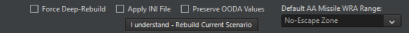

# 8.0 Databases and Templates

## 8.1 Scenarios vs. Databases

COMMAND has two databases that store all information on platforms
(aircraft, ships, submarines, ground facilities and satellites) and
components (weapons, sensors, mounts, magazines, communications gear,
etc.) used in the simulator. The CWDB database covers the years from
1950-1979, and the DB3K database covers 1980 to the near future.

The databases contain a myriad of platforms. Platforms that span 1980 --
those that exist in both databases -- are automatically synchronized to
ensure they are identical.

The two databases come in different versions. New versions contain
additional platforms and components or fixes to the existing ones.
Scenarios store information about what database version they were built
with, and when a scenario loads it automatically loads the correct
database. This prevents errors caused by scenario/database mismatches
and ensures that the scenario will play exactly the way the scenario
author intended.

## 8.2 Scenario Maintenance

When a scenario is created and saved it is linked to the database it was
created with. Some information from the database is saved with the
scenario, which in effect locks a scenario to a certain database
version. Therefore, the simulator must always load the correct database
for the scenarios.

When a platform or component in the database is updated and you want a
scenario to reflect those changes, you must migrate (aka rebuild) the
scenario to the latest database. Typically, when a scenario is under
construction, and you want to use a platform that was recently added to
the database. Or when the latest database contains fixes made to
existing platforms or components that you would like to take effect in
the scenario.

Rebuilding a scenario with the latest database has to be done in the
scenario editor. In addition to rebuilding single scenarios, it is also
possible to rebuild multiple scenarios in one operation. Single
scenarios can be either shallow rebuilt or deep rebuilt. Multi-rebuild
of scenarios uses the deep rebuild method.

### 8.2.1 Scenario Migration

To open the Scenario Migration window, first load the desired scenario
in the Scenario Editor. Then go to 'Editor' =\> 'Upgrade scenario to
latest DB version'.

Note the options in check boxes in the scenario migration dialog box.

- Force Deep rebuild -- A deep rebuild will re-initialize all platforms
  in the scenario to their pristine state, fresh from the database. (see
  **8.3.3 Shallow Rebuild vs. Deep Rebuild** on page
  [188](#shallow-rebuild-vs.-deep-rebuild).)

- Apply INI file -- A file that holds the delta of the components of a
  scenario with an XXX.ini format. (see **8.5 Scenario Config Files (INI
  file)** on page [189](#scenario-config-files-ini-file).)

- Preserve OODA -- Will preserve the currents scenarios OODA cycle
  settings instead of any new OODA cycles in the upgraded database (see
  **6.3.4 Database Viewer** on page [116](#database-viewer).)

- Default AA Missile WRA Range -- Allows the designer to set a default
  WRA range for SAM and AAM.



## 8.3 Rebuilding Scenarios

### 8.3.1 Rebuild Single Scenario

To rebuild the currently loaded scenario, press the Rebuild Current
Scenario button. The lower half of the window will display log messages
from the rebuild process. When the Apply INI File option has been
selected you will be asked to select the scenario config file (INI file,
described later) that shall be used during the rebuild.

### 8.3.2 Rebuild Multiple Scenarios

To rebuild multiple scenarios in one operation, press the Deep-Rebuild
All Scenarios In List button. Follow the instructions in the lower half
of the window, including selecting the location of the Scenario List
file. This file contains a list of the scenarios to rebuild along with
their associated scenario config files (INI files, described later). The
Scenario List file has to be generated manually and typically looks like
this:

```xml
<?xml version="1.0" encoding="utf-8"?>
<ScenarioList>
  <Scenario>
    <ScenarioFilePath> <!-- C:\Command\Scenarios\Battle of Chumonchin Chan.scen --> </ScenarioFilePath>
    <ConfigFilePath> <!-- C:\Command\Scenarios\Battle of Chumonchin Chan.ini --> </ConfigFilePath>
  </Scenario>
  <Scenario>
    <ScenarioFilePath> <!-- C:\Command\Scenarios\Battle of Latakia.scen --> </ScenarioFilePath>
    <ConfigFilePath> <!-- C:\Command\Scenarios\Battle of Latakia.ini --> </ConfigFilePath>
  </Scenario>
</ScenarioList>
```

To add a new scenario to the file, simply copy-paste the lines (tags)
for an existing scenario, update the scenario file paths and names, and
save the file.

### 8.3.3 Shallow Rebuild vs. Deep Rebuild

A shallow scenario rebuild will retain the current inventory of
mounts/sensors/stores etc. for existing platforms in the scenario. But
the performance characteristics of their equipment will be updated as
per the latest database version. New units added to the scenario will be
inserted as defined in the latest database version.

A deep rebuild will re-initialize all platforms in the scenario to their
pristine state, fresh from the database. It re-sets the properties of
each platform and all of their components, including the platform's
weapons, sensors etc. It also completely resets damage status, fuel
status etc.

Most scenarios can be rebuilt using shallow rebuild however if there is
a complex change to the database you must use the deep rebuild function.
If you're not sure whether to use shallow or deep rebuild in a
scenario, select deep rebuild.

## 8.4 Log files

The scenario migration (rebuilder) tool will generate two log files
located in the \\Command\\Logs directory. The first file is named SBR
log file.txt and records any errors or warning encountered during the
rebuild. The second file is named SBR platform list.txt and creates a
list of all the platforms present in the rebuilt scenario(s). The
platform list also includes aircraft on the ground and docked vessels,
and displays the loadouts used by all aircraft. Each platform's
scenario name and database name (the two are usually different!),
database ID# and scenario GUID is listed as well.

All detected errors are marked ERROR in the log. To look for error
messages in the log simply open the log file in Notepad, press F3 or
Ctrl + F, and search for the term ERROR.

## 8.5 Scenario Config Files (INI file)

If any changes/customizations have been made to a platform in a scenario
and you would like to carry these over to the new version of the
scenario after a deep rebuild, the changes will need to be re-applied.
Re-applying the changes can either be done manually in the scenario
editor by loading and unloading weapons etc., or automatically through
the use of the scenario config file (or INI file). Using a config file
saves you having to manually edit the platforms each time.

The scenario config files can either be crafted manually or exported
from an existing scenario. An exported config file will then contain all
custom modifications made to the platforms in a scenario before the
rebuild, and these can then be applied to the re-initialized platforms
in the rebuilt scenario.

The most commonly used functionality is adding and removal of weapons
and altering weapon quantities for mounts, mount magazines and
magazines. It is also possible to add and remove mounts, magazines,
sensors and comm gear (including weapon datalinks).

The scenario config files can edit platforms in the following ways:

- Change mount's weapon quantity (for existing weapons)

- Change mount magazine's weapon qty (for existing weapons)

- Change magazine's weapon qty (for existing weapons).

- Delete weapon on mount

- Delete weapon in mount magazine

- Delete weapon in magazine

- Add new weapon record to mount (Warning: make sure to add associated
weapon directors/illuminators or datalinks)

- Add new weapon record to mount magazine, i.e. a mount's local
magazine. (Warning: make sure to add associated weapon records on the
mount itself)

- Add new weapon record to magazine (aircraft ordnance in ammo dumps and
carrier magazines especially)

- Add mount

- Add magazine

- Add sensor

- Add comm gear (typically weapon datalinks or command guidance systems)

- Delete mount

- Delete magazine

- Delete sensor

- Delete comm gear

### 8.5.1 Scenario Config File Templates and Delta Templates

Scenario config files (INI files) can either be written manually in a
text editor or created automatically by the simulator. Two types of
config files can be created by the simulator, templates, and delta
templates. Template files contain a simple list of all units present in
a scenario, while Delta Template files contain all manually altered
mounts, magazines, sensors or comms.

**Template**: exports the platforms present in the scenario to file. The
generated file lists the platforms and their unique GUIDs and is a
starting point for manually crafting a scenario config file. To create
the template file, go to Editor -\> SBR -\> Generate Template. Template
files are saved in XML format and will typically look like this:

```xml
<?xml version="1.0" encoding="utf-8"?>
<ScenarioUnits>
  <Unit_a25be2bd-d06f-4162-959b-b3d7ccc1e5ff>
    <!--LCS 1 Freedom (LCS 1 Freedom [1839])-->
  </Unit_a25be2bd-d06f-4162-959b-b3d7ccc1e5ff>
</ScenarioUnits>
```

**Delta Template**: exports the delta (difference) between platform
configurations in the scenario and those in the database. The Delta
Template functionality is most commonly used to export aviation magazine
changes or additions. But the generated file will also list platforms
that have new and deleted weapons, weapon quantity changes,
added/removed mounts and magazines, added and removed sensors, and added
and removed communication gear and weapon datalinks. The Delta Template
functionality will not export damage or changes in fuel levels.

Example: An aviation magazine has been given a new 0/10000 Mk84 LDGP
weapon record which has been loaded with 200 weapons. The Delta Template
will attempt to locate the 200/10000 Mk84 LDGP record in the database.
Since no exact match is found for this weapon record, the Delta Template
will look for a best match using various conditions. It will end up
adding a WeaponRecADD and WeaponRecEDIT entry to the scenario config
file to first add the 0/10000 weapon record and then load 200 weapons in
order to produce the desired result.

The Delta Template will also check mount, and sensor arcs to look for
differences between the scenario and database. Say a CWIS mount has been
deleted and another added with a different arc. This will result in one
insert, and one delete statement in the Delta Template file.

To create the delta template file, go to Editor -\> SBR -\> Generate
Delta Template. A delta template file would typically look like this:

```xml
<?xml version="1.0" encoding="utf-8"?>
<ScenarioUnits>
  <Unit_0c4328f6-8900-49c9-a1ee-bbf8e0a2ca92>
    <!--USS Ranger (CV 61 Ranger [Forrestal Class] [1628])-->
    <Mag_2_854>
      <WeaponRemove_1841 /> <!--AGM-78D Standard [ARM]-->
      <WeaponRemove_150 /> <!--AIM-7F Sparrow III-->
      <WeaponEdit_1084_8 /> <!--AN/ALQ-99G [ICAP-2 Block 82] ECM Pod-->
      <WeaponEdit_444_48 /> <!--AIM-54A Phoenix-->
    </Mag_2_854>
  </Unit_0c4328f6-8900-49c9-a1ee-bbf8e0a2ca92>
</ScenarioUnits>
```

Note that the template file has comments to ease manual edit of the file
later on. The comments contain information such as mount and weapons
names, and #IDs from the database. Any errors encountered during the
Delta Template file creation will be logged to the \\Logs\\SBR INI
template log file.txt file.

### 8.5.2 Editing Scenario Config Files

To edit a scenario config file, open it in Notepad. Config files are
stored in XML format and contain an entry for relevant platforms in the
scenario. Scenario config files created using the Delta Template
functionality will only contain the platforms that differ from the
database, and if no differences are found the file will be empty.
Scenario config files created using the Template functionality will
contain all platforms.

A template file for a scenario with a single ship in the LCS 1 Freedom
class will typically look like this:

```xml
<?xml version="1.0" encoding="utf-8"?>
<ScenarioUnits>
  <Unit_a25be2bd-d06f-4162-959b-b3d7ccc1e5ff>
    <!--LCS 1 Freedom (LCS 1 Freedom [1839])-->
  </Unit_a25be2bd-d06f-4162-959b-b3d7ccc1e5ff>
</ScenarioUnits>
```

Note that 'Unit_a25be2bd-d06f-4162-959b-b3d7ccc1e5ff' is the unique
GUID identifier for the LCS 1 in the scenario. It will be different for
all individual platforms. The line `<!--LCS 1 Freedom (LCS 1 Freedom [1839])-->` is a comment and can be altered as needed. It is good
practice to always have meaningful comments for all lines in the
scenario config files.

To add a new torpedo magazine with database ID# 240 to the ship, insert
an 'Add Magazine' line. The line also has a comment for future
reference:

```xml
<MagAdd_240 /> <!--Torpedo Magazine [Internal Tubes] -- USN, 2005-->
```

The edited file looks like this:

```xml
<?xml version="1.0" encoding="utf-8"?>
<ScenarioUnits>
  <Unit_a25be2bd-d06f-4162-959b-b3d7ccc1e5ff>
    <!--LCS 1 Freedom (LCS 1 Freedom [1839])-->
    <MagAdd_240 /> <!-- Torpedo Magazine Internal Tubes, USN 2005 -->
  </Unit_a25be2bd-d06f-4162-959b-b3d7ccc1e5ff>
</ScenarioUnits>
```

To apply the changes to the scenario, make sure that the scenario is
loaded in the Scenario Editor. Then go to Editor -\> SBR -\> Apply SBR
and select the desired Scenario Config File. Return to the scenario,
select the platform, open the Magazines window, and verify that the
magazine has been added.

## 8.6 Scenario Config File Overview

The commands that can be used in the Scenario Config Files are as
follows:

**Add mount**: Mount with database ID# 434 is used as an example below.
Note that Coverage has to be added as well, either each segment of a
limited arc (Alternative 1), or a full 360 deg arc (Alternative 2). Both
have been included in the example however only one should be used in the
actual file:

```xml
<MountAdd_434>
  <!--CADS-N-1 [3M87 Kortik]-->
  <Cov>
    <Seg>PMA1,PMA2,PMF1,PMF2,PS1,PS2,PB1,PB2,SMA1,SMA2,SMF1,SMF2,SS1,SS2,SB1,SB2,</Seg>
    <Seg>360</Seg>
  </Cov>
</MountAdd_434>
```

**Add magazine**: Magazine with database ID# 240 is used as an example
below:

```xml
<MagAdd_240 /> <!-- Torpedo Magazine Internal Tubes, USN 2005 -->
```

**Add sensor:** Sensor with database ID# 2003 is used as an example.
Note that Coverage has to be added for both search coverage and
illumination/target tracking. The two coverages have been given
different arcs for illustration purposes:

```xml
<SensorAdd_2003>
  <!--AN/AWG-9-->
  <Cov>
    <Seg>360</Seg>
  </Cov>
  <Cov_Ill>
    <Seg>PMA1,PMA2,PMF1,PMF2,PS1,PS2,</Seg>
  </Cov_Ill>
</SensorAdd_4>
```

**Add comm link**: Missile datalink with database ID# 3 used as an
example:

```xml
<CommAdd_3 /> <!--SA-10 Missile Datalink-->
```

**Delete mount, magazine, sensor or comm link**: Platforms carry a
variety of equipment (components), and in many cases there are several
mounts, sensors, etc. of the same type but with different coverage
(arcs). In order to precisely specify what component to delete, you have
to specify not only the database ID# of the component but also the
component's number in the ship component list. In the example below
we're deleting component #3 with database ID# 222 from a platform:

```xml
<MountRemove_3_222 />
<MagRemove_3_222 />
<SensorRemove_3_222 />
<CommRemove_3_222 />
```

If component #3 with ID# 222 is not found on the current platform a
popup message will inform you of this fact, and an error message will be
saved in the log file.

Edit, add and remove weapon record on mount, in mount magazines or in
magazines: The below example edits Sea Sparrow mount with component ID
#3 and database ID# 552. Pre-defined weapon records in the database are
added to the mount and its on-board mount magazine (WeaponRecAdd). The
weapon quantity is then altered (WeaponEdit), and some of the weapons
are then removed (WeaponRemove):

```xml
<Mount_3_552> <!--Mk29 Sea Sparrow-->
  <WeaponRecAdd_5188 /> <!--RIM-8J Talos-->
  <WeaponRecAdd_1557 /> <!--RUM-139A VLA [Mk46 Mod 5]-->
  <WeaponRecAdd_2626 /> <!--Roland 3-->
  <WeaponRecAdd_944 /> <!--RUR-5A Mod 3 ASROC RTD [10kT Nuclear DC]-->
  <WeaponEdit_1687_2 /> <!--RIM-7M Sea Sparrow-->
  <WeaponEdit_885_22 /> <!--RIM-8J Talos-->
  <WeaponEdit_1643_77 /> <!--RUR-5A Mod 3 ASROC RTD [10kT Nuclear DC]-->
  <WeaponRemove_233 /> <!--Mk182 SRBOC Chaff [Seduction]-->
  <MountMag>
    <WeaponRecAdd_5188 /> <!--RIM-8J Talos-->
    <WeaponRecAdd_154 /> <!--RUM-139C VLA [Mk54]-->
    <WeaponRecAdd_4015 /> <!--S-8KO 80mm Rocket-->
    <WeaponRecAdd_2765 /> <!--SAM-3 Kin-SAM [Type 93]-->
    <WeaponEdit_885_3 /> <!--RIM-8J Talos-->
    <WeaponEdit_1193_88 /> <!--SAM-3 Kin-SAM [Type 93]-->
    <WeaponRemove_233 /> <!--Mk182 SRBOC Chaff [Seduction]-->
  </MountMag>
</Mount_3_552>
```

The following example edits the SRBOC magazine with component ID# 1 and
database ID#717. Several pre-defined weapon records in the database are
added (WeaponRecAdd), the number of weapons is then altered
(WeaponEdit), and some of the weapons are removed (WeaponRemove):

```xml
<Mag_1_717> <!--Mk36 SRBOC-->
  <WeaponRecAdd_2541 /> <!--Generic Chaff Salvo [5x Cartridges]-->
  <WeaponRecAdd_5188 /> <!--RIM-8J Talos-->
  <WeaponRecAdd_154 /> <!--RUM-139C VLA [Mk54]-->
  <WeaponRecAdd_4015 /> <!--S-8KO 80mm Rocket-->
  <WeaponRecAdd_2765 /> <!--SAM-3 Kin-SAM [Type 93]-->
  <WeaponEdit_232_222 /> <!--Mk182 SRBOC Chaff [Seduction]-->
  <WeaponEdit_885_3 /> <!--RIM-8J Talos-->
  <WeaponEdit_1193_88 /> <!--SAM-3 Kin-SAM [Type 93]-->
  <WeaponRemove_233 /> <!--Mk182 SRBOC Chaff [Seduction]-->
</Mag_1_717>
```

If no mount or magazine on the current platform matches the component
number and database ID# combination a popup message will inform you of
this fact. An error message will also be saved in the log file.
