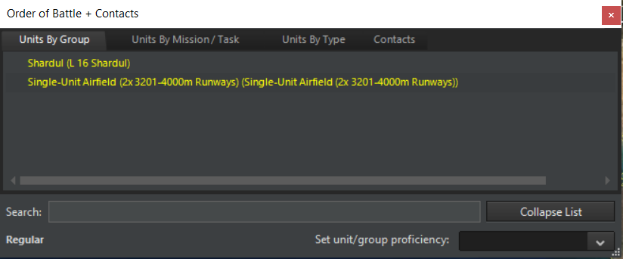
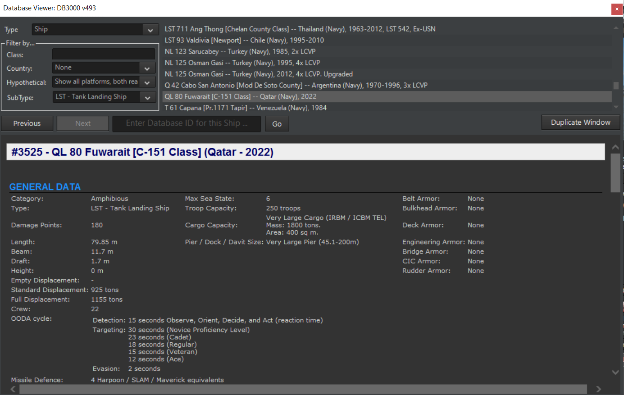
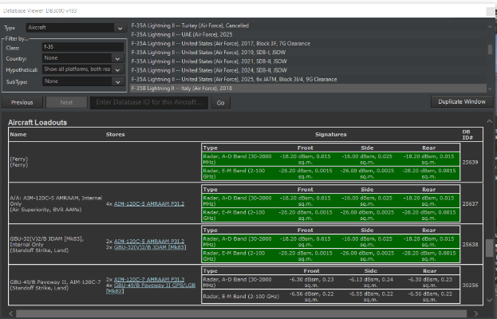
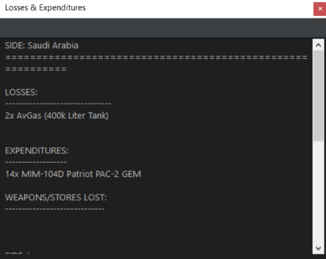
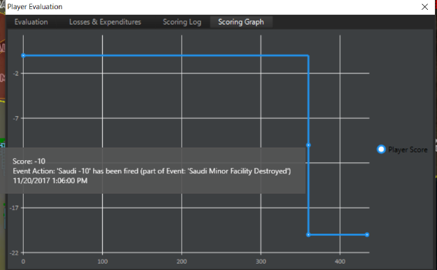
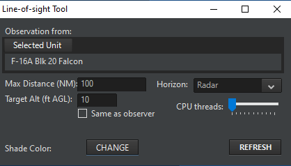
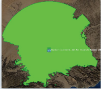
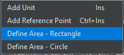
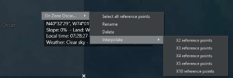

# 6.0 Drop-Down Menus

COMMAND'S menu and game controls are located at the top border of the
UI.

The menus are standard drop-down dialogs that are activated by clicking
them once, which displays the drop-down menu's choices, and then
clicking the item you would like to activate. There are a number of hot
keys which call a number of these functions as well that you can view by
clicking the Help menu item. You can find a list of all hotkeys at the
end of this manual.

## 6.1 File

The "File" menu controls access to various game modes, similar to the
start menu.

- Start Menu. This returns to the start menu.

- Create New Blank Scenario. This opens up ScenEdit mode and creates a
  new blank scenario without any sides or units.

- Load. This opens an existing scenario. If the current scenario is in
  normal play mode, the scenario will be opened in normal mode. If the
  current scenario/map is in ScenEdit mode, so will the opened scenario.

- Load Recent. This opens a list of recently loaded scenarios that can
  be re-accessed conveniently.

- Save. This saves the current scenario.

- Save As. This saves the current scenario under a potentially different
  name.

- Benchmark. This runs a chosen scenario in the "background" as fast as
  possible for a certain number of iterations. The time it takes to run
  the benchmark and pulse times of the simulation are shown. As the UI
  is not present and the player cannot influence the scenarios, a
  scenario with a large number of inbuilt AI missions on both sides is
  recommended for performance testing.

- Exit. This quits COMMAND.

> 

*Iceland, as seen through different map layer options.*

## 6.2 View

The "View" drop-down menu controls the viewing of the map and certain
display options.

- Toggle Full Screen/Windowed. This switches the map from full screen to
  windowed mode. It remains persistent across sessions of COMMAND, so
  exiting it in full-screen mode will lead to the next map opening in
  full screen mode, and vice versa.

- Zoom in/out. These options zoom the map in or out. The default is
  towards the center, but it can be changed by "zoom to mouse cursor" in
  \_\_\_\_\_, Game Options.

- Pan Map. These pan the map in any of the four compass directions.

- Select previous/next unit. This selects the next or previous unit in
  the scenario from the one currently highlighted.

- Range/Bearing Tool. This changes the cursor. Click on the map and then
  move the mouse cursor. A line will be drawn, and next to the cursor
  the distance (in nautical miles) and direction (in degrees) from the
  originally clicked point will be shown.

- Message Log in Separate Window. This moves the message log to a
  separate window from its default place overlaid on the screen.

- Map Lat/Long Grid. Displays a latitude and longitude layer that
  adjusts its increments to your zoom level.

- Sentinel-2. A high-resolution map layer. Enabled by default.

- BMNG Layer. When enabled, a satellite-terrain image of the world is
  shown. If disabled, the map appears as a yellow and black grid.

- Relief + Bathymetry Layer**.** Enables a colorful layer that displays
  elevations well. This is extremely useful for plotting terrain-masked
  attacks. It also shows a detailed view of underwater topography that
  can be used for various naval planning.

- Borders and Coastline**.** Enables and disables the yellow border and
  coastlines layer. The border and coastline layer is modified by year
  and reflects most border changes in the world during and after the
  Cold War. Yugoslavia and the USSR break into their successor states
  after 1991, while Germany reunifies.

- Stamen-Terrain: Adds a more detailed but graphics-intensive layer of
  the terrain map.

- Stamen-Roads + Cities: Similar to Stamen-Terrain, only highlighting
  roads and cities in detail.

- OpenTopoMap: Provides a view of the topography of a region using a
  detailed topographical map. This is useful for identifying key terrain
  features and planning strikes.

- Land cover: Displays the different types of terrain in clear detail.
  For more information see, 4.1, The Globe Display.

- Custom Layers. This adds and removes overlays.

- Placenames. This adds or removes the names of countries and cities on
  the map.

- Day/Night Lighting. When enabled, the map will appear lighter in areas
  of (local) day and darker in areas of night. When disabled, the map
  will stay the same no matter what the time.

- 3D View. If Tacview is installed and enabled (see **12.8 Tacview** on
  page [299](#tacview-1)), this creates a window containing a 3D
  depiction of the current scenario in Tacview. Note that Tacview will
  currently depict all units of all sides, similar to "God's Eye Mode"
  being activated in Command.

## 6.3 Game

In the "Game" drop-down menu, pressing on the "Game Options" tab opens
the game options menu with the following tabs:

### 6.3.1 Start/Stop

Under the "game" menu, this option depends on whether the simulation is
running or paused. If running, the option to pause will be there, and
vice versa.

### 6.3.2 Time Compression

These options increase, decrease, or reset time compression (the speed
at which the scenario run). + increases time compressing (moving
everything faster), - decreases it, and Enter returns it to its default
(and slowest) speed at 1 second/real time.

### 6.3.3 Order of Battle

This dialog is a master list of units in the scenario and consists of
three main tabs.

The first to be viewed upon opening the window is "**Units by Group**".
This contains a list of all units on the player's current side, sorted
into groups and color-coded according to proficiency. Groups (from
aircraft flights to naval/land groups to multi-unit airbases) can be
retracted or expanded to reveal or hide their component and hosted
units. The window refreshes as units are destroyed, change groups, or
otherwise differ in status, making it useful for big/multiple monitor
setups as a "reminder".

Clicking on any unit moves the camera to its location on the map. If the
unit is hosted somewhere else, the camera moves there, i.e. clicking on
an aircraft parked on the USS Nimitz will shift the camera to the
carrier.

The second window/option is the "**Units By Mission/Task**" tab. This
has the same units sorted by the missions they are currently assigned
to. Unassigned units do not appear in this window.

The third is the "**Contacts**" tab. This displays all currently viewed
contacts not belonging to the side in question, as well as their
(color-coded) posture and status. As with friendly units, clicking on
their names will shift the camera to the contact. The information in the
window changes greatly with the data available. An unidentified surface
ship contact will appear as just "Skunk #\_", while a precisely
identified contact will be something like "TAKR Admiral Kuznetsov,
unfriendly, no damage, 4 Yak-141 Freestyles spotted hosted [on the
flight deck]"

At the bottom of the Order of Battle screen, regardless of the current
tab, are three items. The first is a search feature that will highlight
anything (regardless of tab) containing the typed term. The second, in
the lower left corner, is the set default proficiency of the player's
side. The third, only accessible in ScenEdit, allows for the proficiency
of highlighted units to be changed. This allows for mass proficiency
changes without either changing the whole side or doing it one unit at a
time and is the best way to change the proficiency of hosted ai

Aircraft.

### 6.3.4 Database Viewer

This dialog displays all units in the database that is currently
selected (i.e. DB3000 Build 494).

To view, select a type and unit from the list that appears on the upper
right. Unit information is displayed below. This display also lets you
filter results by name, country, or status as a real unit vs a
hypothetical one, in addition to scrolling between chosen units and
being able to find units based on their known database ID by typing it
in. Finally, the DB window can be duplicated to allow for the viewing of
different entries at once.

The filters can be combined. As an example, typing in "F-14" will result
in all Tomcat variants in both American and Iranian service being shown.
After "F-14" has been entered, selecting "United States" or "Iran" from
the list shows only the ones from those specific countries. With "United
States" selected, going to "Show Hypothetical Platforms Only" will
narrow them down further to proposed upgrades like the AST-21 Super
Tomcat that never actually saw service. With "Iran" selected, going to
hypothetical only results in a blank display, as the country currently
has no never-were F-14s in its database.

To reset the country filter, select "None" at the very top of the
country list. To reset the hypothetical filter, select "show all
platforms, both real-life and hypothetical". To reset the name filter,
simply delete the current name.

The "Weapons" section in the database viewer is not sorted by country,
although it is separated by real and hypothetical units. It contains
information on the range, signature, guidance system, and performance of
weapons. At the bottom of every page in the weapons section is a list of
all the platforms that carry it. This can vary considerably depending on
the type of weapon. For instance, the AIM-54C Phoenix is only carried by
several variants of American F-14 Tomcats, and the Fakour-90 version of
the missile is only carried by one single variant of the Iranian Tomcat.
In contrast, the basic Mk82 500-pound bomb is carried by an almost
countless number of aircraft from many countries and time periods.

The "Sensors" section in the database viewer contains all current
sensors in COMMAND and their default platforms. If the same sensor is
carried by different types of units (i.e. both ships and aircraft), it
will divide them into appropriate groups.

This display is important in helping make good decisions about how units
and weapons should be used against certain targets in the game. Take
note of ranges, weapon/sensor characteristics and damage point values.
Sensor technology levels will affect their performance and ability to
counter electronic interference.

Unit radar signatures can be altered by loadouts. Aircraft carrying
external ordnance will have a greater radar signature, with stealth
aircraft being dramatically affected. The database viewer displays the
RCS of each loadout. Loadouts that are completely internal and thus do
not affect RCS are highlighted in green.

*Loadouts for an F-35. The external loadout is far more detectable than
the internal ones.*

Clicking the "Duplicate Window" button will open up a second database
viewer window. It will display the current unit by default but can be
changed. This is useful for comparing the properties of different
platforms.

**OODA Cycle**: The OODA (Observe, Orient, Decide, Act) cycle of a unit
determines how fast it can respond to changing situations, especially
dangerous ones. It is determined by both mechanical factors
(representing the sophistication of automation on the unit), and human
ones (representing crew skill.)

Thus, for targeting, even if a unit sees/detects the opposition, its
OODA "clock" must tick down to zero from its stated beginning before it
actually engages. An old, crude unit where everything is manually
operated will have an OODA cycle far slower than a hyper-automated
futuristic warship.

Besides the crew quality, the Combat System (shown in the database
viewer as well) determines the practical reaction speed of a naval unit.
Combat systems range from Gen 1 (World War II combat information
centers, where contacts are manually marked on a transparent sheet), to
Gen 7 (science fiction super-processors).

**Agility**: The agility of the aircraft determines its turning radius
and ability to dodge attacks.

- \<=1: Early jets or slow, support aircraft (E-3, A-50, C-5, C-130,
  etc..).

- 1.5-2.5: 1950s fighters, high-end bomber aircraft (B-1, Tu-160),
  medium attack aircraft (Su-24, F-111, A-6)

- 3-3.5: Third gen fighters. (MiG-21, F-4)

- 4-4.9: Fourth-gen fighters (F-14, MiG-29, F-16, Mirage 2000)

- 5+: Fifth gen fighters (F-22, Su-57, Eurofighter)

Note that units with the same "nameplate" can have different agility
values. One example is the F-14, whose agility increases from 4 in the
basic F-14A model to 4.5 in the upgraded, better-engined F-14B and F-14D
models. Note that all types of units modelled in COMMAND have various
levels of this targeting quality dependent on the generation and type of
system. For an illustration of this, see the differences between an S-60
battery and a ZSU-57-2 mobile AAA. While both systems have the same base
weapon, their response times are significantly different due to the
nature of the layout and systems of the weapon.

Weapons and sensors have a unique arc where they can be pointed and
utilized, this is represented by green circles on the right side where
the individual sensors are displayed:

These arcs can also be turned on and off in the display options menu.

### 6.3.5 Browse Scenario Platforms

This dialog allows users to see all unit types used in the launched
scenario. You can filter by side and the list is organized by platform
type. Double clicking a unit name will launch the platform display where
you can see information on the unit.

### 6.3.6 Scenario Description

This dialog displays a text description of the currently loaded
scenario. The description is the same as the one appears on the menu, or
when the scenario is started.

### 6.3.7 Side Briefing

This dialog displays the current selected side's briefing.

### 6.3.8 Side Doctrine/ROE/WRA/EMCON

This dialog lets you set the side's Rules of Engagement settings. Rules
of Engagement settings are hierarchical in command, and this is where
you would set them as a player at the highest level to let them flow
down to mission and then groups/units.

Doctrine and Rules of Engagement: Governs platform behavior, or posture,
towards other platforms in the scenario. The Scenario Designer sets the
initial Doctrines and ROEs and may enable the player to edit one or all
of these. Doctrine and ROE can be seen by clicking on the "Doctrine and
ROE" button in the Unit Information Box.

For more information, see **3.3.12 Unit/Group Doctrine** on page
[38](#unitgroup-doctrine).

**EMCOM Tab**

EMCON is the Emissions Condition of the platform. See **3.3.12
Unit/Group Doctrine** on page [38](#unitgroup-doctrine) for more
information.

**WRA Tab**

This controls the weapon release authorization (see **3.3.12 Unit/Group
Doctrine** on page [38](#unitgroup-doctrine)) for the entire side. Thus,
every weapon used by the side will be displayed.

**Withdraw and Redeploy**

This controls the withdraw/redeploy (see **3.3.12 Unit/Group Doctrine**
on page [38](#unitgroup-doctrine)) settings for the entire side.

### 6.3.9 Special Actions

Some scenarios may have special actions that the player can choose to
activate at will. This selection opens the window containing what, if
any, special actions the scenario has. Special actions can be minor,
major, high risk or low risk, and can include anything from
reinforcements of one unit to posture changes. They can also be
repeatable or one-time, like other events.

EXAMPLE: A call for reinforcements might give the player more units, but
the enemy more as well as they shift more reserves in from their
homeland to counter them. A lesser special action is something like
raising a communications buoy on a submarine or receiving a weather
report. See **5.5.2 Special Actions** on page [96](#special-actions) for
how to add them as a scenario designer/editor.

**Satellite Pass Predictions**

This selection prompts a click on the map. Once a point on the map is
selected, it calculates the approximate time when the satellites in the
scenario will reach the point (the "enters coverage at" column) and the
length of time they will remain there (the "dwell time" column). The
satellites on all sides in the scenario are displayed, be they friendly
or enemy.

Learning when a satellite would pass overhead and taking countermeasures
was a well-practiced art throughout the Cold War, and the tool enables
it to be practiced in COMMAND.

### 6.3.10 Recorder

This selection launches the game's replay viewer. COMMAND has in-game
recording capability as well as the ability to jump in and play at any
point of that recording.

**How it works**:

You can start and stop any recording by clicking the **red recording
button** at the top of the UI. When you do the recording is saved as a
.rec file in the recording's directory of your COMMAND directory.

These files are huge, given very long names and are not currently
convertible to any other format. If you use this function often best
practice is to navigate to the folder to rename the file to something
that makes sense while retaining the .rec extension. You will want to
clean this directory out as well as the files are huge.

To view and manage any recordings you can launch the viewer by selecting
recorder in the Game drop-down menu.

The replay viewer functions are very similar to any other video player's
control. You use the Load and Load most recent functions to pull of the
videos you have recorded. You use all the video function buttons and
slider to navigate to the point of the video you'd like to view. If
you'd like to play you simply close the viewer and proceed to play.

### 6.3.11 Message Log

Select this menu item gives a drop down that gives players two options
concerning their message logs, clear and print to file.

**Clear**: This function clears the currently selected side's message
log. This is useful for scenario editors to clear any messages that
appeared during editing (God's Eye View Mode). Scenario makers should
clear the message log before the final versions are saved and released
for public consumption.

**Print to File**: This function writes the contents of your message log
to the AALog.Txt file your Command directory. This is good for after
action analysis of the game mechanics.

### 6.3.12 Losses and Expenditures

This menu item launches the losses and expenditure dialog which displays
the losses and weapon expenditures of all sides of a scenario.

### 6.3.13 Scoring

Selecting this menu item displays the player's score. Note that some
scenarios do not have scoring enabled, whether deliberately or by
omission.

This dialog includes an **Evaluation,** a **Losses and Expenditures**
tab, a **Scoring Log** tab, and a **Scoring Graph** tab.

The player evaluation tab displays scoring information. There is a "quit
scenario" button at the bottom which allow players to end the scenario
they are currently running. On the gauge, red represents levels of
"defeat", grey represents "average", and blue represents levels of
"victory".

The Losses and Expenditures tab displays the unit losses and weapon
expenditures of all sides of a scenario.

The Scoring Log tab illustrates the changes in scoring, for better and
worse. It is helpful for reviewing if a scoring event fired without the
player noticing in the confusion of battle.

The scoring graph shows scoring changes for the player's side over time.
Hovering the cursor over a specific point displays the change and the
reason for it.

## 6.4 Game Options Window

**6.4.1 General**

- **Use Autosave**: COMMAND is saved periodically as "Autosave.Scen" in
  the "/scenarios" directory". This should be used unless it places an
  undue strain on a lower-end computer. [Autosave automatically creates
  a different file for each scenario to prevent accidentally overwriting
  an existing autosave.]{.mark}

- **Message Log In Separate Window**. This moves the message log into a
  different window from its default place overlaid on the screen.

- **Show altitude in feet**. This changes the altitude of units to be
  displayed in feet instead of meters.

- **Map zooms on mouse cursor**. If enabled, the map will zoom in on the
  mouse cursor. If disabled, it zooms in towards the center.

- **Hi-fidelity mode (in real time only**). If enabled, COMMAND will use
  "hi-fidelity mode" allowing for smoother movement on the lowest time
  compression setting.

- **Display unit status image**. If enabled, and if an appropriate image
  is in the database folder, the unit status bar will display a
  thumbnail image of the unit in question if it's on the player's side
  or a positively identified contact. If disabled, the image will not
  appear.

- **Allow switching to high-performance power scheme**. This allows
  COMMAND to let the computer switch to high-performance power systems
  even if it uses more electricity.

- **Show "Game Speed" button on toolbar in main window**. This provides
  a shortcut to the "game speed" options tab (see below) in the form of
  a red button on the toolbar.

- **Log debug information to file**. This logs debug information and is
  useful should a detailed bug report be needed.

- **DPI Scaling**. This changes the DPI scaling from either the
  computer's internal defaults or a fixed "font" one at 125% scaling.

- **Fine-grained navigation-**this changes the settings of ships close
  to land.

- **Extra memory protection**. This, if necessary, provides extra memory
  safeguards to the computer.

- **Window Opening Behaviour --** This allows you to choose how the game
  should pause when various windows are opened during gameplay.

- **Enable Right Mouse Click move order --** This setting allows you to
  order units to move by a simple right click on the map instead of
  using the convention F3 key.

- **Indicators for aircraft contrails and ship/submarine wakes** -- This
  option allows the display of contrail and wake status on the map under
  a unit's data block. This makes it easier for the player to be more
  aware that his units may be visually detected at significantly longer
  ranges because of these factors. These indicators can be disabled on
  the "Game Options" window (similar to noise & cavitation indicators)
  if they clutter the map unacceptably.

### 6.4.2 Map Display

- **Sonobuoy Display**. This makes sonobuoys either displayed with the
  same intensity as a normal unit, "ghosted" into appearing more
  transparent and faded, or not appearing at all.

- **Reference Point visibility**. This makes reference points appear
  either on their default size, appear smaller, or be invisible.

- **Map Cursor Databox Visibility**. This makes the black databox either
  appear next to the mouse cursor, at the bottom of the screen, or not
  be shown at all.

- **Map symbols**. This changes the symbols on the map to be either the
  default directional stylized symbols (large artistic symbols that
  rotate with their bearings and scale to each other's size when zoomed
  in), "stylized" symbols (a different type of artistic symbol that does
  not rotate), or "NDTS+NATO APP-6" (realistic tactical symbols)

- **Show Ghosted Group Members**. If "All groups" is selected, then the
  non-leader units of all friendly groups will be visible. If "Selected
  groups" is chosen, then they will appear only as the group icon
  centered on the group leader unless click-selected, and then the other
  members will show as ghosts. If "Do Not Show" is chosen, the
  non-leader units will never appear unless the game is switched to unit
  view.

- **Show Plotted Paths**. This shows the plotted courses for all units,
  selected units, or not at all, depending on the choice.

- **Show Diagnostics**. This shows internal game features such as pulse
  time and unit count on the top bar. It's useful for bug reports to see
  (for example) exactly how much the sim has slowed down under certain
  circumstances.

- **Use Colored Datablocks**. this makes unit data blocks color-coded
  according to their posture. Blue for friendly, red for hostile,
  etc...

- **Use Personal Map Profile**. What this does is allow map display
  settings (as accessible from the "Map Settings" drop-down menu) to
  remain persistent across different scenarios. Pressing the "save
  current map profile as 'personal'" button will identify the current
  map settings as the player's "personal" ones, and checking the box
  will make those settings override the existing defaults, no matter
  what the scenario. Unchecking the box will revert the map settings to
  the defaults the scenario author has chosen. (WARNING: Scenario
  authors often set up the specific map settings to inform the player of
  vital information that may be missed if overridden. Use this at your
  own risk)

### 6.4.3 Message Log

The Message Log has four columns:

- **Message Type**: Regards the type of information that is displayed.

- **Show on Message Log**: Displays that message type when they occur if
  checked.

- **Raise Pop-Up**: If checked, initiates a pop-up message and pauses
  the game when the message type occurs.

- **Show Balloon**: This toggles a balloon appearing on the main map at
  the location of the message subject.

- **Timescale X1:** Immediately trigger the game to return from whatever
  time acceleration it was at, to 1x.

### 6.4.4 Sounds and Music

This toggles in-game sounds or music on and off and allows the volume of
them to be changed if on. Turning music on plays all the current tracks
in the [Installation folder]/Sound/Music directory. Music files can be
manually added to or removed from there.

### 6.4.5 Game Speed

This enables certain features to be deselected in order to improve
performance, particularly on lower-end computers.

### 6.4.6 TacView

**Tacview:** This allows the TacView executable path to be set.

### 6.4.7 Hover Info

**Hover Info:** This allows the contents of what comes up when the CTRL
key is held down while hovering over a unit to be customized.

## 6.5 Map Settings Drop-Down Menu

**Switch to Group/Unit View**: This switches to the view of a group
(grouped units are displayed with the group icon) or a unit (all units
are displayed as individuals, regardless of their grouped status or
not).

**Show Ghosted Group Members**: This changes the settings of ghosted
group members, see **6.4.2 Map Display** on page [124](#map-display).

The Map settings drop-down allows players to manipulate what they see on
the central globe display. They can turn features on and off by clicking
on the drop-down menu items. They are activated when a check mark
appears next to them in the drop down.

**Sensors Range Rings**

· Air Sensors appear as white rings or arcs.

· Surface Sensors appear as yellow rings or arcs.

· Active Underwater Sensors appear bright green rings or arcs.

**Weapons Range Rings**

· Air weapons ranges appear as pink rings or arcs.

· Surface weapon ranges appear as dark red rings or arcs.

. Anti-land weapons ranges appear as brown rings or arcs.

· Underwater weapons ranges appear as dim green rings or arcs.

. Aircraft ranges (range-NOT radius) appear as blue rings.

**Show Range Symbols For..**

This allows range symbols to be toggle between visible for all friendly
units, individual detected units, or not shown at all.

**Show Non-friendly Range Symbols**

When activated, the simulation will display the theoretical range-ring
for a positively identified contact. These appear as broken lines but
share the color characteristics of friendly range rings.

**Merge Range Symbols**

This merges all range rings of a particular side to unclutter the UI. Be
aware that it only displays the longest-ranged of the weapons, so that,
for example, an SA-2 site will be drowned out by a much longer ranged
SA-5 site nearby.

**Sonobuoy Visibility**

This changes sonobuoy visibility. For details, see **6.4.2 Map Display**
on page number [124](#map-display).

**Reference Point Visibility**

This changes reference point visibility. For details, see **6.4.2 Map
Display** on page [124](#map-display).

**Illumination Vectors**

Many modern weapon systems use or require a fire-control radar to
illuminate a target to guide weapons to them or improve their accuracy.
This includes most modern deck guns and many surface-to-air missiles.
This is displayed as a broken red line leading from shooter to target.

Using the drop-down menu, you can set this to be displayed for: the
selected unit, all units or None by clicking on your choice in the drop
down. It is set to None by default to lower the clutter on the display.

**Targeting Vectors**

Displays a broken green line from shooter to target and a small text
date block below showing how target was allocated (manual or auto) and
the expected time of weapon release.

Using the drop-down menu, you can set this to be displayed for: the
selected unit, all units or None by clicking on your choice in the drop
down. It is set to None by default to lower the clutter on the display

**Datablocks**

Displays unit name, course and speed to the right of unit in white text
in the display.

Using the drop-down menu, you can set this to be displayed for: the
selected unit, all units or None by clicking on your choice in the drop
down. Selected unit is set to be the default value.

**Datalinks**

Displays any communication link between units.

Using the drop-down menu, you can set this to be displayed for: the
selected unit, all units or none by clicking on your choice in the drop
down. It is set to "None" by default to lower the clutter on the
display.

**Contact Emissions**

This displays the emissions of certain non-friendly contacts on the
display. It can be toggled to all, selected, or off. It can also toggle
only fire control radars.

**Plotted Courses**

This displays the courses of plotted units in a line, and can be toggled
to selected, all, or off.

**Mission Area/Course**

This displays the mission area in the form of a highlighted box with the
mission's name nearby and can be toggled to selected, all, or off.

**Track Selected Unit.**

This keeps the camera centered around a selected unit.

**LOS Tool**

This enables the player to view the "line of sight" of a selected unit.
The line of sight will appear as a colored area around the unit, making
it useful for determining what the unit in question can see or detect.
The tool can be applied to either a friendly or detected enemy unit,
meaning it can be used to either plot offensive ("hmm, this mountain is
a nice radar blocker....") or defensive ("Since my ground-based radar
stations can't see well over here, I should send my fighter patrols over
to cover the gap") strategies.

*The line-of-sight tool in action, with lime green selected as the
color. To the north is mostly barren desert where the tool can reach its
max distance. To the south is a mountain range where it's frequently
blocked off.*

There are several customizable options on the tool.

-**Max distance**. This sets the maximum range in nm the tool will
extend to. It can be reined in either for the sake of performance or for
showing a sensor with very limited range.

-**Target altitude** (m AGL). This shows the altitude at which the LOS
target is determined. Higher flying units can obviously be seen from
farther away, and the setting can be changed in light of the usual
attack profile of the scenario's threat units (i.e. threat aircraft with
terrain following suites like F-111s or Su-24s will go at lower
altitudes than ones that don't have them, like earlier and/or simpler
aircraft). The "same as observer" box can be checked to assume that the
target is at the same altitude as the selected unit.

-**Horizon type**. The "Radar/ESM" option, assuming an "electronic
horizon" capable of reaching longer distances than visual sight, is the
default. The shorter range "Visual/EO/Laser" option can be checked, if
need be, such as for a unit that uses those as its primary sighting
system.

-**Shade color**. Clicking "change" opens up a palette of colors that
can be selected as the one to display. Color can be changed to avoid
conflicting with other map elements or for the sake of aesthetics/ease
of sight.

**-CPU Threads.** This allows the number of CPU threads used in
calculating LOS to be changed for performance reasons. (considered
obsolete)

It is important to note that line of sight is different depending on the
type of system selected. Many radar waves have the ability to travel
'over' the horizon to a limited extent resulting in a greater range
beyond that of visual and IR sensors.

**Minimaps**

This toggles minimaps. There are three main types of minimap, all of
which can be used at the same time.

- **Global**. This displays a map of the entire world. Only recommended
  for very large scenarios, as the unit contacts will otherwise appear
  to be incredibly close together.

- **Scenario**. This displays a map with borders established by the
  outermost units in the scenario. In other words, it displays a map of
  the theater of operations.

- **Camera-following**. Self-explanatory, this minimap zooms in and out
  with the camera, showing what the display currently shows.

On the minimap, units follow the same color code as on the main display-
blue for friendly, green for neutral, orange for unfriendly, red for
hostile, yellow for unknown. Minimaps appear in their own windows and
can be adjusted to be as large or small as the player desires. The
minimaps also preview the local terrain making it easier to identify the
orientation and position of various units as it relates to the world.
Minimaps can be adjusted for size by clicking and holding the bottom
right corner of the map.

**Terrain Type Legend**

This toggles a legend that illustrates the types of terrain shown on the
map when the "Land Cover" option is selected (see **6.2 View** on page
[113](#view), and **3.1.1 The Globe Display** on page
[12](#the-globe-display)). This is useful for seeing when a unit is in a
concealing, shielding forest or exposed open land.

## 6.6 Quick Jump

Quick Jumps can be used to rapidly shift back to a unit or contact. To
use quick jumps:

-**Select a unit/contact** and zoom the camera to the desired level.

-**Press CTRL+[NUM]** (the number can be 1, 2, 3, 4, etc....) and the
camera altitude and location will be saved

-To jump to that unit/location, either press the initial number or use
the "quick jump" top level menu and select from the list. The saved
numeral is to the right of the unit in the menu for easy reference.

-Note that quick jumping doesn't select the unit/contact, instead it
merely moves to its location.

## 6.7 Unit Orders Drop-Down Menu

This duplicates the right click/context menu.

## 6.8 Contacts Drop Down Menu

This menu is normally greyed out but becomes accessible once a contact
is selected.

**Drop Contact(s):** This removes the selected contact(s) from the map.
Note that they may be instantly re-acquired if the right sensors are
there. This is for removing contacts like an undersea contact with an
uncertainty area so large as to be useless, and which is probably just a
whale anyway.

**Mark (to posture):** This allows the selected contact(s) to be
manually marked as either friendly, neutral, unfriendly, or hostile.

**Rename:** This allows the contact to be renamed.

**Mark Position:** This creates a reference point at the contact's
current location with the name being the name of the contact and the
time the contact was seen at the position in question.

**Filter Out All Contacts:** This removes the individual visual filters
on all non-side contacts.

**Cancel Filter Out:** This restores the individual visual filters on
all non-side contacts.

## 6.9 Missions & Reference Points Drop-Down Menu

### 6.9.1 Mission Editor Menus

**Mission Editor**

This opens up the Mission Editor window for quick access to existing
missions. (See **7.1 Mission Editor** on page [135](#mission-editor).)

**Add New Mission**

Similar to clicking the "create new mission" button in the mission
editor itself, this opens the "new mission" window.

### 6.9.2 Reference Point Menus

**Area/Reference Points Manager:** This allows you to manage reference
points. No-navigation, exclusion, and custom environment zones that
enable the player to change the weather in a specific area can be
created.

The reference points manager gives you the ability to apply metadata to
individual reference points such as color and tags. These tags can then
be filtered to create the appropriate selections for given missions. On
the right side of the screen is a menu that allows you to create areas
for reference points. Simply select the reference point you wish to add
to an area on the left panel, press the large \> button and then give
the zone an appropriate name and press the save button. The bottom of
the screen you have the **Transform to** dialog that lets you convert
one type of zone to another.

From the box in the upper right, you can select existing zones to manage
and edit:

- Zones -- A zone is area defined by reference points and in this box,
  pressing the "Zones" button will show any zones defining an area that
  have not yet been assigned a specific function listed below.

- No Navigation Zone -- A zone defining an area where specific unit
  types cannot enter. (see **6.9.3 No Navigation and Exclusion Zone
  Menus** on page [132](#no-navigation-and-exclusion-zone-menus).

- Exclusion Zones - Exclusion zones are designated areas that, if
  entered by an object not belonging to the player, such as a ship or
  planer, will change the player-sided posture to something the player
  has previously specified.

- Custom Environment Zone -- A zone that allows creating specific the
  weather and/or terrain inside the defined zone. This zone then
  overrides the global weather or underlying terrain for the defined
  area only. (see notes on build 1307.6)

To make a custom environment zone, select "Cust Env Zones", an
appropriate number of reference points, select "Create New", and then
"Add Points Highlighted on Map". Click "Edit" to change the weather
and/or terrain inside the zone.

When finished, press "Save".

**Add Reference Point:** After selecting this, the player may click
anywhere on the map to place a reference point.

**Define Reference Point Color:** This allows the colors of reference
points to be changed from the default white. It opens a standard color
selection dialogue.

**Delete Selected Reference Point(s):** Pressing this removes all
currently selected reference points. "Delete Waypoint" does the same for
way points on a unit route.

**Rename Selected Reference Point:** This allows an individual reference
point to be renamed. An error message will appear if multiple points are
selected when this is clicked.

**De-Select All Reference Points:** This deselects all reference points
on the map.

**Define Area:** Like the CTRL+Right Click dialogue, this allows for a
box of reference points to be drawn on the map.

**Make Selected Ref Points Relative (Fixed Bearing) to...:** Selecting
this and then selecting a unit/group will cause the reference points to
become relative to, or move with the unit/group. One use of this is
making an ASW patrol area for naval aircraft that moves with the group
of ships it's intended to guard.

**Make Selected Ref Points Relative (Rotating Bearing) to...** Similar
to the above, only this will cause the reference points to rotate with
the units. So, if the points are initially placed to the north of the
subject and it does a 180-degree bearing change, fixed-bearing points
will stay where they are while rotating bearing points will move with
the turn until they are to the *south* of the subject.

**Change Bearing Type:** This makes relative reference points either
fixed or rotating.

**Remove Relativity from Selected Points:** This returns relative
reference points to normal. They will no longer "follow" any individual
unit and will stay in a fixed location on the map unless manually moved.

**Lock/Unlock Selected Reference Points:** This ScenEdit feature allows
reference points to be locked so that they cannot be moved in normal
play.

### 6.9.3 No Navigation and Exclusion Zone Menus

**No Navigation Zones**: This function allows editors to define or edit
areas where specific unit types cannot enter.

The Edit No Navigation Dialog has a list of zones at the top and
specific parameters for each at the bottom. You can navigate between
zones by selecting each from the above list.

To create a No-Navigation zone:

1\. Make sure the side you would like to create a zone for is selected.

2\. Create and select reference points on the map that will be used to
mark the area that units will be excluded from

3\. Select Create new from selected reference points from the No
Navigation Zones drop down which will launch the Edit No Navigation
Zones dialog.

4\. Notice that the selected reference points have populated the Zone
area list. You can adjust their positions by clicking and dragging them
on the map. You can remove them by selecting them in the Zone area list
and clicking the Remove Selected button.

5\. You can assign unit types to the zone by checking off any or all of
the Applies to check boxes.

6\. You can name or rename the zone by filling in the description text
field.

7\. You can save the zone by clicking the Save button which will
populate the zone list at the top.

8\. To remove a zone, select it from the list at the top and click the
remove button at the bottom of the dialog.

**Exclusion Zones:** Selecting this function allows the player to create
an air, ship, submarine or land unit exclusion zones. Exclusion zones in
COMMAND are designated areas that, if entered by an object not belonging
to the player, such as a ship or planer, will change the player-sided
posture to something the player has previously specified. The exclusion
zone gets its name in part from the titular zone declared around the
Falklands in 1982.

A good example of where this might be useful is if you wanted to create
a "No Fly Zone" similar to what was over Iraq in the 1990s. You could
designate an area and then make all air contacts flying into the zone be
designated as unfriendly (to be intercepted but not fired up on) or
hostile (to be immediately attacked) by creating an intercept mission
designed to launch upon detection of an unfriendly or hostile target.

To create an exclusion zone:

> 1\. Drop some reference points to mark an area. It is suggested you
> use the control right click function to define an area (drop 4
> reference points). Please make sure they are activated by clicking
> them.
>
> 2\. Click on Exclusion Zones from the Unit Orders drop down and select
> Create new from selected reference points or Edit Existing which will
> launch the Edit Exclusion Zones dialog.
>
> 3\. Notice that your reference points now have a border drawn. You can
> click and drag reference points to change the zones shape.
>
> 4\. You can designate the zone to apply to Aircraft, Ships,
> Submarines, land units or all by checking all off.
>
> 5\. You can name the Zone by filling out the description.
>
> 6\. You can specify a posture using the drop-down in the Mark
> Violators field.
>
> 7\. You can designate and undesignated reference points using the Zone
> area fields, to add click and highlight one or more reference points
> on the map.
>
> 8\. To remove reference points select them in the zone area field and
> click remove selected.
>
> 9\. To save your exclusion zone click the save button.
>
> 10\. To remove a zone, select the zone from the list at the top of the
> dialog and press the remove button.
>
> 11\. To close, click the red X on the top right-hand side of the
> dialog.

### 6.9.4 Quick Creation and Editing of Zones on the Map

Basic zones can be created on the world map by holding down the control
key and right clicking anywhere on the map. A few options will appear:

After selecting one of the two areas, you can now left click and drag
the shape of your zone onto the map. After releasing the mouse, a dialog
will appear and ask if you would like to create a zone. If you select
yes, a new dialog box will appear and ask you to name this zone.

Pre-existing zones on the world map can now be selected by shift-right
clicking somewhere inside the zone. This will bring up the name of the
zone in a dialog box and provide you with new options:

**Select all reference points**: This will quickly select all the
reference points in an area. This will *deselect* all existing selected
reference points.

**Rename:** Rename the zone

**Delete:** This will provide you with the option to delete the zone as
well as the reference points for that zone if required.

**Interpolate:** This will create new reference points in the zone that
give you the ability to manipulate the shape of the zone with greater
granularity. Note that if you delete the reference point used to create
a zone, the zone will retain that reference as a vertex for the shape.

When editing the points of a zone, if you hold down shift and left
click, you can drag *the entire zone* as one group of reference points
instead of moving them individually.

## 6.10 Help Menu

**Coordinate Converter:** Allows coordinates to be converted from one
format to another.

**Hotkeys:** Displays a list of all hotkeys.

**Tutorial+How To Videos:** Displays an internet link to a series of
tutorial videos on various topics.

**About COMMAND:** Lists the credits and all modules currently licensed
by the player.

