# 10.0 Example Scenario Play

##  10.1 How to Start a Scenario

Proceed to the main menu and select "Start New Game" 

\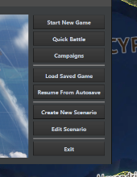

  

Then select the name of the scenario 

\

 

The ratings for complexity and difficulty are set by the designer of the
scenario and are variable depending on many factors.  Generally,
scenarios that are more difficult tend to have serious tactical
challenges or a very active threat environment.  Scenarios that are more
complex tend to both be longer, have more domains, numbers of units, and
rules of engagement limitations. 

After selecting a scenario and pressing Load selected, a menu will pop
up providing you with a detailed briefing as well as selectable sides. 

\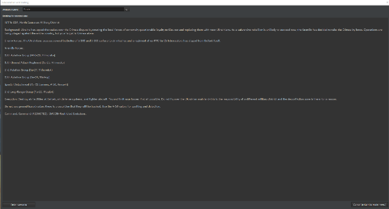

  

Following this, a menu will pop up notifying you of the various features
and realism options set by the mission designer.  These can be tweaked
in the mission editor but are otherwise provided for user information
only. 

\

## 10.2 Wooden Leg, 1985

### 10.2.1 Collecting Intelligence and Devising our Strategy

This scenario provides a great starting point for new players to COMMAND
as the complexity is relatively low but in order to achieve the greatest
result, many different techniques and strategies must be employed.

When you first select the scenario, you will be provided with a few
different details:

\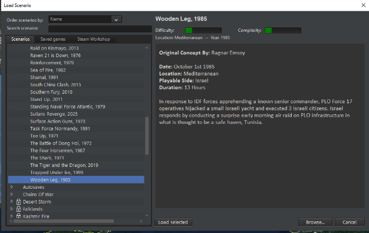

We are given a general overview of where, what and how we should execute
the scenario.  After pressing load selected, we are given a much more
detailed briefing.

\

The key things a player will be interested in will be the nature of the
mission as well as the ways that it should be carried out.  There are a
few things that are relevant to us right away:

1.  The objective is to destroy PLO buildings in Tunisia

2.  The enemy resistance is expected to be light

3.  We are to use the laser guided bombs to do maximum damage to the
    targets and *then* follow up with Mark 82s after the targets have
    received their initial damage.

4.  The ranges of the mission will be long, requiring us to conduct
    refueling possibly in both directions.

On the next page we get an idea of the different scenario options that
will affect us tactically.

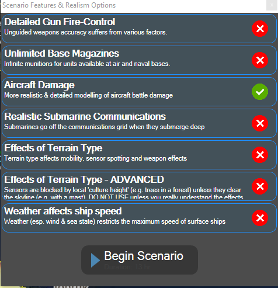

We can see right away that the only real concern we have is aircraft
damage which means if our aircraft are hit lightly, they can still
safely return to base.  Many of the other options are not present in
this scenario because they are either not required or are not relevant.

After we click Begin Scenario, we should pause and collect some
intelligence.

\

We can see that our scenario bounds range from Israel all the way to
Tunisia and that there are no exclusion zones or no navigation zones
anywhere on the map.  This means we have free reign where we would like
to operate our units throughout the scenario.  Keep in mind that these
requirements may be spelled out in more detail in a briefing or may be
implemented in other ways.

We now would like to see what kinds of units are present in our scenario
to see how this may affect our strategy.  We will click Game -\> Browse
Scenario Platforms and take a look at what we have at our disposal and
what we can expect throughout the rest of the scenario.

\

Looks like we have some F-15Ds, a few rescue helicopters and a Patrol
ship.

\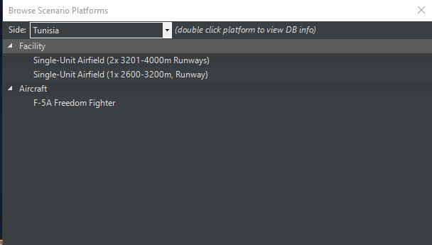

The PLO have a handful of buildings, and we can also see that Tunisia
has a few F-5As that may give us some trouble.  Let's double click on
one of them and see what we can find out.

\

It looks like they can carry up to 4 AIM-9N Sidewinders and have a
110-minute CAP time.  Depending on how many of the aircraft they have on
the ground, they may be able to put up a continuous combat air patrol
over the target region if they have enough warning.  Luckily there are
no EW radars in the scenario so it will be to our advantage not to use
our own radars in the event they do scramble.

The AIM-9N is an interesting weapon as well: 

\

The key element is that it is a rear aspect only missile meaning it can
be used in a chase but not in a head-to-head engagement.  This will have
a profound strategic impact in our WRA later on in the game.

There are a few other things we can determine from our scenario, and
that is that we have aerial refueling aircraft in position and we
already have patrol craft ready in the event we need to do pilot
recoveries.

The last thing we should check is the weather, which we can do by
looking at the side of our cursor at any time.  We can see that the
skies are clear, the temperature is 21C and the wind/sea state is 3. 
This is good since it means we'll have excellent visibility all the way
to the target and not have to fly below a cloud layer to employ our
weapons.

Now let's get an idea of what our strikers look like.  Click on Tel Nof
Air Base and press F6 or click the Aircraft Operations button at the top
of the screen.

\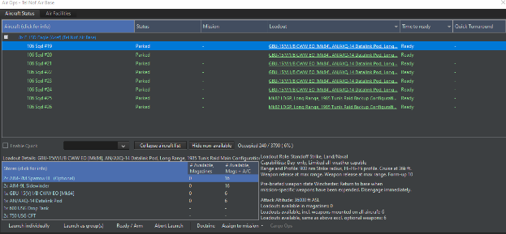

There is a lot of information here, namely that we are using the GBU-15,
a very powerful bomb with the ability to glide significant distances as
well as use a laser to hit a target.  We also can see that we have a 900
nm strike radius without needing to refuel.  We can quickly measure the
distance on the world map by pressing Control-D and then clicking on the
map and dragging a line.

Doing so we can see that the range is a staggering 1300nm!  This means
that we will have to either refuel on the way over or refuel on the way
back.  Ideally, we will do both if we have enough fuel in the tankers to
do so as it gives us the most operational flexibility.

**Un pause** and pause the scenario.  You will notice that a series of
new contacts appear on the screen near Tunis.

We are interested in the ones on the southeast edge of the bay.  Press
the number 9 on your numpad to switch to individual view if the group
view is preventing you from seeing the individual targets.

\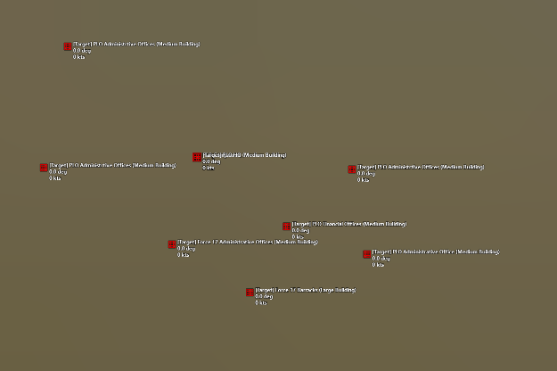

Looks like a pretty spread-out group.  If we select any of them, we can
see that their database entry says they are variations of Large and
Medium buildings.  Each of these has some light armor protection and a
total damage points of about 450 for the large and 300 for the medium. 
That's important to know since it tells us about how many GBU-15s we're
going to need to ensure target destruction.

\

Checking on the database entry for the weapon shows that each of these
weapons will be quite capable of a kill, but we only have 6 of them at
our disposal since each F-15D can only carry a single one of these
weapons.  In longer scenarios we could go back and rearm, but in this
case we will be cutting it a bit close on scenario time if we try that,
so we'll prioritize the larger buildings and let our sweep aircraft mop
up anything that might still be standing with some careful application
of Mk82s from the backup aircraft.

### 10.2.2 Executing our Mission

For this scenario, we could potentially fly the entire mission manually,
and this could work given how simple our scenario is, but for the
purposes of this guide, we will use a strike mission to do so.

Start by bringing up the mission editor by pressing F11 on the keyboard
or pressing Mission Editor on the toolbar.

\

We can see that we already have a refueling flight in position and that
there are a few extra tankers available to keep the track operational
without worrying about having to chase a tanker back to base with an
empty fuel tank.

Select the PLO targets in Tunisia with your left mouse button and then
click Add next to Missions.

\

We will make a few changes here and give it a name.

\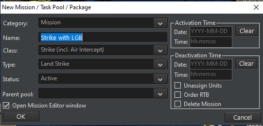

We will be using two missions for this operation, one will be the
primary strike and the other will be the sweepers to do BDA and clean up
any remaining targets.  While it is possible to put the entire group
into one mission, this will give us interesting flight size issues
later.

Press OK and head to the next page.

\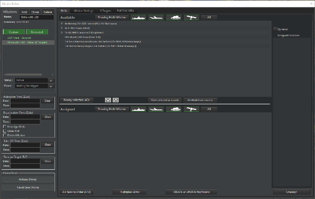

Before we add any units to the mission, we'll need to set up a few
things in Mission Settings first:

\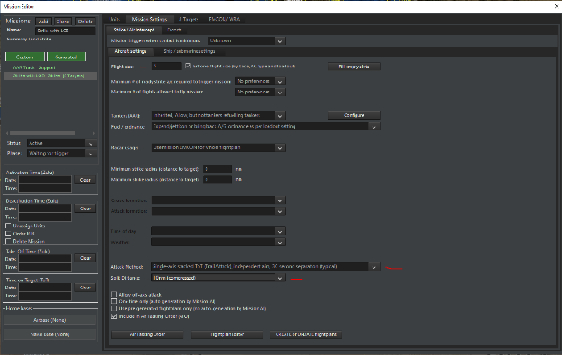

We are shrinking the flight size to 3 since we have 6 strikers available
to us.  We are also setting the attack method to a stacked independent
attack with a tight split to make the attack happen all at once,
reducing the time our opponent will have to scramble their forces.  Now
click on Configure next to refueling.

\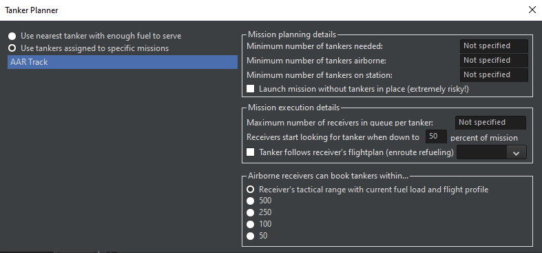

We will define it so that we're using tankers from the AAR Track
mission, to look for fuel at 35 percent of fuel and to NOT allow enroute
refueling.  If we opt for this, our tankers will run dry on their way
back to the refueling track leaving us in a tough spot logistically.

Now return to the units page and add the 6 F-15Ds with the LGBs on
board.

\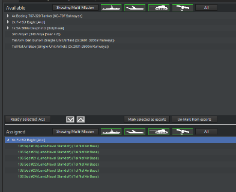

Looks good.  Head to the targets tab and set Opportunity Scrambling to
"Focus on strike targets", set engage to shotgun to 'Engage until
winchester' and then set Target Destroyed to "RTB".

These options ensure we won't get distracted along the way with a tasty
target.  Finally, click EMCON/WRA.  The general WRA is good for this
mission as we have a pretty simple package that we are using.  We do
have a weapon release concern, however.  If we open up "Weapon Release
Authorization" we will notice that the default number of GBU-15 weapons
to use against a land structure is either 2 or the amount the missile
defense value of that target.

\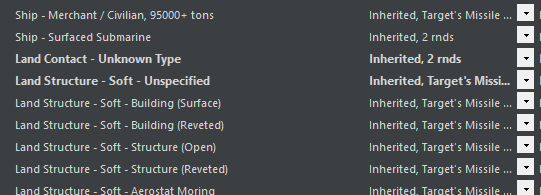

Unfortunately, if you check the missile defense value of a large
building:

\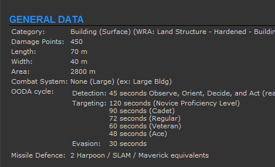

You'll see that our default WRA will use two of our expensive guided
weapons per target!  This is not needed or ideal for this scenario, so
we'll change the WRA so that it only uses one weapon per target.

\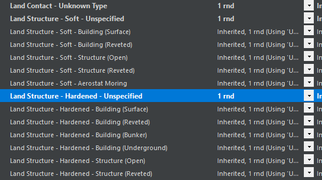

Looks good.  Lastly, we'll visit the targeting priority page and
prioritize the large buildings over the medium buildings.  To do so,
we'll simply create a few quick rules:

\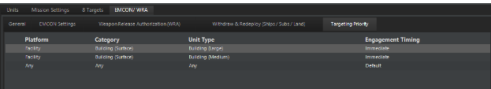

There we go.  Now we are going to hit the biggest targets first with the
actual amount of ordnance we need to accomplish this mission.  Keep in
mind we may deal with duds or return fire, but for this scenario, we
might as well be efficient.

Return back to mission settings and set a takeoff time of 5 minutes from
now.

\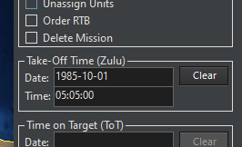

We'll do this since we need to coordinate with our sweepers and have
them come out a few minutes later.  At this stage we could create
detailed flight plans including a refueling stop along the way, but for
simplicity, we'll manually order up the refueling for the outbound leg.

Now that we're done with that mission, we can set up our sweepers. 
There are a few different approaches to this that can include doing it
manually, creating a patrol mission or simply adding another strike
mission.

We will:

1.  Clone previous strike mission

2.  Add the two remaining F-15D's with MK82 bombs to the newly created
    mission.

3.  Change the flight size in mission settings to 2

4.  Change the WRA so that Mk82s will drop a full stick but from only
    one shooter

5.  Set the takeoff time to 2 minutes *after* the previous mission

You might think that we should assign a single Mk82 per target, but
remember these weapons are unguided and our aircraft will be in the
danger zone of low altitude in order to employ them, so we want to limit
their exposure as much as possible.

\

We are ready to go!  Now we can un pause and fast forward to about 5:05
and watch our strikers take to the air on the way to their assigned
mission.

\

We'll fast forward time for a little bit until our strikers get close to
the refueling track.  Then right click on each of them and hit "Refuel
if possible" Then "Select tankers automatically".

\

All gassed up and ready to go.  We have an interesting problem to
consider at this point.  Since our tankers will only have enough fuel
for 3 hours at this point *and* our strikers have several hours of
flight time ahead of them, we are in a position where our tankers might
have to RTB ***before*** our F-15s get back to refuel for them.  What we
will have to do is manually order our tankers to RTB after all our
strikers have fueled up so that a fresh set of tankers are right on
station as the F-15s head home.  They may have enough fuel to do it
without the refueling, but we should be considering this possibility. 
Now we get to the fun part.

\

Turning on our radars seems tempting here, but if we do so we could cue
anyone around that we're coming.  If there was a more robust EW
environment in this scenario, we would more or less have to or at least
come in low over the mountains.

\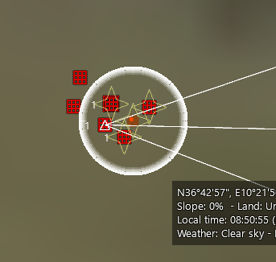

LGBs away!

At this point our strikers turn back, refuel as needed and return to
base.  Once every aircraft has landed, the option to end the scenario
will pop up and we can take a look at our performance.

### 10.2.3 Debrief

As we can see, while the mission was relatively simple, there were many
little things that contributed to the overall success.  We were
fortunate that there were no enemy fighters that came to tango with our
strikers, and we were also lucky that there were no SAMs or EW radars. 
The refueling aspect of this mission was one of the hardest parts to get
right and it can surprise new players just how tough it can be to
organize a long-range strike without doing everything manually.

As you were playing the scenario, you might have noticed some unknown
contacts in the water along the way: 

\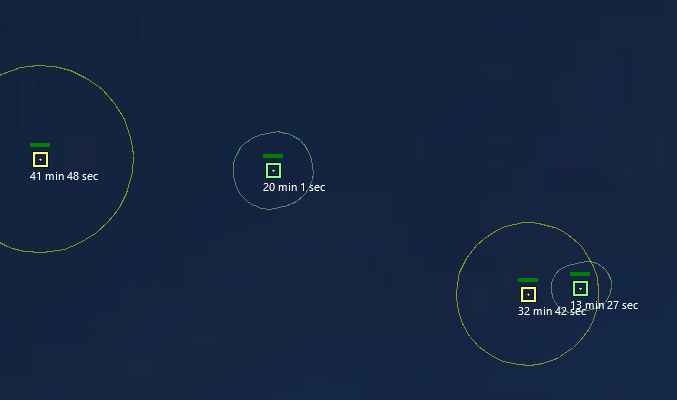

These were civilian vessels that were operating in the sea while you
were busy navigating 1200 nautical miles.  Some scenarios feature very
robust civil traffic that make anti-shipping operations quite a
challenge.

## 10.3 Battle of Chumonchin Chan, 1950

### 10.3.1 Collecting Intelligence and Devising our Strategy

This scenario is a short ASuW operation where we will be utilizing three
surface vessels and their gun armament to protect ourselves from waves
of irregular forces in the form of PT boats and armed civilian junks. 
Although there are no missiles in this scenario, much of the surface
strategy involved is applicable in the later ages and generations of
naval vessel technology.

After starting the scenario, we are presented with the Situation as well
as our objectives.

\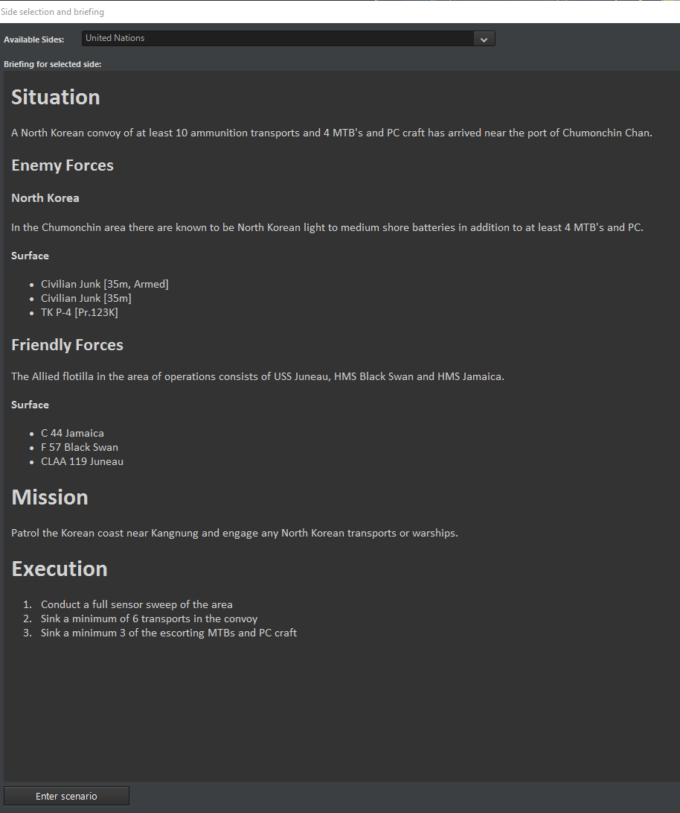

There are several key points:

1.  We are dealing with a non-symmetrical force meaning we will not be
    doing a rolling gun battle with other vessels of the same
    capabilities

2.  Our forces are mixed and older, but still very capable designs

3.  Our orders are to conduct a sensor sweep of the area as well as sink
    as many enemy vessels that are either torpedo boats or junks.

4.  Our previous mission was to shell shore batteries, but that is not
    required for this scenario

Upon entering the scenario, we can see the base layout of our forces:

\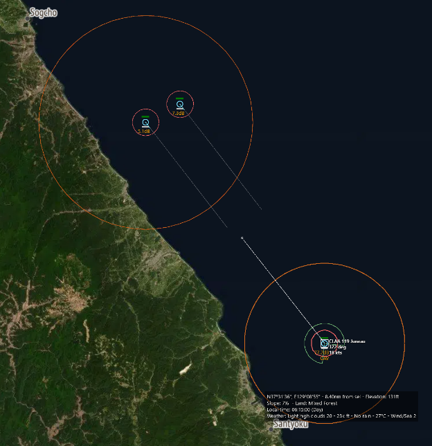

The AA cruiser is to the south and the light cruiser and frigate are to
the north.  The two formations are roughly 26 nm apart meaning at flank
speed, the best our solo ship can hope is to meet up with the main
formation in about 49 minutes, which is a *very* long time if you are
dealing with light craft.  The northern vessels are about 4 nm apart
making mutual support a little tricky, at least initially.

Looking at the scenario platforms we can find out a few different and
useful things, namely the enemy will have TK P-4s and light junks.  The
P-4s are the real threat as they pack the 43-36N torpedo with a maximum
range of 3 nm.

\

Fortunately, the torpedoes are straight runners meaning that we could
thread a torpedo spread if we are made aware of it.  Other information
we can determine is that the torpedo boats have a top speed of 50 knots
and that they have a Skin Head [Zarnitsa] radar making it easier to
identify them from their emissions if we need to establish who to
prioritize.

The Junks have a top speed of 18 knots and have some very basic armament
consisting of RPGs and 12.7mm machine guns.  They would only be a threat
to us if they were allowed to get within shouting distance, so we know
who to prioritize when the shooting starts.

Our forces are a little different.  The C 44 Jamaica is a light cruiser
from World War 2, and it is packing 4" and 6" guns with a maximum range
of about 12 nautical miles, giving us quite a stick if we need to pick
off the torpedo boats before they can close.  The Jamaica has a flank
throttle of 31 knots and importantly, we know the orientation of the gun
batteries from "Arcs" display in the database as seen to the right.  If
we want to have maximum effectiveness, we'll need to either face the
target directly, or we'll need to be firing off the port or starboard
side.  This also means that in a chase situation, we are at a *major*
disadvantage since we only have one turret of 6" guns facing rearward.

\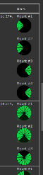

The F 57 Black Swan is an older frigate packing 4" guns and with a much
slower flank speed of 21 knots.  If we were picking the liability, this
would be it since it lacks the ability to concentrate fire like the
cruiser does, and the 4" guns, while they have a great rate of fire,
only can hit targets 6 nm away.  As a point of comparison, the 50-knot
torpedo boat can cover 6 nm to 3 nm range in 3 minutes and 36 seconds,
leaving us a very tight window if the PTs are able to close.

The CLAA Juneau is one of the best units of the scenario when it comes
to firing arcs, as it has 6 5" gun mounts along its length and each of
those has a range of 9 nm.  Unfortunately, since it is literally an hour
away from the fight, we'll have to use it to mop up or to cut off the
enemy retreat.

### 10.3.2 Executing the Mission

The key tactic for this scenario will be keeping the enemy as far away
as possible from our vessels, keeping our speed up, and making sure as
many firing arcs as possible are open for the purposes of engagement. 
The two northern vessels need to be brought into a position where they
can mutually support each other, and the southern vessel needs to get to
the scene as quickly as possible.

**Unpause the scenario** and give it a few moments to get the initial
sightings, then press pause again.

\

There are also some shore batteries in the mix that we must stay away
from.  Checking the database indicates that they have a range of about 4
nautical miles.  We could create a non-navigation zone around them if
needed, but they are not as big a priority as the incoming attackers.

Select each of your vessels and turn their surface search radars on.

\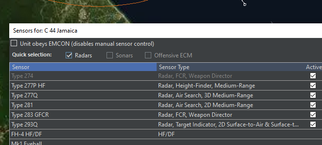

While it is tempting to let one ship keep its radar on while the others
do not for the purposes of denying the enemy intelligence, one of our
objectives was to do a full sensor sweep.  Let's see what our radars
uncovered.

\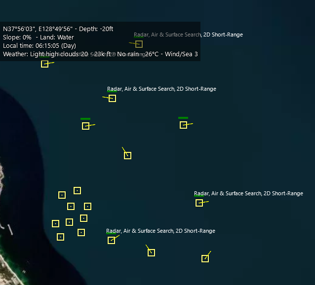

Wow.  That's a few ships.  Luckily our HF/DF crew on board the vessels
have immediately picked out the emissions of several 2D Short-Range
radars.  From what we know about the units in this scenario, the only
ships with that type of radar are the torpedo boats, making it very easy
to identify them as hostile.  Click each of the ships with the Air &
Surface Search, 2D Short-Range radar and press H to mark them as
hostile.  You'll notice when you hold your mouse over them, that the ESM
crew has already marked them as PT.

Now that the enemy is identified, we can start maneuvers.  Get all of
your ships up to flank speed and maneuver the Jamaica towards the
frigate while sending the Black Swan while bringing the course of the
Black Swan towards the cruiser.  The Juneau to the south should be
plotted to get into the action, and we'll tweak that a little later on
depending on what the opponent does.

\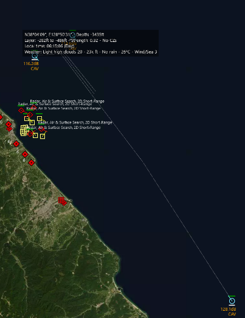

Our goal here is to beam the enemy forces as best we can while building
up enough speed to put some distance between us and the deadly
torpedoes.  While we're doing this, we'll take a quick visit the
Doctrine & ROE for side: United Nations (Control - Shift - F9) and set
"Engage Opportunity Targets" to yes.

\

Now we'll unpause and monitor the action for a minute.  The closest
enemy to one of our ships is about 5.5 nm away, giving us only a few
minutes to destroy the incoming vessels before they get into firing
range.

Notice what happens as the battle starts:

\

Four other vessels immediately point at us and start raising steam.  If
we check with our distance measuring tool, we can actually see they are
following an intercept course with our vessels.

While this is initially concerning, we can probably assume those vessels
are the armed junks and while they are dangerous at *very* close range,
we'd rather our cruise prioritize the incoming PTs *before* declaring
them hostile and wasting firing effort on something that is less of a
threat than the torpedoes that may follow.

We can see the 6" shells from the cruise bracketing the incoming PT
boat.  Even though the shells were not direct hits, the concussion can
still do a lot of damage.  Making five enemy units combat ineffective is
better than destroying one and leaving the other four still ready to go.

It is possible using manual targeting to 'force' the ship to select a
new target while shells are on the way, but this can be very difficult
to manage in a very pitched naval battle.

\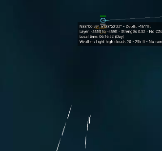

You can see how the cruiser splits its fire automatically since it has
multiple director control towers and associated radars regardless of our
need to manually target.

\

We now know what to look for.

\

There it is.  The enemy convoy has spotted us and is turning to flee to
the south.  Luckily, we have Juneau on the way to block their retreat.

\

Move the targeted destination slightly southward to cover the distance
quicker.  But do **not** come within 4 nm of the beach, or you may be
attacked by shore batteries.

\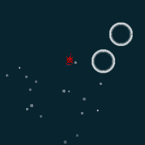

One PT down, 4 to go.  If needed, keep the ships perpendicular to the
incoming line of enemy fire.  This strategy will keep true all the way
into the near future with the advent of high-speed anti-ship missiles.

You may notice the firing rate of the cruise suddenly drops off at this
point in the battle.  This is not due to battle damage, but rather if we
take a quick look at the weapons tab of the Jamaica we can see:

\

Gun warfare with naval vessels involves a lot of 'hurry up and wait',
and modern warfare is no different.  As the battle continues, you may
see something like this occur:

\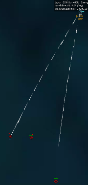

Notice how the Jamaica was busy engaging the other two vessels and
missed one coming up the center.  A quick check with the range tool
tells us that they knew skunk is 4 nautical miles away.  Luckily the
Black Swan is just coming into range with its own 4" guns and we can
click it, press F1 then select the straggler for automatic targeting. 
It is very tempting to turn the Black Swan perpendicular to the incoming
vessel to open up the rear guns to fire, but this would cut into our
time needed to close the distance to Jamaica which could become
problematic.

\

As we discussed in the briefing, mutual support is critical when dealing
with gun-based vessels.

\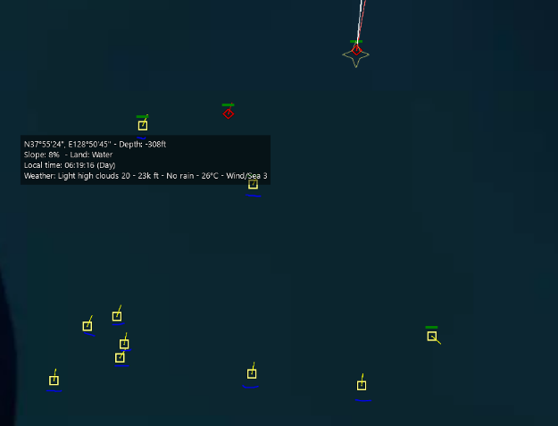

Note how all these other vessels turned to intercept us while the group
to the south head East.  Adjust the course of Juneau to intercept.

\

You will also notice one vessel that seems to be doing its own thing. 
This could be an enemy or could be a civilian, and without the presence
of any HF/DF on them, we will have to visually identify them later
before we close for a kill.  Mark the other vessels on an intercept with
us as hostile.

\

Note that both our vessels are working together now, but also observe
how those unknown vessels are rushing out to sea.  We have to finish up
with the lighter enemy vessels first, then we can go for the runners. 
Remember our southern vessel is steaming up to assist us.

\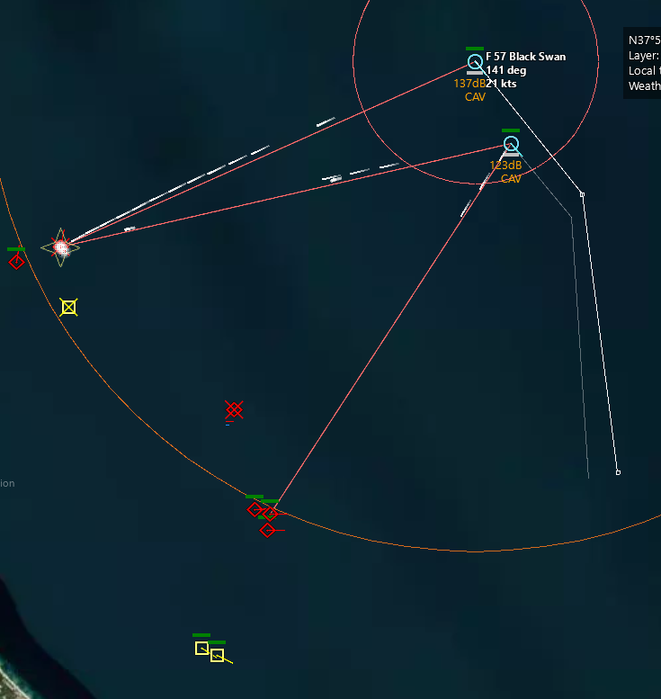

Adjusting our cruise to cut off the retreat.  Notice how the western
most vessel is slipping out of range; you can tell Jamaica to hit it
with the 6" guns or break the Black Swan off to do the deed.  Also note
that the two vessels are falling out of formation and will need some
manual speed adjustments, or to be put in a group to keep them together.

\

Note that Juneau has started firing on the town marker.  We *do not*
want that since it will result in a major loss of ammunition for no
gain.  In COMMAND, objects like cities and towns require much heavier
ordnance.

You can quickly shut down the unwanted shelling by right clicking on the
town marker and selecting "Filter Out".  This will cause your ships to
ignore the target until you reactivate them.

At this point we can either run out the clock to end the scenario or if
we're feeling a little more daring, we can set our ships up to shore the
very shore batteries we were originally sent to attack, but this is
actually out of the scope of the scenario.

\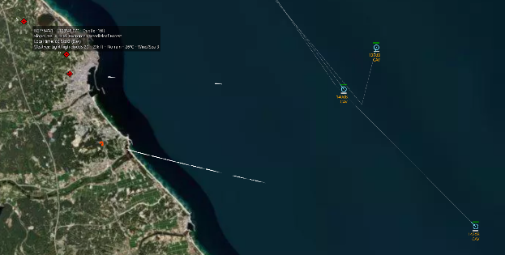

Cleaning up the shore batteries.  Remember that these shore batteries
have a range of 4 nm and will happily set fire to any vessel that gets
too close to shore.

We can use time acceleration to run out the clock and see how we did in
the scenario.  An interesting point to visit with this run was the
Losses & Expenditures page under the "Game" menu.

\

And of course there's the final scoring page as well:

\

### 10.3.3 Conclusions and Discussion

While the scenario was relatively uncomplicated, it showed many key
points in all naval warfare:

- Keep your speed up unless you're dealing with submarines

- Keep your weapons in range and position the greatest number of your
  weapons to face the incoming threat

- Keep your enemy out of their effective range

- Use mutual support

- Press the attack and don't let the enemy escape

- Prioritize the biggest threats first

- Monitor your expenditures.  In a longer fight, you may have to decide
  between closing the range to save ammunition and risking battle
  damage.

- Ships only can target a handful of opponents at the same time.  It is
  possible to overwhelm a ship's defenses with a large quantity of
  concentrated threats.

The other important takeaway from this scenario is that when missiles
get involved in a few years, detectability and detection take a much
bigger role in battles since if a surface action group is detected,
possibly hundreds of supersonic anti-ship missiles will rain down in a
matter of minutes.

## 10.4 Trapped Under Ice, 1999

### 10.4.1 Collecting Intelligence and Devising our Strategy

This scenario is a very challenging operation and at the same time an
excellent introduction to the challenges inherent in anti-submarine
warfare.  You may have to retry this scenario several times before
achieving the scenario goals as this scenario features random placement
of the enemy submarines creating a situation where you may score a lucky
win one round or complete destruction on another.

Take a look at the briefing:

\

We see that we have our work cut out for us. There are three "potential"
escorts and each of these is a very capable Russian attack submarine. 
Our target is the PLARB-941 Typhoon, the largest submarine ever built
and was designed from the outset to be able to pop through arctic ice
and deliver its deadly load of 20 SS-N-20 nuclear weapons, each with 10
MIRV.  Our submarine for this scenario is the SSN 768 Hartford, an
Improved Los Angeles Class nuclear attack submarine.

Our goal in this scenario is to destroy the Russian missile sub, even if
it costs us our submarine in the process.  Destroying the other Russian
attack subs is nice but not needed for this scenario.

As in our other scenarios, we'll carefully browse the scenario units and
see if there are any things we can discover about the units that we will
be encountering.  After looking carefully, there are many things you may
discover:

1.  The Russian subs primary anti-submarine torpedo is the USET-80K and
    it has a default range of 5 nm, and its seeker is only sensitive out
    to 1.5 nm.  This means our primary anti-torpedo strategy will
    involve turning and running to get out of its effective cone.

2.  The Russian submarines also possess a long-range standoff torpedo
    that is delivered by missile, a weapon that *cannot* be used due to
    the presence of the ice above our heads.  This is the luckiest break
    we have in this scenario.

3.  **All** of the Russian submarines have a towed array sonar system
    meaning they can hear things both behind it as well as underneath it
    since the hydrophone is trailed behind the submarine away from its
    noisy propeller.

4.  The Mk48 Mod 5 ADCAP torpedo is our primary weapon, and it has a
    staggering range of 21 nautical miles making it a fantastic 'recon
    by fire' weapon.  It also does 270 damage points.

5.  The Typhoon is both double hulled and it possesses 75 damage points,
    which is less than our torpedo is capable of inflicting, but the
    Typhoon is also well armored meaning it may take more than one clean
    hit to do the deed.

6.  The SSN Hartford is a very capable platform with a top speed of 32
    knots and several different types of towed arrays.  It is also 10 dB
    quieter than any of the Russian subs, giving us a huge stealth
    advantage.  This also means that if we detect a Russian sub first,
    we will almost certainly get the first shot.

7.  The patrol area we are covering is 50 nm x 60 nm (30000 square
    nautical miles of ocean).  If we split that into 10-mile-wide
    corridors of search that are 60 nm long, at 5 knots, it would take
    us 14 hours to complete one sweep.  Since we only have 48 hours to
    complete the mission, this is *not* viable.

As we can see, this is going to be very tricky but it's not impossible. 
We have a few basic strategies available to us:

1.  Conduct an ASW mission in the 'center' of the patrol area

2.  Build a search pattern using sprint and drift

3.  Drive our submarine into the search area and fire a spread of
    torpedoes in every direction while listening

4.  Run full speed through the search area attracting torpedo attacks
    and then firing on the bearing of incoming attacks.

When deciding between possibilities, it sometimes helps to create a risk
chart:

| **Option**         | **Chance of Success** | **Risk to us** | **Complexity** |
|--------------------|-----------------------|----------------|----------------|
| ASW Mission        | Low                   | Low            | Low            |
| Sprint and Drift   | Medium                | Medium         | High           |
| Torpedo spread     | Low                   | Low            | Low            |
| Full Speed Ahead!  | Medium                | High           | Low            |

The usual balance is between success and risk.  We want the highest
chance to succeed, but the one that minimizes losses on our side.  Note
how strategies that are often lower risk are either *less effective*
and/or *less complex*.  This is no surprise and it's why there are
military colleges dedicated to these subjects.

We will opt for two of the strategies, the sprint and drift and the
torpedo spread.  If we are running out of time in the scenario, we'll
engage in a high-speed torpedo dodging exercise.  Remember as we said in
the introduction, even if we get *everything perfect,* we may still fail
the scenario.  ASW is as much about art as it is science, and in other
ASW style scenarios, even with the presence of more assets and powerful
passive tools such as sonobuoys.

### 10.4.2 Executing the Mission

Loading the map, we can see:

\

The markers to the East of us represent the possible submarine patrol
area and are where we need to start looking.  We have to get there as
quickly as possible so we will order our vessel to the patrol zone at
full speed and maximum depth possible.  Once we get to the patrol area,
we'll prepare our sprint and drift patrol after listening.  While it is
tempting to start our patrol in the upper left or bottom left corner,
bisecting the patrol zone will improve the chances of us finding our
quarry.

\

Our towed array is trailed behind and below us, but our own submarine
noises will make it hard to hear 'through' us.  Although we have a
powerful sonar array on the fore of the submarine, we'll want to swing
around often to listen.

 \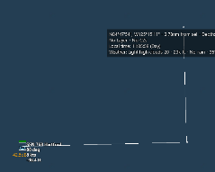

At anything under 10 knots, we have a good balance of speed and the
ability to hear things around us.  The faster we travel, the more noise
we will make and the harder it will be to pick out the sounds of quiet
submarines in our vicinity.

At this point we may encounter a possible contact, but this is unlikely
given the size of the search area.  If we do get the distinctive unknown
subsurface contact, we can start working out our first shot
immediately.  Otherwise, it's time to set up the sprint and drift.

Our method will be to sprint about 10 nm at maximum depth and then drop
our speed to 10 knots and then return to shallow depth for five minutes
of listening and a quick 90 degree turn to clear our own baffles.  5
minutes at 10 knots works out to be about 0.42 nautical miles which
means we'll spend a quarter mile going forward and then a quarter mile
at the perpendicular course.

Start by drawing a 10 nm course, then selecting our submarine and
setting the depth to "As deep as possible" and the speed to flank.

\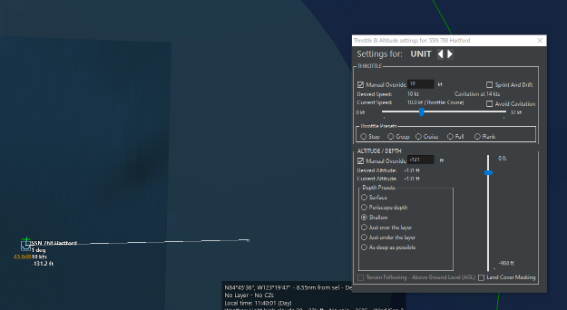

Then click on the end waypoint and press F3 to continue the pattern
forward about 0.25 nm and then north 0.25 nm

\

Now select the waypoint on the left (Waypoint #1 and set the depth to
shallow and the speed to 10 knots)

\

Now our submarine will sprint to the waypoint, then come up to listen
for a few minutes.  All we have to do now is repeat the pattern on a
macro level.

\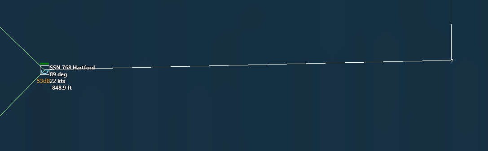

You can see as our submarine arrives; it heads back up to the surface
for a listen.  Do not be surprised if there is nothing there as sonar
has limited range.  We can continue this pattern of sprinting and
listening at a much larger level.  At this point, we have to consider
what kind of search pattern we are going to use now that we have our
depth and speeds worked out.

In ASW, there are several basic patterns we can use:

1.  Expanding box: make progressively longer legs away from a point in
    the shape of a 'square spiral'

2.  Ladder: Track back and forth up and down an area similar to the
    pattern someone mowing the lawn takes

3.  Sector: Head to an area and execute several 120 degree turns before
    offsetting to another.

4.  Zig-Zag: As in a box, but without the square corners

Expanding box:

\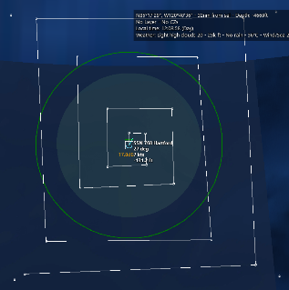

Ladder:

\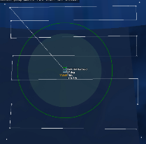

Sector:

\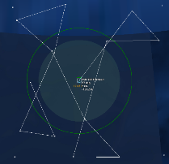

Zigzag:

\

Notice how each pattern has a different level of coverage versus time
spent.  The ladder is very effective, but it takes the longest to
execute while the sector search doesn't cover as much, but it allows for
quicker transit. The zigzag gives us a good balance between transit time
and coverage.  The expanding box is very useful if we were dealing with
a stationary target, but since we're dealing with moving targets, the
time spent going back over the original terrain won't help us.

Unfortunately, what makes our decision tougher is our need to sprint and
drift along the length of the pattern we create.  We can either
meticulously place each waypoint along our route, or we can opt for
manual control of the submarine.  Manual control also means we can react
to anything we find along the route without having to redraw *our entire
route*.

When trying this scenario, experiment with the different patterns.  For
the purposes of this tutorial, we'll opt for the expanding box and use
manual control of our submarine.  To make things a little easier for us,
we'll build a simple system to keep track of when to sprint and when to
surface and listen:

  -----------------------------------------------------------------------
  Time past the hour       Depth                      Speed
  ------------------------ -------------------------- -------------------
  +0:00                    As deep as possible        Flank/32 knots

  +0:20                    Shallow                    Creep/8 knots

  +0:30                    As deep as possible        Flank/32 knots

  +0:50                    Shallow                    Creep/8 knots
  -----------------------------------------------------------------------

This is also handy in case we encounter an enemy submarine, and we need
to determine where we were in the cycle.

After setting up our pattern, we can see it will take us about 14 hours
to cover the entire shape at flank, and with our adjustments we can
expect that to be pretty close to 24 or so.

\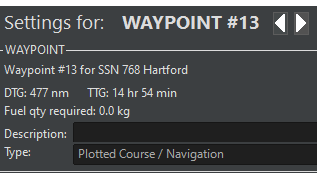

\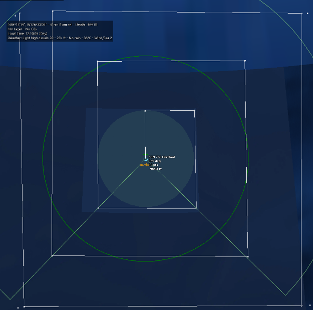

Our drawn pattern.

Now all that is left is to make our adjustments as we go along.  You'll
now see what ASW is also known as 'awfully slow warfare'.  It may take
us a literal two days in game time and still not see one of the four
enemy submarines, or we will see all four at once, that's why it is so
challenging.

\

ALARM!  We've got something during one of our sweeps.  Our sonar team
was on their a-game and worked this contact out to be our quarry!  This
was incredibly lucky on our part, but just because we have a positive
contact and ID, we still need to engage the enemy submarine.

Our range to the target is 3.37 nautical miles meaning our 50 knot
torpedoes can cover that distance in about four minutes.  The moment we
fire, the typhoon will likely drop a rack of their own torpedoes down
our bearing, but if you recall, their range is only 5 nautical miles
giving us plenty of time to get outside of their detection range.

Hold down shift+F1 and left click on the target

\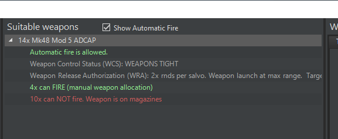

Although it is tempting to fire all four torpedoes at the target,
typical submarine doctrine calls for always holding one torpedo in
reserve for self-defense.  After all, there could be a Russian sub right
behind us!

Since our range is so close, we can take a direct shot rather than
firing a carefully aimed spread.  Remember the default reaction to
hearing a torpedo is turning and running from it meaning if we *miss*,
we now have a target that is several miles away from us and out of range
from a follow up shot, so we'll have to pursue them *remembering that we
will be making a lot of noise in the process*.  We'll have to run deep
and fast and constantly track where our target is.

Fire two of the torpedoes and notice immediately that you lose sight of
the Typhoon.  This is because your torpedoes are the loudest things in
the water and they are between you and your target, you can either
manually steer the torpedoes out of your line of sight (they are wire
guided and can be controlled with the plot course command), or you can
beam them until you reacquire the target.  Remember they will run *away*
from the incoming torpedoes, so we need to be where they are going.

\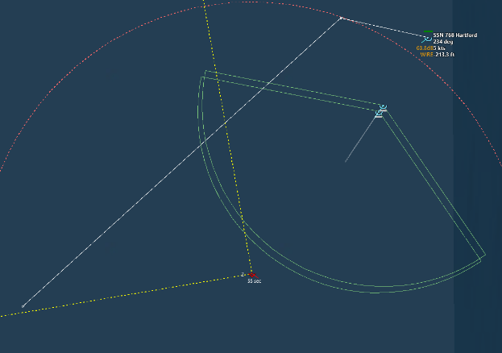

Since our torpedoes are so noisy, we can easily track the position of
the enemy sub by the direction the torpedoes point and their path of
travel.  Turning on unit trails is a great way to visualize the path of
the weapon.  This is under options -\> Map Display.

\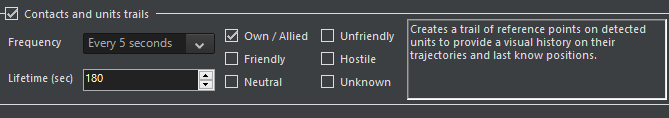

\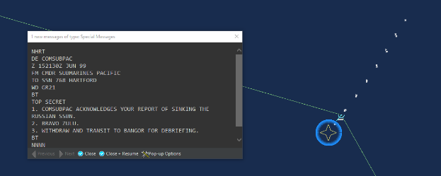

Those Mark 48 torpedoes are incredible weapons, and you can see how it
was a very clean kill leaving us with one torpedo still tracking.  That
torpedo can turn and *come back to us* if we are noisy, so be careful
not to get too close to it.  A common strategy here is using the wire to
plot a course of the weapon *away* from our own submarine, but this can
cause collateral damage!

In this scenario, it is very tempting to keep hunting for the other
Russian submarines, but an order is an order.  The BRAVO ZULU is a naval
shorthand for 'well done'.  Getting out of this area is quite easy since
we can get down deep and run at creep speed until we are clear of the
patrol zone.  Remember that there are still several attack subs around
us, and they may have heard us and are vectoring in to engage.

\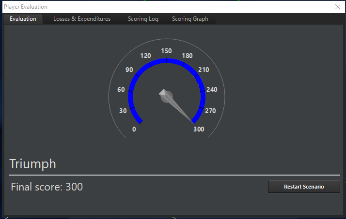

### 10.4.3 Conclusions and Discussion

Whether or not you were able to sink the boomer in the time allotted,
the scenario provided you with a few great ways to approach
anti-submarine warfare:

1.  You can execute the mission perfectly and still miss your mark

2.  If you can hit your opponent, they can hit you.  This is not as true
    with aerial assets, but still relevant.

3.  Detection is a function of speed and depth.  The faster you are, the
    harder it is to hear but you will also be easier to be heard.

4.  A search pattern is easier to execute when you have multiple assets
    at your disposal.

5.  Sonar can be easily masked by your own vessel, weapons or other
    objects in the water making detection very challenging.

One thing we did not cover in the scenario write-up is the event that
you are engaged by an enemy torpedo.  The first thing you should do is
launch one of your own torpedoes using a bearing only launch in the
direction the torpedo was launched from while simultaneously marking
where that weapon was when it was first detected.  This will allow you
to plan your re-attack after turning around and running at flank speed
away from the torpedo.  If a torpedo is fired at you beyond effective
range, it is often easier to plot a course perpendicular from the
incoming weapon to proceed out of the detection cone of it, also
providing you with quality targeting information.

## 10.5 AAW Example -- To be completed.

