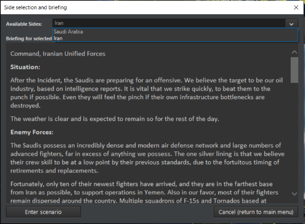

# 2.0 Introduction to COMMAND

Entering COMMAND, there are four main game modes.

**Game Modes:**

**Campaign.** This game mode allows for the playing of multi-mission
campaigns, such as the official DLCs or tutorials. See **5.4.3
Campaigns** on page [83](#campaigns), for more information.

Quick Battle. This game mode allows for players to throw together a
"quick battle" from a list of presets. Thus, you can choose between
F-16s and F-22s on one side and Su-35s or MiG-29s on the other for an
easy to execute dogfight, or a submarine matchup involving a Los Angeles
or Virginia vs. Victor III or Akula.

------------------------------------------------------------------------

**Start New Game.** This loads a prebuilt scenario. This can be
considered "normal play". Players can select a side if the scenario
allows it, but all ScenEdit features are disabled.

------------------------------------------------------------------------

**Create New Scenario**. This allows for a scenario to be created. All
ScenEdit features are enabled.

The gigantic amount of community content for COMMAND and its complexity
may be daunting to beginners. Completing the formal tutorials, some new
to CMO and some carried over from 1.0, in order is highly recommended.
In addition to those, the following "standalone scenarios" are useful
for learning the basics of COMMAND.

- Battle of Chumonchin Chan, 1950. This is a basic Korean War scenario
  where the player controls an objectively superior force to their
  opponent. Useful for learning gun-dominant surface warfare.

- Wooden Leg, 1985. This is another basic long-range Israeli airstrike
  scenario where the only challenge is aerial refueling to get the
  aircraft to the target. Useful for learning how to use tanker
  aircraft.

- Raid on Kismayo, 2013. This is a basic low-intensity modern warfare
  scenario. Useful for general play and control in a generally low-risk
  environment.

- Battle of Latakia, 1973. This is a historically lopsided encounter
  that serves as an excellent introduction to missile-age surface
  warfare. Useful for learning missile-dominant surface warfare.

- Stand Up, 2011. This is, especially if played from the British side,
  an easy scenario that nonetheless forces the player to coordinate
  aircraft and ships. Useful for getting the hang of combined arms
  operations.

Once the basics have been mastered, the following are recommended for
somewhat more advanced play:

- North Pacific Shootout, 1989. A small-scale air-to-air scenario
  between the best the US and Soviet Union have to offer. Useful for
  fighting a peer air opponent in a manageable situation.

- Iron Hand, 2014. A Russia-vs-Azerbaijan scenario that teaches the
  basics of standoff weapons, a detailed air campaign, and operating in
  a casualty-conscious environment.

The community pack, available at
<https://command.matrixgames.com/?page_id=1876>, contains hundreds of
scenarios available for download. Many are beginner-friendly. A helpful
rule of thumb is to search for ones with low 'complexity' on the
difficulty-complexity scale.

*Disclaimer: The community pack scenario authors have varying degrees of
contactability and support of their scenarios. Thus, some scenarios may
not be updated or changed to take mechanics changes since their
introduction into account. Play at your own risk.*

## 2.1 Important Terms

There are several bits of information those in a hurry to get started
need to know. These will be elaborated in greater detail throughout this
manual and the tutorials.

**Units (Page [56](#units-groups-and-weapons-symbols))**: Units are the
entities in the simulation. There are many types of units and many of
these units can house other units; for example, an aircraft carrier can
house aircraft, or an airbase can have hanger units, runway units, and
these hanger units may contain aircraft units. Many units can be
directly controlled or assigned to missions. There are special units
such as individual facilities, sonobuoys, missiles, and many weapon
types that may or may not be directly controlled and cannot be assigned
a mission. Airbases can be assigned missions.

**Groups (Page [56](#units-groups-and-weapons-symbols))**: Groups are
units that have been bound/grouped together in the simulation into one
cohesive unit. This is done by drag-selecting units and pressing the G
key. Many scenarios come with groups pre-made by the scenario creator,
and aerial missions automatically group aircraft based on the mission
editor's flight size.

**Mounts (Page [36](#mounts-and-weapons))**: Many units have mounts.
These are usually weapons or sensors. An example would be a gun mount on
a ship, a hard point on an aircraft, or a sonobuoy dispenser on an
anti-submarine warfare (ASW) helicopter. Mounts usually require
ammunition that is already loaded, such as a missile on an aircraft
(single shot mount) or a gun mount with a magazine associated with it
for reload. There are ways to reload mounts and magazines if the
scenario designer desires to provide loaded ammunition bunkers, ships'
magazines for aircraft or at-sea replenishment for ships.

**Magazines (Page [30](#magazines))**: These are components of units
that are used to store weapons. These must have weapons in them for
weapons to fire or aircraft to launch combat-oriented missions.

**Missions (Page [144](#mission-definitions-and-details))**: Missions
make the battle space manageable and allows the scenario designer to set
up an effective AI controlled opponent. The purpose of missions is to
allow units or groups of units to engage in a common task, such as
anti-submarine warfare or all striking one target. There are many
mission types and mission options, such as Rules of Engagement, Doctrine
and Postures.

**Formations (Page [29](#formation-editor))**: Formations are a group of
units (normally associated with ships, but may be extended to aircraft
formations), a central unit(s) and escorts. Each unit in the formation
usually has a primary task and station, designed to mutually support the
whole formation from any threat.

**Rules of engagement (RoE) and Doctrine (Page [38](#unitgroup-doctrine)
and
[61](#doctrines-postures-weapons-release-authority-and-rules-of-engagement))**:
This also encompasses mission options and orders. Many units house other
units, like a cruiser with an embarked ASW helicopter. The cruiser is
assigned a mission or patrol zone within a formation which has a
specific EMCON (Emissions Condition, i.e. whether its radar is on or
off). If the embarked helicopter is not assigned a specific mission, it
will inherit the Rules of Engagement, Doctrine and EMCON of the parent
unit (the cruiser), this can be overridden if you decide to change any
of the aforementioned settings (you will be prompted to affirm the
override).

You can skip right to the tutorials or read further for more detailed
information on the items above.

**Events (Page [93](#events)):** Events allow fundamental changes in the
battlespace, such as changing the player's score, launching or
cancelling a mission, or even ending the scenario entirely. Events
consist of a trigger (cue to start them, which can be a point threshold,
unit hit/found, or time point) and an action (the meat of the event
itself, which can be everything from a basic "Side \_\_\_ scores X
number of points" to a complex Lua script). Events are created by the
scenario author in the scenario editor and are not viewable or editable
in regular play.

**Sensors (page [195](#sensors-1)):** Sensors are anything that allows a
unit to detect something else. They range from the classic "Mark 1
Eyeball" to advanced radars and electronic emission detectors. Sensors
can be passive (no emissions of their own) or active (which do emit, and
thus can be detected by other passive sensors)

Types of sensors include:

- Radar. The most famous 'active' sensor system. Radars range from the
  earliest and crudest World War II vintage types to ultra-modern AESAs
  (Active Electronically Scanned Arrays). Radar performance, especially
  in the face of jammers, can thus vary extensively based on power and
  technology. On one extreme are early radars that can only generate an
  imprecise general contact location, while on the other are advanced
  ones that are incredibly jamming resistant and can determine the exact
  type of target they're identifying.

- Sonar. Sound-based naval detection system, sonar can be 'passive'
  (purely listening) or active (pinging). Active sonar is more precise
  but lets the target know that someone else is there. As with radars,
  sonar performance varies extensively by size and technology.

- Electro-Optical. This includes video cameras and infrared sensors.
  While they have their limitations (such as only being able to
  determine precise distances at short range), they have the advantage
  of being 'passive' and thus not emitting like radars are.

- ESM. Electronic Support Measures, these range from simple radar
  detectors to advanced signals processors. All share the
  characteristics of being 'passive' (not emitting themselves) and being
  able to detect active radar emissions.

## 2.2 Fundamentals

### 2.2.1 Starting COMMAND

Start command by either clicking on the Desktop Shortcut or on the
Command.EXE file in the Command folder. The screen below is shown.

On the top is the "play game" subsection.

"**QUICK BATTLE**" opens a series of customizable engagements where the
player selects the forces from a group of presets and proceeds to engage
them in a small scenario.

To create a quick battle involves templates. They are accessible in the
[COMMAND installation folder]/QuickBattle folder. Each quick battle
gets its own subfolder, featuring an HTML document and a Lua script to
match.

In the background, the named elements in the HTML page are translated to
Lua variables which are then executed via the attached script. Thus,
like scenarios, the templates can be customized and shared by editing
the template portions.

"**CAMPAIGNS**" opens a list of current campaigns. (See **5.4.3
Campaigns** on page [83](#campaigns))

"**START NEW GAME**" and "**LOAD SAVED GAME**" places the simulation in
play mode and opens a menu with two tabs on the left and a file menu
below them. The "**START NEW SCENARIO**" tab shows scenario files and
allows starting the selected scenario from the beginning and the "**LOAD
SAVED GAME**" tab shows saved game files and allows loading those saved
games. Selecting a scenario or saved game will show the title and a
brief description of the scenario.

**RESUME FROM AUTOSAVE** loads the last autosave.

On the bottom is the "Scenario editor" subsection.

The "**CREATE NEW SCENARIO**" places the simulation in the edit mode and
starts the simulation is a blank mode.

The "**EDIT SCENARIO**" places the simulation in the edit mode and
allows loading a scenario or saved game.

The load scenario dialog is composed of list of scenarios or saved games
on the left (with a third section on the rightmost side of that reserved
for scenarios accessed via the Steam Workshop) and a large text box with
name and description on the right. The left scenario drill-down list is
tabbed and allows you to view and choose scenario folders, files
(scenarioname.scen) or save games (scenarioname.sav files).

To load a scenario or save game you must select one by point and
clicking it from the left side menu. If the entry has a plus sign next
to it is a folder which when clicked will open revealing individual
scenario or save game files that can be individually selected. When
satisfied, click the load selected button at the bottom and the scenario
or save will load.

When you load a scenario in either mode the application will match the
scenario with the necessary database version. When you edit a scenario,
it will start with your default database version. If you need to change
this, you can do so in the scenario editor. This will be described later
in the manual.

You will now be presented with the side selection and briefing dialog.

Select a side in the drop-down menu at the top, read the briefing and
click the "enter scenario" button when satisfied with your choice. Many
scenarios do not have this option. In this case, simply read the
briefing if desired and press "enter scenario".

The scenario will now launch, along with the features and settings
graphic that determines what specific options are enabled or disabled.
Some scenarios may have unlimited magazines at air and naval bases,
while others may not.

In normal play, scenario features and settings are locked. See **5.4.9
Scenario Features + Settings** on page [92](#scenario-features-settings)
for information on how to change them in the editor.
