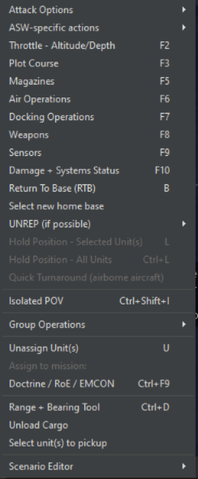
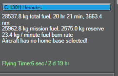

# 4.0 Menus and Dialogs

## 4.1 Right Click on Unit/ Context Dialog

You can right-click on a unit to display a drop-down menu of popular
functions in the game.

### 4.1.1 Attack Options

**Engage Target(s) - Auto**: This function will order the selected unit
or group to attack a designated target or group of targets. See **3.3.1
Engage Target(s) - Auto** on page [24](#engage-targets---auto) for more
information.

**Engage Target(s) - Manual**: This function calls on the weapons
allocation dialog, which allows players to manually allocate weapons to
selected targets. See **3.3.2 Engage Target(s) -- Manual** on page
[24](#engage-targets-manual) for more information.

**Bearing-Only Attack**: The bearing only attack allows players to fire
guided weapons without designating a target but instead designating a
point which their guiding sensor(s) will activate to hunt targets. It
otherwise functions identically to the "engage target(s)-manual"
function.

Be aware that doing this may put neutrals at risk as the sensor may not
know friend from foe and that it has a high chance of missing,
especially if the contact location is not accurate. You can also call on
this function using Ctrl+F1 hotkey combo or from the Unit Orders drop
down menu.
*(For purely inertial-guided weapons, like ballistic missiles or
JDAM-type bombs, the designated point is not the seeker-activation point
but rather the desired impact point. This can be useful if, for example,
you want to finetune the airburst point of a cluster warhead.)*

**Lay Chaff:** This function has the aircraft deploy a cloud of
anti-radar chaff. The "single burst" option releases one 'puff', while
'continuous stream' has the aircraft deploy chaff until it runs out or
has to RTB for another reason. The corridor and its altitude are marked
on the map.

Aircraft inside the corridor have an effectively reduced RCS (the chaff
strips break up the radar beam and scatter it wildly), but it is
dependent on them staying inside it. Improvements in radar quality made
chaff increasingly less effective in real life, as aircraft would be
confined to a narrow corridor with increasingly marginal benefits from
it.

Note that the aircraft must be *inside* the corridor (and at the same
altitude as the cloud when faced with 3D radars), not merely behind it.
Chaff-droppers must therefore precede the main body, an inherently
dangerous task (many F-4 crews assigned to such a role in Vietnam found
this out the hard way.)

From the late 1970s onward, chaff sharply drops in effectiveness. 3D and
phased-array systems, along with better electronics overall, can make
radars more capable at seeing through it. Experiment in the editor to
see what radars can and can't be foiled by chaff.

**Drop Target**: This function allows a player to drop one or more units
from its target list. After selecting this function simply click on the
unit you would like to drop or drag select multiples.

**Disengage (Drop All Targets):** This function drops all targets from
the unit target list and the unit will continue with its previously
assigned mission or plot.

**Ignore Plotted Course When Attacking**: If units are on plotted
courses and are given an attack order they will fly to the end of their
plotted course and carry out the attack by default. Selecting this
option turns that behavior off and units will attack immediately.

**Weapon Control Status (WCS):** This allows the weapon control status
(see "General Tab" below) to be changed. WCS Selected Unit(s) changes
the settings only for the units in question, while "All Units" changes
it for the entire side.

### 4.1.2 ASW-specific Actions: 

**Drop Passive Sonobuoy:** If the aircraft has sonobuoys in its
inventory, it drops it. Sonobuoys can be dropped above or below the
thermal layer (see **9.3.3 Submarine Combat** on page
[204](#submarine-combat)). Passive sonobuoys are the main source of
anti-submarine warfare.

**Drop Active Sonobuoy:** This drops a sonobuoy that actively pings. As
the submarine will know it's being watched, active sonobuoys are
traditionally used only to pinpoint the exact location of an
already-detected contact prior to an attack.

**Deploy Dipping Sonar:** If the aircraft is a helicopter with a dipping
sonar, it stops, hovers low, and deploys it.

**Function key functions**: Allow you to call on unit level functions.
See **3.3 Buttons and Windows** on page [24](#buttons-and-windows) for
more information.

### 4.1.3 Context Menu, Cont.

**The Range and Bearing Tool**: This tool acts as a measuring tape for
players. To use it select the option (or hit Ctrl + D) and click a point
on a map and drag out you will see it measure range in nautical miles
and bearing relative to the point you chose.

**RTB**: If an aircraft is selected using this function will order an
aircraft to return to its home base.

**Select new home base**: If you'd like to designate a new home base for
a unit select this option and click on the new home base or ship on the
map. Home bases can be ports (for ships), airfields (for aircraft), or
ships with the size and docking capacity to hold the unit in question
(either).

**Refuel/UNREP/Replenish (if possible)**: The unit will head over to a
tanker, UNREP ship, or ammo truck and refuel/resupply. The
tanker/replenish unit can be selected either automatically, manually, or
from a certain mission. This is essential if one needs to ration fuel or
prioritize one specific mission over another (i.e. the heavy bomber that
needs the fuel for a deep strike over short-range fighters who'd only
gain a bit of endurance). Submarines are also able to resupply and
replenish assuming the supplier has the appropriate munitions and fuel
types on board. Note that this can take a significant amount of time at
sea due to the complexities of loading items onto a rolling submarine.

**Hold Position - Selected Unit:** For land units, this stops the
selected unit(s). This is useful if they've moved to the wrong place.

**Hold Position - All Units:** This stops all land units.

**Quick Turnaround (Airborne Aircraft):** This allows the quick
turnaround settings of an airborne aircraft to be reconfigured.

**Summon to re-establish comms:** If "Realistic Submarine
Communications" (see **5.4.9 Scenario Features + Settings** on page
[92](#scenario-features-settings)) is checked and a submarine is
currently too deep to have normal communications, selecting this will
cause it to, if possible, return to a depth where it can communicate
constantly.

### 4.1.4 Group Operations: 

**Group Selected Units:** The multiple units selected will be unified
into one group.

**Detach Selected Units from Group:** If one or more units in a group in
Unit View is selected and used, it will be removed from the group.

**Formation Editor:** This opens the formation editor to change the
placement of units inside the group. See **3.3.5 Formation Editor** on
page number [29](#formation-editor)for more information

**Unassign Unit(s):** This unassigns the selected unit(s) from the
mission in question.

**Assign To Mission:** The assigns the selected unit(s) to an existing
mission.

**Doctrine/ROE/EMCON:** This brings up the doctrine window to allow unit
level doctrine, ROE, EMCON settings and WRA to be set. (See **3.3.12
Unit/Group Doctrine** on page [38](#unitgroup-doctrine).)

**Range+Bearing Tool:** This opens up the range/bearing tool. Clicking
on a point starts the process, with a line being created. The line can
be moved across the map, and in doing so, the distance and bearing from
the original point appear next to the cursor. Clicking again creates a
new "start point" at the cursor's current location, while pressing ESC,
CTRL+D or double clicking exits the tool.

**Unload Cargo:** This makes the unit, if able, unload any cargo that
it's carrying. Ships need to be right next to the shore to unload their
cargo, while helicopters will need to drop down and land.

**Select Unit(s) to pickup:** This enables a suitable unit to pick up
units and carry them as cargo. When selecting this, the cursor turns
into a crosshair. Click on the unit you want picked up.

### 4.1.5 Scenario Editor:

**Edit Unit Properties:** This allows unit properties-magazines, stores,
and aircraft- to be changed. The time underway can also be changed, to
simulate food and other non-fuel resources being consumed aboard a
ship/submarine.

**Set Unit Proficiency:** Allows the proficiency of the unit to be
changed. For more information about unit proficiency, see **6.3.3 Order
of Battle** on page [115](#order-of-battle),

**Chance Of Appearance:** This sets the probability that the unit will
appear when the scenario is next loaded. Thus, if it's set to 10,
there's a 1-in-10 chance that it will appear on load and a 9-in-10
chance that it will not.

**Copy Unit ID to Clipboard:** Copies the unit ID to the clipboard where
it can be used in Lua scripts.

## 4.2 Right Clicking on Map Dialog

### 4.2.1 Control and Shift Right Click on Map Dialog

You can also Ctrl button + right mouse click on an empty spot on the map
for some other functions.

· **Add Unit** appears in ScenEdit mode and calls on the add unit dialog
to drop a unit where you clicked.

· **Add Reference Point** allows you to drop one reference points where
you clicked.

· **Define Area**: Allows you to, via click-and-drag, make a "box" of
reference points. Areas defined can be rectangular or circular. To
define an area, left click and hold after selecting. If a unit is
selected, the distance from the selection will appear in the databox.
Once the area is large enough, release the mouse button and the box/disc
of reference points will be formed.

If a potential target is right clicked while holding the shift key, a
new dialog appears:

This allows you to engage a target with the selected unit using specific
weapons or to simply order an intercept. If an intercept is ordered, the
selected unit automatically selects an appropriate throttle setting and
moves to identify the target using the best path possible.

If a unit that is capable of carrying and unloading cargo is selected
and the shift + right click option is done on a unit that can be
carried, a new menu will appear allowing the carrying unit to pick up
that unit. If a base is shift-right clicked, it can be set as the new
home base. If a unit that has a base is shift-right clicked, then the
option to make that unit RTB is presented. If a unit is selected and a
pre-existing zone is shift-right clicked, a new dialog appears:

This dialog menu allows you to create quick missions by selecting the
appropriate option. Once you pick an option, the mission editor dialog
will appear and allow you to dial in the appropriate details for that
mission you just created. This can be done with individual units or
groups, as appropriate.

## 4.3 Units, Groups and Weapons Symbols

Units can be utilized in the game as individual units or groups. Groups
are useful to create as you can give many units common orders, and you
can organize ships into formations for a better common defense.

To group units simply drag-select the units you would like to group
together and press the G key. You will now notice they have merged into
one group symbol, which you can rename to whatever you would like.

If you'd like to remove members or dissolve the group:

· In game mode, you can detach individuals by selecting them in unit
view (see below) and pressing the D key. Once you get down to one unit
the group will dissolve.

· In editor mode you can select the group and press the delete key once
which will dissolve the group.

Units and Groups are displayed on the game map as color-coded symbols.
The colors note postures (player side, friendly, unfriendly and hostile)
and the symbols themselves let you know what kind of units they are.
Symbols on the map are also shown with a small letter F indicating that
the contact is friendly to the player and a small letter A meaning that
that contact is allied with the player.

All friendly units that have friendly postures set from both sides have
an A displayed on the bottom left-hand side of the icon.

**Unit Aimpoint Counts**

The small white numbers next to units are a mount and sensor aimpoints
within the unit. This allows players to know how many components (ex.
Each tank of a 4-point tank platoon) are within a unit so they can
allocate the correct number of weapons.

**Reference Points**: Reference points are markings that can be used as
area boundaries, waypoints or simple markers. There are several types
with different properties.

**Unselected Reference Point:** The reference point is on the map and is
functional but is not currently selected.

**Selected Reference Point:** The reference point is currently selected.
Its name appears on the display. When creating a new mission that
requires them, all selected reference points will make up the default
mission course.

**Locked Reference Point:** The reference point can be selected or
deselected but cannot be moved by the player.

## 4.4 Group Mode and Unit View Mode

You can toggle between unit view and group view by pressing the ***9
key*** on the keypad of your keyboard. To check which mode you are in
please check the value on the lower left-hand side of your display,
where it will say "**SWITCHED TO [UNIT/GROUP] VIEW.**"

Group view is default and displays the group symbol and group data block
for units that have been grouped together. You can see individual units
in a group when it is selected but cannot select and give individual
orders to those units.

Unit view displays every unit on the map. You can select and give
individual units orders in this window.

## 4.5 Right Side Information Panel

The dialogs on the right side of the display are the unit/group
information dialogs. These are utilized by left clicking a unit/contact
in the display which changes the different dialogs displaying
information about the selected units/contacts. What and how much is
displayed depends on what the player has access too. If the unit is on
the player side, friendly or the game is in scenario editor mode the
player will have access to all information. If in game mode and the
player is neutral, unfriendly or hostile the player will only have
access to what their contact information filters too.

The right-side information panel can be extended or retracted via the
button on the upper left side of it.

### 4.5.1 Unit Status Dialog

**Name**: The unit or group name will be displayed at the top. If an
image for the unit is available, it will be remotely downloaded and
displayed.

**Proficiency**: The unit's proficiency (see **5.4.4 Add/Edit Sides** on
page [84](#addedit-sides)) will be displayed.

**Type**: Clicking on this opens the database viewer with the selected
unit displayed. If a group is selected, clicking will produce a list of
the group's composition. Clicking a unit name on the list opens the
database viewer with that unit displayed. Multiple database viewer
windows can be opened at once should it be desired, such as if the
player wishes to see the capabilities of all the escort ships
surrounding a carrier.

**Group Composition**: If the selected unit is a group, you can click
the down arrow button to display the member classes of the group.
Clicking on individual entries will shift to unit view and select the
unit in question.

**Unit Message Log:** Clicking this button brings up a message log. This
functions similarly to the side-wide message log, except it only deals
with messages concerning that unit. So, it will only show contacts the
unit personally detected, weapons calculations dealing with what the
unit personally fired, damage reports dealing with what the unit
personally took, etc...

**Contact Report**: Clicking this button opens up the contact report
dialog that presents a list of detected emissions (sensor), a list of
possible unit matches, and if applicable, units hosted. This is helpful
in identifying the unit. Clicking on the various entries in the possible
matches list will launch the platform display giving players full
information on the unit.

The "Emissions" tab will display detected emissions and possible matches
based on them (IE, an AN/AWG-9 radar will almost certainly be an F-14
Tomcat of some sort). The "Spotted Hosted Units" tab will display
whatever units parked at the contact that have been seen by friendly
optical sensors. See **9.4 Construction and Destruction** on page
[216](#construction-and-destruction) for more details on hosted units.

**Loadout:** If applicable, this displays the loadout of the selected
air unit.

**WRA:** The contact's Weapon Release Authorization type (see **3.3.12
Unit/Group Doctrine** on page [38](#unitgroup-doctrine)) is displayed.
An unidentified contact is displayed as the appropriate surface/air
"unknown type", while a positively identified one is displayed as what
fits it's setting-an F-16 is a "4th gen fighter", an E-3 is an "Airborne
Early Warning and Control", a giant oil tanker is a
"Ship-Merchant/Civilian, 95000+ tons", etc...

**Side**: The unit or group side is displayed.

**Course**: Indicates the current course for a mobile unit or facing
direction for a stationary unit or fixed facility.

**Speed**: Indicates the unit's current speed.

**Group lead/lead can slow down (group reform) checkbox**: When
selected, allows the formation leader to slow down when it is necessary
for group members to move to regain their position in a formation. This
prevents group leaders from breaking away from the main group and is
selected by default.

**Damage**: Shows the Total amount of damage the unit has at this
moment.

**Damage Ctrl Button**: Opens the Damage Status window. See **3.3.11
Systems and Damage** on page [37](#systems-and-damage) for more
information.

**Fire and Flood Meters**: Display the fire and flood damage as it
occurs. The more the flood or fire bar is filled, the more damage over
time it does to the affected unit, and when the bar fills all the way,
the unit is automatically killed. The ability to control fire and
flooding depends on a variety of factors, including side proficiency.
Compare the crews who saved the Samuel B. Roberts from the mine hit when
every simulation had the ship breaking in half to the fates of the Taiho
and Shinano carriers, doomed from seemingly survivable hits.

**Systems:** Shows the damage to various systems (weapons, sensors,
radios, engines, etc....) on the unit. As anyone who knows the meaning
of the term "mission kill" can say, a unit can have its hull intact and
yet be unable to meaningfully fight.

**Assigned Base:** Shows the assigned home base of the unit, if any.

**Status:** Displays the status of the unit, such as "unassigned" (doing
nothing), "engaged offensive/defensive" (engaging in battle), or "on
plotted course" (moving)

**Mission:** Shows the mission the unit is currently assigned to, with a
link to the appropriate entry in the mission editor (see **7.1 Mission
Editor** on page [135](#mission-editor)).

**G-Tolerance:** For aircraft in high-g situations such as turning
dogfights or evading missiles, this shows the amount of strain on the
pilot. When full, the aircraft is no longer able to make as tight turns
as it could previously.

**Last Detections:** Displays the unit that last detected the contact in
question and the sensor on said unit that did so as well. Clicking on
the unit's name automatically centers the camera on the detecting unit,
while clicking on the sensor name brings up the database viewer of the
detecting unit with the sensor in question highlighted in green. The
"Last Detections" menu can be folded up or down by clicking on its bar.

**Magazines**: Pressing the magazine button launches the magazine dialog
which displays individual magazines, weapons records and number of
weapons carried. For more information, see **3.3.6 Magazines** on page
[30](#magazines),

**Supplies:** This menu allows you to define the type of supplies that a
unit can provide to a given group or to the rest of a side/allies.
Selecting options from this menu can limit a provider to only providing
for its group rather than all possible receivers.

**Boats Button**: Displays the number of available boats and total boats
in the selected unit. Pressing the button launches the Docking Ops
Dialog. For more information, see **3.3.8 Boat Operations** on page
[34](#boat-operations).

**Edit Hosted Boats:** Only available in ScenEdit for units capable of
holding and deploying boats, clicking it "Edit Docked Boats" window.
Once there, boats can be added or removed as needed.

**Aircraft Button**: Shows the number of available aircraft and total
aircraft in the selected unit or selected group. Clicking the button
launches the Air Ops dialog which is used to manage hosted aircraft for
the base in question. For more information see **3.3.7 Air Operations**
on page [32](#air-operations).

**Edit Hosted AC:** Only available in ScenEdit to units capable of
deploying aircraft, clicking this brings up the Edit Aircraft window.
Once there, aircraft can be added or removed as need be.

### 4.5.2 Sensors Button

Pushing this button launches the sensor dialog that displays a list of
all sensors on a unit. See **3.3.10 Sensors** on page [37](#sensors) for
more information.

### 4.5.3 Weapon Buttons

Pressing this button launches the Weapons Dialog which displays
information on all weapon mounts on a platform. For more information,
see **3.3.9 Mounts and Weapons** on page [36](#mounts-and-weapons).

### 4.5.4 Unit Fuel

A green bar that shows the amount of fuel remaining. All units consume
fuel except facilities and land units. Units with nuclear power plants
will not run out of propulsion fuel. Fuel consumption rate is a function
velocity for all units and is not a linear relationship. A/C have fuel
consumption modifiers for altitude and throttle setting including
afterburner

Total units remaining and time until expended are displayed below. These
will change based on consumption.

### 4.5.5 Unit Alt/Speed

When expanded, this allows for the unit's speed and (if applicable)
altitude to be quickly changed.

### 4.5.6 Unit Fuel

When expanded, this displays the unit's fuel. For surface ships, it
involves the remaining amount and time to run out at current
consumption. For aircraft, it is more detailed and involves mission
fuel, reserves, burn rate, distance to its home base, how far away (in
terms of time and quantity) it is to bingo fuel, and how long it's been
in the air (important for quick-turn loadouts and seeing how much its
crew can take before they get tired and have to return to base to
sleep).

Pressing the "jettison" button, if available, will release whatever drop
tanks the aircraft has, increasing its maneuverability at the obvious
expense of range. Use this with care when far away from a base or
tanker.

For air units, there is an additional item for flying time:

All aircraft have a limited amount of time they can be airborne before
they are forced to immediately return to base. This is determined by the
experience of the unit and the size of the crew. This means that it is
not possible to keep an aircraft in the air indefinitely regardless of
how it is refueled.

###  4.5.7 Unit EMCON

When expanded, this contains shortcuts to the EMCON and sensor windows,
as well as buttons that can set radars, sonars, and/or jammers to active
or passive.

### 4.5.8 Doctrine

When expanded, this contains a link to the doctrine window, as well as
the ability to change any particular ROE for the unit right there.

### 4.5.9 Doctrines, Postures, Weapons Release Authority, and Rules of Engagement

**Doctrine & RoE**: Shows the unit/groups Doctrine and Rules of
Engagement settings.

· **Change Button**: Click this to open the Doctrine & RoE/ EMCON
dialog, described below.

· **Doctrine & RoE Dialog**: This dialog lets you set Rules of
Engagement (RoE) settings for units and groups. Doctrine and Rules of
Engagement govern platform behavior, or posture, towards other platforms
in the scenario. The Scenario Designer sets the initial Doctrines and
RoEs and may enable the player to edit one or all of these. For more
information, see **3.3.12 Unit/Group Doctrine** on page
[38](#unitgroup-doctrine).**