# 5.0 ScenEdit

The scenario editing mode in COMMAND is accessible by selecting either
"Create New Scenario" or "Edit Scenario" from the start menu, or the
"create new blank scenario" option from the file menu. Existing files
can be accessed via the "Edit Scenario" choice on the main menu.

## 5.1 Getting Started

The scenario editor is the most versatile part of COMMAND. It can be
used for making scenarios, with V 2.0 boasting a rewritten map engine
and other "under the hood" performance improvements that make building
and running monstrously large battles easier than ever. It can also be
used for "editor experiments" where certain situations can be quickly
set up for the sake of entertainment or curiosity.

Certain features can only be used in it, or in "ScenEdit" mode. This
section will explore those features.

## 5.2 Scenario Walkthrough

To make a scenario.

### 5.2.1 Basic Scenario Walkthrough

- Click "**Create New Scenario**" on the start menu. This will bring you
  to a blank globe screen.

- Go to **"Add/Edit Sides**" on the editor menu. Then click "**Add**"
  and name the first side.

- Go to "**Unit Actions**" and then click "**Add Unit**" on the editor
  menu or press the **INSERT** key.

- Select the type of unit(s) to add (see **5.7.1 Add a Unit** on page
  [101](#add-a-unit)). Make sure to add airbases for air units.

- Return to Add/Edit Sides and add additional sides, particularly the
  enemy side. If you do not wish for them to be playable, make sure to
  select the "**Side Is Computer Only**" button.

------------------------------------------------------------------------

- Add missions via the "**Missions/Ref Points**" menu (see **7.3
  Reference Points** on page [161](#reference-points)). For non-playable
  sides, this is necessary-otherwise they will just sit there and do
  nothing. For playable sides, it can still be useful.

- Once the missions are added, saving the scenario is highly encouraged.

- A test run to see if the missions work is also strongly encouraged,
  reloading to the original file.

- If everything works as intended, proceed to add scoring events (see
  **5.5.5 Constructing an Event** on page [100](#constructing-an-event))

- Save the scenario and then test-run it to ensure the scoring events
  work.

------------------------------------------------------------------------

- Add briefings and scenario descriptions.

### 5.2.2 Full Scenario Walkthrough

- Create a scenario idea.

- Perform research if necessary. The need for historical accuracy varies
  greatly on both the designer's preferences and type of scenario.
  Obviously, a detailed re-enactment of a real battle needs to be highly
  researched. A looser alternate history can be but does not have to.

- Go to the editor and load an appropriate database. Depending on the
  time period, it's either the Cold War Database or DB3K. **CWDB is WWII
  to 1980**, **DB3K is anything beyond that**.

- Create the sides of the scenario and set their postures and conditions
  to an appropriate setting. Not only should hostile sides be marked as
  such, but *neutral traffic should be set to "Blind" to reduce CPU
  stress*. (See **5.4.4 Add/Edit Sides** on page [84](#addedit-sides).)

- Decide which side the player will be. Set non-player sides to
  "Computer-Only"

- Add the units and, if necessary, the missions for the player's side.

- Add the units and missions for the opponent's side. This is necessary
  for a computer opponent.

- Add the necessary events and scoring. (See **5.5 Events** on page
  [93](#events))

- Playtest the scenario.

- Complete the final checklist. (see immediately below)

- Submit the scenario.

### 5.2.3 Final Checklist for Polishing

- Scenario saved as a scenario file (scenarioname.scen) not a save game
  (savename.sav).

- Scenario Times, duration, complexity, difficult and location/settings
  are set.

- If a playable side has tons of sensors the merge range-symbols in map
  settings is turned on to reduce clutter.

- Scenario description and the scenario briefings for playable sides are
  written.

- Sides are added, postures, ROE and awareness are set. If side is not
  playable the computer only check box is checked.

- If a side is to be playable by both the AI and a human player than all
  missions created for the AI have the Scrub mission if human side is
  human checkbox checked in the mission editor.

- If a side is included just for environment (fishing boats, merchants)
  you've set their awareness level to blind to minimize unnecessary
  sensor calculations.

- Units are named, and they are assigned to missions.

- The scenario features and settings are set to what the designer
  intended.

- Air bases and ships that host aircraft have populated magazines.
  Alternatively, the "unlimited ordnance at bases" option is set to
  default to on.

- Aircraft are armed or set to reserve, so players know to add
  munitions. Aircraft that are not to be used are set to maintenance.

- Boats, landing craft and UUV are added where appropriate.

- Groups are named, and their formations are set in the formation
  editor.

- All reference points are deselected you don't want selected and they
  are locked if you don't want players moving them.

- No-navigation zones are added and locked where necessary.

- Missions and exclusion zones do not share reference points. Likewise,
  missions and no-navigate zones do not as well.

- All events created in the event editor have triggers and actions.

- If added, special actions work properly and effectively.

- If you are using points in the scenarios, you have correctly
  configured the scoring dialog.

- If the game is in unit view switch it back to group view by pressing
  the Page up button.

- Layers (Relief, latitude and longitude) are activated in map settings
  if you would like to use them.

- God's eye view is turned off if used.

- If you have a message displayed you've cleared them by select message
  log and clear for the game drop down menu.

- The losses and expenditures report is clear. Any erroneous entries can
  be cleared by clicking the Reset All button.

- The scenario elements work properly and there are no in-game problems
  (i.e. a missile strike that never activates not because of a bug or
  scenario editor flaw, but simply because its target is never spotted
  in time)

- The scenario feels fun to play. A scenario that is too hard (the
  victory condition can only sometimes barely be met) or too easy (the
  player's side can effortlessly win with standoff weapons) may need
  reworking even if everything's gone right technically.

### 5.2.4 Detailed Single Scenario Walkthrough

This section goes into detail on the exact steps needed to make a very
simple scenario.

-Click on "Create New Scenario" on the title screen or "Create New Blank
Scenario" on the file menu. A blank world map should appear.

-Move and zoom the map to the area of the world you want the scenario to
take place in. While COMMAND allows for intercontinental travel, a
beginner should start small. This step doesn't *have* to be taken now,
but it doesn't hurt. Let's zoom in on Mauritania.

-Go to the Editor drop down menu. The first thing you should do is check
the database. Since changing DBs wipes the rest of the scenario, the
database should be decided on before any more work is done. There are
two main databases, the DB3000 (1980+) and the CWDB (1946-1979). The
DB3000 won't have World War II surplus fighters like P-38s, and the CWDB
won't have advanced modern aircraft like F-22s. Here we want the DB3000,
so select "**use latest DB3000.**"

-Now add a side. This will be the player's side. We'll just call it
"Blue" for now. Go to Add/Edit Sides on the editor drop down menu, click
add, type "Blue", and click "**OK**."

It's time to add an airbase. Fortunately, COMMAND has many prebuilt
ones. Go again to the **editor drop-down menu**, then go to
"**import-export units**" and "**load units**". Go to "**main,
import/export**", then scroll down to "**Mauritania"** and expand. Check
the box that says "**Nouakchott IA**", and then press "**Load Selected
Installation(s)**". Then close the window after it says "**completed!**"

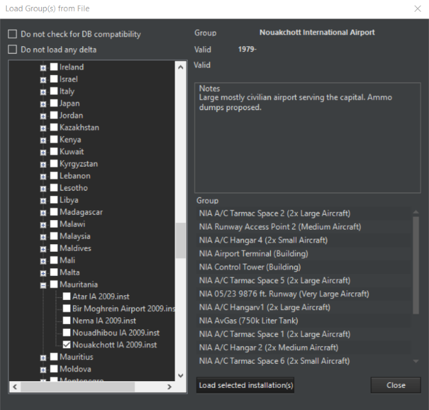

A small airfield shall now appear on the Mauritanian west coast. Click
on it.

Go to either "**Edit Aircraft**" in the Editor drop-down menu or press
the "**Edit hosted aircraft**" button on the right bar with the airfield
selected. The edit aircraft window will appear.

Into "Class", type "F-4S".

Two types of (functionally identical) units will appear. Select the
lower (Navy) one, type "**Phantom**" for callsign, and enter **5** into
"how many". Then press "**Add Selected**". Five F-4S Phantom IIs should
appear in the "current" tab on the left. Close the window.

Now zoom close to the airbase. Go to either Editor Drop Down/Unit
Actions/Add Unit or just press insert. The mouse cursor should change.
Click on an area of land near the airbase.

Select "**Facility**", then in the "class" box, type in "**Bar Lock**".
Several types of Bar Lock radar will appear. Select one and press
"**OK**." A Bar Lock 3D air search radar station will appear at the
spot. Click on the Bar Lock to select it. Note that in the Add new unit
dialog, you have the ability to filter the desired units by class,
subtype, country and whether the unit is real or hypothetical.

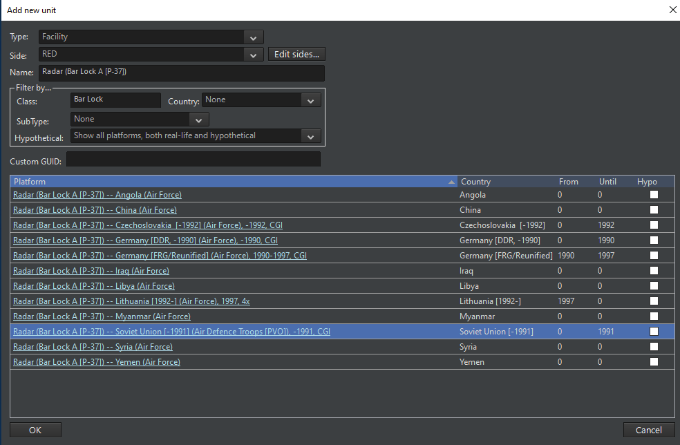

On the right bar, press "**Sensors**". Uncheck the "**Unit Obeys
EMCON**" box and click the "**active**" box on the "Bar Lock A" option.
Close the window. The radar is now emitting.

Now we need to arm the fighters. Reselect the airbase. Click on
"**magazines**" on the right bar, then "**add weapons**". Add the 120
Sparrows and 48 Sidewinders (or any number, but those choices are the
most convenient).

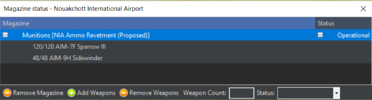

Close the windows and click on "**aircraft**" on the right bar. The five
Phantoms are all red with "**no loadout**", meaning they cannot
function. Select all of them, then press **ready/arm**. You'll notice in
the air ops window that the air-to-air loadouts are functional, but the
rest aren't. This is because only the air-to-air missiles are available
in the magazines.

Select "**A/A: AIM-7, Heavy**", and press the red "**ready immediately
(ScenEdit) button"**. While in normal mode they'd need time to prepare,
here they're ready instantly. Now they appear as green, meaning they're
ready to go.

All right, one side is up. It has a radar station for spotting and
aircraft capable of intercepting. Now for the other.

Go to **Add/Edit Sides** again, then add a side called "**Red"**. Before
closing the window, make sure to check the "side is computer-only" box.
Now go to "**Switch To**" and select Red.

The map is now blank again. Go to add unit/insert, click on a spot near
the northern Mauritania/Western Sahara border, and type in
"**Single-Unit Airfield**". Select one with a long runway and press OK.
It should appear.

Now press the play button for a few seconds and then pause the
simulation again. Two green symbols-the Nouakchott airbase and Bar Lock,
should appear. Green means neutral, and we want these to be hostile. Go
back to add/edit sides. Click on Blue, go to Postures, and then select
Hostile. Do the same for Red. They should now appear as red on the map.

Select the airfield (making sure you're controlling Red) and then click
"**edit hosted aircraft**" on the right bar. Type in C-130A and select
one of the two C-130As (NOT the AC-130A on the top). Write "**Target**"
under callsign and add two.

Go to "**planes**" and ready/arm again. Select **Ferry** and **ready
immediately**. There's no need for filling the magazines in this case.

They need missions to function. Using **CRTL-right click** or
**CRTL-Ins**, put two reference points near, but not too near, the blue
airbase. Make sure they're selected.

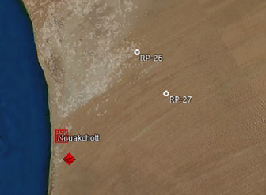

Now go to the missions/reference points drop down menu and add mission.
Make it a support mission.

Select both C-130s and add them to the mission, then uncheck the 1/3rd
rule.

Now save the game. If loaded in normal play, the scenario now
functions-the C-130s will take off on their own. But now it's time to
make it meaningful.

Switch to Blue or exit and reopen the scenario (it will load as Blue by
default, as Red is checked to computer-only). Go to Editor-Dropdown/Edit
Scoring. Set the Triumph score to 150. Close the window.

Now go to **Editor/Event Editor/Triggers**. Select a "**create new
trigger, unit is destroyed**." Type in C-130 Shot Down. Select Target
Side Red, Target Type Aircraft, Target Subtype Transport, Target Class
C-130A Hercules. Press OK.

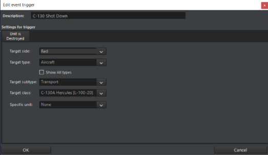

Now Editor/Event Editor/Actions. You want two actions this time. Select
"**Create New Action**" with "**Points**", and then Side: **Blue**,
**Point Change 500**, with **Blue Points** in the description. Press OK.
Then select Create New Action with "**End Scenario**". Press **OK** in
the now limited action editor window.

Close the window, now go to Event Editor/Events.

Check the **Event is Repeatable** Tab, Type in **C-130 Hit for
"description**", then add **C-130 Shot Down** for trigger and "**Blue
Points**" and "**End The Scenario**" for Action. Press OK. Save the
scenario.

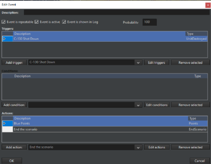

By this point, the internal mechanics of the scenario are complete. All
that's left is touching it up.

At the very top of the editor drop down menu is "**scenario
times-duration**". Make sure the "**scenario current time**" and
"**scenario start time**" are the same, set the "**complexity**" to 2
(for the sake of the exercise) and put "**Mauritania**" as the location.
Then press **OK.**

Now go to editor menu- "**Title/description**". This has probably
already come up as part of the initial save of the scenario. In the
description box, write "**Defend southern Mauritania from unknown red
contacts**. **This is an editor test."**

Then press **OK**.

Now go to "**Edit Briefing**", and type in the sentence. "**Investigate
and Engage incoming air contacts**." Press **OK**. Most scenarios need
and have a longer briefing, but this works for now.

Save the scenario again and return to the title screen.

At the title screen, go to "**start new game**", and select the scenario
in question. The scenario will appear as having Mauritania as the
location, a higher complexity and difficulty score, and the scenario
description of "Defend southern Mauritania from unknown red contacts.
This is an editor test."

The only option is to play as Blue, and you will see the Blue
"Investigate and Engage incoming air contacts" briefing. Enter the
scenario and run it for a bit. Two air contacts should appear, detected
by the Bar Lock.

Using either an intercept mission, patrol mission, or manual engagement,
send the Phantoms up to engage the contacts. They will be shot down.
Once one C-130 is downed, if all has gone right, a popup saying "The
scenario has concluded. You will now be presented with the evaluation of
your performance." will appear. Press OK. Another window should appear,
saying Triumph: Final Score 500" (or 1000 if both planes were quickly
downed). You've won!

A complete scenario has now been made and played.

## 5.3 Lua

### 5.3.1 Lua Scripting

Lua is a programming language that Command uses for advanced scripting.
It is extremely versatile and can provide many bonuses. Even at their
simplest, Lua scripts can add much versatility beyond the limits of what
the internal event editor alone can provide.

The Basics:

Lua can be used to:

- Spawn, as opposed to teleport, units into the map during a scenario.

- Change the weather mid-scenario.

- Reassign units to different missions.

- Change side postures and doctrine.

- Add elements of chance so that the scenario is never the same way
  twice.

- Make scenarios detailed and varied.

Thus, Lua can be used for creating a basic scenario where the player
starts with a random variety of units. It is here that a basic
walkthrough will be conducted.

In either a subset of "**event actions**" or a "**Lua script console**"
in the event editor, there's a Lua menu. A basic set of "**recipes**"
are there, see "**Command Lua API**" at
[https://commandlua.github.io/](https://commandlua.github.io/)
for explanations. One such recipe is ***ScenEdit_AddUnit*** (Table).
When filled in, it looks like this:

  -----------------------------------------------------------------------
  ScenEdit_AddUnit({type='Sub', side='USSR', name='B-23',
  dbid='187', latitude='49.3812997111192',
  longitude='-36.8903957715054'})

  -----------------------------------------------------------------------

This, if run with a side marked "USSR" in a DB3K database, will generate
a Foxtrot-class submarine named B-23 in the middle of the North
Atlantic.

**NOTE: Lua can be very finicky, and a single character in the wrong
spot can mess up a script. Also, be aware that values carry over across
scenarios, so do not assume they will be the default ones.**

That example is using Lua to duplicate something that can be
accomplished with the traditional interface. The same task could be
accomplished via finding the spot in the Atlantic and using the unit
editor. A more complex task is to include one of three very different
submarines.

  -----------------------------------------------------------------------
  a = math.random(1,3)
  if a == 1 then
  ScenEdit_AddUnit({type='Sub', side='USSR',name='B-10',
  dbid='287', latitude='50.52351341355',
  longitude='-37.177899984719'})
  elseif a == 2 then
  ScenEdit_AddUnit({type='Sub', side='USSR',name='B-15',
  dbid='278', latitude='50.52351341355',
  longitude='-37.177899984719'})
  elseif a == 3 then
  ScenEdit_AddUnit({type='Sub', side='USSR',name='K-115',
  dbid='391', latitude='50.52351341355',
  longitude='-37.177899984719'})
  end

  -----------------------------------------------------------------------

Here there is an even chance of one of the following three submarines
being spawned.

B-10, a Whiskey (one of the earliest and least capable diesel subs)

B-15, a Juliett (a 1960s diesel submarine that still has long-range
anti-ship missiles)

K-115, a Charlie II (a nuclear submarine with advanced
Bazalt/Sandbox-style anti-ship missiles)

Tying this script to an event that is triggered after the scenario is
loaded (see **5.5 Events** on page [93](#events)) is the next step. Once
a player (with the "USSR" being a playable side) runs the scenario in
non-ScenEdit mode long enough to trigger the event, they will receive
one of the three submarines.

For a non-playable side, patrol orders need to be bundled-in for any
mobile unit. For example:

  -----------------------------------------------------------------------
  ScenEdit_AddUnit({type='Sub', side='USSR',name='B-24',
  dbid='287', latitude='51.52351341355',
  longitude='-38.177899984719'})
  ScenEdit_AssignUnitToMission('B-24', 'eastpatrol')

  -----------------------------------------------------------------------

Creating two different (and possibly) empty missions in the scenario
editor, having the USSR be a *non-*playable side, and using a
math.random script as follows:

  -----------------------------------------------------------------------
  a = math.random(1,2)
  if a == 1 then
  ScenEdit_AddUnit({type='Sub', side='USSR',name='B-24',
  dbid='287', latitude='51.52351341355',
  longitude='-38.177899984719'})
  ScenEdit_AssignUnitToMission('B-24', 'eastpatrol')
  elseif a == 2 then
  ScenEdit_AddUnit({type='Sub', side='USSR',name='B-24',
  dbid='287', latitude='51.52351341355',
  longitude='-38.177899984719'})
  ScenEdit_AssignUnitToMission('B-24', 'westpatrol')
  end

  -----------------------------------------------------------------------

..means that once the event is triggered, a Whiskey submarine will spawn
in the same spot and conduct a mission in one of two areas. This sort of
Lua randomization is useful for increasing the variability and
replayability of scenarios.

Lua can do more than just set up scenarios. It can also make them more
dynamic.

One Lua action is using the previously mentioned
***ScenEdit_AssignUnitToMission*** to either assign or change missions
for units that already exist. Simple random selection can make the
following units assigned to one of three possibilities.

  -----------------------------------------------------------------------
  a = math.random(1,10)
  if a\<5 then
  ScenEdit_AssignUnitToMission('Ukrainian Flanker #1', 'NONE')
  ScenEdit_AssignUnitToMission('Ukrainian Flanker #2', 'NONE')
  ScenEdit_AssignUnitToMission('Ukrainian Flanker #3', 'NONE')
  ScenEdit_AssignUnitToMission('Ukrainian Flanker #4', 'NONE')
  ScenEdit_AssignUnitToMission('Ukrainian Flanker #5', 'NONE')
  ScenEdit_AssignUnitToMission('Ukrainian Flanker #6', 'NONE')
  elseif a\>=5 and a\<8 then
  ScenEdit_AssignUnitToMission('Ukrainian Flanker #1', 'Close
  Patrol')
  ScenEdit_AssignUnitToMission('Ukrainian Flanker #2', 'Close
  Patrol')
  ScenEdit_AssignUnitToMission('Ukrainian Flanker #3', 'Close
  Patrol')
  ScenEdit_AssignUnitToMission('Ukrainian Flanker #4', 'Close
  Patrol')
  ScenEdit_AssignUnitToMission('Ukrainian Flanker #5', 'Close
  Patrol')
  ScenEdit_AssignUnitToMission('Ukrainian Flanker #6', 'Close
  Patrol')
  elseif a\>=8 then
  ScenEdit_AssignUnitToMission('Ukrainian Flanker #1', 'Aggressive
  Patrol')
  ScenEdit_AssignUnitToMission('Ukrainian Flanker #2', 'Aggressive
  Patrol')
  ScenEdit_AssignUnitToMission('Ukrainian Flanker #3', 'Aggressive
  Patrol')
  ScenEdit_AssignUnitToMission('Ukrainian Flanker #4', 'Aggressive
  Patrol')
  ScenEdit_AssignUnitToMission('Ukrainian Flanker #5', 'Aggressive
  Patrol')
  ScenEdit_AssignUnitToMission('Ukrainian Flanker #6', 'Aggressive
  Patrol')
  end

  -----------------------------------------------------------------------

Depending on the roll, the six Su-27s will either stay grounded
(NONE-assigned to no mission), launch but only stay near their air bases
(assigned to the "Close Patrol" mission), or launch in a mission with a
large prosecution area, making them more eager to fight (assigned to the
"Aggressive Patrol" mission).

Another is changing sensor statuses to active or passive via
***ScenEdit_SetEMCON***. The template is as follows:

  -----------------------------------------------------------------------
  ScenEdit_SetEMCON('EMCONSubjectType', 'EMCONSubjectNameOrID',
  'EMCONSettings')

  -----------------------------------------------------------------------

SubjectType can be a unit, group, mission, or side.

For a single unit it could be:

  -----------------------------------------------------------------------
  ScenEdit_SetEMCON('Unit', 'USS McCracken', 'Radar=Passive')

  -----------------------------------------------------------------------

This turns off the radars on a unit called the USS McCracken.

Whereas for an entire side it could be:

  -----------------------------------------------------------------------
  ScenEdit_SetEMCON('Side', 'USSR', 'Sonar=Active;Radar=Passive')

  -----------------------------------------------------------------------

This turns off the radars but turns on the active sonars for every
"USSR" unit.

This can be combined with triggers (see **5.5.3 Triggers** on page
[97](#triggers)) to enhance scenarios in the following ways:

-Combined with time-related triggers to symbolize intermittent
emissions. A unit doesn't have to go to the extremes of either always or
never using the active sensors.

-Combined with detection-related triggers to symbolize a unit commander
going "Ok, the cat's out of the bag, better emit for the sake of
awareness" without needing to be explicitly under attack.

-Combined with special actions to symbolize a general order,
particularly if it's on an allied side the player otherwise doesn't
directly control.

Still another Lua capability is changing the weather. The
***ScenEdit_SetWeather*** function has four inputs: temperature
(increments of 0 to 50 degrees Celsius), rainfall (increments of 0 to
50), clouds (increments of 0.1 to 1), and sea state (increments of 0 to
9).

So, in basic terms, running the following **SetWeather** action-

  -----------------------------------------------------------------------
  ScenEdit_SetWeather((35),(12),(0.6),(4))

  -----------------------------------------------------------------------

...will lead to a base temperature of 35 degrees Celsius (95 degrees
Fahrenheit), moderate high clouds and rain, and a sea state of 4 (wind
11-16 knots, small waves).

Lua is capable of much more than these major examples. It can even
create a type of "AI" if the programmer is skilled enough.

If in doubt about anything, or if one simply wants to learn more, ask
online in the "Lua Legion" subforum at
[http://www.matrixgames.com/forums/tt.asp?forumid=1681](http://www.matrixgames.com/forums/tt.asp?forumid=1681).

## 5.4 Editor Drop-Down Menu

The editor drop-down menu only appears in ScenEdit mode and contains the
scenario creation functions.

### 5.4.1 Scenario Times + Duration

This drop down allows you to set the current scenario time, the scenario
start time, scenario duration, complexity, difficulty and location. The
exact date of the scenario will change everything from national borders
to the location of polar ice.

**Scenario Current Time**: Sets the current scenario time.

- Enter a date by either selecting and manipulating the individual
  elements of the date field (day name, Month, Day, Year) or clicking
  the calendar icon which will launch a small calendar dialog that can
  be used to choose a date.

- Enter a time by manually manipulating the hour, minute and second
  fields or typing them in.

**Scenario starts on**: Sets the time the scenario starts on.

- Enter a date by either selecting and manipulating the individual
  elements of the date field (day name, Month, Day, Year) or clicking
  the calendar icon which will launch a small calendar dialog that can
  be used to choose a date.

- Enter a time by manually manipulating the hour, minute and second
  fields or typing them in.

**Scenario Duration (And lasts for) Field**: Enter a numeric value in
the days, hours, mins (minutes) fields to set this. This can be changed
after playtesting if one feels the scenario is too short or too long for
its own good.

**Complexity**: Allows editors to set a scenario complexity using a 1 to
5 scale. This will be reflected by the Complexity green bar scale in the
load scenario dialog. Complexity is inherently arbitrary and up to the
scenario creator, but a general rule of thumb is that scenarios with
more units and/or a situation that requires more setup, such as aerial
refueling or coordinated time-on-target strikes, should have a higher
complexity level.

**Difficulty**: Allows editor to set a scenario difficulty using a 1 to
5 scale. This will be reflected by the Difficulty green bar scale in the
load scenario dialog. Like complexity, difficulty is inherently
arbitrary and up to the scenario creator. Scenarios should be play
tested to see the 'true' difficulty before a final score is assigned.
However, a scenario where the win condition can be consistently achieved
should get a low ranking, and one where it cannot easily be
accomplished, even by the scenario creator, should be the opposite.

**Location**: Allows editor to fill in a text value noting location that
will be displayed in the location field of the load scenario dialog. The
location can be anything from geographical locations (I.e. GIUK Gap,
East China Sea) to conflicts (Persian Gulf War, Indo-Pakistan War).

**Title + Description**: This dialog allows editors to add the scenario
Title and descriptive text that appears in the Load Scenario Dialog.

**Title Field**: Enter a text value to give the scenario a title. It
will appear in the load scenario dialog under title.

**Description**: This field allows editors to add text, pictures and
links to the scenario description that appears in the load scenario
dialog It. It is copy and paste capable and includes most common Windows
text edit functions.

**To add text**: Type and edit using the appropriate buttons. You can
highlight over existing text and use the function buttons to make edits.

**Pictures**: Add pictures as needed.

**Links**: Add links to background materials, etc. as needed.

### 5.4.2 Database

**Current:** This displays the current database in use by the scenario.

**Use Latest DB3000:** This updates the database to the latest version
of the DB3000, covering 1980 to the ever shifting "near future". NOTE:
Changing the DB in this fashion will delete all sides, so it's important
for scenario designers to choose a DB *before* adding sides and units.

**Use Latest CWDB:** This updates the database to the latest version of
the CWDB, covering 1946 to 1979.

**Load Other DB File:** This allows a database file to be manually
loaded.

**Upgrade Scenario To Latest DB Version:** This allows an existing
scenario to be updated to the latest version of its respective database
without losing any units. It can be accomplished as either a "shallow"
or "deep" rebuild, or used to update multiple scenarios. See **8.1
Scenarios vs. Databases** on page [187](#scenarios-vs.-databases).

### 5.4.3 Campaigns

This allows for the creation of campaigns of linked scenarios.

In it, the player can attach scenarios, attach attachments, and set a
pass score to enable progress to the next mission in campaign play.

· Use **"Add scenario**" to select an individual scenario for part of
the campaign. Likewise, "Add attachment" adds a scenario attachment.

. "**Remove selected**" is self-explanatory and removes the selected
element.

. "**Move Up/Down**" changes the position of the selected element,
useful for changing the order of scenarios.

· At the bottom of the campaign dialog, enter an appropriate pass score
(what score the player needs to obtain in order to reach the next
scenario) in the dialog box and press "set". It will change the score
for the selected scenario.

· "**Title and Description**" describes the beginning of the campaign,
what players will see at the menu screen.

· "**Ending Text**" describes the ending of the campaign, what players
will see after they've beaten it.

· "**Save Campaign**" saves the current campaign.

**Create New:** This opens up a blank campaign editor window where
scenarios (not necessarily the currently loaded one) can be added.

**Load From File:** This loads a previously existing campaign for
editing. Scenarios and attachments can be added or removed, the order
and pass score can be changed, and so can the opening and ending text.

### 5.4.4 Add/Edit Sides

This function allows you to add sides to a game and edit their
properties. Sides may be human, or computer controlled. A side's
relationship with other sides is determined by its posture. Each side
also has its doctrine which is part of the mechanism that governs its
behavior.

- **Add:** Click "Add" and type a name for the side in the box that
  opens. A new side will be added to the scenario

- **Remove**: Select a side and click "Remove". This deletes all units
  and missions for that side.

- **Rename**: Select a side and click "Rename", Type in a new name in
  the box that opens. The side will be renamed.

**Briefing:** This opens a window to edit the briefing of
the selected side.

**Postures**: This determines how each side interacts with
other sides. The choices are Neutral, Friendly, Unfriendly, and Hostile.
Select the side, then click "Postures", in the box that opens, select
the desired posture from the drop-down menu. Posture choices:

- Friendly: Sides will not fire on each other and share contact
  information and air facilities.

- Neutral: Sides will not fire on each other and do not share sensor
  information.

- Unfriendly: Sides will not fire each other but will intercept when on
  patrol missions. They can conduct electronic warfare against each
  other.

- Hostile: Sides will fire on each other and can conduct electronic
  warfare against each other.

**Doctrine--RoE button**: This sets the default Doctrine,
RoE, and EMCON for a side. All existing and Lua-spawned units will
inherit these settings unless changed by a mission, script, or manual
selection. The editor can set these to be editable by players in game
mode by checking off the Player Editable checkboxes.

**Side is Computer-Only:** If checked, this makes the side
inaccessible to the player in normal play. This is typically used to
designate the OPFOR side in a scenario and means that missions and tasks
will have to be set for it before the scenario can be playable outside
of ScenEdit.

**Collective Responsibility:** If checked the actions of
one unit in a side will be treated as reflecting the entire side. If
unchecked, it will not be. For example, with **CR** checked a unit from
Side A being marked as hostile will cause all of Side A to be marked the
same way, while designating that unit with CR unchecked will just change
only that one unit.

**Can Auto-Track Civilians:** If checked, civilian and
commercial units will automatically appear as visible to the side
regardless of its awareness settings.

**Awareness**: This sets the side's level of awareness of
the units in the scenario. Note that any unit may be set to be
automatically detected and classified by the scenario author, regardless
of this setting.

- Normal: All units must be detected and classified using suitable
  sensors.

- Auto Side ID: All units must be detected but the side identified upon
  detection.

- Auto Side and Unit ID: All units must be detected but the unit's side
  and unit type is provided upon detection.

- Omniscient: Similar to "God Mode" which reveals everything detectable.

- Blind: Nothing is revealed.

**Proficiency Settings:** This sets the default
proficiency for a side. There are five proficiency levels ranging from
'Novice' to 'Ace', with 'Regular' as the default norm. The proficiency
levels most visibly affect aircraft agility, with novice aircraft having
only 30% of their nominal capability, veterans being able to equal the
on-paper level exactly, and aces capable of even exceeding it.

In addition to aircraft agility, proficiency also affects damage
control, ability to fly at low altitudes without advanced avionics,
ability to withstand g-forces during hard maneuvers, reaction time
(extremely useful for engaging fast moving aircraft or missiles), and
the accuracy of unguided weapons.

Proficiency is inherently subjective and up to the player. There is no
locking the player into select proficiencies for select countries.
However, some possible guidelines are:

- "**Regular**" as the default and as a backup in case all else fails or
  a suitable choice cannot be found by the scenario author.

- "**Cadet**" as a nation with a poor historical record and/or a unit
  new to battle. "**Novice**" as an even more extreme version of
  "**Cadet**".

- "**Veteran**" as a nation/unit with decisive combat experience and/or
  excellent training. "**Ace**" likewise as a similarly extreme side in
  relation to **"Veteran"** in the opposite way as "**novice**" is to
  "**cadet**".

Individual unit proficiency can be changed from the side norm via either
the right-click on unit dialogue (see **4.1.5 Scenario Editor:** on page
[54](#scenario-editor)) under "scenario editor" or in the order of
battle menu (see **6.3.3 Order of Battle** on page
[115](#order-of-battle)).

*Historical note: The unit proficiency symbolizes the disconnect between
tactical and operational skill. Proficiency can swing marginal fights
one way or another but is (generally) less important when one side or
unit has a clear supremacy. Often, putting assets in the right place at
the right time is more important than the exact performance of those
assets.*

**Side Enablers:**

Modern warfare is not "WW2 but with better weapons", and the comforts of
post-Cold War COIN & intervention / regime-change ops are no longer to
be taken for granted. The GPS navigation systems guiding modern
platforms and weapons will likely be disrupted *(in fact count yourself
lucky if the satellite constellation above you survives)*, and the [BLOS
comms](https://www.sto.nato.int/Lists/STONewsArchive/displaynewsitem.aspx?ID=571) that
forces rely upon for everything from cell-phone connectivity to [drone
control](https://www.twz.com/news-features/russian-shahed-136-with-camera-cellular-modem-could-be-a-big-problem-for-ukraine) may
or may not be available, theater-wide or locally.

**Side Enabler Function**

A key side-related feature of Command is the concept and framework of
"Side Enablers" *(aka "theater access options")*: Capabilities that act
as force multipliers, enabling options for action -- or taking them off
the table if they become unavailable.

The most common enabler is access to satellite-based navigation,
particularly with regards to weapon guidance (and more recently,
autonomous operation of drones). GPS is of course the most commonly
referred example, but GLONASS (Russia), BeiDou (China) and NavIC (India)
are also other options.

These enablers are available for configuration in Command when editing
the properties of Sides in the Scenario Editor:

Clicking the "Enablers" button brings up the available enablers for the
selected side:

Checking or unchecking each checkbox enables or disables this capability
for the selected side.

Apart from the top Side-level, these enabler items are also configurable
on a local basis. The idea here is that in many cases the ability (or
lack thereof) to use a certain functionality may be restricted
geographically; Starlink's "no Ukraine" geofencing for its LEO-BLOS
comms service is a recent example, but another common case may be the
localized jamming/spoofing of GPS on a town or frontline of interest.
The reverse may also be true: A given service may be generally
unavailable theater-wide but available on a specific area (local beacons
for both PNT/GNSS and comms are rapidly proliferating; you can now fit
some of them even on artillery shells).

The way we model area-specific availability is through the area &
reference-points manager:

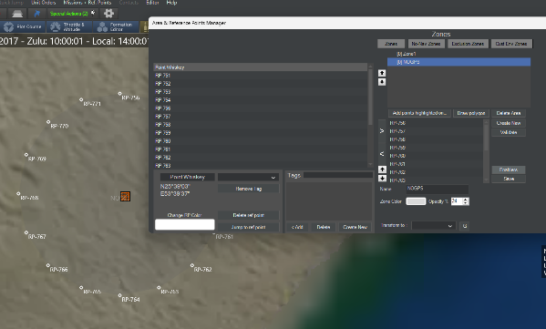

By selecting a zone and clicking on the new "Enablers" button, we get
access to the same menu of enabler options as on the side level.
Embedding this ability on zones also allows taking advantage of all the
nice properties already present in them, such as anchoring them on
units, contacts or reference points.

Given that the (non)availability of these services can be highly
dependent on events happening during the sim execution (or player
decisions), it makes sense that the enablers themselves are configurable
also through Lua scripting. Here is an example of fetching the enablers
for a given zone and modifying them:

local s = VP_GetSide({name='side-A'})
print(s)
local z = s.standardzones
local myz = s:getstandardzone(z[1].guid)
print(myz.enablers)
myz.enablers = {GNSS_GLONASS = true, GNSS_GPS = false}
print(myz.enablers)

**GNSS disruption implementation in Command**

The first concrete implementation of the enabler's framework is, to
no-one's surprise, GNSS disruption. This is a large topic of discussion
in western defence circles as an acknowledged vulnerability, given that
so many different weapon systems since Desert Storm have come to rely on
GPS navigation for guidance -- and this trend has been also subsequently
replicated in Russia, China & India *(to our knowledge, the pan-European
Galileo system has not yet been adopted as a guidance component on any
fielded weapon system)*.

GNSS disruption (in the form or jamming, spoofing or complete denial of
service) is a huge and highly technical subject, but in the context of
terminal weapons guidance its effects are fairly simple: It
significantly increases the CEP figure of anti-surface weapons, thus
significantly degrading their accuracy. Such weapons typically rely on
an internal inertial navigation system (INS) which acts as the primary
navigation reference, with the GNSS providing a regular correction to
the INS's inevitable drift. If GNSS is denied, the weapon has to rely
entirely on its INS for terminal guidance.

When a weapon is denied a GNSS update, a "NOGNSS" warning is shown next
to the weapon icon on the map, to indicate that this weapon is suffering
from such degradation:

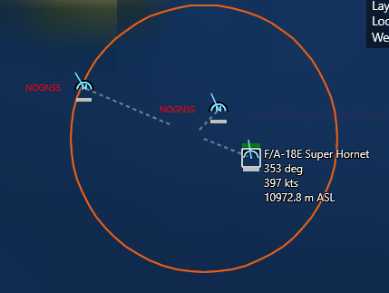

When the weapon's impact is evaluated, the INS drift due to GNSS denial
is taken into account and may significantly raise the final CEP value
used in the impact evaluation. This is presented in the message log, as
in this example:

***\> 8/4/2017 10:08:14 -- Weapon: GBU-39/B SDB #993 has been without a
GNSS update for 6 min 49 sec. Weapon has INS: 1990s+ tactical weapon
INS. Max drift: 105m. Actual drift (CEP increase): 79m***

Notice in this example the significant difference between max and actual
drift: The max drift represents the maximum deviation from the DMPI if
one assumes that all drift perturbations will cumulatively swing the
weapon away from the aimpoint. A more (statistically) likely case is
that the actual deviation will be somewhere between zero and max; in
this case 79 meters.

There is a popular misconception on public discourse, that GNSS
disruption can instantly turn a weapon useless. This is a gross
exaggeration. The actual effect of such degradation on a weapon's impact
accuracy, and to its overall effectiveness, will strongly depend on the
inherent accuracy of the weapon's INS system, the time the weapon spends
in a degraded state (INS drifts with time, not distance covered), the
weapon's warhead type and yield, as well as the type and physical
dimensions of the aimed target.

Some recent examples illustrating this:

- According to persistent reports, [ground-launched SDB (GLSDB) bombs
  have been ineffective in the Ukraine theater due to extensive GPS
  jamming/spoofing](https://www.twz.com/land/have-ground-launched-small-diameter-bombs-been-thrown-aside-by-ukraine).
  This makes sense for a weapon like SDB, whose penetrator-explosive
  warhead is highly dependent on high accuracy (a near-miss does not
  produce any proximity damage; it's direct-hit or bust); combined with
  an increased flight time (i.e. more time to be exposed to GNSS
  disruption, depending on the reach of enemy EM activity) this creates
  ample opportunity to disrupt the weapon sufficiently to make it a
  clean miss.

- On the same theater, GMLRS guided rockets have reportedly been highly
  successful despite facing the very same jamming activity against them.
  Why? The warheads of these rockets are area weapons (they disperse
  bomblets) so a near miss usually is as good as a spot-on direct hit.
  Additionally, their small flight time reduces the opportunity for
  significant jamming and thus diversion. *(Reportedly air-launched
  SDBs, the very same type as ground-launched by GLSDB, [have also been
  a popular
  weapon](https://www.twz.com/air/cockpit-video-of-ukrainian-su-27-lobbing-gbu-39-small-diameter-bombs).
  Why? Presumably the shorter flight time compared to the
  ground-launched variant makes for a sharply reduced window of
  GNSS-jamming vulnerability.)*

- High-velocity weapons in general have an inherent advantage in such
  conditions because of the time-based drift on INS systems. This is an
  additional reason that high-speed systems (incl. hypersonics) are a
  popular avenue for research and development.

**Note #1:** The current GNSS disruption model applies only to weapons
that use INS+GNSS for terminal guidance (JDAM being the prime example),
and NOT to weapons that combine INS+GNSS for mid-course guidance with
homing sensors for terminal guidance (e.g. most modern cruise missiles).
There are a number of reasons for this, incl. the complexity of
representing "actual" vs "perceived" weapon position *(cue the "missile
knows where it is" memes...), *as well as the fact that such systems use
terminal homing precisely in order to compensate for mid-course guidance
errors and thus are less susceptible to GNSS disruption.

**Note #2: **Currently there is no distinct field in the database to
mark the INS performance level of each individual weapon. For this
reason, a simple "deduction" algorithm is used, based on the weapon
properties:

- If the weapon is a guided gun round (e.g. Excalibur) or rocket (e.g.
  GMLRS), assume it uses MEMS-based INS (Assumed drift: 5nm / hr.).

- Otherwise, if the weapon's maximum range is under 162NM, assume it
  uses a "1990s+ tactical weapon"-grade INS (Assumed drift: 0.5 nm /
  hr.)

- Otherwise for longer-range weapons, assume it uses a "1990s+
  high-grade" INS (AIRS etc.) (Assumed drift: 0.05 nm / hr.)

The 162NM (300km) threshold is based on the MCTR regime rules, which
treat missile weapons with a \>300km range as "strategic".

**Switch To**: This drop-down allows you to switch the
view perspective in the editor to each side you have created.

### 5.4.5 Edit Briefing

This function calls the edit briefing dialog which allows players to add
text, pictures and links to the side briefings that appear for each side
in the load scenario dialog and briefings dialog. You must switch sides
using the editor switch to function to edit and add unique briefings for
each side.

Briefings can be either formal with the style of an actual military
document such as the traditional American "five paragraph order", or
informal. Whatever the format, they should include:

- The units under the player's control.

- A less detailed description of units under enemy control (remember the
  fog of war).

- The objective and rules of the scenario.

The briefings should be able to lay out the basic guidelines for the
scenario player, so that they do not have to wander around confused
wondering what to do (if the objective is to hit a set of fuel tanks,
the player shouldn't waste time attacking air defense sites if they have
limited resources, thus the briefing should mention that)

### 5.4.6 Edit Scoring Dialog

This dialog allows editors to apply scoring evaluation to their
scenarios that appears in the victory conditions dialog. Points can be
scored or lost in the game by using the scoring event in the event
editor. This dialog is then used to evaluate that scoring.

To use:

1.  Make sure the side you'd like to apply scoring to is selected in the
    Switch To dialog.

2.  When the scoring dialog is open, enter high and low values in the
    Triumph and Disaster fields. Be aware that a campaign (see **5.4.3
    Campaigns** on page [83](#campaigns)) will require reaching the set
    pass score to progress to the next scenario in it.

3.  Make sure the numbers match the point total in the scoring events.

Note: Scoring overall is a hugely tricky situation. In many scenarios, a
simple give and take of "destroy enemy units, gain points, lose friendly
units, lose points" works fine.

But for others, this isn't suitable. If the goal is to hit a certain
high value target, that should take precedence over just trading blows.
In extreme cases, hitting the target(s) alone can be the difference
between success and failure. Hit it, get a triumph, lose it, get a
disaster.

The scoring system thankfully allows for more nuance between the two
extremes. Something like 1,000 points for hitting the target, -100
points for losing an aircraft, and 750 points being the line between
minor victory and average allows for a bit of slack. Lose two aircraft,
and the tradeoff for hitting the target is judged by the scenario
designer to be worth it. Lose three and it's a little too much. Miss the
target and it's an automatic failure.

The relative value of units should be considered by the scenario author.
If the units are supposed to be expendable, then there should be little
to no penalty for their losses. Likewise, an irreplaceable unit can
justifiably result in an automatic loss for the entire scenario. The
time period can be considered for losses of line units-if the side in
question has plenty of aircraft to spare, a wave of replacements, and a
politically high tolerance for casualties, accomplishing the objective
beats taking losses. The reverse is also true.

Scoring can also be determined for pure gameplay reasons, even if it's
not "historically accurate" per se. If the way to balance a scenario is
to make one side's losses or kills worth a lopsided amount, that's a
perfectly valid reason.

### 5.4.7 God's Eye View

Provides an omniscient view of all units on all sides in the game.

· This setting is useful for editors to see what is really going on
while testing a scenario. Shifting from it to normal player views is
used to provide an excellent contrast.

· This setting also allows editors to create strike missions for targets
that have not been detected but still need to be specified.

· Keep in mind that this does not reflect what each player side sees at
any time as they see things through often imprecise sensors.

**Minefields**: This drop-down menu allows editors to add and remove sea
minefields.

To add and mines to a designated area:

1.  Make sure you have switched to the side you would like to deploy the
    mines.

2.  Create and then select the reference points you would like to you
    use to define the area you'd like the mines to be placed.

3.  Select Create minefield in designated area which launches the "add
    mines in designated area" dialog.

4.  Choose the type you would like and how many (holding down the shift,
    control, or both keys while will clicking will add more). Please
    consider the depth of the water and the depth parameters the mines
    can operate in prior to deploying. These are found in brackets after
    their name in the dialog. The different types of mines vary
    extensively in terms of both damage and sweepability, from basic
    moored contact mines to lethal rising mines.

5.  When ready to add press the ADD button. The mines will be randomly
    distributed based on area and water depth.

To remove mines from a designated area:

1.  Select the reference points or drop and select new reference points
    marking the area you'd like to remove mines from. Make sure that it
    covers the entire minefield.

2.  Select remove mines from designated area in the Minefields drop down
    menu.

### 5.4.8 Weather

This function allows editors to manipulate weather and sea conditions.

Use this menu to manipulate weather conditions in the game. Simply slide
the scales to manipulate average temperature, rainfall, sky (visibility)
and wind/sea state conditions. These can be global or localized (**7.3
Reference Points** on page [161](#reference-points)

How weather impacts units in the game:

**Temperature** affects several sensors but primarily infrared ones.
During the night, man-made and mechanical objects stand out more clearly
against the background on infrared sensors. Conversely, during daytime
(and particularly in hot climates) IR sensor range shrinks dramatically.
Imaging sensors are less severely affected than older ones. Temperature
differs from the "average" setting depending on region of the world-the
equator is a lot warmer than the Arctic, obviously.

**Rainfall** affects both visual, IR and laser sensors. Visibility can
shrink to as much as 1-5% of original range and similarly IR sensors are
severely degraded by even light rain (e.g. in a rainstorm a Sidewinder
may have an effective lock-on distance smaller than gun range).

**Cloud coverage** affects line-of-sight for visual and IR sensors.
Light cloud coverage usually means scattered clouds at high altitude;
aircraft can get under the cloud base and still visually acquire targets
below, illuminate for LGBs etc. Thick cloud coverage means thick clouds
at all altitudes; LGB guidance may be difficult or impossible unless the
aircraft descends to low altitude, and spotting is likewise degraded.

**Sea states** affect primarily ship suitability (not currently
modelled) and sonar performance. Surface ducting is useless in high
waves and sonar ranges at or near the surface are severely degraded.
High waves also raise the minimum safe altitude for low-flying aircraft.
Sea state also affects the accuracy of naval gunfire, especially on
lighter, more easily tossed vessels.

### 5.4.9 Scenario Features + Settings

This dialog allows editors to set default realism settings for
scenarios. Some features are locked and require owning a certain DLC to
unlock.

To select a setting just select a checkbox and click the apply button.

**Detailed Gun Fire Control**: When activated, guns have their Ph and
CEP values realistically affected by the quality of their fire-control
director and may altogether be incapable of firing if their sensors are
blocked or knocked out. When disabled, guns can fire even without any
director guiding them, and their accuracy is unaffected by sensor and
weather limitations.

**Unlimited magazines at air/naval bases**: When activated, aircraft and
ships now have unlimited ordnance at any port or airfield they deploy
in. With this enabled, even if the magazine has one or zero specific
missiles, a squadron of ten aircraft can all be deployed with a loadout
of said missiles.

**Aircraft Damage**: When activated, aircraft are not immediately
destroyed by any successful hit. Their survivability is highly dependent
on both the weapon (light AAA is far weaker than a precise heavy SAM,
and a modern fuze is better at inflicting damage than an older one) and
the aircraft (Larger, multi-engine and/or more heavily armored aircraft
are harder to destroy). A damaged aircraft that successfully returns to
base will be down for repairs and thus take longer to ready than an
undamaged one-often longer than the current length of the scenario.

When disabled, aircraft are destroyed in one hit by anything.

**Realistic Submarine Communications:** When activated, submarines
diving below periscope depth will go out of contact with the player (see
**12.6** **Comms Disruption & Cyber Attacks** on page
[291](#comms-disruption-cyber-attacks)). They can be returned by right
clicking on the ghosted "last known location" icon and selecting "summon
to reestablish comms."

An ELF signal amounting to "Ok, you'd better come up now" is sent, and,
if the coast is clear with no immediate threats, the submarine returns
to antenna depth, sharing any contact information it gained while deeply
submerged.

**Effects Of Terrain Type:** When activated, this allows for different
terrain types to have their effect on unit movement, visibility, and
resistance to blast effects (see **3.1.1 The Globe Display** on page
[12](#the-globe-display) for details). When deactivated, all types of
terrain are treated similarly.

**Effects of Terrain Type -- ADVANCED:** This option enables the effect
of the skyline of the local terrain as well as the height of the mast of
a unit to affect visibility. With this enabled, many older scenarios may
be broken if the terrain wasn't carefully checked prior to placement of
units. Think of it terms of standing in the middle of a lot of
skyscrapers with a pair of binoculars trying to see 'through' the
buildings.

**Communications Disruption**: Enables comms disruption. See **12.6**
**Comms Disruption & Cyber Attacks** on page
[291](#comms-disruption-cyber-attacks).

**Weather Affects Ship Speed:** When activated, bad weather will slow
ships down and, in some cases, even trap them in a near-stationary
"heave". Unsurprisingly, small ships are far more vulnerable to bad
weather than large ones.

**Allow instant loading for landing planner:** This option allows for
instant loading of units into vehicles when using the loading planner.

**Weather and day/night affect aircraft sorties:** Aircraft that are not
suitably equipped (either built-in or through their loadout, e.g.
LANTIRN pods) for flying at night or in bad weather, will not be able to
take off. If such aircraft are already airborne when unsuitable
conditions occur, they run a high risk of crashing on landing. This
feature can easily break older scenarios, so be careful when and how it
is employed.

### 5.4.10 Merge Scenario

This fuses two scenarios into one. Scenario 1 acts as the 'foundation'
which Scenario 2 is added to, and in the event of a conflict between a
fundamental background characteristic like time or weather, Scenario 1
is used.

For DB match tolerance, the "exact DB option" (i.e. DB3000 v477) is
ideal. The others are very risky.

## 5.5 Events

**Event Editor**: The event editor is a powerful tool that allows
editors to give more variability to Command's Static AI and Editor's
scenario storylines by introducing conditional and/ or random events
into the timeline of a scenario. In COMMAND terms, events are actions
that occur as a result of a trigger.

You launch the event editor by clicking on Event Editor in the mission
drop down and selecting Events from the dropdown. When you do so, the
Event Editor dialog will launch the Events dialog.

**Populated Event Dialog**

The Events dialog includes a listing of all created events at the top
and three function buttons at the bottom.

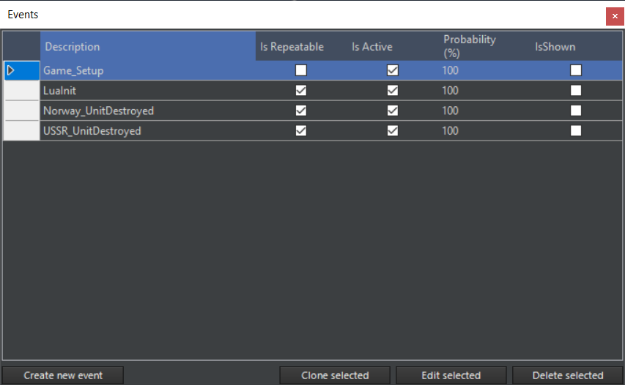

The event listing displays each event's: description (name), if it is
repeatable, if the event is active and the probability of the event
occurring. These values are all set when creating the event.

The function buttons are:

· Create a new event: Launches the Edit Event dialog. See below for
functionality.

· Edit selected event: Selecting an even from the list and pressing this
button opens the event in the edit event dialog for editing.

· Delete selected Event: Selecting and event and pressing this button
deletes it.

**Creating an Event**: As mentioned, events are actions that are the
result of a trigger. So, we'll work through creating an event while
describing each dialog used.

First, click the **Create New Event** button which launches the Edit
Event dialog. This dialog includes basic event parameters at the top and
specific triggers and actions sections below.

Events are constructed from actions and triggers, so it is best to build
them first. You can do so by pressing the edit trigger or edit action
buttons that are found at the bottom of their sections. You could also
edit them independently from the event editor drop-down by selecting
either Actions or Triggers. **Once you have constructed the necessary
actions and triggers, you can begin construction of your event in the
Edit Event dialog**.

### 5.5.1 Actions

You create actions by clicking on the edit actions button, which brings
you Event Actions Dialog. This dialog has a listing of all created
actions at the top and all function buttons at the bottom.

**To create a new action,** you select the type from the drop-down menu
at the bottom and press the Create New Action button which will launch
the Edit Event action dialog, allowing you to construct the action and
modify options and parameters. Descriptions of all are below.

**To edit an existing action**, select it from the list at the top and
press the Edit Selected Action button, which opens the Edit Event Action
dialog allowing you to modify the action options and parameters.

**To delete an action**, select it from the list at the top and press
Delete Selected Action. Keep in mind that if you are using the action in
an existing event, it will be deleted as well.

**What are Actions?**

Actions are the result of a trigger and may be used in many triggered
events.

To setting up actions, click on Editor \> Event Editor \> Actions. A
window opens listing the existing possible actions and options to
create, edit, or delete the selected action.

**Action Types**:

**Points**: This allows adding or subtracting points from a side's
score. Be aware that other points will be

- To use:

- Fill in a description of the action (ex. 100 Points to side Blue).

- Select a side that is to receive or lose the points.

- Add the Point change. Positive numbers to grant points and negative to
  subtract (ex. -100).

**End Scenario**: This action terminates the scenario. It is suggested
that you add a message action prior to this letting the player know.

**Teleport to Area**: This is used to teleport units to within a
reference designator defined area. This can be used to simulate the
arrival of reinforcements.

To use:

- Make sure you drop some reference points to mark the area the units
  will be teleported to. Select/activate them and make sure other
  reference points are deselected. The units will appear at a random
  point in the area, so keep that in mind when making or selecting them.

- Launch the event editor and add action

- Type in a description (for example, "1st platoon lands at airport").

- Click on "add points currently highlighted" to set the teleport area.

- Select the units you would like moved. They are selected when
  highlighted in blue.

- Click the OK button.

**Message**: Creates a popup message with user-defined content. Please
remember to tell players to activate their special message popup option
in their Game Log message options to see this as a popup rather than a
less visible entry in the game log.

To use:

- Fill in a description of the message (like "Blue side war warning").

- Use the drop-down to select the side that will see it.

- Use the text box to type the message you would like displayed.

- Click the OK button when complete.

**Change Mission Status**: Sets a mission to active or inactive. This
action is designed to be used with the mission status field in the
mission editor. Please be sure do set the mission status
(active/inactive) to the status you'd like the mission to have a
scenario start.

To use:

- Add a description of the action (such as "Activate Blue AAW Patrol").

- First select a side from the Side drop-down and then a mission from
  mission drop-down.

- Click the New Status drop-down and select a status.

- Click OK.

**Lua:** Activates a Lua script. The Lua script must be manually entered
to the action console by the scenario, although prepackaged template
options are set for non-coders. For information on specific Lua scripts,
see **5.3 Lua** on page [78](#lua).

### 5.5.2 Special Actions

Special Actions have a Lua input. Mechanically, they are identical to
"normal" Lua actions but can be activated on cue by the player. For how
to activate them in normal game mode, see 6.3.10, Special Actions.

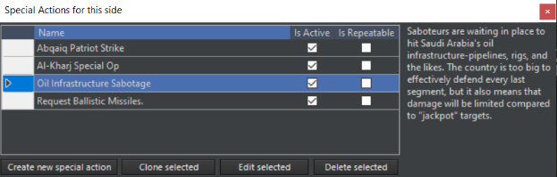

For scenario creators, special actions come in two forms: Functional and
tactical. "Functional" special actions exist for the sake of providing a
service to the scenario player, like replaying special messages,
delivering weather reports, deploying a unit (with no guarantees for its
safety once it *is* deployed), and the like.

Tactical special actions are things like "attempt to use irregulars to
destroy an enemy SAM site" or "request additional missiles from
storage". Tactical special actions should have either a sort of balance
(i.e. you get reinforcements, but so does your opponent) or a potential
outcome that ends badly for the side triggering it to prevent the player
from just constantly choosing them, knowing there's no downside to
pressing the button.

### 5.5.3 Triggers

Triggers initiate events. A trigger can be used to initiate multiple
events; however, each event must be set up separately. Triggers are
created by selecting the Edit Trigger button which launches the Event
Trigger dialog.

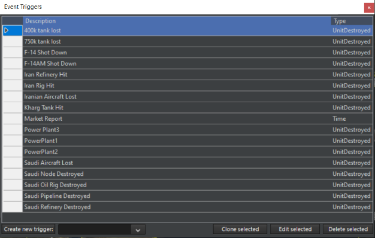

1\. To create a new trigger, you would select the type from the
drop-down menu at the bottom and press the **Create New Action** button
which will launch the edit event trigger dialog allowing you to
construct the trigger and modify options and parameters.

2\. To edit an existing trigger, select it from the list at the top and
press **Edit Selected Trigger**, which calls the edit event trigger
dialog allowing you to modify the action options and parameters.

3\. To delete a trigger select it from the list at the top and press
Delete Selected Trigger. Keep in mind that if you are using the trigger
in an existing event, it will be deleted as well.

**Trigger Types:**

- **Unit Destroyed**: Trigger occurs when the specified unit is
  destroyed.

- **Unit Damaged**: Trigger occurs when a specified unit or class of
  units

- **Unit Enters Area**: Trigger occurs when the specified unit enters an
  area defined by reference points. An option exists where a window of
  time may be specified such that the unit must enter the area within
  that time window to cause the trigger to activate.

- **Unit Remains In Area**: Trigger occurs when the specified unit
  remains in an area defined by reference points for a specified amount
  of time. The time is reset if the specified unit leaves the area for
  any reason.

- **Time**: The trigger occurs when the game time reaches a specified
  time. An effect similar but not identical to "Scenario is Loaded" can
  be achieved by setting the event to trigger at a time one second after
  the scenario is set to start (i.e. if the scenario is set to start at
  3:00:00 UTC, the trigger is set for 3:00:01.)

- **Random Time**: The trigger occurs at a random time within a user set
  interval.

- **Unit Is Detected**. The trigger occurs when a certain unit is
  detected by a certain side. Options range from any aircraft/ship to a
  specific unit name being positively identified.

- **Side Points:** The trigger occurs when the designated side's points
  either exceed, matches, or falls under the specified number of points.

- **Scenario is loaded**. The trigger occurs the moment the scenario is
  loaded.

- **Scenario Ends**. The trigger occurs when the scenario ends.

- **Regular Time**. The trigger fires every set interval (a dialogue
  opens, and it can be anything from a second to a day.)

**Triggers Associated with Units**

The "**Unit Destroyed**", "**Unit Damaged**", "**Unit Enters Area**",
and "**Unit Remains In Area**" triggers can be linked to units in a
hierarchal fashion from a type of unit down to a specific unit. These
types, below, are set when the trigger is created:

**TARGET SIDE:** Designates the side the trigger will generate from.

**TARGET TYPE**: Designates the type of unit. If any of the designated
type of unit experiences the trigger criteria, then the trigger is
activated. Unit types are:

- Aircraft

- Surface Ship

- Submarine

- Land Facility

- Land Unit

- Weapon

- TARGET SUBTYPE [DDG]

- TARGET CLASS [Arleigh Burke Class Destroyer]

- SPECIFIC UNIT [USS Arleigh Burke]

**Triggers Associated with an Area**

Some triggers have an area associated with them which are defined with
reference points. The reference points defining the area should be
selected prior to creating the trigger that uses them. The reference
points used to define the area can be changed in the trigger edit dialog
box.

### 5.5.4 Setting up Triggers

Click on **Editor \> Event Editor \> Triggers**. The "**Event
Triggers**" dialog box opens listing the existing triggers and options
to create, edit, or delete Triggers. Scroll down the pull-down listing
at the bottom of the box and pick a trigger type then click "**Create
New Trigger**". The "Edit Event Trigger" dialog box is displayed.

NOTE: Triggers with areas defined by reference points associated with
them should have the reference points already selected when creating the
trigger.

**Unit Destroyed**:

1.  Type in a description for the trigger.

2.  Select the Side and desired unit settings from the drop-down
    listings. These should be done from the top down since the
    subsequent available selections often depend on what is selected
    above it. If the trigger is going to apply to all types, then the
    subsequent selections should be left as "None". The same is true if
    selecting a subtype or class.

**Unit Damaged**:

- Type in a description for the trigger.

- Select the Side and desired unit settings from the drop-down listings.
  These should be done from the top down since the subsequent available
  selections often depend on what is selected above it. If the trigger
  is going to apply to all types, then the subsequent selections should
  be left as "None". The same is true if selecting a subtype or class.

**Unit Enters Area**: The reference points defining the area should be
selected prior to opening the Event Triggers dialog box.

- Type in a description for the trigger.

- Select the side and desired unit settings from the drop-down listings.
  These should be done from the top down since the subsequent available
  selections often depend on what is selected above it. If the trigger
  is going to apply to all types, then the subsequent selections should
  be left as "None". The same is true if selecting a subtype or class.

- Designate the earliest time the trigger can occur. If the designated
  unit(s) enter the area prior to the designated earliest time, the
  trigger will not activate.

- Designate the latest time the trigger can occur. If the designated
  unit(s) enter the area after the designated latest time, the trigger
  will not activate.

- Modifier: Modifies the trigger to a "Unit Leaves Area" trigger if
  checked.

- Verify the correct reference points are assigned to the trigger.
  Reference points may be added later after creating the trigger,
  removing reference points may be done at this time. At least three
  reference points must always remain.

- Select OK to create the trigger.

**Unit Remains In Area**: The reference points defining the area should
be selected prior to opening the Event Triggers dialog box.

1\. Type in a description for the trigger.

2\. Select the side and desired unit settings from the drop-down
listings. These should be done from the top down since the subsequent
available selections often depend on what is selected above it. If the
trigger is going to apply to all types, then the subsequent selections
should be left as "None". The same is true if selecting a subtype or
class.

3\. Designate the amount of time the unit must remain in the area. Note
that if the unit exits the area, the timer will reset.

4\. Verify the correct reference points are assigned to the trigger.
Reference points may be added later after creating the trigger, removing
reference points may be done at this time. At least three reference
points must always remain.

5\. Select OK to create the trigger.

**Side Points**: Type in a description for the trigger. This trigger may
be used to set victory or defeat in a game.

1\. Select the side the trigger applies to.

2\. Enter the number of points and select whether the trigger occurs
when the accumulated points for that side either exceeds, reaches
exactly, or falls under the specified points.

3\. Verify the correct reference points are assigned to the trigger.
Reference points may be added later after creating the trigger, removing
reference points may be done at this time. At least three reference
points must always remain.

4\. Select OK to create the trigger.

**Time**: Type in a description for the trigger. Set the date and time
the trigger should occur. This trigger occurs when the game clock meets
the designated time. Select OK to create the trigger.

**Random Time**: Type in a description for the trigger.

1\. Set the date/time range within which the trigger should occur.

2\. Press the "Set Random Time" button.

3\. Select OK to finish creating the trigger.

### 5.5.5 Constructing an Event

Once you have completed the Actions and Triggers necessary for your
event to work, you can begin creation of the event itself in the Edit
Event dialog.

1\. Give the event a name by populating the Description field with text.

2\. Select the Event is repeatable check box if you'd like the event to
repeat.

3\. Enter a 1-100 numeric value chance of the event occurring in the
Probability field.

4\. Next go to the trigger section at the top and select the trigger you
created from the drop-down and press the Add trigger button next to it,
which will populate the trigger list above.

5\. Next, go down to the Actions section at the bottom, select the
action you created from the drop-down list, and press the Add Action
button, which will populate the Action List with your chosen action.

6\. If you'd like to make any edits to the actions or the triggers you
can press the Edit Action or Edit Triggers button in their related
sections which will launch their edit dialogs.

7\. If you'd like to remove a trigger or action select them in their
lists and press the Remove Selected buttons in the appropriate section.

8\. Press the OK button on the left to save your work and complete the
process. Your new event should now appear in the events dialog.

## 5.6 Scenario Batch-Rebuilder (SBR)

This allows functions of the Scenario Batch Rebuilder to be accessed.

**Generate Template:** This generates a basic configuration template for
the scenario. See 8.8, Scenario Config Template Files for more details.

**Generate Delta Template:** This generates an advanced delta template
for the scenario, essential for deep rebuild database updates.

**Apply SBR Script:** This applies an existing SBR script to the
scenario. See 8.9, Editing Scenario Config Files, for more details.

## 5.7 Unit Actions

This allows actions concerning individual units to be taken.

### 5.7.1 Add a Unit

This function allows users to add a unit to a scenario. It can also be
called from the ctrl + right click drop down menu.

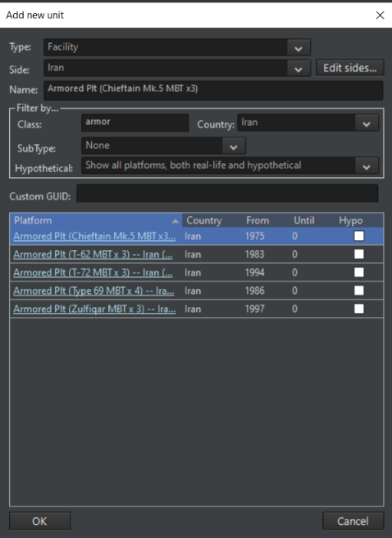

To add a unit:

- Make sure you have the side you want to add a unit to selected in the
  "**Switch**" to menu.

- Select **Add Un**it from the Editor drop down and click a point on the
  map you'd like to place the unit. Please be sure that the place you
  selected to drop the unit you would like matches terrain suitable for
  the type (ships in water, buildings on land).

- Choose Type using the Type drop down. Your options are aircraft,
  ships, submarine and facility. Notice when you do so that your pick
  list on the bottom of the list switches to match your chosen type.

- Side should be the side you are set to, but you could change it with
  this drop down. If you wish to add a side on the fly, click the Edit
  button which will launch the Add/Edit Side Dialog.

- The Name field allows you to name the unit by deleting the default
  text and typing it what you would like.

- There are filter options to assist you in finding units to add:

  - Filter By Class Field: Typing in this field filters items based on
    what you type.

  - Filter By Country Drop Down: You can filter by country by selecting
    a country from the drop-down list.

  - Filter By Hypothetical. You can filter by whether or not the unit is
    a historical or hypothetical one by selecting one of the three
    options from the drop-down list.

  - Filter by Name (Alphabetically) You can filter alphabetically by
    click on the name Platform column. This arranges units by name
    alphabetically from a to z or z to a.

  - Filter by Country (alphabetically): You can filter alphabetically by
    country by clicking on the country at the top of its column. This
    will filter by country alphabetically from A to Z or Z to A.

  - Filter by From Date: Selecting From at the top of this column allows
    you to order by in service date.

  - Filter by Until Date: Selecting Until from the top of its column
    allows you to order by out of service date.

When you find the unit you would like to add, select it by clicking on
it and press the OK button. If it's a ship or facility it will be added
to the map. If it's an aircraft, you will have to select a loadout and
click ok.

The filter figures are there merely for reference and do not contain any
limiters. Thus, the player can easily add in ahistorical units ranging
from the plausible (Iowa battleships to a side called "US" in a
mid-1990s extended Cold War scenario) to the impossible (F-22s to a side
called "Bhutan" or "The Legendary Super-Duper Force" in 1981).

This also enables units of the same type to be used as stand-ins for
ones another country used but that are not in the database list for the
country in question. For example, a Mozambican MiG-21bis (not in the
database in the time of this writing) can be represented by an Angolan
one.

### 5.7.2 Add Satellites

This menu allows users to add Satellites to scenarios. It is currently
auto-filtered to only display satellites currently in orbit in relation
to the current time value you have set.

**To Add a Satellite**:

· Make sure the side you'd like to add them to are selected, and select
**Add Satellite** from the editor drop-down, which will launch the **Add
Satellite** dialog.

· To add a satellite to a scenario work through the nation, type, and
model drill down lists and select the checkbox of the satellite you
would like to add.

· Press the **Add Satellite** button when complete and it will appear on
the GUI.

**To Delete a Satellite**:

Select the unit on the game map and press the D key to delete it.

### 5.7.3 Edit Aircraft

This function allows you to add aircraft to any facility or group that
can accommodate them by calling the Edit Aircraft dialog. The current
inventory of aircraft hosted on a unit are displayed on the left and the
edit aircraft functions and pick list are on the right.

**How to add an aircraft to unit or group**:

1\. Select the unit, group, facility or air base you would like to add
aircraft too and select Edit AC in the editor drop down which will
launch the Edit AC dialog. Please consider the amount of storage the
unit has and runway lengths. The game does filter as best as it can but
there are hybrid units that don't always fit the mold.

2\. As in the Add Unit dialog you can filter by: Class Name, Country,
Aircraft Name, Aircraft Country, From Date and Unit Date.

3\. Select the aircraft that would like by selecting on it in the unit
listing.

4\. Callsign: This is an editable text field that allows you to give
nicknames to units. The callsigns can be purely descriptive (i.e.
"40^th^ Fighter Regiment #1, #2, etc....) or more whimsical nicknames
(i.e. a group of F-15Js going by the callsign Tengu #1, #2). To avoid
confusion, no two "batches" of aircraft should have the same callsign,
especially if they stage from different bases.

5\. How Many: Enter a numeric value for the number of aircraft you would
like to add.

6\. Press the Add Selected button when complete.

**Removing aircraft from a group or unit**

1\. Select the units you would like to remove from the current inventory
list on the right. When you do so notice that Remove Selected button has
appeared.

2\. Set the number of units you would like to remove in the quantity
field and click apply.

3\. Click the Remove Selected buttons to remove the unit

### 5.7.3 Add/Removing a boat or submarine

1\. Select the vessel you would like to host the boat or submarine and
select Edit Docked Boats from the editor drop down which launches the
edit docked boats dialog.

2\. Use the type, class, country filters to display a list of possible
units to host.

3\. Select the unit you would like by selecting it in the pick list.

4\. Add the number you wish to add in the How Many field.

5\. Click the Add Selected button to add them. They should now appear in
the current inventory list on the right.

**To remove a boat or submarine**:

1\. Select the units you would like to remove from the current inventory
list on the right. When you do so notice that Remove Selected button has
appeared.

2\. Set the number of units you would like to remove in the quantity
field and click apply.

3\. Click the Remove Selected buttons to remove the unit

### 5.7.4 Edit Docked Boats

This function allows editors to add boats or submersibles/UUV's to
facilities or boats capable of hosting them. When launched the Edit
Docked Boats dialog displays the current inventory of units already
hosted on the vessel on the left and filters and a picklist to add boats
on the right. This list is already filtered to display ships that fall
within the correct size limitations to be hosted.

### 5.7.5 Remove All Units of the Side

Deletes all units for selected side. Be careful as there is no undo.

### 5.7.6 Edit Cargo

This function allows you to add cargo to a suitable unit.

**To load an appropriate unit with cargo**:

1: Check the DB viewer to see if it contains a cargo capacity. Cargo is
limited by mass, area, and crew-a giant LST or Il-76 can hold what a
C-130 or small boat cannot. Edit Cargo can also be used on airbases.

2: Click on the unit, then go to Editor/Unit Actions/Edit Cargo

3: Select the mobile land unit to add in the "database", then go to the
bottom left corner. Use the numeric counter to determine the quantity of
the unit, then press "Load Selected".

4: Press "OK" in the bottom right corner to save the changes.

5: The "Cargo" button should appear on the unit sidebar. Clicking on
it reveals how much mass, area, and crew the parent unit is holding, as
how much spare capacity it has left.

6: Repeat as necessary.

7: For air cargo, make sure to both add suitable cargo to the airbase,
and load specifically desired ones onto the individual aircraft if
necessary.

### 5.7.7 Other editor functions

**Copy Unit**: Many units of the same type and load-out may be placed by
selecting an existing unit and pressing the hotkey "C" then clicking on
the map to place a copy of the selected unit.

**Clone Unit:** As with "Copy Unit", only Shift+C is used to make a more
exact "clone" of the unit in question.

**Move Unit**: To move a unit on the map, select the unit then press the
hotkey "M" then click on the map the desired new location for the unit.

**Rename Unit:** Selecting this or pressing "R" after selecting a unit
opens a dialog where the unit can be renamed.

**Delete Unit**: Select the unit or group and press the "DEL" key.

**Set Fuel QTY and Airborne Time:** Accessible for air units, this
allows their fuel quality and time airborne (for the sake of things like
quick turnaround calcs) at the start of the scenario to be set. An
"automatically adjust fuel" option can be checked, which sets it at the
optimum amount for the current altitude plus a 10% reserve.

**Unit is auto-detectable:** If checked**,** the unit can be seen
without being in range of a sensor. This is generally off by default for
mobile units and on for fixed units such as buildings.

**Set Orientation**: Allows you to adjust the unit facing. This is
crucial for land units that have sensors with a limited arc like the
radars on Patriot missile batteries. To use, simply move the slider bar
to match your desired bearing.

**Hold Position:** This instructs a selected land unit to stop and stay
in its current position.

**Remove All Units (Of This Side):** This deletes all units in the
current side.

**Remove All Contacts (Of This Side):** This deletes all contacts
visible by the current side. It does not remove the actual units, only
the contacts.

**Scenario Attachments:** This allows overlays, Lua scripts, local
videos/sound, or installation imports to be attached to a scenario or
removed. The attachments can then be used via a "ScenEdit_UseAttachment"
Lua script.

### 5.7.8 Publish Scenario to Steam Workshop (Steam only)

Obviously only accessible in the Steam version of COMMAND, this allows a
scenario to be placed in the Steam Workshop. The process is very simple.

-Open the desired scenario in ScenEdit mode and ensure it's in a
satisfactory condition.

-Select the "Publish Scenario to Steam Workshop" option from the editor
drop-down menu.

From here, either an external preview image can be loaded via "Select
Preview Image", or an in-game screenshot of the current camera can be
used via "Use Screenshot". Once the preview image is determined, simply
press Publish New Item and the scenario will be uploaded.

Other players with the Steam version can obtain the scenario by
accessing the COMMAND Steam Workshop, locating the scenario, and
pressing the subscribe button. A download/update will ensue, and the
next time the Steam version of COMMAND is launched, the scenario will
appear in a special tab on the scenario load dialog (see **2.2.1
Starting COMMAND** on page [9](#starting-command)) for easy access.

Published scenarios can be updated or changed by pressing the "Update
Existing Workshop Item" button. The changed scenario will then be
transmitted to all subscribers.

**Package Scenario For Distribution:** This bundles the scenario and all
selected attachments together in one zip file for easy identification
and loading by end users.

## 5.8 Import/Export Units

The import/export unit function is one of the most powerful tools in the
game. It allows editors to save/export selected units and groups to a
file and then import them into other scenarios at a later date or shared
with other edits.

We have already prepopulated thousands of these files so that many of
the airbases, air defense system or historical battlegroups might
actually be there -- saving you time and effort.

**Save selected units/groups to a file - Creating import files**

1\. Select a unit or drag select multiple units and groups you would
like to save so they are highlighted and then select save selected
units/groups to a file from the editor\>import/export units drop-down.
This will launch the Export units/groups to a file dialog.

2\. Fill in the Name, Valid From, Valid Until and Notes text fields if
you'd like.

3\. Press the Save button which will launch the Save As dialog.

1.  Give the file a meaningful text name and when press the Save button.
    By default, it will be given an .inst file extension and saved to
    the import/export folder in your command directory.

It is now possible in COMMAND to save a group of units as a template,
this allows you to place several copies of it when importing it without
sharing the same GUID numbers. This is very useful to create a baseline
formation and then use the import feature to create several copies of
the same formation.

**Load units/Groups from File - Importing**

Selecting load units/groups from file editor\>import/export units
drop-down will launch the Load Group(s) from File dialog. The left side
is a hierarchal listing of all folders and files in the import/export
directory. The right side displays the information you entered when you
created the file and a list of all group members.

**To add units to your scenario**:

- First find the unit or group you would like to add from the import
  listing on the left. You can open up the lists by clicking the + signs
  next to them to expose the files within folders.

  - You must be sure to match the import with the database you are
    using. We have marked all folders that contain cold war database
    files as CWDB and then their names. All others are DB3k files.

  - You must be wary of duplicates as well. It is likely that the
    creator of the 1967 SAM site File used it to build the 1973 SAM site
    file and if you add both you'll get a duplicate key error message.
    If for some reason this is unavoidable just click okay and the
    duplicate will be skipped.

- Next mark the files you wish to import by selecting the open
  checkboxes next to them. If you'd like to select anything in a folder
  select the open checkbox next to it which will all select all folders
  and files under it.

- To import click the Load selected installation button which will
  populate the units for the selected side on the UI.

- To delete them you would have drag select and delete as you would a
  unit or group added any other way.

**Lua Script Console:** This opens a console where Lua scripts can be
entered and run, either for the sake of testing or for the sake of
scenario building (i.e. using "ScenEdit_Addunit" to put a specific unit
in a very specific place). Different parts are color coded to enhance
readability.

Existing .lua files can be loaded into the console using the file/open
key.

## 5.9 Benchmark Mode

The benchmark mode allows you to test the performance of a scenario
without having to run the main game GUI. This allows scenario editors a
chance to see how their creation will run in general terms. To access
this mode, select 'Benchmark' from the file menu and the main window
will close and the following dialog box will appear.

