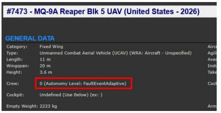
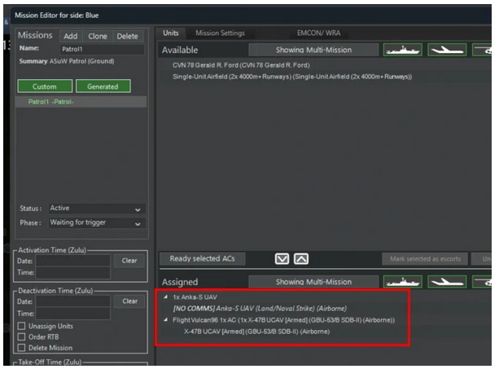
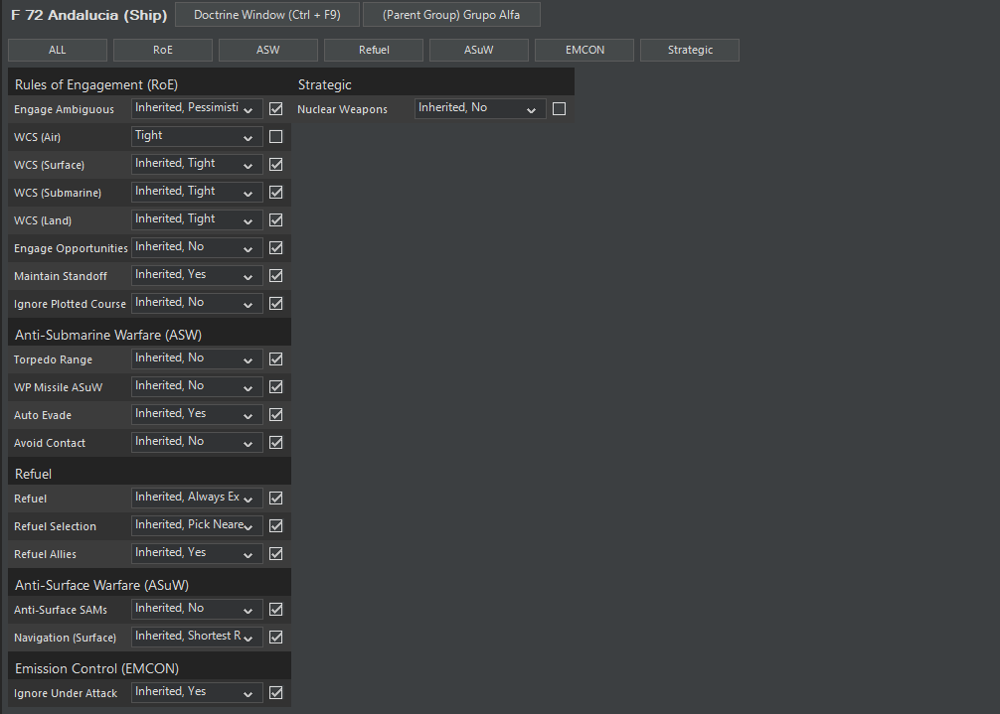

# 12.0 Simulation & Unit Modeling

??? info "FAQ: Is the cloud cover spread evenly or localized?"
    By default, weather settings apply globally. However, you can override them locally using Custom Environment Zones (CEZs).

??? info "FAQ: Does weather affect sensors?"
    Yes, particularly visual & IR sensors, but also radar at certain frequencies. Weather also affects air operations - aircraft may be grounded by bad weather or night conditions based on their loadout capabilities.

??? info "FAQ: Does weather affect underwater acoustics?"
    It affects sonar performance in the surface duct (shallow sub vs ship, etc.). Once below the thermal layer, weather does not affect you except for local temperature which affects layer strength.

??? info "FAQ: Is water depth taken into account?"
    Yes. Shallow waters increase reverberation for sonars, can limit towed array and VDS deployment, and can block convergence zones (CZs). Bottom depth is crucial for thermocline layer formation. In very shallow waters, submarines may need to surface to transit (e.g., Bosporus).

??? info "FAQ: What is the land warfare model like?"
    Command excels at assets affecting air/naval/strategic operations: fixed and mobile radar sites, EW units, anti-aircraft units, long-range artillery and missile units, coastal anti-ship weapons, ICBM silos, and underground bunkers.

    Tactical ground units (infantry, tanks) are present and can interact with air/naval forces. You can transfer and drop units from airlifters and amphibious ships.

    Limitations show when ground units fight each other in large-scale land engagements: no terrain cover at small scale, simplified warhead-vs-armor, no cost-based pathfinding for roads, no automated resupply shuttles. Command is designed for Air/Naval operations, not Steel Panthers-level ground combat.

??? info "FAQ: Do you model midnight sun and polar night?"
    Yes. Command accurately adjusts day/night conditions for the midnight sun (24hr daylight in summer) and polar night (24hr darkness in winter) at polar latitudes.

??? info "FAQ: What warhead types are modeled?"
    Command models extensive warhead types including:

    - High Explosive (Blast/Frag)
    - Armor-Piercing (AP)
    - HEAT Shaped Charge
    - Incendiary (Napalm, WP)
    - Fragmentation SAP
    - Continuous Rod
    - Hard Target Penetrator (HTP)
    - Fuel-Air Explosive (FAE/Thermobaric)
    - Torpedo & Depth Charge
    - Nuclear
    - Chemical & Bacteriological
    - Cluster Bombs (Anti-Personnel, Anti-Tank, Anti-Runway, Guided)
    - Mines (Anti-Personnel, Anti-Tank)
    - Long Rod Penetrator (APDS/APFSDS)
    - Anti-Electrical
    - Laser Energy
    - EMP (Directed and Omnidirectional)

    One Damage Point (DP) equals 1kg of TNT. Various explosives types (Tritonal, Torpex, HMX, etc.) are automatically converted to TNT equivalents.

??? info "FAQ: What is the communications model like?"
    All platform-to-platform communication is instantaneous by default. Command supports communication disruption and (in Professional Edition) integrated communications jamming.

    Platform-to-weapon datalinks include one-way (target position updates) and two-way (weapon passes data back, e.g., Walleye, SLAM-ER, Tactical Tomahawk). Wire-guidance for torpedoes and missiles and command guidance are also modeled.

??? info "FAQ: How do you calculate horizon limitations?"
    Command uses proper earth radius calculations, tangent angles, and surface angles - not textbook approximations. Radar, ESM, and infrared horizons differ from visual horizon as each EM wavelength has different refraction properties.

## 12.1 Deterministic vs. stochastic execution: Chess or chaos?

*"The man who said 'I'd rather be lucky than good' saw deeply into
life. People are afraid to face how great a part of life is dependent on
luck. It's scary to think so much is out of one's control. There are
moments in a match when the ball hits the top of the net, and for a
split second, it can either go forward or fall back. With a little luck,
it goes forward, and you win. Or maybe it doesn't, and you lose."* -
Intro to "Match Point" by Woody Allen

There is a question that is being frequently asked about Command: Is the
execution deterministic? Is it random? If the latter, can it be
configured to run in a deterministic mode instead?

Deterministic and stochastic models are approaches in various fields,
including machine learning, simulation and decision support.
Understanding the differences between these models is crucial for making
informed decisions and analysis.

------------------------------------------------------------------------

Deterministic models are based on precise inputs and produce the same
output for a given set of inputs. These models assume that the future
can be predicted with certainty based on the current state. Chess is a
classic example of a fully-deterministic complex system.

On the other hand, stochastic models incorporate randomness and
uncertainty into the modeling process. They consider the probability of
different outcomes and provide various possible results.

------------------------------------------------------------------------

Deterministic models assume that all variables are known and can be
accurately measured. They rely on precise inputs and produce
deterministic outputs. Stochastic models, on the other hand, consider
uncertainty and randomness. They incorporate probabilistic inputs and
have a range of possible outputs, allowing decision-makers to assess the
likelihood of different outcomes.

A fully-deterministic simulation certainly has its uses. For example,
when performing a small-scale test (e.g. a single missile attacks a
single aircraft), it is desirable to set all variables of non-interest
to fixed, static values so that the variable of interest (e.g. the
successful seduction rate of a decoy against the threat missile) can be
tweaked, and the result of the change evaluated.

COMMAND can indeed be configured to provide a small-scale "controlled
environment" such as this: The weapon impact mechanics and other
sim-events (sensor detections, AI decisions etc.) can be extended and/or
overridden through a number of ways, in order to provide a control
baseline for the experiment or analysis at hand.

Where full determinism begins to run into issues of real-life relevance
is as the simulation scale increases, from the small-scale, low-level
technical/engineering to the tactical and operational levels - i.e.
where COMMAND really shines. Any complex system, and particularly one
with human involvement, is virtually guaranteed to display variance in
the execution of events, in the combination order of these events and
even in the individual probability of any single of these events
happening. Tom Chivers, an author on science issues, recently wrote an
excellent article about the human uneasiness with navigating this "sea
of uncertainty":
[https://unherd.com/2021/07/what-warhammer-taught-me-about-life/](https://unherd.com/2021/07/what-warhammer-taught-me-about-life/)

Even low-level technical/engineering events, nominally the playground of
full-determinism, can in fact suffer from uncertainty. As an example, on
June 18, 2017, a USN F/A-18E operating over Syria engaged a SyAAF
Su-22M4 tail-on with an AIM-9X missile. The missile was successfully
decoyed by flares. A strict engineering analysis would have shown this
to be practically impossible; the AIM-9X was expressly designed to
reject these very old, primitive Soviet-era flares. In reality, the
Syrian pilot was just very lucky that day *(for a short while; he was
subsequently shot down by an AMRAAM missile fired by that same USN
aircraft)*. In a fully-deterministic simulation this outcome either
never happens at all, or always invariably happens. In a stochastic
simulation, what happened was very unlikely, but feasible.

Command is expressly designed to reflect this "sea of uncertainty" in
its modeling of real-world military operations - while concurrently
respecting the mostly immutable nature of the physics foundations its
simulation engine rests on. Historical accounts of real-life operations
are full of "dirty" details like "...and number #4 in the flight had
to divert to the nearest airfield because he had maneuvered off the
group to avoid a SAM, this took him right over an unsuspected AAA site
which punctured his fuel tank and he was leaking fuel like a sieve". A
fully-deterministic simulation has little room for such
"imperfections" of both man and machine; whereas they are constant
occurrences in Command.

Command achieves this effect by combining multiple execution paradigms
within its sim engine: Aspects such as physics (e.g. movement, weather
etc.), sensor detections, fuel consumption, cargo transfer, crew
proficiency, mission tasking, doctrine & rules of engagement (ROE), and
basic crew AI decision trees are addressed in a deterministic fashion.
(Hardcore physicists may argue that even the physics fundamentals
contain built-in variance and entropy and thus laugh at absolute
predictions, but this is an abstraction the dev team can live with).
Other aspects, such as weapon impact, damage inflicted and subsequent
damage control are more fuzzy and handled stochastically: There is a
"control" baseline, but things can go either way to an extent.
Finally, the structure of the sim engine itself (multi-actor simulation
with multithreaded execution, each actor running his "story" within
the sim timeslice in parallel to others) creates built-in race
conditions and thus a chaotic environment of interaction - just like
real-life.

In addition, Command has the ability to record the simulation execution
and afterwards go back into any of the saved snapshots and resume
execution from that point. This provides an additional way of ensuring a
consistent state up to a certain point in the timeline before spawning
off to a new what-if branch.

## 12.2 General sim-engine flow: What happens on each pulse

Command's simulation loop can be set to run at three different timeslice
settings; 0.1-sec pulse (aka "fine-grained"), 1-sec pulse (aka "coarse"
or "flame") or 5-sec pulse (aka "very coarse" or "double-flame")

When using 1-1 (real-time), 2x, 5x and 15x acceleration, the
fine-grained setting is used. In "flame" acceleration the coarse setting
is used. In double-flame acceleration the 5-sec setting is used.

Other sim designs choose to use even larger slice values for their
coarse setting (e.g. 15-sec pulse) in order to boost performance, but in
a detailed tactical simulation this can create problems (e.g. a missile
is ahead of a target on pulse X, then afterwards well beyond a target on
pulse X+1, and the impact that should happen is never evaluated). So,
5-sec pulses are as coarse as we'll go, and we gain good performance by
other measures.

Most of the non-kinematic operations in a simulation pipeline, for
example most AI calculations, happen at 1-sec (or more) intervals. So,
it does not make a difference if the sim runs at hi-fi or coarse
setting, as e.g. a targeting evaluation may happen every 4 seconds in
both cases. What will change is that the trajectory of e.g. a turn curve
will be smoother in hi-fi mode.

On the other hand, weapon impacts and other time-critical events are
evaluated on each pulse, so there will be a slight difference in precise
timestamp between the two modes (e.g. a weapon impact may register at
07:46:02.300 at hi-fi mode (3 tenths of the next second), but at
07:46:03 in coarse mode (as all events are checked on a second-by-second
basis, so all times are rounded-up to the next second).

Command uses a combination of deterministic models (e.g. for movement,
intra-base air/boat operations, effects of weather, sensor checks etc.)
and stochastic elements (weapon impact & damage evaluation, order of AI
calculations between multiple units etc.). So indeed, the engagement
results are not perfectly reproducible at the microscopic level, but in
a repeated series of running the same scenario the probabilistic trends
gradually manifest themselves. For example, in an engagement between a
Eurofighter and a MiG-23, all other things equal/neutral, the MiG may
well get some lucky breaks here and there *(Remember the Libyan Su-22
that successfully evaded/decoyed an AIM-9X shot? A strictly
deterministic simulation would barf at things like that)*, but
statistically the EF should dominate.

## 12.3 Terrain Modeling (aka Land Cover)

Terrain type is a decisive factor in any land-related operations
(including air-to-ground actions or land-impacting artillery delivered
from the sea). The various terrain types (urban, desert, forests,
croplands etc.) have different effects on the mobility of ground units,
on weapon effects (especially blast and frag warheads) and spotting
visibility. As examples:

- Water is impassable

- Wetlands reduce speed to 10% of original *(bog!) and* impair
  visibility slightly.

- Snow/Ice reduces speed to 20% of original and impairs visibility
  slightly.

- All forest types reduce speed to 30% of original, significantly hamper
  the destructive effect of blast and fragmentation detonations and
  sharply reduce spotting ranges.

- Shrublands reduce speed to 50% of original, slightly reduce the blast
  & frag effects, and moderately reduce visibility.

- Croplands and vegetation mosaics reduce speed to 70% of original and
  slightly reduce visibility.

- Open and wooded savannas reduce speed to 80% of original

- Barren / sparsely vegetated terrain and grasslands have no impact on
  speed, weapons or visibility.

- Urban & built-up terrain increases speed to 110% of original but
  severely block both weapons and visibility.

These combined effects have significant tactical & operational
implications. For example:

- How do you move a unit rapidly and minimize observation by the enemy?
  Move it through urban terrain. (If stealth is more important than
  speed, a forest will also do. If speed is paramount and no urban
  infrastructure is nearby, go flat-out through barren/plain terrain).

- Do enemy weapons/sensors outrange yours? Deny him a shooting gallery
  by closing on him through a forest or, failing that, a shrubland.
  *(Conversely: How do you maximize your weapon & sensor standoff? Fight
  in deserts or plains. Desert Storm ringing a bell?)\*

- You know the enemy is holed up inside a forest, but your conventional
  explosive & frag weapons are seriously degraded inside it, and you
  don't want to send your own forces inside for a bloody knife-fight.
  How do you kick them out of the forest? You rain down napalm and
  fuel-air explosives on their heads. (If civilian casualties are not a
  concern, this can also apply to urban terrain).

Units are aware of the terrain type and take it into account in their
navigation & pathfinding calculations. They use a cost-based pathfinding
algorithm that considers both terrain slope and terrain type to generate
the optimum (fastest) route to their destination.

In the example below, a M60 tank platoon in southern Attica (outskirts
of Athens) is ordered to move to the northeast of the peninsula. The
unit selects the displayed path both to avoid the surrounding mountain
ridges (red ellipses) and to maximize its mobility, going through the
urban area instead of the croplands to the east:

Apart from being visually displayed on the map (when the "Land Cover"
map layer is enabled), the land-cover information is also listed on the
map-cursor databox, next the terrain slope info:

The same information is also available through the Lua API, to allow for
automated exploitation of it.

## 12.4 Weather modeling and its effects

There are 11 pre-defined cloud cover profiles. Some profiles have two
layers of clouds which complicates TTPs. It is possible to operate
underneath clouds, over clouds, inside clouds, and visibility through
cloud layers depends on cloud density. The profiles are:

- Thick fog 0-2k ft, solid cloud cover 7-36k ft

- Thin fog 0-2k ft, solid cloud cover 7-36k ft

- Solid middle clouds 7-16k ft, moderate high clouds 30-36k ft

- Moderate middle clouds 7-16k ft, light high clouds 27-30k ft

- Moderate high clouds 25-28k ft

- Moderate middle clouds 7-16k ft

- Moderate low clouds 2-7k ft

- Light high clouds 20-23k ft

- Light middle clouds 10-16k ft

- Light low clouds 5-7k ft

- Clear sky

Cloud cover significantly disrupts EO/IR/laser sensors, depending on
cloud thickness *(difficult but doable in light/medium clouds, but good
luck dropping LGBs from med/high altitude in typical CentFront
weather).*

## 12.5 Types of units

### 12.4.1 Common Air Units

Here is a list of common air units found throughout COMMAND.

**12.4.1.1 Early/Mid Cold War**

These are "first" (Meteor, F-80), through "Third" (F-4, MiG-23)
generation aircraft. These are the mainstays of scenarios using the
CWDB.

- Meteor. First-gen British fighter

- F-80. First-gen American fighter

- MiG-15. Early Soviet fighter, the bane of the USAF over Korea.

- F-4. American fighter. A multirole aircraft that ended the frantic
  "Moore's Law For Jets" period of 1945-1960. Very versatile.

- MiG-21. Soviet point defense interceptor with limited ground attack
  capability.

- MiG-23. Soviet swing-wing fighter capable of launching radar-guided
  missiles. The MiG-23BN is a ground attack version.

- F-5. Lightweight, no-frills western fighter.

- Su-17/22. Soviet high-speed ground attack aircraft.

- F-105. "Thud"-basic Vietnam-era ground attack aircraft.

- F-104. High speed point defense interceptor, can be considered a
  western analogue to the MiG-21.

**12.4.1.2 Late Cold War/Modern**

These are "fourth-gen" aircraft of the late Cold War to modern period,
in use widely around the world. While they may look similar, many of
them are designed for quite different roles.

- F-15A/C. Purpose-built air superiority fighter, "not a pound for air
  to ground."

- Su-27. Similar to the F-15A but has a small ground attack capability.

- Su-30/35. Upgraded versions of the Su-27. The Su-35 is the most
  advanced version.

- F-15E. Although the same shape as the F-15A/C, it's a highly capable
  strike fighter with much air to ground capacity.

- F-16. Lightweight multirole fighter. Intended as a "jack of all
  trades" that could be built and fielded en masse. Goes from
  short-ranged Sidewinders and dumb bombs to radar-guided AMRAAMs and
  precision weapons assisted by advanced targeting pods, but keeps its
  role as the "low" in the "high-low" mix.

- F/A-18. Roughly equivalent to the F-16, only for carrier wings. Has an
  earlier ability to launch radar guided missiles.

- MiG-29: A point defence interceptor, more of an heir to the MiG-21
  than the multirole Western fighters it externally resembles. Built to
  operate inside an integrated air defence system. Has a small air to
  ground capability.

- F-14. Carrier interceptor with later air-to-ground capacity installed.

- Tornado IDS/GR: Long-range ground attack aircraft.

- Tornado F/ADV: Bomber interceptor, not intended to engage other
  fighters.

- A-10: American ground attack aircraft geared towards close range
  support.

- Su-25: Soviet ground attack aircraft also geared towards close-range
  support.

- Su-24: Long-range ground attack aircraft.

- E-3: AWACS.

- A-50: AWACS similar to the E-3.

- Harrier. V/STOL Aircraft. Low-performance but highly deployable.
  Frequently deployed from smaller aircraft carriers and amphibious
  ships as a "one eyed man in the land of the blind".

- Yak-38: Soviet counterpart to the Harrier. Even lower performance.

- Rafale: Multirole "4.5" gen fighter. The Rafale M variant can operate
  from carriers.

- Typhoon: Another "4.5" gen fighter, more optimized for air to air than
  the Rafale but still has multirole capability among some users.

- Gripen: Swedish light multirole fighter with excellent rough-field
  capability.

**12.4.1.3 Aircraft Organization**

The average size of a fighter squadron ranges from 12 aircraft to 24 (a
USAF squadron at full paper strength). Multiple squadrons form a "wing"
(western) or "regiment" (Soviet), while multiple wings/regiments form a
group/air division.

### 12.4.2 Common Sea Units

In the same vein as the air units list above, a list of common modern
naval units.

- Nimitz: American supercarrier.

- Kirov: Soviet/Russian missile battlecruiser, intended as a fleet
  flagship and heavy missile launcher.

- Kuznetsov: Soviet/Russian aircraft carrier. More like a Kirov with an
  air wing instead of S-300s than an American supercarrier.

- Arleigh Burke: American multirole destroyer.

- Perry. American low-end anti-submarine frigate.

- Ticonderoga: American anti-air cruiser.

- Slava: Soviet/Russian missile cruiser.

- Udaloy: Soviet/Russian anti-submarine destroyer.

- Spruance: American high-end anti-submarine destroyer.

### 12.4.3 Common Naval Tactics

The important difference between the Cold War foes in terms of their
naval systems is that the American/NATO systems trend towards the
*tactical* defense but the *strategic* offense, while the Soviet/Russian
ones are, if anything the opposite.

Thus, an American cruiser or destroyer will generally (not always) have
an anti-surface armament of only light Harpoons, and its SAMs pressed
into a horizon-limited anti-shipping role. Its main job is to protect
the carrier/amphib. That high value unit, on the other hand, has the
role of projecting power around the world. This can mean anti-shipping
power in the form of its air wing attacking an enemy fleet with
long-range missiles, or anti-ground power in the same air wing bombing
enemy units or covering an amphibious landing.

A Soviet ship of a similar period and displacement will tend to have a
much heavier anti-surface armament and (generally) a weaker
anti-aircraft one. This is to make up for the lack of carriers. Soviet
naval doctrine was highly defensive-the keystone was simply defending
their nuclear missile submarines long enough for them to launch.

Even large high-value units were focused towards this goal-the Kiev and
even Kuznetsov/Ulyanovsk carriers are built as large antisubmarine
carriers. To a degree, a large portion of the "offensive" slack was
taken up by fleets of large land-based aircraft in the Soviet Naval
Aviation such as Tu-16s and Tu-22s. These carry monstrously large ASMs
and have long range.

Weaker factions than the Cold War superpowers are constrained more
heavily by their equipment. One need only look at the Falklands, where
the British Invincibles (which grew out of a helicopter carrier, carried
Harriers initially just to shoo away patrol aircraft, and lacked AEW at
the time) faced Argentine air forces (who had a severe shortage of both
air-launched Exocets and tankers that had a massive effect on their
operations). A regional power with a large PGM-capable fleet can do
things that a country with a handful of light ships and old aircraft
cannot.

Regardless of what the strikers consist of; naval warfare is based on
massing as much of them at the target as possible. It is and always has
been a very deterministic type of war.

It can be boiled to three simple maxims:

- See, and try not to be seen. Whoever finds the target first will
  usually strike it first.

- Whoever strikes the target first will almost always win.

- Half measures will almost always result in nothing being gained.
  Concentration of force is necessary.

## 12.6 Weapon and Warhead modeling

### 12.5.1 Left of Boom: Terminal defence & weapon endgame sequence

Assuming a guided weapon reaches its target without being intercepted, a
number of final steps are taken in sequence:

1.  The target is attempting to soft-kill the threat, i.e. to seduce or
    jam the weapon through its electronic countermeasures, both onboard
    and offboard/expendables (chaff bundles, IR flares, self-protection
    decoys etc.). IRL it is possible to soft-kill a weapon that is
    heading to a nearby unit; this makes it possible for example for a
    frigate to protect a nearby HVA with its soft-kill systems. This is
    currently **not** supported in COMMAND; only the actually attacked
    unit can use its soft-kill systems on the incoming threat

.

2.  If soft-kill is unsuccessful, hard-kill terminal defenses are
    employed: CIWS systems (usually guns but increasingly lasers, HPMs
    etc.), short-range defensive missiles etc. Many of these systems may
    already have been fired against the incoming threat before it
    reached the endgame phase and are currently reloading/recharging; if
    so then they cannot participate in this last-ditch attempt. As with
    soft-kill systems, only the unit actually being attacked can be
    protected by point-defense actions *(though of course if the weapons
    have sufficient range, they can have their shot at an incoming
    threat to a nearby HVU well before the endgame phase)*.

3.  If the weapon survives both the soft- and hard-kill attempts, it now
    attempts to physically impact on the target - either direct-hit on
    it or airburst at a proper standoff altitude, depending on the
    warhead and fuse characteristics.

The logics of the actual "endgame impact" are somewhat different between
aerospace targets (with extra wrinkles for manned & maneuvering
aircraft) or surface & underwater targets:

- Anti-surface weapons have two basic properties that determine their
  ability to hit a target: Pk and CEP. "Pk" in this context really
  refers to the weapon's reliability; will the weapon actually connect
  and detonate as expected? CEP is the [Circular Error
  Probable](https://en.wikipedia.org/wiki/Circular_error_probable),
  the radius of a circle, centered on the aimpoint, that the weapon is
  expected to land within at 50% of the time. It effectively represents
  the weapon's actual precision in hitting the target. So, for example,
  an old-fashioned iron bomb may have terrible CEP but excellent
  reliability *(there is not much to go wrong...)*, or a complex guided
  missile may have great nominal accuracy but low reliability (not
  uncommon in early guided weapons, for example). A large-CEP weapon may
  easily miss a target of small dimensions (but still get a fair change
  of proximity- or area-effect damage, depending on the warhead type).
  This makes it faithfully harder/easier to hit targets of certain
  dimensions depending on their size.

- Weapons with area-effect warheads (cluster, FAE, nuclear etc.) of
  course compensate for this. The actual impact point (almost always
  different from the original aimpoint, even just slightly) is compared
  with the actual physical dimensions (length/width) of the target
  object and it is determined whether a direct hit was achieved, or
  otherwise a miss (and if so, how far from the target and in what
  direction).

The weapon is also checked for direct hit on any of the nearby targets
(e.g. the missile may miss its target bunker but hit the runway or a
parking area; in a target-rich area it is not uncommon to hit something
else than intended). If no direct hit is achieved on any facility, the
weapon impacts the ground (or airbursts if applicable) and, if it has an
explosive warhead, detonates; proximity damage is then applied to
everyone within applicable range, depending on the warhead type & yield.

Anti-aerospace engagements are different, as no CEP is involved. The
weapon's nominal Pk value represents its ability to hit a large,
cooperative target *(think "B-52 or B-747 flying straight and level")*
on a perfect day. Since most aerospace targets are usually not that
cooperative or easy to spot, various modifiers are sequentially applied
on this nominal value: Small size of the target, the target's agility if
it is actively maneuvering to avoid the weapon, pilot skill etc. This
can easily lead to a wide gap between the weapon's nominal Pk and the
eventual actual Pk that is used to evaluate the probability of hit.

Following is a typical example of an AAW missile engagement endgame, as
shown on the message log. We can clearly see the sequence of soft-kill
attempts, followed by the actual kinematic/physical endgame:

----------------------------

7:41:11 AM - Decoy (Generic Chaff Salvo [4x Cartridges]; Tech: N/A)
from Flanker 3 is attempting to seduce sensor: Active Radar Seeker
(Tech: Early 2010s) (Guiding weapon: AIM-120D AMRAAM P3I.4 #12). Final
probability: 10%. Result: 64 - FAILURE

7:41:11 AM - Defensive jammer (EL/L-8222 ASPP; Tech: Early 1990s) on
Flanker 3 is attempting to spoof sensor: Active Radar Seeker (Tech:
Early 2010s)(Of: AIM-120D AMRAAM P3I.4 #12). Final probability: 5%.
Result: 82 - FAILURE

7:41:11 AM - Weapon: AIM-120D AMRAAM P3I.4 #12 is attacking Flanker 3
(Su-30MKI Flanker H) with a base PH of 95%. PH adjusted for distance:
85%. Flanker 3 has nominal agility: 4.9, adjusted for altitude: 2.5.
Agility adjusted for proficiency (Regular): 2. Aircraft has a weight
fraction of 0.59 - Agility adjusted to 1.29. High-deflection impact (no
effect on agility). Final agility modifier: -13%. Final PH: 72%. Result:
26 - HIT

---------------------------------------

Another example, in this case a ship attempts to defend itself from an
incoming Harpoon missile with both soft- and hard-kill defenses:

1/19/2011 1:03:35 AM - Gun (114mm/55 Mk8 HE(MP)ER HE) is attacking
AGM-84D Harpoon IC #133 with a base-Ph of 2.7%. Base-Ph adjusted for
distance: 2.7%. Sea-skimmer modifier: -30%. Target speed modifier: -4%.
Target size modifier: -9%. Target is missile with pop-up terminal
maneuver - hit probability reduced by 25%. Final Ph: 1%. Result: 75 -
MISS

1/19/2011 1:03:35 AM - Decoy (Mk214 Sea Gnat Chaff [Seduction]; Tech:
N/A) from HMS Portland is attempting to seduce sensor: Active Radar
Seeker (Tech: Late 1980s)(Guiding weapon: AGM-84D Harpoon IC #135).
Final probability: 20%. Result: 81 - FAILURE

1/19/2011 1:03:35 AM - Decoy (Mk214 Sea Gnat Chaff [Seduction]; Tech:
N/A) from HMS Portland is attempting to seduce sensor: Active Radar
Seeker (Tech: Late 1980s)(Guiding weapon: AGM-84D Harpoon IC #135).
Final probability: 20%. Result: 1 - SUCCESS

1/19/2011 1:03:35 AM - All weapon seekers were spoofed - weapon missed
target - REATTACK

--------------------------------------------------

The default models are "bottom up" analytical-oriented; that is, the
user inputs various nominal-conditions data (e.g. "this weapon has a
CEP of 150m, a reliability of 85% and a max range of 12nm when tossed
from a transonic aircraft at 36000K on a good day"), and then the
simulation applies a wide range of condition-specific modifiers to these
values to arrive at the "actual" hit & damage probabilities, which are
then evaluated by the virtual dice.

### 12.5.2 Right of Boom: Weapon & Warhead Damage

Command employs an elaborate warhead & damage model to accurately
simulate the effects of different weapons on different target types.

Weapons have different warhead types (see below), and these can be
combined with different fuze types (airburst, contact, delayed /
underground, proximity, and specialized systems like the new QuickSink).

A warhead's ability to produce effects is nominally measured in damage
points (DP), which are based on the TNT-equivalent (1 DP = 1 kg classic
TNT). These figures are adjusted to provide for a number of modifiers;
for example, many modern warheads employ significantly more potent
explosives than TNT, such as PBXN-109. While the DP is a convenient
reference number for comparisons etc., nonetheless each warhead type
produces different effects and has different effectiveness depending on
target type. As a general rule, warheads that produce blast (e.g.
high-explosives like aerial bombs) are most effective against soft
targets (light-armored vehicles, personnel, unhardened buildings etc.)
and they can also be quite effective even with near-misses. Warheads
that rely on direct impact (e.g. armor-piercing shells, penetrator bombs
or laser weapons) are generally ineffective if they miss even slightly
but can be very effective against armored targets.

Moreover, the amount of damage inflicted on a unit will depend on the
extent that the warhead has managed to penetrate the unit's armor. An
anti-ship missile with a semi armor-piercing warhead may have the same
nominal destructive power as a general purpose bomb, but is able to
cause significantly more damage to a ship because it will lodge itself
inside it before detonating, whereas the bomb will go off immediately
upon contact. Even "pure", non-explosive penetrators have significant
destructive potential both because of their kinetic energy (Command
takes this into account as well), and also because most units are more
vulnerable to internal than external damage.

The ability of a weapons/warhead to penetrate armor depends on its
built-in characteristics (armor-piercing shells and bombs are
particularly optimized for this), relative speed at the time of impact,
and the armor rating of the target.

All platforms comprise of discrete components that perform various
combat related functions. These components may be weapon mounts (guns,
missile launchers, decoy launchers etc.), sensors, aircraft or ship
facilities, powerplant sections, command decks etc. When a unit is hit
by a weapon, apart from absorbing damage on its own, each of these
components may also be damaged or destroyed. Because the components of a
platform are often inter-dependent in their function, seemingly subtle
damage can frequently have severe operational effects; for example
knocking out the sole SARH illuminator of a ship may render that ship
completely unable to operate its SAMs, or damage to an aircraft
carrier's elevators (even only some of them) immediately bottlenecks
the practical aircraft sortie rates.

Depending on the weapon/warhead that impacts, the damage inflicted on a
unit may vary on its intensity or focus. For example, a fragmentation
bomb will generally do little damage to a ship's hull, but the
high-speed fragments can easily damage many exposed sensors or weapon
mounts. A ship being repeatedly hit by such bombs (or gun shells set to
airburst etc.) may easily end up being completely knocked out of action,
with all its weapons and sensors inoperative, even though it is still
structurally intact. On the other hand, a heavy internal detonation
(such as one produced by an armor-piercing bomb or missile warhead) can
completely obliterate a bunker even without damaging any of its
components. Underwater detonations (torpedoes, mines etc.) apart from
their raw shock damage have the added element of the explosive gas
bubble that, if the geometry is right, can cause severe structural
damage (break the back of the ship).

As a very simple example: An AS-13 missile impacts an Adelaide-class
(Australian OH Perry) frigate. The kinetic damage alone is 17 DPs (so
even if the warhead is a dud, the missile will do at least that much
"shock" damage). The missile penetrates the frigate's hull 100% (no
serious armor) and detonates inside, which doubles the warhead's
nominal DP potential (250 x2 = 500 DP). The tremendous explosion
destroys 4 weapon mounts, 3 sensors and the helicopter hangar, and
damages 2 more mounts, 3 sensors and the bridge. The ship has suffered
grave damage and may be out of the fight depending on which systems were
knocked out. If the ship has less than 520 DPs available, she may be
lost outright.

Weapon impacts can also cause secondary damage such as fire or flooding.
This again steadily eats away at a unit's DP value (representing
overall structural damage) and further damages or destroys individual
components. The type of secondary damage depends largely on the warhead
type (e.g. underwater detonations are more likely to cause flooding,
whereas fragmentation or incendiary explosions are a great way to start
fires). The platform's virtual crew will continuously try to first
contain and then eliminate secondary damage through damage-control
efforts; this may succeed or fail on a number of factors, chief among
them crew proficiency. It is not uncommon in a low proficiency-crewed
boat for fires or flooding to get out of control and result in
disintegration, magazine explosion or capsizing (or simply structural
collapse).

The discrete aimpoints in an aimpoint-style facility (e.g. vehicle
group) very in their vulnerability to different warhead effects. For
example, tanks are a lot harder to kill with proximity blast, while e.g.
trucks are much easier. Bomblets are very likely to start fires if they
impact (lots of small explosions). For the same reason they are more
likely to cause component hits even if they barely scratch the target
structurally.

## 12.7 Comms Disruption & Cyber Attacks

Most wargames and simulations accustom their users to the idea of
omnipresent, instant, always-on communications. The battle may be lost
-- your forces & assets may be in disarray -- but you are always in
control of them and aware of their whereabouts, activities and
condition. You are always in the know and in power. The pawns in the
chessboard are always at your disposal.

------------------------------------------------------------------------

But what happens when the lights go out? When the only sound on the
radio is static? When the datalink is dead?

------------------------------------------------------------------------

This is fast becoming an ever-important question, both because the
western armed forces are increasing their reliance on distributed,
hyper-connected force concepts ([the F-35 and the US Navy's NIFC-CA
being fine
examples](https://news.usni.org/2014/01/23/navys-next-air-war)) and
because potential peer competitors, fully aware of this trend, are
rapidly improving their electronic attack and cyber-warfare
capabilities. The ever-evolving chess game of electronic warfare has
never been limited to the radar bands, but more recently communications
and datalinks are becoming increasingly appealing targets.

------------------------------------------------------------------------

Command handles this aspect of operations explicitly. We want to show
players both the "how" and the "why" of communication lines breaking,
and the practical effects of units being isolated from their parent
side's common picture. A unit that is out of comms will have a small set
of text reading NOCOMM next to it to indicate its situation.

------------------------------------------------------------------------

**Causes...**

In order to enable this feature, the scenario author must ensure that
under "Scenario Features and Settings", the "Communications Disruption"
box is checked.

A unit can have its communications disrupted in a number of ways:

If all its onboard comm devices and datalinks become non-operational
(damaged or destroyed):

*This frigate is about to become very lonely*

**Through the Lua scripting API:** As an example:
*ScenEdit_SetUnit({Name="USS Vigilant", OutOfComms="True"})*. This is a
very versatile technique as it can be used to model any number of
factors, both man-made and natural, that can cause a unit to go
"off-grid":

A submarine hooking up to HF or satellite communications when it goes to
periscope depth, and breaking contact again when it submerges.

A satellite linking only temporarily with its ground station to dump its
intelligence product and receive new tasking instructions, then again
going in isolation in space *(contrary to popular fiction, even modern
intelligence satellites are rarely, if ever, in constant link with their
ground control stations).*

A cyber-attack directed at the internal comms infrastructure of the
targeted platform. *(Your comm devices may be physically untouched, but
the server at the core of the comms exchange just got taken over. Tough
world!)*

Physical incapacitation (damage/destruction) of a critical C3I node
leading to other unit's dependent on it going offline *(remember that
many of the first-night targets in Desert Storm were headquarters, C3
bunkers and comm buildings? You can recreate why this was a critical
action).*

**Through the scenario editor GUI**, by selecting the unit and marking
it as "out of comms".

This is less powerful than using the Lua API but a simpler and faster
way for quick setups. So, for example, you may use this to configure a
unit to be "off grid" at the start of a scenario, and follow-up with a
Lua script depending on some later action that changes this unit's
connectivity.

**By jamming its comm devices**, using communications jamming equipment
similar to existing OECM systems. *[NOTE: Integrated comms-jamming is a
feature reserved for the [Professional
Edition](http://www.warfaresims.com/?page_id=3822). However, with a bit
of creative work you can use the Lua API to approximate this in the
commercial version of Command.]*

**...and Effects**

So, what are the results of a unit going "off-grid"?

The most obvious effect is that the unit is no longer under your
positive control. You no longer know where it is currently located (you
only know where it was when it last checked-in, and if any of your other
still-connected assets manages to make contact with it, this "last
datum" is updated). You don't know what it is doing, what its fuel,
weapons or damage status is. You don't know if it is peacefully
loitering with not a care in the world or if it is fighting for its
life. You will know its fate with certainty only when it comes back to
its base -- or is destroyed first.

> *"Last we heard from Garry he was somewhere there... and that's all we
> know."*

For its part, the cut-off unit loses all the benefits of the common
side-wide operational picture; its situational awareness now reaches out
just to the limit of its own sensors and no further. It has no idea what
is going on "out there". It can still detect, investigate and prosecute
contacts on its own and proceed with its assigned mission if it has one,
but all the benefits of mutual support are gone. Cooperatively
patrolling a large area to split up areas? Nope. Efficient fire
coordination? ("You shoot bandit #1 and I'll take #2") Forget about it.
Even worse, it now has to be really careful with anything that shows up
on the scope. Is that new contact a friendly or an enemy? You'd better
hope its RoE and doctrine settings take such a situation into account --
or prepare for blue-on-blues!

> *Meanwhile, Garry is now alone and trying to adjust to the sudden loss
> of SA from the nearby AWACS. Notice the only contact still "fresh" is
> the one that the F-15 is actually detecting on its own; the other
> contacts, hitherto provided by the E-3, are now deteriorating fast.*

Units that lose their comms connectivity retain local copies of the
contacts that were available to them before they went offline;
essentially, they inherit a snapshot of their parent side's theater
picture at the moment of their breakaway. However, without the benefit
of information exchange with their parent network, this snapshot
immediately starts to lose its currency and most of the contacts will
soon vanish unless refreshed by the unit's own sensors. *(It's like
walking down a busy street, taking a last look around and closing your
eyes. The longer you remain blind, the less relevant & useful your last
memory will become.)*

Units that manage to get through their "isolation" and re-join their
side comms network share their contact information. You can use this to
model things like film-return satellites *(the Russians still use
them!),* a submarine sharing its intelligence take after rejoining its
battlegroup etc. If the parent side already has these contacts, the
updated information *(including BDA -- very handy!)* is merged and used
to refine the contact information.

As mentioned, the player has no control over his "disconnected" units.
However, playing out a scenario in ScenEdit mode (which is essentially
"cheating" but also very useful for analysis) affords an additional
ability: To literally jump into the cockpit/CIC of the isolated unit and
experience its "loneliness" first-hand *(**Editor --\> Isolated POV
view**)*. This is an excellent way to understand how a comms-isolated
unit perceives its environment and reacts to it (which is usually quite
different from when it operates as part of an integrated network).
Quickly switching between "side-wide common picture" and "isolated POV
view" can be a real eye-opener as to the value of a well-connected
battle force and the hazards and challenges of "comms off". It is simple
enough to say "we'll not transmit so the bad guys cannot sniff us out".
But how well can you really fight in the dark?

**Living with vulnerable comms**

Players using this feature will probably have to adjust to a different
mindset as well as absorb the new options it affords them. A few random
thoughts:

- Non-kinetic options are now significantly more expanded. Forget
  jamming radars; now you can do some real sneaky tricks. It is
  remarkable how much more brittle and inefficient, say, an IADS becomes
  when you can selectively take any of its critical nodes offline.
  (*Michael Scofield would love to be able to brick the guards' phones
  during his break-out/break-in escapades).* Put another way: Going
  ultra-stealth or swarming cruise missiles over every radar & SAM site
  are no longer your only, or even your best options.

- An initial tempting thought was to freely use comms disruption as a
  standard built-in feature to all existing scenarios. It was soon
  discovered, in hilarious ways, how this can wreck scenarios that were
  not designed with this factor in mind. As an example, in the
  standalone scenario "Duelists", we "flipped the switch" on the Soviet
  surface group just to see what would happen. Because the group had a
  standing "forbidden zone" around it that automatically marked
  violators as hostile, and in combination with very liberal "shoot
  first" ROEs, the ships in the group almost immediately proceeded to
  blow each other out of the water with righteous fury, with even a
  distant Oscar-class sub joining the action with its beastly antiship
  missiles. It really was blue-on-blue in its most pure, raw form.

- Apart from the obvious step of making this new feature optional so
  that existing scenarios can function as before, we also added a lot of
  "reasonable smarts" to the AI crews so that events like the above
  Soviet shootout were less likely to happen. So for example, when
  detecting a new contact close to where a friendly off-grid unit was
  last known/reported, the side-wide AI is now a bit more careful even
  if the new contact is a violator of a forbidden zone ("easy on the
  trigger, guys... maybe it's Garry after all"). Likewise, cut-off units
  compare their new contacts with the most recent datum of their known
  comrades and will ignore contacts that seem to be right on top of
  where their buddies were when they last heard from them. After putting
  together such refinements and re-trying the Duelists test, the
  isolated Soviet units were now significantly more restrained on how
  they prosecuted sudden new contacts after their breakaway.
  
  *(On the flip side, if you are the one creating the chaos, this
  creates excellent "false flag" opportunities for exploiting it. For
  example, if you can swiftly and unobserved dispatch comms-isolated
  units that are part of an enemy distributed force, the longer you can
  remain in their general location the longer it may take for their
  friends to get suspicious of you. Cloak and dagger fans rejoice!)*

- Comms vulnerability really drives home the dirty little secret of most
  network-based CONOPS. People talk about swarms, distributed lethality
  and all the rest of current jargon -- but all of this assumes reliable
  communications.
  This also reinforces the importance of sufficient individual
  capability: A modern warship, even when comms-isolated, is still a
  powerful unit. It has a fair chance of accomplishing its mission even
  without the obvious benefits of cooperation with its consorts. On the
  other hand, a "swarm" unit (be it a small speedboat, a drone etc.)
  that relies on the "my strength is in the pack" principle? Take comms
  off and its power drops precipitously (it is not an accident that
  comms-jammers are rather more favored for counter-drone defence than
  hard-kill measures).

Some other scenario-editing ideas for taking advantage of this feature:

- Special actions, with units on the opposing side getting their comms
  knocked out. This is used to simulate a computer network attack, but
  could also represent saboteurs physically disrupting the comms
  network.

- A "unit enters area" trigger where a friendly unit representing a
  jammer (i.e. an EA-6B Prowler or similar) arrives on station. The
  script is fired, and representing its jamming capabilities, units on
  the opposing side have their comms taken out.

- A "unit enters area" trigger where run-off the mill friendly units get
  their comms knocked out, forcing them to continue prearranged missions
  or move aimlessly in circles until they run low on fuel and return to
  base. This, especially in earlier-period scenarios, simulates units
  outrunning their lines of communication. It can also be used to
  simulate submarine operations.

## 12.8 Drone Autonomy Levels

Introduced in Command Modern Operations V1.08 - 4^th^ July 2025.

Information below is from: <https://command.matrixgames.com/?p=5886>

**"True drone autonomy isn't just about flying without a pilot---it's
about making real-time decisions in unpredictable environments, with
limited data, constrained power, and no room for error"**

*-- ChatGPT, reflecting on its siblings on the front line*

Uncrewed combat & support platforms (aka "drones") are all the rage
these days in defence circles, and not without good reason. However,
they suffer from a fundamental limitation compared to more "traditional"
crewed platforms: When not under direct human control (ie. in a
realistically comms-challenged environment in any non-lopsided
conflict), their ability to autonomously carry out their intended
mission is drastically curtailed. By how much? Well, contrary to men,
not all drones are created equal -- and hence one of the new major
simulation features of
[Command](https://command.matrixgames.com/?page_id=5002): variable drone
autonomy levels.

The question of how much autonomy we are willing to grant to
conscious-less machines armed with lethal weaponry has long escaped the
confines of legal & ethical theoretical discussions, and is already
hammered in the front lines of Ukraine, Syria and elsewhere, as well as
the virtual battlefields of the major powers where doctrine, tactics and
operational art are forged *(see [this excellent article by Bill
Sweetman](https://valkstrat.com/just-dont-call-it-a-flying-killer-robot/)
on the dilemmas of how best to employ CCAs in a future peer conflict)*.

Public western/NATO literature on the subject commonly refers to
different degrees of "drone autonomy" and then assigns individual
uncrewed systems to each of them, to distinguish their autonomous
capability. The dev team's chosen structure closely (though not
precisely) follows this public nomenclature. Let us explore the
different levels and what they actually mean in the field, when their
comms are lost:

**-- Remotely Piloted:** These are the cheap & cheerful quadcopters or
small-sized wingcraft or UGVs/USVs you can buy at your local store and
have up and flying / rolling / sailing within minutes. Due to their low
cost and high numbers, they are very popular in battlefields where comms
are not contested. They are remotely-piloted and entirely dependent on
their human operator for control. If comms are disrupted, they will
stick with their last-ordered course and speed until comms are
re-established; if they are not, then they'll run out of fuel/energy and
halt in place (or crash if airborne). While offline, they are unable to
take any initiative in order to further their mission.

**-- Self-Recovering:** Things are slightly improving here; if the comms
link is lost, these units will loiter/hold at their current location and
try to rejoin the comms grid; if successful they will resume their
mission, otherwise they will autonomously return to their deployment
base/host. It doesn't sound like much, but retrieving back effortlessly
your comms-disrupted force rather than losing them to every comms-jammer
out there really does make a difference.

**-- Changeable Mission:** *(A more accurate description here might be
"Flexible in-mission behavior", but we don't get to choose the
terminology).* A pretty significant jump in autonomy here: The offline
vehicle will actually move ahead and try to perform its assigned
mission. The bad news: Because of the lack of human oversight, the
platform will not perform any pre-emptive checks for own damage,
[bingo/joker fuel status or winchester/shotgun weapon
status](https://command.matrixgames.com/?p=4182) -- checks that (under
human supervision & positive control) would trigger an immediate abort &
RTB. In other words, it will press on to its mission even if it is
objectively incapable of actually pulling it off and surviving.

-- **Fault/Event Adaptive:** Another major step forward in intelligent
behavior here: The platform will actually perform pre-emptive checks for
own damage, bingo/joker fuel status or winchester/shotgun weapon status,
and thus will avoid needlessly kamikazeing itself into a hopeless
situation.

-- **Multi-Vehicle Coordination:** Drones can be quite more effective
when they are used in big groups (aka "swarms"). This level of autonomy
allows a drone to participate in such a group -- but only strictly as a
group member. It can perform independent maneuvers only if it is the
group's designated leader.

-- **Battlespace Cognizant:** This is an absolutely huge leap forward,
and allows an offline unit to finally evaluate targets and threats on
its own, rather than sticking to pre-assigned targets only. It can also
maneuvers independently even if its part of a swarm, it can
intelligently change its desired home base (though only from available
fixed bases, not mobile bases like aircraft carriers) and can evaluate
UNREP or air-to-air-refueling opportunities.

-- **Fully Autonomous:** Now we are stepping firmly into [Cyberdyne
Systems](https://terminator.fandom.com/wiki/Cyberdyne_Systems)
territory. Fully-autonomous drones treat comms isolation almost as a
nuisance rather than a crippling handicap: In addition to freely
evaluating the targets & threats within their predefined mission
parameters, they are also free to evaluate and engage any targets of
opportunity that are relevant to their available weaponry. They are also
able to modify their mission course instead of sticking to their
predefined one, as well as changing their home base destination, either
fixed or mobile. Such a unit will most definitely ask you for [your
clothes, your boots and your
motorcycle](https://www.youtube.com/watch?v=lYOoWCv_PYE) -- and you'll
be wise to accede. *If the thought of heavily-armed robots having this
freedom of action doesn't give you pause, you might had been an
excellent [Carmageddon](https://en.wikipedia.org/wiki/Carmageddon)
player.*

The autonomy level of a drone is displayed on the DB viewer:

It is also accessible (and editable) through the Lua API:

theU = ScenEdit_GetUnit({name='Anka-S UAV',
guid='4FTZEE-0HNA5SMK3O9K4'})
theU.autonomylevel = 1500
print(theU.autonomylevel)

*(**Note:** In DB3000 v510 and previous versions, most drones have their
stock autonomy level set to "Undefined". We therefore recommend using
v511+ when using this feature)*

One common characteristic of off-grid drones is that, when they get
disconnected from their side network, their mission becomes "fixed" for
them. In simulation terms, they obtain and use a "private snapshot" copy
of their mission state as it was at the moment of disconnect, and use
that as reference. Any changes on their original assigned mission are
NOT reflected on their private snapshot; for example if the doctrine or
ROE settings change, or the area of a patrol shifts around, the
disconnected drone sticks to its "known" mission parameters; **this is
one of the key operational drawbacks of even the most advanced
autonomous drones.**

The Mission Editor has been adjusted to display such "snapshot"
missions, if they are the selected ones (for example, if the player is
in direct control of an isolated drone and selects its mission):

The ME window now also more clearly displays platforms who are assigned
to a mission but are currently off-grid:

When a unit is off-grid, any attempts to transfer it to another mission
or change its mission parameters will fail.

Variable drone autonomy levels is an opt-in scenario realism feature
(disabled by default, to avoid disrupting existing scenarios). It is one
of the biggest new simulation features of Command, and one of the key
new additions on the new upcoming major update.

## 12.9 Tacview

To enable the use of Tacview in Command if owned (NOTE: TACVIEW MUST BE
PURCHASED SEPARATELY, AND THE ADVANCED OR ENTERPRISE EDITION IS
NECESSARY):

-Download and install Tacview at
[https://www.tacview.net/](https://www.tacview.net/)

-Go to "Tacview" under Game Options, locate and select the Tacview
executable (the default installation folder should be
C\\ProgramFiles(x86)\\Tacview)

-Go to the "View" drop-down menu and select 3D View (see **6.2 View** on
page [113](#view))

To center the 3D Tacview map on a certain unit, either left click on
them in the main Command window or Control+Left Click on them in the 3D
View window. They can be zoomed in and out or rotated via mouse grip.

To add extra models: First, construct a suitable 3D mesh and place it in
the proper folder (see here for instructions:
<https://www.tacview.net/documentation/3dobjects/en/> Afterwards, edit
the Excel file in [COMMAND INSTALLATION
FOLDER]\\Resources\\Tacview\\Associations_DB3000.xls and add a new row
in the relevant sheet with at least the DBID and mesh file name of the
object. Command will then read the entry and provide the filename to
Tacview to render the object. This is currently possible only for DB3000
units.

With each update, more and more "official" Tacview models have been
added.

To add more detailed elevation data & textures, see instructions here:
<https://www.tacview.net/documentation/terrain/en/> .

**NOTE: In early releases, Tacview displayed all units of all sides,
even if the player's current side could not see them, similar to the
God's Eye View mode. As of CMO 1.01, it has been changed to no longer be
the case.**

## 12.10 Other Unstructured Design Notes

Note: This section shows design notes from
<https://command.matrixgames.com/>. These are the raw comments from the
Warfare Sims team at the time of release of each feature. That means, as
Command develops through the years, the comments can become outdated or
even vestigial. They are organised newest first.

**V1.08 Update -- Born on the fourth of July**

[**https://command.matrixgames.com/?p=5943**](https://command.matrixgames.com/?p=5943)

In addition to the previously covered [side-enablers and GNSS
disruption](https://command.matrixgames.com/?p=5825), the new update
also packs a whole lot of new major features. Let's take a look.

**From cheap closely-tethered quads to fully-unleashed murderbots: Drone
Autonomy Levels**

We have [a separate article](https://command.matrixgames.com/?p=5886)
dedicated to this new feature, as it's a meaty one. Doing drones justice
is table stakes in 2025, and properly demonstrating their comms
vulnerability as well as their different degrees of autonomy is an
essential part of this. Drones have different autonomy levels which
dictate what they can and cannot do when they are comms-isolated (which
is a common predicament in a comms-challenged peer-conflict
battlespace). If you thought the [flying hunter-killers in
Terminator](https://terminator.fandom.com/wiki/HK-Aerial) were a bit too
sci-fi, prepare to be amazed.

**Static on the radio: Comms jamming comes to commercial CMO**

Ever since comms disruption and its effects were [introduced in Command
back in 2017](https://command.matrixgames.com/?p=4454), comms jamming as
an attack vector was available only in
[Command-PE](https://command.matrixgames.com/?page_id=3822). While it
was possible to simulate it in CMO as well *(look at the ["Bekaa Valley"
scenario in the "Shifting Sands"
campaign](https://command.matrixgames.com/?p=4623))*, this required some
Lua scripting. Given that the main way to disrupt comms is through
jamming, and the importance of this attack vector in disrupting drone
communications (and thus highlighting their different autonomy levels)
it now makes sense to bring script-less comms jamming also to the
commercial version of Command.

If you need a refresher on the effects of having the command and control
over your units abruptly cut off, have a look at [our original coverage
on this feature](https://command.matrixgames.com/?p=4454). Suffice to
say, a number of things happen when your radios & datalinks are chocked
with static, none of them good.

**Grand vistas: 3D Terrain view and vertical scaling**

This may be seen as the next evolutionary step for the map UI after the
(enthusiastically received) ["pin-cushion"
view.](https://www.youtube.com/watch?v=2H3gazg1seo) In addition to
showing aerospace units at their true altitudes, it is now possible to
display the terrain itself in top-down stereoscopic 3D *(users of Google
Earth or other GIS apps should be familiar with this)*. This can be
useful for both air and ground operations, in better appreciating
vertical differences and understanding how the terrain geometry limits
available operational options. Phil Gatcomb has already covered this new
feature, [check it out](https://www.youtube.com/watch?v=2H3gazg1seo).

**An army runs on doctrine and diesel: Doctrine & ROE UI/UX
improvements**

This has been a popular user request: While the various doctrine & ROE
options are ridiculously powerful and flexible *(and they explain why
[we don't have to artificially nerf/OP
hardware](https://command.matrixgames.com/?p=5349) in order to recreate
historical results)*, keeping track of them and being aware of possible
conflicts between them or other issues can sometimes be a chore.

So, we set out to radically improve the UI and user experience on this
vital aspect of Command:

Instead of having all baseline doctrine options crammed in a single
panel, they are now logically divided by operational branch, in a
pseudo-tabbed interface. This makes it faster to locate the options of
interest and also allows more space for future additions.

Moreover, the population of options can be dynamically adjusted
depending on the type of the selected platform (so for example, if you
select a friendly submarine, options related to air operations are not
shown). In this example, a single ship is selected, and only the
doctrine settings that are relevant to surface ships are displayed:

[We asked
you](https://www.matrixgames.com/forums/viewtopic.php?f=10201&t=408688)
if you still wanted/used the quick-access panel for the doctrine options
on the right-hand column, and you overwhelmingly said no (and we
agreed). So, we ripped that off and replaced it with something you will
probably find more useful: An intelligent mechanism for detecting common
doctrine-related problems or conflicts and (semi-automatically, with
user consent) correcting them. Here is an example of a common issue
(conflict between mission- and unit-level WRA setting) being detected
and a notice presented to the player, who can then resolve this with
just a single button click (click on animation to enlarge):

The system is deliberately extensible so that it can be further enriched
in the future with other common issues encountered, as highlighted by
community feedback. So, tell us what torments you on doctrine
management, and we can try to encapsulate the solution there.

**When men were men, and missiles slammed into hills: Early anti-ship
missile overland restrictions**

Here's something you may not have realized until now: Early low-flying
anti-ship missiles (from granddaddy P-15 Termit/SS-N-2 "Styx" up to and
including the first versions of Exocet and Harpoon) had rather primitive
systems to keep them flying safely above the sea waves. These early
guidance systems (simple radar altimeters or even just gyroscopes) were
designed primarily for sea-skimming flight, relying on a relatively flat
sea surface to maintain a consistent altitude. They were therefore
limited in their ability to follow flight paths that took them overland.
When directed overland, the missiles encountered varied terrain such as
hills, ridges, or buildings, which their rudimentary altimeters could
not detect or adjust for. As a result, the missiles were unable to
compensate for elevation changes and often crashed into the ground
before reaching their targets.

Now if you are in the middle of the Atlantic or in the North Sea,
shooting every Harpoon at hand against the incoming Soviet/Russian
Northern Fleet, this doesn't matter much. But if you are playing
hide-and-seek in, say, the Norwegian fjords, the Swedish archipelago,
the Aegean Sea or the strait of Malacca, it becomes a real constraining
factor real fast.

Post-Cold War littoral operations emphasized this handicap even more,
and as a result evolved guidance systems from the mid-90s onwards
addressed this limitation. New systems like LRASM, NSM or Onyx/Yakhont
(SS-N-26 Strobile), as well as evolved iterations of older classics like
Exocet Block 3 or Harpoon Block 2 have no problem navigating themselves
overland, even often using the terrain to their advantage in order to
surprise a target ship near the coast.

Command now models this factor with a new opt-in realism option: "ASCM
terrain-following restrictions" (disabled by default, to avoid
disruption on existing scenarios). When this feature is active, early
ASCMs who lack true TF capability cannot overfly land with elevation
higher than their cruise altitude (unit is actively blocked from firing,
both in auto-fire and also through the manual weapon allocation window).
If the weapon is fired nevertheless (e.g. BOL shot) and encounters
terrain higher than its cruise altitude, it smashes into it. *(This
means that is possible, but risky, to fire such missiles over very
low-elevation land terrain such as atolls etc. -- just like in real
life.)*

Non-TF ASCMs with waypoint capability (e.g. Harpoon Block 1C) can be
fired with a plotted course around landmasses, to avoid the "land
between shooter and target" restriction when this feature is active. On
the manual weapon allocation window, if the selected salvo has a
suitable complex course that avoids landmass, non-TF ASCMs show up as
"green" (can fire).

**Grinding like a chad: Chainsaw/Grinder patrol movement style**

Another consistent request from the user community. The *grinder* or
*chainsaw* patrol pattern is a naval air patrol tactic used to maintain
continuous surveillance or presence over a specific area (typically over
the sea) by a sequence of aircraft flying overlapping racetrack or
circular routes.

In this pattern, multiple aircraft (such as maritime patrol planes,
airborne early warning aircraft, or fighters) take turns flying long,
looping tracks in a coordinated sequence, where one aircraft is always
on station while others are en route to or from the patrol zone. As each
aircraft nears the end of its time on station, the next aircraft arrives
to take over, creating a seamless "grinding" or "sawing" motion of
coverage. This graphic may better illustrate this:

###### **(original credit: <https://x.com/RSE_VB/status/1897710024937365913> )**

The purpose of the grinder pattern is to provide persistent situational
awareness, surveillance, or defensive coverage over critical areas like
carrier strike groups, chokepoints, or potential enemy approaches. Its
utility lies in efficiently managing limited air assets to ensure that a
surveillance or combat-ready presence is maintained 24/7, while allowing
for necessary rotations, refueling, and maintenance without leaving gaps
in coverage.

While this patrol pattern was originally developed primarily for
aircraft in an air-surveillance context, Command allows using it for any
platform type in any kind of patrol mission (e.g. ships in an ASuW, ASW
or sea-control patrol).

**UPDATE: A late arrival: Depressed-trajectory ballistic missiles**

This is a new feature introduced in [Build
1662](https://forums.matrixgames.com/viewtopic.php?p=5223419#p5223419),
during the v1.08 public beta. By default, most ballistic missiles use
the lofted/"high" trajectory leg when fired at less-than-maximum range.
*(When the firing range is just a small fraction of the max range, this
can result in absurdly high apogees; witness, for example,* *[the recent
North Korean missile
tests](https://www.washingtonpost.com/graphics/2017/world/north-korea-launch/).)*

Instead, missiles who have the "depressed trajectory" capability will
use the "low" trajectory option in any less-than-maximum range shot.
This has several advantages: A reduced flight time, a (much) lower
apogee which means a reduced detection range & reaction time for enemy
ground-based sensors, and spending a higher portion of the flight inside
the atmosphere is very useful for systems that utilize maneuverable
reentry vehicles (MaRVs).

*(NOTE: This feature requires the v512+ databases. Also, initially only
the Russian Iskander-M/E and its North Korean analog KN-23 are flagged
as such in the database. If you have sources for other systems having
the same capability, feel free to share them on the DB tracker:
<https://github.com/PygmalionOfCyprus/cmo-db-requests/>)*

**Other bits of note**

- A whole lot of improvements and fixes related to airstrike-planning
  logics and refueling. If you've given up on a specific scenario (or
  historical raid) because you couldn't get the AI to behave exactly as
  needed, give it another try now.

- A longstanding problem with scenario performance degrading due to a
  ballooning message backlog has been fixed. If you have developed a
  habit of saving & reloading large scenarios every few hours to work
  around this, rejoice.

- The "significant hiccup every 1 sim-minute if a lot of airstrikes are
  preparing to launch" problem has been fixed.

- **All the scenarios in the "The Silent Service" DLC have been
  overhauled, with all known issues fixed and various tweaks and
  improvements applied.**

- Numerous other scenarios have received various fixes and improvements,
  and the DB description files have been updated, courtesy of Steven
  Lohr and kgambit.

- Contact datablocks now conform much closer to established NATO & APP-6
  standards, discriminating between a contact's track number and its
  classification/ID name. The amount of information shown on datablocks
  *(just track & name? track & name and kinematics? everything?)* is now
  also configurable, which can help A LOT in decluttering "busy" maps.

- The Sentinel-2 map layer now uses per-zoom-level tile packing, which
  allows increased performance and also faster download and
  installation, particularly on external hard disks *(if the bane of
  your CMO Steam installation is "stuck at 99% FOR HOURS", this should
  be your salvation)*.

- The unit-status thumbnail and the DB-viewer now use webp (instead of
  jpg) as the image format, which thanks to its greater efficiency both
  takes up less space and is much faster to download (You may
  temporarily have a shortage of shown images as these are repopulated
  from the server on-demand)

- When running in interactive-GUI mode (not benchmark), the simulation
  thread gets set to "Lowest" priority. This reduces raw sim-engine
  performance, but has two UX benefits:

\(a\) It reduces the impact of sim execution on UI responsiveness (map
zoom/pan lag, general UI lag etc.) and

\(b\) It reduces the impact of sim execution on the overall OS
responsiveness *(If you've ever observed your entire OS respond
sluggishly while an epic missile-spam schlachtfest unfolds in Command,
you know)*.

- Plus numerous other additions, tweaks and fixes as laid out in detail
  in the release notes.

**Overview of War Planner (nicknamed Tiny)**

Operations Planner: Ever wished you had an ATO-like
overview of all missions and operations planned or currently executing,
their status and hierarchical priorities and dependencies? With units or
even entire task forces automatically switching from one mission to the
next as objectives are achieved? Wish no more. The brand-new Operations
Planner makes this, and much more, a reality.

Multi-Domain Strike Planner: Throw away your planning
spreadsheets! You asked/begged/hostaged family members for it, and now
it's here. Coordinate massive, complex strike missions with
time-on-target, complex flight plans (incl. in-flight refueling) ,
multiple attack patterns and multi-domain strike combinations. "Bringing
everything together on a strike is just too complex/difficult" is
officially over as an excuse. If you don't master this, your adversary
most definitely will.

Cargo 2.0: The sub-header for this feature is often "The
Logistician's Nirvana" -- and that should be your first hint. Transfer
both combat units and also weapons, stores, fuel and any arbitrary
material. Place your cargo on a multitude of different container types,
from standard ISO-blocks to specialized boxes, each with its own
peculiarities. Transload cargo at airbases, ports, railyards etc. in
order to haul it over even transcontinental distances. Automate all this
through cargo and (NEW!) transfer missions. Set up complex logistical
chains from mainland factories all the way to the front line. Conquerors
from Napoleon to Alexander would have given their right arm for such a
tool -- and you get it for free. Who ever said life is fair?

Area & Reference Point Manager: Areas, zones, ref-points
and overlapping fields oh my! A centralized way to manage anything and
everything related to reference points.

Custom Environment Zones: Multiple & moving weather
fronts? Check. Bend the laws of physics on a localized area? Can do.
Specify carefully hand-picked weather, terrain and other environmental
properties in order to test or compare sensors and other
environment-dependent components? Yup. Unleash your inner nature wizard
with this puppy.

Air combat mechanics overhaul: Boost-coast AAW missiles
(i.e.. the vast majority of them) now correctly accelerate to their
maximum speed by their boosters and subsequently coast over the rest of
their flight, trading altitude for speed (and vice versa) while also
shedding speed due to drag -- especially on sharp maneuvers. This makes
them much easier to avoid at the edge of their envelope, where their
energy reserves are depleted. Missiles with specialized long-burn motors
have a decisive terminal-energy advantage over plain boost-coast
systems. Virtual pilots are aware of these new dynamics and will exploit
them to "drag out" incoming missiles, with beaming/notching as a last
resort. To counter these counters, new additional WRA firing-range
settings (including "No-Escape Zone") are available. A2A and S2A missile
engagements are, as a result, both more dynamic and far more realistic
now.

"Double-flame" time acceleration: "I wish my simulation
runs had executed more slowly, I had time to spare" -- said no-one on
their deathbed. Aside from an array of general sim-speed improvements,
this update brings a brand-new exclusive (and optional) time accel mode:
"Double Flame". This cranks up the virtual timeslice to 5 seconds,
massively speeding up simulation execution. "Hold on", we hear you say,
"bad things start to happen when you get so coarse in your timeslice".
You bet they do. So how did we solve it? Find out in one of our
follow-ups.

HGVs and D-EMPs now available: Yes Dorothy, the previously
available only in CPE hypersonic glide vehicles and directional-EMP
weapon types are now available in the commercial version too. Yes, they
can be pretty useful if used correctly -- especially in coordination
with other, more abundant assets. No, they won't save you from certain
doom if the rest of your ops suck. Treat them as magic saviors at your
peril.

Palletized Weapons & Stores: Yes, we know you've all seen
AFRL's videos on the Rapid Dragon concept. Yes, we know you drooled over
the new possibilities. Newsflash: So did we. So now you can do that too.
Is it awesome? You bet it is.

Passive Coherent Location System (PCLS) sensor, aka "Passive
Radar": How do you detect and track stealth aircraft? One
of the possible ways is to break out of the classic monostatic radar
paradigm and embrace alternative solutions like PCLS. Are they
omniscient? No. Do they have operational drawbacks, some of them quite
severe? Yes. In the right conditions, can they detect stealthy aircraft
that conventional radars are hopeless against? Yes, yes and yes. Find
out how.

Intermittent Emissions: Radars and other active emitters
no longer have to strictly choose between active and silent: You can now
blink, and schedule how to. No scripting necessary! (But scripting still
a very powerful option). Find out how, in our follow-up article.

Revised Mission Editor: "It's insanely better than
before!" is the least positive comment we've heard about the revised ME
layout. Now you too can experience what every beta player considers the
finest visual experience since "Love Actually: The Directors Cut".

Revised Message Log: You asked (intensely and
consistently...) for a fully filterable message log, dynamically
enabling/disabling messages per type, while also retaining the
"responsive nature" (show location, optionally show balloon etc.) of the
messages. Oh and also keeping all the existing goodies (docked or
free-floating, "raw"/waterfall mode, per-type coloring, balloons etc.).
Our first reaction was "So, you essentially want Visual Studio's errors
& warnings list?" Our second reaction was "Maybe this is feasible after
all". Our third reaction was to go ahead and build it. And there was
much rejoicing throughout the land.

Distinct Ground Units: As much as we keep telling you
Command is not SPMBT or Combat Mission, you keep asking for distinct
ground vehicles. So there you go. Command now offers individual ground
units, in addition to the previous method of modeling them as
aimpoint-facilities. You'll find ground units modeled with the same
level of detail users expect of ships and aircraft: propulsion, fuel,
mounts, sensors, etc. are all simulated, as are characteristics like
armor (incl. ERA, slat armor, etc.). Ground units bring brand-new
capabilities to the fight, such as amphibious vehicles capable of
transitioning between land and water (with distinct speeds and fuel
consumption in each domain).

Save/Load Doctrine & ROE Settings: Sorry, Cimmerian;
crushing your enemies and seeing them driven before you is only the
\_second\_ best thing in life. The first-best, is to carefully construct
your Doctrine & Rules of Engagement settings for a specific side,
mission, group or individual unit, and then export them to a text file
where they can be freely re-imported for any other simulation object as
well as edited, either by hand or in an automated fashion. With power
such as this in one's hands, no prayers to Crom are necessary.

Overhauled Reaction Times: The differences in reaction
times, and their effects, are now more critical than ever. All units use
common-reference "Combat System Generation" ("Cockpit Generation" for
aircraft) to model the modernity of their combat systems, combined with
an "Ergonomics" value to handle intra-generation differences (the
atrocious switchology on early missile-age aircraft will most definitely
get you killed now). Older, WW2-era ships may take up to 5 minutes to
engage a target, while Aegis cruisers fire in \<20 seconds. Cold War
fighters will be beaten to the draw by modern, fifth-generation
fighters. Overmatch, that ever-elusive dream, is now possible -- but
beware, it goes both ways.

IR & Visual Sensor Improvements: IRSTs and high-mag
cameras are no longer near-magical counter-VLO sensors. They may still
be your best bet for detection, but you won't be volume-scanning for
stealth fighters at \>100nm anymore. (You can still spot/track them
pretty far enough IF something/someone else first cues you there)

Radar & IR Stealth Improvements: Sensor improvements come
coupled with a massive overhaul of signature modifiers in the DB, which
significantly improve the realism of our stealth model by drawing
clearer distinctions between shaping and RAM generations. We also added
special DB "flags" to indicate the presence (or lack) of certain
stealthy design features such as S-shaped intakes, exposed fan blockers,
active cancellation, and stealth pylons. The overhaul also extended to
IR modifiers, which now not only model whole-aircraft IRSS (distributed
vs. conventional fuel tanks, low-E coatings) but also specific IRSS
features such as shielded "anti-Strela" exhausts, masked exhausts,
heavily masked / slit-shaped exhausts, and peak temperature reduction or
"cool-air mixing".

Formation Presets: Tailor your formation's layout with a
number of different presets (wedge, circle, echelon, line, diamond etc.)
or make and store your own custom template. Customize facing and
distancing to suit your preferences. Transitioning from parade to
full-attack and back (perhaps in the middle of your parade?) has never
been easier.

Bathymetry Layer: Visualize the terrain contours of the
naval domain as clearly and as richly as you already do for the overland
globe surface. A must for every facet of underwater ops, from sub/ASW
hunts to mine warfare to UUV control to tracking whale migrations.
Jacques Cousteau would have rightly wept.

Graphical Satellite Pass Display: The "Satellite Pass
Prediction" window now offers a graphical representation of future
satellite passes, sparing users the need to compare timeblocks to figure
out which satellites will be overhead when. Who needs data grids when
you can visually compare availability windows.... right?

Benchmark Mode: Looking to compare rigs? Command now
includes a benchmark mode, which will repeatedly run any scenario you
choose in "headless" mode and output performance metrics. Now your
machine's sorry state will be plain for all the world to see.

Miscellaneous UI Improvements (Weapon Quick-Allocate, Slug Trails,
"Barks," etc.): Quickly allocate weapons manually, without
needing to bring up the (intimidating to some, apparently...) manual
allocation window. Have units or contacts bark to each other (yes, you
read that right). Make unit & contact movement paths & histories more
obvious (and easier to visualize in a screenshot) by enabling "slug
trails". Plus a few more tricks we'll see in detail on the UI-dedicated
UI follow-up.

Weather effects on ship seakeeping: Sea state limits are
no longer treated as hard lines. Smaller ships are now affected by
progressively higher sea states, which will slow their max speed but not
necessarily immobilize them. Moving from the QE to a small sloop now
most definitely feels like it.

Aircraft Max Endurance: If you've ever used the "keep
aircraft in the air indefinitely through repeated air-refueling" cheat,
first: SHAME ON YOU! Second: You won't be able to do it anymore.
Aircraft are now limited in persistence both by their onboard
consumables and also crew fatigue. And you wonder why everyone loves
drones.

**The Operations Planner <https://command.matrixgames.com/?p=5486>**

Ever wished you had an ATO-like overview of all missions and operations
planned or currently executing, their status and hierarchical priorities
and dependencies? With units or even entire task forces automatically
switching from one mission to the next as objectives are achieved? Wish
no more. The brand-new Operations Planner makes this, and much more, a
reality.

To fully comprehend this function, it is essential to have a good
knowledge of the mission editor in general, and cargo missions in
particular. Previously, in Command, a given unit could only be assigned
to a single mission. If you wanted to assign the unit to another
mission, you would have to manually unassign it from the current mission
and then assign it to a new one.

Before we begin: Some nomenclature

Triggers

A trigger in the operations planner is a condition that gets checked
each simulated second. If the conditions are met the trigger will
execute a specific action. There are two possible actions: start a
mission or tag a mission as satisfied.

Mission status

A mission's status in Command can be either Active or Inactive.

Active means the mission is evaluated by the Command simulation, but it
doesn't necessarily mean that the mission serves a purpose or has units
assigned to execute it.

Inactive means that the mission is completely ignored by the simulation
until it becomes Active.

IMPORTANT: It is strongly recommended to leave all missions active,
especially when working with the operations planner. Set mission as
inactive only for draft missions or manually controlled missions.

Mission phases

A mission phase is a new concept introduced with the operations planner
and is not related to the existing mission status:

"On Hold":

The mission has not yet started, the units assigned to the mission won't
execute the mission.

"Satisfied":

The mission is considered to have achieved enough of its objective for
assigned units to consider other missions, but a satisfied mission does
not necessarily end. This tag is used for mission triggers and for
multi-mission priority.

"Running":

A running mission will have its assigned mission to execute the mission.

"H-Hour":

In Command, H-Hour designates the date and time at which the mission
designated as the initial mission for H-Hour is to start. H-Hour in
Command isn't strictly an H-hour according military terminology as it
can be customized without restriction.

"L-Hour":

In Command, L-Hour designates the date and time at which the mission
designated as the initial mission for L-Hour is to start. L-Hour in
Command isn't strictly an L-hour according military terminology as it
can be customized without restriction.

Understanding the concept of dynamic (aka. multi-missioned) units

The operations planner provides the capability for a single unit to be
assigned to multiple missions. Of course, the unit can only execute one
mission at a time, but you can now prioritize which mission it should
execute. Mission priority is set via the operations planner.

Let's assume we have a scenario where a group of aircrafts is assigned
to a patrol mission. These aircrafts should patrol an area from a given
time and then start a strike mission against a group of tanks. Without
the operations planner, the player would need to track the time and then
manually switch each aircraft to a new mission, at the right moment.
Thanks to the operations planner such behavior can be automated, and in
a more complex environment, our units could even behave like a reactive
AI, aware of the simulation at the strategic level.

IMPORTANT ! A unit without "Dynamic" Checked will be ignored by the
operations planner dynamic assignment, if you want a unit to work with
the operations planner's feature you MUST designate it as a dynamic
unit.

Notice that since we have toggle "Showing Multi-Mission" we are now
allowed to assign multiple mission to a unit, they are still shown in
the "Available units" list despite having an assigned mission.

This panel on the right side of the mission editor shows all missions
assigned to this unit. The mission in green in the one currently
executed by the unit. Missions don't have an order of execution, but a
priority, which is set in the operations planner, as we will see later.

The "Dynamic" checkbox allows the unit to be assigned to multiple
missions, units are all unchecked by default to reflect default command
behavior.

Below the mission list we can see the current status and phase of the
mission. We will see later in the operations planner chapter as "Phase"
is a new way of managing the mission dynamically and is closely related
to multi-mission:

It is on this screen that you decide to add the unit to all of the
missions you want it assigned to. At this point you don't have worry
about priority or to select a current mission as the operations planner
will manage this for you.

In above's example we see that Rafale B is assigned to both the "Air
Superiority Patrol" and "Light Tanks Destruction" missions, and the
active mission for this unit is the one in green: "Air Superiority
Patrol." Depending on the configuration of the operation planer, this
unit may automatically switch to the "Light Tanks Destruction" mission
at some point in the future.

Don't worry if the multi-mission mechanism is not entirely clear to you
yet, as the mission editor is only half the story. The next chapter on
operations planner will explain the other half.

Interlude: "Mobile facility" vs "Ground unit" and Split / Merge ground
units

One of the most significant capabilities brought by the operations
planner, is the possibility to have units dynamically change mission.
But not all types of units are eligible for this kind of behavior. As
part of that, It is important to understand the core difference between:

Ground units as facility which is a legacy implementation where ground
units are represented as a moving, multi-aimpoint "facility" (see this
old post explaining this concept).

Mobile ground units, a new implementation, which works like others
active units such as aircraft, ships etc.

The first hold a group of units abstractly represented as "mounts",
while the last is a fully simulated individual unit. The core difference
that interests us here is that ground units as facility are transported
as cargo which doesn't have an existence in the simulation until it has
landed (and spawned).

This means that we can't assign or queue them a mission until they have
landed, and you will not be able to achieve a fully autonomous behavior
for your units, in this case.

Cargo operations are now enabled for active units, meaning that all
these limitations are now removed. However, you must have the right
methodology to achieve this.

Unless you have to achieve backward compatibility or if a database entry
is missing, you MUST use ground units, NOT mobiles facilities, to use
the operations planner at its fullest.

On the new cargo edition form, note the "type", at the moment, the
database has more content for mobile facilities:

Ability to Split/Merge ground units (facilities)

Legacy ground units associated as "facilities" can now be rearranged
through this new tool.

Select an eligible unit, such as a landed detachment, right click on it
to bring the context menu and click on "Split unit":

This brings you this menu, with the details of the detachment:

You can also break the detachment into individual units with a single
click:

Two eligible units can be merged together:

**The Operations Planner**

The operations planner adds a new level of interaction between missions
and allows units to be dynamically reassigned from one mission to
another.

Since the operations planner is sometimes tied to a landing plan, we
have here the concepts of H-Hour and L-Hour to indicate overall
operational time. These can of course be ignored, or used in a different
purpose:

On the top left, one can define the H-Hour and the L-Hour values.

The H-Hour box on the left is where we can define the date and time to
start the H-Hour mission. The H-Hour mission is the initial mission in
the operation. L-Hour box works identically to H-Hour but they are
independent.

Once an H-Hour or L-Hour is hit the respective initial mission can no
longer be changed.

The checkbox in the middle ties the H-Hour to the L-Hour, meaning that
the time separation will be constant between H-Hour and L-Hour when you
modify the time for either.

The spreadsheet in the center lists all the side's missions. Most
columns are informational. Generally, you will be dealing with 2
columns: Priority and Phase.

Mission priority

The priority of a mission does NOT designate his supposed position in a
mission execution queue. It indicates to its assigned units how
important this mission is at this moment. The mission priority is used
by units assigned to multiple missions to decide which mission to
execute at any given time.

A unit having a mission in "On Hold" phase will not have this mission
evaluated for the active mission evaluation.

Mission phases

A mission phase is a new concept introduced with the operations planner
extension, it is not related to the mission status and should not be
mistaken with it:

Waiting for trigger: The mission may (or may not) have already started
yet but queued units won't evaluate this mission when choosing one to be
assigned to.

Satisfied: The mission is considered to have achieved enough of its
objective for its current assigned dynamic units to consider other
missions, but a satisfied mission does not mean its ending. This tag is
used for mission triggers and for multi-mission priority.

Triggered : A running mission will become a valid candidate for
multi-mission units assigned to it. Therefore, a queued unit to this
mission may become assigned to it.

A unit assigned to multiple missions will pick the most appropriate
mission to be assigned to, based on the priority and the phase of the
mission. unless it is already active on a mission that is in "running"
phase, or if all assigned missions are in "On Hold" phase.

A unit that is active in a mission in "Satisfied" phase will still
evaluate the satisfied mission and may continue that mission if no other
missions are available.

Name

Just like for operation, the mission's name helps for organization.
However user's made Lua scripts might reference a mission by its name
and it is recommended to be careful when changing mission's name in such
situation.

Description

This is purely an informational tag and does not affect the simulation
at the moment. Use and edit this field to organize yourself.

Generated mission will usually contain some generated information

Type

This is the mission sub type as defined in Command's simulation.

Execution Time

The time, relative to H-Hour at which the mission is estimated to begin.
See the chapter "Working with estimation" for more details.

Bulk actions

Bulk action tools are located on the bottom of the operations planner.
These are used to select multiple mission at once and perform
simultaneous modifications on them:

Filter

The filter tool is used to do a specific term research on mission and
filter the result of this search query:

Triggers

This chapter is the core of the operations planner capabilities. It
allows relationships between mission and a dynamic approach when
executing missions.

A trigger is like a set of a condition and an action, if the condition
is met, then we do an action.

Command evaluates all these triggers every second.

For mission, there are 2 types of actions:

We start a mission (we set the mission's phase as "Running").

We finish a mission (we set the mission's phase as "Satisfied").

It is important to understand that Command doesn't have a concept of
mission completion, when tagging a mission as satisfied, command only
indicates that the mission have enough fulfilled its objective to allow
its assigned units to evaluate other mission assignment options. Of
course, all relevant missions have already implicit mission completion
mechanisms, a cargo mission will stop operation once the task is done, a
strike mission won't launch again to strike a nonexistent targets, etc.

These 2 actions are tied to a set of conditions.

Starting a mission with triggers

Select any of the mission and look on the right side of the operations
planner window. Notice the main block called "Triggers to Start
Mission", and how it is separated into 3 smaller blocks:

These smaller blocks are individual conditions. Checking them means this
specific condition will be evaluated.

The dropdown on the right of each smaller block is called a conditional
operator.

As you can see there are 3 types of triggers that can start a missions:

A time based trigger

A mission dependency trigger

A Lua script trigger

Time-based trigger

This will be triggered when the scenario date reaches the defined H-Hour
plus or minus a given duration.

Example #1 : This trigger will be true if we reach H+ 2 hours

Example #2 : This trigger will be true if we reach H- 23 hours

Mission dependency trigger

This will be triggered if all missions in "missions to check" are in
"Satisfied" phase.

In this example, it will be triggered when "Air Superiority Patrol"
mission is in "Satisfied" Phase:

Lua script trigger

This will be triggered if the Lua script contained returns TRUE as a
value:

"Finishing" a mission with triggers

It was mentioned earlier that Command does not have an explicit concept
of finished mission.

The triggers to tag a mission as "satisfied" work just like the one to
start it.

The first trigger is a time based one, it tracks the elapsed time since
the mission's phase has been set to "Running" and will be true once the
defined time elapsed.

The second one is a Lua script trigger and work identically to the one
in the mission start trigger -- it returns the Boolean value of the
contained lua script.

Logical Operators

Triggers, in Command, can be tied with logical operators.

Take a look at the picture on the right, representing a set of triggers
to start a mission:

We have set all 3 triggers to be checked. On the right of each triggers
you can notice a dropdown when you can selected either the OR or AND
operator.

For the triggers to return TRUE and therefore start the mission (set its
phase to "Running") each checked trigger is evaluated.

We see in this example that the first trigger has "OR" operator, the
second "AND," the third "OR."

What it means in this situation is that the second trigger (the one with
"AND") must be true.

In addition the "AND" trigger needing to be true, either of the first or
third "OR" triggers must also be true.

If all conditions are met and the current mission's phases is "On Hold"
then the mission will change it phase to "Running".

Another example (left):

All triggers are checked (and will be evaluated), and each of them have
the "AND" operator.

This means that the missions will start when all conditions are true.

Operations planner and Lua Scripting

Command has already a powerful Lua scripting framework. The operations
planner allows the integration of your script as a trigger.

Clicking on "Edit Script" in either the "Triggers to Start Mission" or
the "Triggers to Tag Mission as Satisfied" group will bring you to an
interface where you can add your script in:

Just like the rest of the triggers, the Lua Script trigger will be
executed each second for its associated mission. The Lua script must
return a Boolean.

Working with estimation

Command is such a complex simulation that giving an accurate estimation
of an operation duration could take up to hours of computation. The
operations planner provides an instantaneous estimation at the price of
reliability.

The operations planner estimation takes into account all the time based
triggers and mission dependencies, it simulates a run and then display
the estimated execution tie for each mission.

This estimation work only thanks to the user's input on triggers.

The special case of Lua script

You may have noticed that not all triggers are time-based, some depends
on lua script and cannot be reliably predicted. In this case, you will
have to manually input a value into the trigger in this trigger, shown
on the right.

It is not necessary to check (enable) the trigger, having an unchecked
"Time Elapsed" trigger with a value basically tells the operations
planner : "Only use this trigger when estimating execution time". In
this example, we assume the mission will be satisfied after 1 hour:

If everything is properly configured, clicking on the "Simulate" button
will calculate the execution time, relative to H-Hour for each mission:

**The Multi-Domain Strike Planner
<https://command.matrixgames.com/?p=5492>**

Throw away your planning spreadsheets! You asked/begged/hostaged family
members for it, and now it's here. Coordinate massive, complex strike
missions with time-on-target, complex flight plans (incl. in-flight
refueling) , multiple attack patterns and multi-domain strike
combinations. "Bringing everything together on a strike is just too
complex/difficult" is officially over as an excuse. If you don't master
this, your adversary most definitely will.

Poolside party: Task Pools

You have 8 bases across your scenarios, in every base there are 5 B-52
Stratofortress, and you want to assign a specific set of missions to a
specific subgroup of those Buffs. Sounds painful?

No more!

With the brand-new Task Pool feature you can now easily create logical
clusters of units and be able to operate them effortlessly in a large
scenario like never before.

From the new and improved Mission Editor (F11)

Select Add,

from the popup select Task Pool,

then assign a name to the Task Pool just created:

You will now see the Task Pool just created (light blue circular
symbol), the list of available units (round shaped green rectangle) and
the list of units assigned to the Task Pool (orange rectangle).

Press the Arrow shaped buttons to manage the units into the Task Pool:

4 B-52s are added to the Task Pool just created:

This will let you quickly assign one or more Packages to those aircraft,
allowing you to rapidly access to this specific set of units without
having to search for them in your scenario.

This feature can be viewed like a more nuanced and detailed version of
"Control Groups", that are available in a large quantity of modern RTS.
Task Pools let you create a cluster of units that are not forced to work
together in any way, giving you a new way of interacting with multiple
units at the same time.

Going the extra mile: Packages

The concept of Packages is deeply connected to the concept of Task Pool.
Once you create a Task Pool, you can define one or more Packages to be
executed exclusively by those units.

This link is immediately defined when you create a Package. In Mission
Editor, click on Add and select Packages. Here, you'll need to define a
Name and a Parent Pool, like in the image below:

You will now see the Package just created as a child of the Task Pool
(light blue circular symbol), the list of units that are in the parent
Task Pool, (round shaped green rectangle) and the list of units assigned
to the Package (orange rectangle):

As before, you can press the Arrow-shaped buttons to manage the units
into the Package.

You can interact with the Packages just like you would in a normal
Mission. Expect every functionality to be the same, and every setting to
work exactly in the same way. The only limitation would be that only
units from the parent Task Pool can be assigned to the target Package.
The Task Pool is acting like a filter, lifting the encumbrance of having
to look for that specific subset of units every time you need it.

30 mins or the next one's free: Time On Target (TOT) and Take/Off Time

Do you need a specific place to be blown exactly at 18:00:00 ?

We got you covered!

With the new TOT feature you will be able to schedule precise
multi-domain Package in minute detail.

After creating a Strike Mission or Package, added the desired units and
defined a target, you can now define a Time On Target (TOT) (light blue
circle); then, click on CREATE or UPDATE flight plans (green rounded
square):

The simulation has now created a detailed Flight plan for all the units
involved in the Mission, taking into account the inserted time
constraint. This Flight plans are visible from the Flight plan Editor
Accessible from the appropriate button (orange square).

Let's analyse the Flight plan Editor in detail:

In the light blue circle, you can see the Flight name.

On the map, the Flight plan is visible as shown into the orange square.

Every Waypoint is shown in complete details, and you can examine and
change type, time and speed of every Waypoint, as long as the physical
constraints are respected.

You can also add or move most of the Waypoint. Every change is reflected
in real time on the game map and vice versa, giving you complete freedom
when customizing your Flight plans.

The TOT constraint is a multi-domain element that lets you precisely
synchronize complex multi-domain strikes: Just add another type of unit
to the mission with a TOT assigned, and every unit will hold its weapon
until the firing time comes. The firing time is constantly re-evaluated
and takes into account if the target or the firing unit moves.

In the example below, the aircraft has taken off at the expected
Take-Off Time and will arrive on target at the expected TOT, but the
ship did not fire yet:

The ship fired its weapon according to the weapon ETA:

and the weapons reached the target at the common expected TOT:

Seven sim-seconds after this screenshot was taken, both the string of
iron bombs (notice the aircraft that released them is already breaking
clear) and the ship-launched cruise missiles impacted concurrently on
their targets.

Any which way you can: Attack Methods

You can define a wide array of attack patterns for your air strike,
including -- but not limited to -- Multi staked TOT with various degrees
of separation, single axis and split action. This will let you further
customize your strike plans without the need to manually define those
attack maneuvers every time:

As with the flight planner, every Waypoint can still be dragged and
customized as seen fit.

A sip in mid-air: Air-to-Air Refuel (AAR) Scheduling

This is a more advanced topic and one of the most requested features.

In the screenshot below, a Task Pool and a Package were created
alongside a Support Mission:

From the Flight plan Editor of the Strike Package, Waypoint Number 7 (on
the Egress leg of the flight) was selected and a new Waypoint was added.
The added Waypoint (generated as the 8th one of the route) default type
is "turning point" but it was redefined as a refuel point:

As soon as the Waypoint 8 is reached, the aircraft that are part of the
flight will head toward the tanker and be refueled.

**Cargo 2.0 -- The main points
<https://command.matrixgames.com/?p=5496>**

Command's existing cargo system was hitherto geared more towards the
transfer of combat forces & personnel rather than materiel. This changes
radically with Cargo 2.0. You can now transfer both combat units and
also weapons, stores, fuel and any arbitrary material. Place your cargo
on a multitude of different container types, from standard ISO-blocks to
specialized boxes, each with its own peculiarities. Transload cargo at
airbases, ports etc. in order to haul it over even transcontinental
distances. Automate all this through cargo and (new) transfer missions.
Set up complex logistical chains from mainland factories all the way to
the front line. Expeditionary commanders from Napoleon to Alexander and
Eisenhower would have given their right arm for such a tool -- and it's
now included in Command for free.

Mission Editor / Mission Behavior Changes

(New UI elements circled in red)

A new cargo-oriented mission type has been added and the original type
of cargo mission has been renamed. The existing cargo mission behavior
is now called a 'Delivery' cargo mission. The new cargo mission type is
a 'Transfer' cargo mission.

Delivery cargo missions work as before, with the destination being a
zone defined by RPs on the map. This type of mission will unload cargo
into action / for use in the simulation (units will unload from cargo
onto the map where they can be given orders, etc. Ammo and fuel will
move into unit fuel records / magazines.)

Transfer cargo missions, on the other hand, are for moving cargo from
one holding unit to another --from airbase to airbase, port to port, or
supply facility to airbase, etc. The cargo is not unloaded onto the map
but instead moved from the starting cargo source into one of the
transporting units assigned to the mission, transported to the
destination, and then moved from the transporting unit into destination
unit's cargo.

Creating a Transfer cargo mission uses the same procedure as creating a
ferry mission -- select a destination unit (rather than a group of
reference points) before you create the new mission.

Ships and aircraft transfer or deliver cargo from their starting host
unit. Ground units assigned to a cargo missions should start the
scenario loaded as cargo within the source unit (i.e. a ship, fixed
facility, airbase, etc.) They will automatically exit cargo and appear
on the map as soon as the mission activates and they are within range of
the mission destination.

Move All Cargo From All Available Sources: This is a new option for any
cargo mission to move all the cargo from the available source(s). You
can click this checkbox instead of having to manually go through and
assign every possible cargo item. It also allows cargo to 'flow' through
a system of cargo missions without the sim needing to know what cargo is
/ is not going to be transferred to a cargo source by some other cargo
mission.

Vehicles Stored in Cargo May Self-Transfer: This is a new option found
on the 'Transfer To' tab for cargo transfer missions. Setting this
option 'on' allows ground units (not mobile facilities or other cargo)
that are assigned to the cargo mission to transport themselves from the
starting cargo source to the destination unit's cargo. They will exit
cargo onto the map, travel to the destination unit, and then enter the
cargo of the destination unit. In order for this to work the ground unit
needs to be in the mission source's cargo, assigned to the mission, AND
in the list of cargo to be transported (or you have the 'move all'
option set to on.)

Cargo / Edit Cargo Changes

A new cargo type, 'container', is now available (NOTE: DB v493 or later
is required). Cargo containers are added/removed from cargo the same as
other types of cargo. Once a container has been added to cargo you can
select it from the current cargo list on the left and click 'Edit
Container' to put other cargo inside the selected container.

Cargo containers can contain ammunition, fuel, or user-defined contents.
User-defined contents can be assigned a name, size, and mass via the
Edit Container window. Containers are loaded and moved in the same
manner as other cargo types but cannot be unloaded directly to the map
as independent entities -- they are always in cargo.

If cargo containers are moved as part of a cargo delivery mission they
will be delivered into nearby (within 2nm) existing supply-type
facilities if possible, or a new 'forward arming and refueling point'
facility will be created to hold the containers if none are available.

Fuel in cargo containers that is delivered via a cargo delivery mission
will be added as available fuel of the destination facility. This fuel
can then be used by other units to refuel.

Ammunition in cargo containers that is delivered via a cargo delivery
mission will go into the magazine of the destination facility. These can
be used to rearm other units that use the same ammunition type (NOTE:
Check the DB ID number to confirm your cargo ammunition matches the type
used by the unit you want to re-supply).

User-Defined Cargo: This is a catch-all type of cargo for items the user
wishes to move and track as cargo but which have no effect within the
Command simulation. User-defined cargo can be used to track the movement
and delivery of items like food, medical supplies, spare parts, etc.

Chaining multiple Cargo Missions

A single cargo mission can handle movement of cargo from the assigned
source(s) to one destination. By using the 'Move All Cargo' option,
however, you can create a sequence of cargo missions to ultimately move
cargo through a series of intermediate destinations and on to delivery
in the field -- or in an extreme example, move material from homeland
factories all the way to the expeditionary frontline. The 'Move All
Cargo' option is required for this sort of system, as individual cargo
missions do not intrinsically know what cargo may be delivered to their
cargo source(s) by other cargo missions.

The ability to use multiple cargo missions to route different cargo
items from the same source to different destinations is currently
limited to 'originating' cargo sources -- i.e. those where you know no
other cargo mission will be delivering cargo TO the cargo source.

New Game Option: Show US Units of Measure in Cargo Editor

This option will change the display values show in the Edit Cargo and
Edit Container forms to use US units of measure (feet / square feet /
tons / pounds / gallons) rather than metric units. This option applies
ONLY to those two forms. The forms will refresh automatically if change
the option.

**Simulation Additions & Improvements
<https://command.matrixgames.com/?p=5500>**

NEW FEATURE: Energy-based flight model for boost-coast missiles

Boost-coast anti-air missiles (i.e.. most tactical missiles that are not
powered continuously) now use a much more realistic flight model that
distinctly models the initial boost-sustain and post-burnout regimes,
and takes into account the effects of gravity (shedding speed while
climbing and regaining it when diving) and aerodynamic drag. The drag
changes with altitude, built-in drag coefficient and whether the weapon
is maneuvering (pitching/turning) or not. This change makes it possible
to apply real-life "exhaust the threat" tactics and further constrains
edge-of-envelope shots.

The onboard fuel (and thus boost duration) varies with the type of
missile propulsion. Most AAW missiles (e.g. Sidewinder, Sparrow, all
Standards, pre-D AMRAAMs etc.) still rely on the "traditional"
boost-(optional sustain)-coast sequence, in which case the rocket motor
is active usually for a few seconds. Some missiles (SA-4, SA-6, Sea
Dart, Meteor etc.) use ramjet propulsion to provide for a much longer
burn duration, and this allows them both a much higher average
speed-to-target but also a higher energy state on the terminal
engagement, which increases their chance of impact. Other new systems
like the AIM-120D use "dual-pulse" rocket motors to again achieve a
substantially higher overall energy state.

(NOTE: On missiles that use this model, the "fuel bar" indicator now
represents only the remaining boost-sustain fuel, NOT to the total
remaining energy. After burnout, the fuel bar is removed and the weapon
will coast until it reaches its stall speed.)

Significant changes in default aircraft defensive maneuvers

Instead of beaming and diving to the deck by default, now they will
first try to outrun an incoming missile while matching its relative
pitch (i.e. climb if the missile is below them, or dive if it's above
them), and if the missile closes the distance they will then attempt to
beam it (or its parent guidance) while also reversing their climb/dive.

To counter these counters, new additional WRA firing-range settings
(including "No-Escape Zone") are available, offering a much more
comprehensive set of range options (see the UI improvements article).
A2A and S2A missile engagements are, as a result, both more dynamic and
far more realistic now.

(NOTE: These two changes have been arguably the most controversial ones
during the public beta of the War Planner. The typical complaint by many
players is "My AMRAAMs are now useless unless if fire them almost at
point-blank range". Our response to this is: EXACTLY. Welcome to the
real-world kinematic limitations of most AAW missiles (against agile &
alert targets, at least). This part of the reason that most (all?)
real-life BVR kills have been achieved at significantly
less-than-nominal launch ranges. Watch this BVR tactics video from F4
BMS and note how on each case the missiles are dragged-out rather than
outmaneuvered. WRAs and configurable firing ranges are a thing -- and
with the new percentage-based settings and NEZ they are more powerful
than ever. Learn them, practice with them and use them. Or get used to
becoming your adversary's chew-toy, first by the enemy AI and later by
other human players as MP comes to commercial CMO.)

NEW FEATURE: Passive Coherent Location System (aka "Passive Radar")

The term "passive radar" has grown to broadly encompass two
significantly different concepts; one is ESM/SIGINT-based
air-surveillance systems and the other is multistatic radars with
third-party emitters. The latter is called Passive Coherent Location
System, and for a general background on the technology and CONOPS see
here: <https://en.wikipedia.org/wiki/Passive_radar>

PCLS systems can be very capable against VLO targets (if the geometry is
right), and their passive nature makes them inherently less vulnerable
to SEAD attacks (although of course the emitters-of opportunity may
themselves be targeted). On the other hand the geometry restrictions can
be a tough taskmaster (the emitter, the receiver and the target must
form a clean-LOS triangle otherwise there is no detection) and the
signal propagation geometry sharply reduces the effective detection
altitude. Therefore such systems are most effective when combined with
other traditional active & passive surveillance sets rather than
operating completely on their own.

The v488+ releases of the DB3000 database contain several "non-detecting
emitter" platforms such as radio, TV, and cellular antennas or
navigation beacons such as LORAN. It also contains a prototype PCLS
vehicle that can be used in testing and as the basis for operational
variants.

NEW FEATURE: Distinct mobile ground units

In addition to modelling mobile forces as "aimpoint facilities" (see:
[https://www.warfaresims.com/?p=1159](https://www.warfaresims.com/?p=1159%20)
), it is now possible to explicitly model individual vehicles with their
own customized properties such as armor, propulsion, mounts, sensors
etc.

The new-style ground units have unlocked certain brand-new capabilities,
such as true amphibious vehicles (with distinct speed & fuel consumption
properties overwater and on land).

NEW FEATURE: Intermittent emissions

This band-new feature allows to control the behavior of emitting sensors
so they emit in intervals instead of only continuously or never.

Alert levels

The first thing to do is to configure a unit's interval according to the
alert level. The alert level is set in the EMCON setting of any unit and
affects the whole side. Below, in the "Active Emission Interval" we have
the intermittent emission configurations for each alert levels. The
side's alert level will determine which intermittent emission
configuration to use:

Emission Intervals

Let's configure an EMCON behavior for the yellow's alert level. By
default, the interval type is set to continuous, this is the usual
behavior in command where an enabled sensor will emit continuously.
Emission Duration is the duration in seconds of an emitting phase.
Interval is the duration in seconds of a silent phase between 2 emitting
phases. Interval random variation is the random duration in seconds we
add to an interval. This allows unpredictability of the cycle and is
particularly useful to disrupt the enemy's plan:

The action of waking up mean that the radar will temporarily turn into
continuous and ignore intermittent behavior, until time until sleep mode
is elapsed. The Wake when detecting threat checkbox controls this
behavior, a threat is a unit defined by the checkboxes group includes
stance and includes ID. If the radar detects an unfriendly or hostile or
unknown contact with any identification level, then we wake up the
radar.

If you want a unit to inherit all configuration from its parent check
Use parent group parameters:

NOTE: intermittent emission will NOT make a radar active or inactive as
depicted below:

Intermittent emission controls whether or not an active radar will be
silent or emitting at a given moment.

Custom emission intervals configuration

If you want to use all alert level, you will need to define each
interval configurations, and perhaps you want a way to override the
alert level and have some units feel special and use their own rules:

To do this, populate the Custom interval tab as you will and make sure
the Use custom preset only checkbox is checked.

NEW FEATURE: Custom Environment Zones

Multiple & moving weather fronts? Check. Bend the laws of physics on a
localized area? Can do. Specify carefully hand-picked weather, terrain
and other environmental properties in order to test or compare sensors
and other environment-dependent components? Yup. Unleash your inner
nature wizard with this puppy.

Using this new feature, you can define a zone where you can tailor the
environment & weather properties. This can be useful if you want a
"controlled environment" for sensor checks, mobility & damage tests
etc., but can also be used as a localized "weather override" for
scenario purposes.

To create a CEZ, bring up the Refpoint Manager and switch to the "Cust
Env Zones" tab. Create a zone as usual, and then click on "Edit". A new
window should appear, in which you can define the weather & environment
properties:

NEW FEATURE: Palletized weapons and other stores

This is a new capability that has been making the public rounds lately,
as a result of a series of videos by AFRL on the Rapid Dragon concept.
using pallets packed with guided weapons, aircraft not usually
associated with frontline attack operations (such as transports) can
contribute to the firepower volume allocated at enemy forces.

As usual, there are caveats. The fact that weapons are fired from
released pallets, rather than individually fired from the parent
platform, means that weapon allocations must happen in batches; if a
single missile in say a 12-pack is allocated, the full dozen has to be
allocated either on the same target or others. (There exists of course
the theoretical option of allocating only the desired amount of weapons
and just sacrificing the rest of the pack, but the cost of the majority
of modern weapons makes this an unlikely scenario).

Therefore, accurately modelling this new capability (and the decisions &
restrictions it enforces) to Command has been a lot of work. Here's what
we've come up with:

Pallet Weapon: the Para droppable system (usually a pallet, but may also
be a container etc.) containing the payload

Palletized Weapon: the content of the pallet, the actual weapon that
will be delivered

Pallet Weapons can be fired by specific aircraft that are equipped with
suitable loadouts (C-130, C-17 etc.). Several new representative
loadouts have been included in the DB3000 database:

Pallet and Weapon Allocation

Pallet Weapons can be allocated to a target both as a Pallet or by
assigning a single target for every Palletized Weapon in the aircraft
Loadout. When allocating a whole Pallet, all the weapons within it will
be added to the salvo, and all of them will share the same target as the
Pallet:

Single (individual) Palletized Weapons can also be allocated clicking on
the relative node in the tree:

NOTE: As mentioned, due to the nature of the weapon system the whole
Pallet is dropped even when some of the weapons within are not
allocated. So take care to allocate the full pack! A message will serve
as a reminder in order to avoid wasting weapons:

When the Palletized Weapons are allocated separately, the system will
recognize how many Pallets are needed to fill the requested salvo
quantity and will drop the appropriate amount of Pallets:

Pallet and Weapons Behavior

When dropped from an aircraft, the Pallet will align itself following
the correct loitering pitch, and after reaching that pitch it will
deploy the parachute and start to loiter. After the Pallet starts to
loiter, all the allocated weapons are fired from the Pallet:

Example with multiple Pallets:

Pallets have one more tick up their sleave: Because they remain in coms
(datalink) with their parent aircraft, you can allocate additional
weapons remaining in them while they are para-dropping. Obviously this
can be very useful for delayed fires against targets as the tactical
situation evolves. This can be done simply by clicking on a Pallet and
then allocating its hosted weapon(s) as usual:

ZueeFXi.png (1017×609)

Effect on WRAs

All the WRA will now include the weapon info for the Palletized Weapons.
Since the Pallet itself is just a carrier, it is not subjected to any
WRA and will follow the WRA of its hosted Palletized Weapons:

New facility category: Surface + Underground

This new facility category represents facilities that are buried
underground but also have major access from the surface in order to
operate. Examples are all ballistic missile silos, some command bunkers,
retractable coastal-defense turrets like ERSTA etc. These facilities are
vulnerable to damage/destruction both from direct weapon impacts on
their surface area and also from underground shock from near misses by
penetrator weapons (or exceptionally powerful surface detonations e.g.
from a multi-megaton warhead or asteroid impact).

Significant improvements on ballistic missile kinematics

Ballistic trajectories have been reworked from the ground up, using true
Kepler equations to reflect the movement of planetary bodies. This
produces true-to-life boost-phase profiles and overall trajectory
parameters (this is important in order to more faithfully model the
abilities & limitations of BMD systems).

Improvements in ABM DLZ calculations

ABM systems have additional fail conditions in their DLZ evaluations
compared to normal SAMs. A prime example is the intercept "hard floor"
for exo-atmospheric systems. For instance, SM-3 cannot make intercepts
under 100km in altitude (because its "warhead"/kill-vehicle is
effectively a miniature spacecraft with a very sensitive IR seeker and
no aerodynamic control, and thus cannot function within the atmosphere).
This factor severely restricts the system's intercept window: If the
estimated intercept point is within the atmosphere, it is already too
late to shoot. This screengrab from a LM THAAD-ER promo video
illustrates this well:

In addition, the case of "intercept will happen within weapon minimum
range" has been added as a fail condition to DLZ checks.

Overhauled Reaction Times

The differences in reaction times, and their effects, are now more
critical than ever. All units use common-reference "Combat System
Generation" ("Cockpit Generation" for aircraft) to model the modernity
of their combat systems, combined with an "Ergonomics" value to handle
intra-generation differences (the atrocious switchology on early
missile-age aircraft will most definitely get you killed now). Older,
WW2-era ships may take up to 5 minutes to engage a target, while Aegis
cruisers fire in \<20 seconds. Cold War fighters will be beaten to the
draw by modern, fifth-generation fighters. Overmatch, that ever-elusive
dream, is now possible -- but beware, it goes both ways.

Until now, the existing OODA model was hobbled by two major problems.
First, most values were way too fast. Detection, targeting, and/or
evasion usually took less than 20 seconds. This works for ships equipped
with modern combat systems, e.g. upgraded Aegis; not so for Cold War
clunkers (or, heaven forbid, a pre-WW2 battleship). Second, having to
manually set OODA values per-ship meant inconsistent reaction times
across combat system generations.

For the revised model, we've added a new component to ships: the Combat
System Generation (CS Gen), which can range from Gen 1 (1945-1950) to
future Gen 7 (2030+). Whether you're plotting contacts on a plotting
board, federated CPUs, or an integrated system -- and the age of the
components making up those systems -- will have a huge effect on your
ability to quickly react to and engage targets. A modern Aegis ship can
spot, track, and engage a contact in about 20 seconds; for a ship with a
WW2-vintage CIC, the process balloons upwards to almost five minutes. If
your first detection of an incoming missile comes from your own radars,
it may not be enough.

There is an exception for small craft, which regardless of age generally
have extremely fast reaction times (this is because their targeting
process essentially consists of shouting at the guy on the MG to "shoot
that guy over there RIGHT NOW"). However, this is mitigated by their
comparatively less powerful sensors and weapons: being quick on the draw
doesn't help much when the Mk1 Eyeball on your RHIB spots a Hellfire
inbound.

"But wait," we hear you object. "Doesn't this mean that, given an
especially old ship and a modern threat, I may find myself completely
helpless against an incoming missile?" The answer is yes: those Final
Countdown scenarios are going to play out very differently now. This was
a major concern for naval planners during the Cold War (the development
of NTDS, the US Navy's first automatic data-exchange system, was driven
by classified exercises & wargames in which USN ships were consistently
sunk before they could react to incoming air & missile strikes).

For aircraft, the flying equivalent to the "Combat System Generation"
for ships, the "Cockpit Generation" is a way for us to approximate pilot
load -- and subsequently reaction times -- based on cockpit design.
Aircraft can be assigned one of six cockpits: "Basic Instruments Only,"
intended for the simplest aircraft; "Steam Gauges, " as for WW2-era
fighters; "Complex Steam Gauges," for the nightmarish mid-Cold War
fighters; "Partial Glass Cockpit," for transitioning aircraft of the
'70s-90s; "Glass Cockpit," for most modern aircraft; or finally a
"Panoramic Cockpit Display," representing the new single-screen touch
displays coming to a fifth-generation fighter near you.

Just as a ship is only as good as its CIC, your aircraft are only as
good as their cockpits -- and whether your pilots are forced to fiddle
with a forest of knobs, switches, and dials or able to glance at an
easy-to-read LCD will affect their performance. Of course, the
difference between aircraft cockpit generations is far less than the
difference between ship CS generations, measured in seconds rather than
minutes -- but in an aerial engagement, seconds do count.

For submarines, facilities and mobile ground units, we have followed a
similar path. We split submarine combat systems into six distinct
"generations," ranging from the early Mk1/3/4 TDC used in WW2 to the
modern AN/BYG-1 and future witchcraft as featured in SSN(X). Facilities
and ground units required a slightly different system: rather than using
multiple "generations" as with ships and subs, these annexes distinguish
between fixed and mobile systems and whether said system uses manual or
assisted guidance. For example, radar-assisted AAA (e.g. Skyshield) will
be faster to engage than a manual gun (ZSU-57); both (towed) systems
will be slower at evasion than a SPAAG. The same is true for manually
laid artillery vs. those with digital fire control, towed artillery vs.
SPGs, etc. While less detailed than our system for ships, subs, and
aircraft, we felt this was "good enough" for the level at which these
platforms are simulated in Command. (And, of course, we always have the
manual override for when we have specific platform data.)

This is obviously is a major set of changes and potentially
game-breaking for older scenarios. For this reason, the SBR tool now
also includes the ability to preserve "legacy" OODA values when
migrating scenarios to v494+ databases. For pro users, the DB Editor
also offers the ability to explicitly set custom values and selectively
override the generation-derived ones.

Extra wrinkles: Ergonomics

Not every aircraft built with steam gauges was equally difficult to fly;
not every ship built in a certain decade could react with identical
speed. Certain platforms gained a reputation for being especially easy
to operate (the Viggen, for example, had a remarkably well-designed
cockpit); others, like the Komar-class missile boat, were the bane of
their operators. Much of this can be ascribed to ergonomics, the
consideration (or lack thereof) of human factors in design.

The new "ergonomics" field -- ranging from "Awful" to "Excellent" -- is
intended to reflect these intra-generation differences, acting as a sort
of OODA "buff/debuff" and giving the ability to adjust values to reflect
upgrades, etc. without needing to take the drastic step of upgrading the
combat generation.

And, of course, you still have proficiency in the mix. Players now have
an interesting mix of factors to consider:

-- "Tech generation," e.g. CS/cockpit generation: when was your platform
designed/built, and what sort of tech was in play at the time? Are you
working with ancient WW2 plotting boards or Aegis?

-- Usability/ergonomics/design: are you working with beautiful,
top-of-the-line COTS human interface tech or the nightmare that was
mid/late-Cold War Soviet systems?

-- Proficiency: Do you have well-trained, well-rested/motivated crews,
or are you dealing with bottom-of-the-barrel conscripts?

Those three factors will all have to play into your operational
planning.

Radar & IR Stealth Modifier Improvements

Sensor improvements come coupled with a massive overhaul of signature
modifiers in the DB, which significantly improve the realism of our
stealth model by drawing clearer distinctions between shaping and RAM
generations.

Prior to the v494 DB releases, we could classify an aircraft as having
"light," "medium," or "heavy" stealth shaping ... and that was it. These
modifiers were applied always in all aspects (no ability to define e.g.
a frontal-only reduction modifier). Modeling of IR signature suppression
(IRSS) techniques was even more limited.

In v494+ we completely overhauled our existing VLO modifiers to account
for shaping and RAM generations. In addition we also added several
special flags to indicate the presence (or lack thereof) of certain
stealthy design features. This allows us to model not only general,
whole-craft stealth but also context-specific or aspect-specific
features such as S-shaped intakes, exposed fan blockers, active
cancellation, and stealth pylons. For example, S-shaped intakes reduce
the likelihood of being detected head-on, while LO pylons reduce the
impact of externally-carried stores.

This overhaul also extends to IR modifiers. As with radar stealth, we
completely rewrote our "general" modifiers to represent whole-aircraft
IR signature suppression techniques (distributed vs. conventional fuel
tanks, low-E coatings etc.) and added several additional aircraft codes
to represent specific IRSS features. These codes include shielded
"anti-Strela" exhausts, masked exhausts, heavily masked / slit-shaped
exhausts, and peak temperature reduction or "cool-air mixing". Note that
certain IRSS features come with downsides and limitations: slit-shaped
exhausts, for example, will make you harder to spot but paradoxically
easier to lock on to with IR weapons due to back pressure penalty; in
another example, anti-Strela exhausts are most effective against someone
trying to get a lock from below.

The full list of added signature modifiers is:

RCSS -- Active Cancellation

RCSS -- S-Shaped Intake(s)

RCSS -- Exposed Fan Blocker(s)

RCSS -- Stealth Pylons

IRSS -- Shielded Exhaust (Anti-Strela)

IRSS -- Masked Exhaust

IRSS -- Heavily Masked / Slit-Shaped Exhaust

IRSS -- Peak Temp Reduction (Cool-Air Mix)

We've backfilled all LO/VLO aircraft in both DBs with these features as
best as we could determine. (Naturally, in many cases and especially
with contemporary stealth fighters, exact details are sometimes hard to
come by.) These changes mean that various LO/VLO aircraft are now much
harder (or easier) to detect than you may be used to. We have solid
confidence in the results; comparisons with known real-world RCS & IR
data yield accurate numbers. However, we're also open to feedback:
expect tweaks in future DB releases as we hone the new values. Pro users
can of course manually input their precise classified figures as before.

IR & Visual Sensor Improvements

Closely related to the above, this was initially presented and discussed
in the professional edition context (see presentation side to the right)
but applies equally to the commercial edition.

IRSTs and high-mag cameras are no longer near-magical counter-VLO
sensors. They may still be your best bet for detection, but you won't be
volume-scanning for stealth fighters at \>100nm anymore. (You can still
spot/track them pretty far enough IF something/someone else first cues
you there). Abhirup Sengupta broadly explains the tech background behind
this limitation well in this Quora post.

The relevant sensors now have a dual value in the search range listing
in the DB value, to make it more explicit where their volume search
extends to. For example, this listing for the PIRATE IRST system on
RAF's Typhoon Tranche 3:

...indicates that the system can perform un-cued volume search out to
20nm, but can track already-detected targets out to 100nm (both cases
under ideal conditions).

Visual and IR checks are now also susceptible to look-down clutter. For
example, it is easier for an IRST (or the plain Mk1 Eyeball) to pick out
an aircraft over the horizon line than against the surface background.

Degree-Definable Sensor Arcs and Vertical Scan Limits

This is a seemingly small but important improvement to our sensor
modelling: at last, sensor arcs can optionally be defined in degrees,
rather than just in "pie wedge" set sectors. We've also implemented
vertical sensor arcs, which were especially important during the Cold
War. Older air-to-air radars were often limited to a small chunk of
vertical space (20 degrees or so), which meant that fighters would
struggle to detect aircraft far below or above them. For air planners,
this meant "Low CAPs" and "High CAPs" were necessary. Soon you too will
have to consider altitude in your CAP coverage.

(Note that current DBs do not have vertical sensor arc data backfilled,
so this won't have an immediate effect on gameplay until we can do a bit
more research. Expect to see an RFI in the public GitHub for arcs and
scan limits.)

Parallelized attack salvo calculations

The creation of attack salvos is now largely run in parallel instead of
sequentially.

Some background to this: Until now, the creation of attack salvos was
done purely sequentially. Unit-1 examines if it can attack (both
doctrinally and physically) a contact; if yes, it creates a new salvo or
adds its weapon(s) to an existing one for the same target with same
weapon ID. Then Unit-2 does the same, etc. etc. until a suitable salvo
for the given target is filled to capacity. This presents a number of
issues:

Because of the sequential nature, a potential "Unit-3" which perhaps is
better located to attack the same target, or perhaps has a more suitable
weapon for it, may not be considered at all (if a suitable salvo for the
given target is filled-to-capacity by previous units). This can lead to
problematic situations like this.

Again because of the sequential calculation, this process does not
exploit multiple CPU cores and can significantly slow down a pulse
execution in a large/busy scenario.

Units now perform the salvo evaluations in their own individual threads
and submit "firing proposals" to their side. The parent side groups
firing proposals per-target and selects the most promising one, based on
criteria that depend on the nature of the target (e.g. for aerospace
targets an important factor is time-to-impact). Once selected, the
salvos are executed as usual.

Weather effects for surface ship speed

This is an optional new feature. When enabled, deteriorating weather
conditions (and especially increasing sea state) has an adverse impact
on the maximum speed that ships can travel. This effect is particularly
acute on small-displacement ships. Depending on sea state and ship size,
a ship may be forced to run at 3/4, half, 1/4 speed or even heave
(effectively remain stationary).

The information about the weather-related limitation is shown in various
ways:

On the ship datablock

On the Unit Status panel

On the throttle/altitude window

Because this feature can potentially unbalance existing scenarios, it is
optional (can be toggled on the "Scenario Realism Features" window) and
is "ON" by default when making a new scenario, and "OFF" by default when
loading an existing scenario.

Aircraft maximum airborne endurance

This fixes the "aircraft may stay up indefinitely by multiple
A2A-refuellings" realism flaw. Aircraft are now limited in their total
airborne endurance depending on their size, type and crew complement.
The information about current airborne total time and maximum endurance
is listed on the fuel panel and is color-coded for at-a-glance
evaluation (dark red is bad). If an aircraft reaches it max endurance
limit, it enters an "RTB -- Exhaustion" state, turns straight for its
home base and will refuse any manual orders to change course or engage
in any other activity.

Other simulation bits and pieces

-- Added new ASuW doctrine option: "Use missile waypoints" (NO by
default). When set to Yes, ASuW missile shooters will use the missile's
waypoint/dogleg capability (if present and if the range allows it). If
set to No, ASuW missile shots will always go "straight in" (for
old-timers, this is the default CMANO pre-v1.10 behavior).

-- Non-ABM-optimized AAW missiles (e.g. Stunner) use a direct-flight
profile when engaging ballistic targets (even if they have a
lofting/cruise altitude set in the DB)

-- An AAW missile's attitude control type is now taken into account when
determining Ph reduction due to reduced terminal energy:

Interceptors with non-aerodynamic control (e.g. SM3, THAAD) have no
reduction at all

Interceptors with aerodynamic-only control (i.e. most SAMs) have the
as-standard reduction

Interceptors with combined aero & non-aero control (e.g. Aster 15/30,
9M96) halve their Ph reduction (the non-aero control diminishes the
negative effect of low terminal energy on maneuverability)

-- Optional speed improvement: Do not share-and-deduplicate contact
messages between allied sides.

HOW TO ENABLE: On Command.ini, under the category [Game Preferences],
add this: "DedupAlliedMessages = False"

PROS: In scenarios with numerous sides allied to each other, this can
provide a significant boost to sim performance.

CONS: When this is enabled, sides do not receive contact-related
messages (new contact, contact status change, contact lost etc.) from
their allied sides. NOTE: The contact data itself is shared as always,
it's only the log-messages that are not shared. This may or may not be a
significant hindrance depending on your gameplay style.

-- Ships & submarines now attempt to evade incoming torpedoes more
realistically, following these guidelines. Submarines will additionally
alter their depth to avoid the torpedo(es) if appropriate.

-- Added new sonar sub-type: Vertical Flank Array (DB v494+ required).
These have been present in some Russian sub classes for a while, and are
now backfitted on the Ohio class and earmarked for future US SSNs. They
provide improved tracking capability (can establish a high-quality TMA
track sooner).

-- Expendable UAVs (and weapons/decoys) can now have their plotted
course programmable in throttle & altitude

-- Surface targets are now affected also by underground explosions,
though not nearly as much as underground facilities (they receive much
less of the transmitted shock). This makes it possible to damage/destroy
buildings through near misses by penetrator weapons.

-- New simulation feature: Certain weapons occupy their launcher while
they are enroute (e.g. most wire-guided torpedoes & ATGMs). The mount
cannot be reloaded before the weapon is destroyed one way or another.
(Requires DBs v489+)

-- ADDED: RWR detection of SARH/TVM illumination auto-generates an
(incoming) missile contact, even if the missile itself has not yet been
detected yet. This provides realistic ahead-warning (and thus evasion
opportunity) to the targeted aircraft.

-- New simulation feature: Daisy Chain-type weapon datalinks (DB v489+
required). This allows weapons to communicate directly with each other
instead of being slaved to a datalink platform.

-- The AI can now employ Mobile Air Decoys (MALD/TALD) (DB v489+
required).

-- Support missions can now be created without a ref point (with a
visual warning). Example use: Turn on ground based radars without having
to turn them on the side-level or individually.

-- AI improvement in wingman logic: Distances when evaluating contacts
is measured from the group LEAD (not from itself), so the wingman will
not chain-investigate away from lead. Also, wingmen do not investigate
contacts alone if some other aircraft in the same mission is checking
it. So if there are more unknowns than flights, wingmen may start
breaking off to investigate them when they are in weapons range of their
lead, otherwise they will not.

-- Dual-seeker ARMs (e.g. AARGM) can now be fired (non-BOL) against
non-emitting targets

-- Relaxed the "have reached formation station" check threshold for
aircraft (makes them less eager to throttle up to get to station)

-- Ship attack AI tweak: When attacking with a contact bomb (i.e.
saboteur or kamikaze), if possible, use flank throttle to minimize the
target's reaction window.

-- The visual & IR signature modifiers of in-flight missiles have been
tweaked so that they are picked up at shorter ranges. This prevents
unrealistic early detection of incoming missiles and thus too-effective
maneuvering against them.

-- Aircraft AI tweak: When in normal loiter mode (no mission flight or
plotted course), wingmen ignore their formation station and just stick
close to the leader

-- Added: Fuel resupply and rearm for submarines

-- Tweaks to sonar cavitation model:

Cavitation is now dependent on desired speed (i.e. screw turn rate)
rather than current vessel speed

The noise boost from the onset of cavitation is now gradual (instead of
all or nothing), and its magnitude depends on how much above the
cavitation threshold the desired speed is

-- Aircraft will now pitch up/down as necessary if weapon release is
blocked by vertical boresight limits

-- When undetected units fire gun/missile weapons, their visual
signature blooms temporarily and they are susceptible to detection.

-- BOL-fired torpedoes will snake if they are able to

-- Added new navigation doctrine option: "Direct path" for ground units.
This causes land units to head straight towards their destination
without any pathfinding considerations.

-- Added: Mine-Clearing mission can now also use "repeatable loop"
movement style (so e.g. use explicit sweeping lanes)

-- MIRVs are now released from ballistic missiles in sequence, one every
5 seconds (instead of all together)

-- ARMs are less effective against low-band emitters (increased chance
of a miss)

-- Active sensors on aircraft are temporarily de-activated when
approaching a target tanker for refueling (this is a safety measure to
avoid igniting the tanker's fuel).

-- ALARM parachute loiter capability added (this requires DB3000 v489+)

-- Vehicles now use cargo load/unload time calculation similar to
aircraft

-- Cargo transfers now attempt to keep grouped units (that are stored in
cargo) together when possible.

-- Amphibious vehicles assigned to an active mission but stored in cargo
will be checked against available docking facilities on their host unit.
If available, they will self-unload into the docking facility. This is
currently checked every 30 seconds though only one unit can self-unload
per check. Amphibious vehicles cannot use davit type docking facilities.

-- Docked amphibious vehicles that are assigned to an active mission
will launch automatically if they're in range of the mission area. This
is the same behavior as boats currently perform for cargo missions, but
amphibious vehicles auto-launch for all mission types.

-- Ground Units can now perform cargo missions.

-- Added "X days underway" tracking value for subs (example).

-- Tweak to radar clutter logics: AESAs which refresh/revisit existing
target tracks can narrow their beams and effectively cancel-out clutter
altogether. This does NOT apply to volume-search scan against
not-yet-detected targets.

-- Implemented distinct horizon propagation values for different sensor
types. Typical factors are 1.23, 1.5, and 1.06 for radar, ESM, and EO/IR
respectively. These parameters are defined in the "Electronic Warfare
and Radar Systems Engineering Handbook".

**Weapon Release Authorization (WRA)**

Command 1.07 adds a Weapon Release Authorization (WRA) tab to the
Doctrine window. The WRA lists all weapons for the current side,
mission, group or unit. To change the WRA for a weapon, press the (+) to
expand the target list, and update the desired setting. Players and
scenario designers can configure the number of weapons to use against a
target and also the number of shooters that may participate in a salvo.
Furthermore, the 'automatic firing range' of weapon systems can be
capped so that the Artificial Intelligence (AI) won't automatically fire
the weapon at certain target types beyond a given range. And lastly,
each weapon system's self-defence behaviour can be configured in detail.

**Weapon quantities**

The WRA has two levels of targets: 'Unknown/Unspecified' and 'Specific'
types. The first level is made up of 'Unknown Type' and 'Unspecified'
target types, which are highlighted in bold text and used before and
after a target has been identified. I.e. a blip on the screen uses
'Unknown Type' settings, and once identified as an aircraft or guided
weapon the 'Unspecified' settings are used.

The WRA allows further refinement of the weapon allocations by specific
target types. For example, the WRA can be configured to fire two
missiles at a target identified as a MiG-29s and one missile at a Tu-95.
Click on the screenshot to the right for an example. Here, the RIM-66M-5
SM-2MR Blk IIIB SAM will be fired in pairs against 4th and 5th
generation fighters and supersonic missiles, and singly against all
other target types. It should be noted that in this screenshot, most
settings are inherited from side level since they have not been
configured locally, while some specific aircraft types have not been
configured at all and inherit from the 'Unspecified' settings.

The WRA settings are inherited the same way as doctrine and EMCON are.
The WRA can be configured at side, mission, group or unit level, and
inherit settings from higher levels if not set at the current level.
This makes the WRA very flexible, i.e. aircraft flying Mission A may be
set up to fire 2 weapons at a given target, while all other units (from
side level via missions and groups down to unit level) fire 4 of the
given weapon at the same type of target.

When firing a SM-2MR Blk IIIB against a contact identified as a MiG-29,
the simulator will first check the WRA setting for a 4th Generation
Fighter/Attack aircraft from unit level via group and mission to side
level. If not defined at any of these levels, the simulator will check
the 'Unspecified' category from unit to side level. The 'Unspecified'
target type is always specified at side level, and is the last place the
WRA looks.

In addition to specifying the exact number of weapons to fire, anti-ship
and land-attack weapons may also rely on the target's 'Missile Defence'
value to automatically determine the number of weapons to fire depending
on the target's defensive capabilities. See screenshot to the right for
an example. The 'Missile Defence' value can be found in the Database
Viewer (DB Viewer) for ships and facilities, and gives an indication on
the number of Harpoon / SLAM / Maverick missiles needed to destroy the
unit. The weapon may also be configured to use multiples of the 'Missile
Defence' value. For instance, a less powerful weapon may be configured
to use twice as many weapons, where as high-performance weapons like the
AS-4 Kitchen or SS-N-19 Shipwreck are configured to use 1/4th the
'Missile Defence' value. In other words, a ship that is estimated to
take 16x Harpoon missiles to sink will only have 4x AS-4s fired at it.

The WRA allows more refined 'Weapon Control Status' (WCS) than the FREE
/ TIGHT / HOLD settings in the Doctrine tab. Granted the WCS is set to
FREE or TIGHT, the Artificial Intelligence (AI) may be excluded from
automatically firing at certain targets to prevent employment of heavy
anti-ship missiles against tiny boats that are best dealt with using
other weapons such as guns. In the above screenshot the Harpoon missile
has been configured to not be used against 0-500 ton vessels such as
torpedo boats, smaller minehunters, open boats, tugs, fishing boats,
small landing craft, etc. However the weapon will be used against 0-500
ton missile boats. Please note that this only applies if the target has
been positively identified as a 0-500 ton boat. Otherwise, the AI will
use the 'Unknown Type' settings and fire two weapons.

**Number of shooters**

In addition to limiting the number of weapons to fire, the number of
shooters to participate in a salvo can be configured in the WRA.
Typically, air targets will only have one unit firing at a time to avoid
taking up more channels-of-fire than needed. Surface targets may have
more shooters, for instance two ships participating with 8x Harpoon
missiles each in a 16-round salvo against a Sovremenny DDG. Shooters
will seek to fire all weapons in a salvo by themselves, and will only
ask other units to join if there are not enough weapons available on the
first unit.

**Automatic Firing Range**

In addition to control whether or not a weapon can be automatically
fired by the Artificial Intelligence (AI), and preventing a weapon to
automatically fire depending on target type, the WRA also allows the
player and scenario designers to limit automatic fire by target range.
For instance, a 80nm range weapon may be limited to automatic fire at
30nm. The player will of course be able to allocate weapons manually out
to full weapons range.

A typical example would be to reduce the firing-range of SA-5 Gammon
SAMs to prevent them from interfering with fighters on Combat Air Patrol
(CAP). I.e. by using a 50nm range limitation. Or preventing use of the
new 160nm-range SM-6 SAM against difficult targets at ranges beyond
50nm.

**Self Defence**

Normally, only one friendly unit engages an enemy contact at a time.
However, in many cases it would make sense for units to defend
themselves when they feel threatened, even when other units are
currently firing at the contact. For example, a pair of MiG-23s are
closing on a bogey at nearly 2000 knots. Seconds before reaching firing
parameters for an AA-7 Apex shot, a SA-5 Gammon site launches a salvo.
If the MiG-23s wait for the SA-5s to reach the target before shooting,
they will already have merged with the contact and the dogfight begun.
To prevent this from happening, it is possible to configure the
Self-Defence Range in the WRA. Typically, the self-defence range for the
AA-7 is 5nm. This means any MiG-23 that gets within 5nm will launch
AA-7s regardless of how many weapons have been allocated to this bogey
by other units.

Another example would be a Carrier Battle Group (CVBG) under attack. The
escorts do a great job picking off incoming anti-ship missiles with SM-2
SAMs. But once a leaker gets within 5nm of the carrier, the ship will
fire a salvo of Sea Sparrows or RAM in self-defence regardless of
whether the anti-ship missile currently has SAMs from any of the escorts
targeted at it.

**Conclusion**

In order to control automatic use of weapons in Command: Modern Air /
Naval Operations, first set the 'Weapon Control Status' (WCS) in the
Doctrine window to FREE / TIGHT / HOLD. When set to FREE or TIGHT,
weapon employment can be further refined by target types and the number
of weapons to be fired in the 'Weapons per Salvo' column in the Weapon
Release Authorization (WRA) tab. The firing range can be limited in the
'Automatic Firing Range' column and the AI can also be prevented from
firing the weapon in this column. Finally, the 'Self Defence' column
allows a unit to fire the weapon regardless of whether the target being
dealt with by another unit.

Please note that the decision of whether or not to shoot, and the number
of weapons to fire, is decided the instance the simulator generates the
weapon salvo. It uses what is currently known about the target to
determine what target type settings to use. Two incoming anti-ship
missiles may be of 'Unknown Type' and 'Supersonic Sea Skimming'
respectively, and may trigger very different behaviour. So make sure
that the target types are configured correctly for all target
identification levels, from Unknown and Unspecified target types to
Specified target type.

It should be noted that guns are normally set up to automatically fire
at anything that comes within range. Default settings allows the weapon
to be used against any legal target type, using continuous fire, an
unlimited number of firing units to participate per target, employment
out to max range, and self-defence out to max range. This means that
guns will always fire even when the target is under attack by other
weapons. To limit gun usage, make sure to alter the 'Self Defence' range
in addition to any other custom modifications. Nerf Wars: On downgrading
Russian systems & units in Command

**Nerf Wars: On downgrading Russian systems & units in Command**

So, ever since it became clear that Russian combat performance in
Ukraine has been "less than stellar", there has been a persistent
request in many corners of the web towards the Command dev team. The
request can be summed up as:

"So, when are you guys going to nerf Russian equipment in Command's
database, to match what we are seeing in Ukraine? It seems it is
performing well below official specs."

(Oxford Dictionary: "to nerf": (of a video game developer) reduce the
power of (a character, weapon, etc.) in a new instalment or update of a
video game.)

A naval-oriented variant of this comment is: "I tried simulating the
attack on the cruiser Moskva, and I just couldn't sink it as happened it
real life. So CMO is probably talking up Russian hardware."

Now, there is a short and direct answer to both these claims, but we
have been advised not to print it here. So let's go into the more
elaborate and slightly more polite version instead.

Command, by default (i.e.. stock DB values) represents Russian systems
(and all other nation's systems) as they are meant to be used, by
trained crews employing them according to their design doctrine. Shortly
after the Ukraine conflict got going for real, a US general remarked
that "Russian hardware works pretty well... when used by Ukrainians".

(As a quick example of this, Carlo Kopp had written an unusually
insightful analysis on what happens when Russian SAMs get used
correctly, and also what happens when they are not. Favorite quote: "The
Syrians used mobile missiles in a fixed configuration; they put the
radars in the valley instead of the hills because they didn't want to
dig latrines --- seriously.")

At the same time, Command also recognizes that combat is not a sterile
hardware contest, and provides a lot of "soft factor" options (crew
proficiency settings, reaction times, doctrine settings, EMCON, ROE
etc.) to offer the ability to represent sub-optimal usage of said
hardware. You can have two different units use exactly the same hardware
with vastly different effectiveness and survivability (our favorite
reference example is Iraqi 1991 SA-6 battery vs. Serbian 1999 SA-6
battery).

An example list of the factors you can edit:

Proficiency levels, both side-wide and per-unit

Reaction times (OODA loop values)

Doctrine settings

Rules of Engagement

EMCON settings

WRA settings (i.e.. firing doctrine)

Per-component equipment failure

That very last aspect is particularly important in light of what has
been recently learned WRT the system readiness on the Moskva. According
to the leaked readiness report (standard caveat for CYA-shaped leaks),
both the central SA-N-6 fire control radar and the short-range SA-N-4
systems were effectively disabled due to equipment malfunction and were
waiting for replacements. In addition both the main guns as well as the
main air-search radar were also inoperative. In other words, the Moskva
was sent to an active warzone almost naked against air/missile attack.

Can this be faithfully reproduced in Command? Absolutely.

Can other factors, such as apparently poor crew proficiency which led to
both poor reaction times and also abysmal damage control, also be
modelled? Also yes, very easily so.

So why then do some CMO users out there find it so hard to reproduce
results like the Moskva sinking? (Or the Saki airbase strike, or
S-300/400 batteries not being omnipotent, or UAVs apparently roaming at
will, or...)

TOUGH LOVE WARNING: Because some people's idea of "testing something in
the scenario editor" is to quickly plop down a few units here and there,
in their stock-DB setups, give them free fire reign against each other,
and call it a day. No customization for soft factors, component status
or any of the other real-world aspects that directly impact the end
result.

Thankfully, some players are disciplined enough to do it right. Here is
an example, soon after the actual sinking itself when info was still
scarce. (This of course is far from "the last word" on the subject. SMEs
are still debating e.g. how the Sheffield went down after a single
Exocet hit while the Stark survived two of them. Hell, even WW2 events
are still up for analysis. It's a safe bet that the Moskva sinking will
be endlessly discussed by our grandchildren.)

It is tempting indeed, to embed the soft-factor issues directly into the
DB entries themselves, so that when you spawn a Russian unit on the
virtual battlefield, it's in a sorry condition out-of-the-box, ready to
be clobbered. The price you pay for this expedient approach becomes
obvious only later, when you realize that not only you lost the ability
to clearly separate man (and context/circumstances) from machine, but
you also railroaded yourself intellectually into believing that this
Russian unit will always behave like this.

Does this matter? Let us consider, for instance, an Israeli staff
sergeant nerfing Egyptian tanks in a wargame just prior to Yom Kippur in
1973 "because they were such pushovers just a few years back". Did this
specific example happen? Maybe, maybe not; but we know for a fact that
the Israeli military establishment grossly underestimated Egyptian &
Syrian forces because of their lightning successes in 1967 (they
essentially nerfed them in their mental "databases"), and that plenty of
Israeli soldiers paid for that intellectual myopia with their lives. Is
this a mistake we want (or can afford) to repeat?

Such a radical shift in combat effectiveness with identical/similar
hardware does not happen just between conflicts, but also within the
span of a conflict itself. Returning to Ukraine for an example, in the
early days of the "rush for Kiev" we observed a lot of Russian SHORADS
batteries getting bombed by aircraft while completely inoperative. As it
turns out, apparently the rapid speed at which these elements were
forced to move (to screen the assault forces) prevented them from
properly screening/leap-frogging each other and thus actually operating
as they are designed and supposed to do. When later these very same
systems were properly echeloned with the forces they covered during the
Russian withdrawal to Donbass (and also undeniably as the hard lessons
of the first weeks were distilled to the surviving operators), their
effectiveness and survivability were restored to expected levels. (And
then the Ukrainians introduced HARMs in the theater... but that's
another story)

How can you represent such drastic differences in effectiveness in the
very same unit, if the soft-factors are embedded in the database entry?
Short answer: You can't.

(Longer answer: You can cheat/hack your way into it by having multiple
entries in the DB, each representing different competence levels and
equipment maintenance. It's a very hacky solution, a maintenance
nightmare, and again you are mixing up man, machine and context. We
sometimes were forced to do something like this back in the
computer-Harpoon days, simply because Harpoon had absolutely no soft
factors. Nowadays we can and must do better.)

So, to recap: We would be doing a grave disservice to both our
commercial players and especially pro customers by directly embedding
soft factors into the DB just so that Joe Player can get a
realistically-degraded Moskva out of the box. Platforms and systems in
the DB are spawned in pristine condition and (by default) are assumed to
be crewed competently: This is not a design oversight, but a conscious
and carefully-considered decision. Players can then modify the platforms
themselves, turning them into anything from decrepit spank-targets all
the way to invincible fortresses, and shape the context of the virtual
environment in their favor or against them, in order to either recreate
historical situations or explore hypotheticals of past, present or
future. But in every case, it's something that they will have to roll up
their sleeves and do themselves. To quote Norm Koger from two decades
ago: "Word processors ask a lot of those who would use them to create
stories".

**The v1.03 Command update**

Major improvements to sonar model. Based on an ongoing discussion of
existing flaws in the sonar model (see here for the tech background)
with various SMEs both on and off the forum, we have renovated many
aspects of the sonar model in order to improve its real-world fidelity.
A brief summary of the changes included:

-- The thermocline layer is generally weaker then before for a given
location, and completely stops being effective at 70+ degrees north or
south latitude.

-- The minimum bottom depth necessary to achieve converge zone (CZ)
propagation is sharply increased per given location, and is no longer
static but dependent on latitude. CZs are now also impossible at 70+
degrees north or south latitude.

-- Most under-layer sonars (SOSUS/SURTASS excluded) lose the 2x
detection range bonus afforded by the deep sound channel. This sharply
reduces the in-DSC detection ranges of VDS & towed arrays.

Combined, these changes have the effect of making submarines at great
depth more difficult to detect with towed arrays or VDS, and shifting
the emphasis more to direct-path detections at the expense of CZs.

Select IRST/FLIR systems can now produce AAW fire control-grade data,
allowing EMCON-silent engagements with AMRAAM-class weapons (background
discussion here ). Note that the fire-control data generated by advanced
IRSTs can be used not only for direct onboard shooting (e.g. F-18E uses
IRST-21 to silently shoot AMRAAMs at target) but it can also be
distributed to other platforms via CEC (e.g. F-18E silently tracks
target, hands off to CEC-equipped ship which silently shoots SM-6 at
target).

NOTE: Scenarios will need to be made/rebuilt in DB3000 v488+ in order to
use this feature. These are the sensors in DB3000 v488 that have this
ability.

Visual and IR sensors are now also susceptible to look-down clutter. For
example it is easier for an IRST (or the plain Mk1 Eyeball) to pick out
an aircraft over the horizon line than against the surface background.
This provides an extra incentive to "go low", even for VLO aircraft, and
makes terrain-hugging cruise missiles even harder to spot.

Datalink + TARH AAW missiles (e.g. AMRAAM, SM-6 etc.) can now go active
without immediately going autonomous. This allows such missiles to be
guided with greater precision & reliability against VLO targets or in
strong OECM environment. The datalink is cut instead only when the
missile acquires the target (or impacts on it, still under positive
control from the link provider.

Various improvements in ballistic missile & BMD modeling, including
fixing the simulation slowdown caused by ABM DLZ calculations.

Numerous smaller changes and quality-of-life additions. As a quick
example, it is now much easier to visually spot when a side/group/unit's
doctrine & ROE settings are overridden at a higher (parent) or lower
(children) level, as they are now displayed in a different color when
they do. Also as a popular request, the LOS-tool now supports altitude
input in feet in addition to meters.

The v488 release of the DB3000 database, incorporating countless player
requests and new additions as well as numerous tweaks and fixes. You can
view the complete DB changelog here.

**Command: Modern Operations -- The new simulation & editor features
<https://command.matrixgames.com/?p=4990>**

We have already covered the massive UI/UX changes and improvements in
CMO in a previous two -- parter piece. We also saw the significant
improvements in ground operations. But at the end of the day, Command's
beating heart remains an elaborate simulation engine of air, naval,
strategic and joint operations at the tactical and operational/theater
level, together with a powerful editor for manipulating and creating
with it. So let us take a look at some of the major new features in this
area.

Turbo-charged for your pleasure

One of the most immediately noticeable features, especially when running
large or elaborate scenarios, is the jump in performance. Command now
offers both greater absolute speed in simulation execution (i.e. reduced
"pulse time" as displayed when the "Show Diagnostics" option is enabled)
as well as significantly increased CPU utilization, as a result of
improved parallelism. (As an example of the latter, on a recent trial
run of "Northern Fury #9: Hold the line", CPU load was observed
fluctuating between 65%-75% on a Core i7-6700 system. This may vary
across different systems, of course). Maximum practical unit count has
also increased thanks to better memory management, with the result that
even more massive scenarios are now feasible.

Until the COWs come home: Comms disruption, aircraft damage & new
weapons

As we previously mentioned, it was decided to merge the previously
DLC-locked features of "Chains Of War" to the core simulation available
with Command. This allow both scenario authors and players to make
extensive use of these features without any licensing concerns. We've
covered these features extensively before, and we included cargo,
amphibious and airdrop operations on our previous article on ground
warfare, so here is a short summary of the others:

Comms disruption explores the different & numerous ways that a unit can
be isolated from its parent side's communications grid, and the
repercussions of "going offline" (spoiler: none of them are pleasant).
This feature has been used very successfully on COW, Shifting Sands and
The Silent Service, and now it can be used on any scenario. One of the
post-launch improvements of this feature is that when a unit re-joins
the comms grid, the UI provides much more fine-grained feedback on what
type of information was updated for a contact (if any), and skips
mentioning contact merges that produce no new info. Ready to feel a cold
sweat as your units abruptly go out of visibility and out of your
control?

Detailed aircraft damage is arguably the most popular feature of the
bunch, enabling a much more fine-grained level of damage & attrition on
aircraft than classic CMANO's "kill on first hit" paradigm. Since its
original introduction, this feature has been significantly enriched with
feedback from both commercial & professional users.

Advanced weapon types: High-energy lasers, railguns & HVPs, and tactical
EMPs are now available at your disposal, to mindlessly include in the
next Transformers flick use in all scenarios addressing the challenges
of warfare in the foreseeable future.

Alone and unafraid: Realistic submarine comms

One of the benefits of absorbing the COW features is that now we can
freely use them as building blocks for additional functionality,
inserting features & mechanics that would previously require some
non-trivial Lua elbow grease. Realistic sub comms are one such example.

When this feature is enabled, submarines who go below 40m depth go off
the communications grid. As in other cases of comms disruption, they are
no longer under direct player control, and only their last reported
location is available (this BTW means that sending them deep without
first tasking them with a mission may be pointless, since they will
simply sit there). The player can, at any time, send a "bell-ringer" ELF
signal to a no-comms submarine to recall it to re-establish comms
(right-click on sub icon, click on "Summon to re-establish comms"). The
sub will attempt to rise to shallow depth to rejoin (this may not be
immediate, as it will try to evade nearby hostiles). Once it rejoins,
the sub will share its contact updates with its parent side.

Never stray from the path

One of the more persistent problem of CMANO's navigation AI was that its
pathfinder was binary-based: Either a spot was passable by a unit, or it
was not. This resulted in a tendency in units to aggressively cut
corners in their plotted paths in order to travel to their destination
as efficiently as possible, sometimes coming dangerously close to shore
or other obstacles. This can result in some unintended "beach surfing",
as this example demonstrates:

In this case, the Freedom is placed in the mouth of the Hormuz straits
and ordered to travel inside the Persian Gulf. It plots an efficient
path --- too efficient, as it nearly clips the shoreline at Khasab.
There is a possibility that the ship may get stuck on the shore, if left
unattended. Ships generally don't navigate this way if they can help it.

To address this issue, we implemented a new cost-based pathfinder that
evaluates a location's suitability based on a number of different
factors. In the case of ships, a primary concern is local depth and
proximity to terrain; generally large ships tend to prefer to maximize
both, while smaller ships are somewhat more freewheeling. Using this new
logic, ships are now able to plot much more realistic (and
gameplay-friendly) courses, as the very same example played out in CMO
demonstrates:

Stay in formation

This has been a popular request, which we are finally happy to oblige:
The formation editor can now also been used to define and edit aircraft
formations. It sounds like a simple change, but in reality we had to go
through extensive reviews of the mission AI logics to make sure that
this did not interfere with aircraft assembly & grouping logics (in some
places it did, and we had to make adjustments). But we think it's worth
it, and you will probably agree: This opens up new opportunities for
formation tactics and optimum placement & distribution of air assets in
a group, both for regular transit or surveillance as well as combat.

A patrol of four MiG-31B sweeps over the sea north of Murmansk. The
group is in loose line abreast formation, to widen the search area. Lead
and the nearest wingman are already in position, while the two outer
members race to catch up to their stations.

I like the way you move (and think)

Various tweaks & improvements have been applied to the kinematics models
& AI routines, with a strong emphasis on aircraft and missiles. Among
other items:

Numerous tweaks to aircraft flight model, specifically for "combat"
conditions. For example, aircraft no longer "wiggle" between headings as
they must first roll towards the turn direction before committing to a
turn. This in turn makes inherent roll-rate more important to close air
combat maneuvers (This is easier to observe in the Tacview window).

Helicopter diving rates have been reduced (they were previously dropping
like a stone)

Surface- and underwater-launched missiles now use the same improved
pitch kinematics as air-launched missiles, resulting is more realistic
trajectories.

Lofted AAW missiles now begin their terminal dive earlier, to avoid a
too-steep approach to the target.

Air combat AI improvement: Aircraft now consider approaching
fighters/interceptors as imminent threat, not just missiles. This helps
AI-controlled aircraft perform more proactive evasive maneuvers against
fighters about to perform gun attacks on them (e.g. MiG-17 vs F-105).

Significant change in unit AI logic: The "evaluate targets" and
"evaluate threats" logics are now not performed on every sim pulse, but
instead on regular intervals dictated by the OODA-Targeting (modified by
crew proficiency) and OODA-Evasion values respectively. Therefore these
two OODA values, combined with crew proficiency, become even more
critical to a unit's effectiveness and survivability.

Feeling the strain: Aircrew G-tolerance

If you have ever closely watched a dogfight in CMANO, one of the things
that may seem odd if you are familiar with real-world ACM is the
seemingly iron-man constitution of the virtual fighter pilots; they seem
to be constantly engaging in turns, climbs and dives as tight as their
airframes will allow them, without regard for their own fatigue from the
continuous high-G acceleration loads. This isn't how close air combat
works in real life; even the best pilots need a breather between
aggressive maneuvering in order to allow their bodies to recover,
otherwise they become more dangerous to themselves and their side than
to the enemy (yes UCAV fanboys, you can laugh now). So we set out to
model this nuance in CMO.

When an aircraft is considered to be performing "combat maneuvers", an
extra UI element is shown on unit status panel:

This represents the crew's tolerance to hard maneuvering. The longer the
aircraft is continuously pulling a hard turn, the more this buffer fills
up. (Getting out of a hard maneuver, e.g. reversing a turn, reduces this
strain and allows recovering. This is one of the reasons that scissors
are a popular practice in RL dogfights.)

Once the tolerance is exhausted, the crew begin suffering G-LOC and have
to significantly relax the turn (this is easier to notice in Tacview, as
the aircraft wing bank visibly changes, but you should also observe a
noticeably larger turn radius on the map's top-down view as well), while
regaining their senses and control of the aircraft. Of course the
aircraft is particularly more vulnerable during this recovery period,
which makes cooperative tactics and mutual support all the more
important. The maximum tolerance level depends on aircrew proficiency,
so experienced pilots get one more significant advantage against greener
adversaries (Ed: Like they need one more...).

Radar frequency agility

Not all radars are created equal. One particular feature that became
quite important during the Cold War for radar performance against
jamming and other countermeasures was its ability to "frequency hop",
i.e. shift its operating frequency to a different value within its
feasible operating range. CMO now models this, and two particular
operational benefits of this ability:

Frequency-agile radars are significantly harder to noise-jam, as they
can shift to a new frequency once their existing one gets flooded with
static. The jammer has to either start hunting for the new frequency,
effectively hopping after the radar operator, or alternatively flood the
entire frequency range with jamming power to make hopping pointless;
both counter-actions are feasible but they both have complications of
their own.

These radars are significantly less susceptible to doppler-notching
maneuvers (more on this below).

This feature became so important to radar engineering & operations from
the mid-1960s that, quite often, the main difference between a very
capable domestic radar set and its export-cleared variant was the
physical removal of the frequency-hopping circuits in the latter kit.

As in other cases, electronic-scan arrays and especially AESAs get
massive advantages; in this case, all P/AESAs are automatically
considered as being frequency-agile, while older mechanical-scan sets
have to explicitly have this declared in the simulation databases.

A notch on the bedpost

Doppler notching, a maneuver designed to exploit a fundamental flaw in
pulse-doppler radars in look-down mode, has been included until now
abstractly in CMANO as part of the weapon endgame calculations. This
time, however, it can be actively and preemptively used as a maneuver,
both for missile track lock-break and for general surveillance radar
detection avoidance.

Aircraft can attempt to fly perpendicular to an emitter using doppler
filtering in order to hide inside its "blind" velocity gate. The
effectiveness of the maneuver varies with crew skill (an "ace" pilot
will execute it far more effectively than a novice), to discourage
manual micromanagement by players. Aircraft under missile attack with a
doppler radar guiding the missile will also actively try to beam the
radar instead of the missile (the geometry of the two axes can vary
significantly). The maneuver is ineffective against pulse-only radars
and less effective against frequency-agile radars.

Players can also deliberately plot courses for aircraft that fly
perpendicular to known PD search radars, to reduce the actual detection
range. (If you're a Microprose F-19/F-117 virtual vet this may bring
back some memories).

Patrolling in style

This has been another popular request: "I like the flexibility of the
patrol mission, but sometimes I want to enforce my custom patrol
movement patterns instead of the 'random within defined area' logic,
even at the cost of predictability". Well ask, and ye shall receive --
in the form of an extra patrol mission option: movement style.

This option has two settings: "Random within area" (default) and
"Repeatable loop". "Random within area" is the patrol behavior you are
already familiar with. If "Repeatable loop" is selected instead, the
assigned units treat the reference points of the patrol area as a
racetrack, just like in a support mission. This allows the player (or
scenario author) to define precise, consistent patrol patterns
(figure-8, expanding spiral, ladder etc.) while also retaining the
"investigate & prosecute" behavior that distinguishes patrol missions
from support ones.

When the "Repeatable loop" setting is active, the patrol area is
depicted very similarly to support mission racetracks, to emphasize the
difference:

Till death do us part: Merge scenarios

This is another gift from the PE world, and we bet it will be a
much-appreciated one. If you are a scenario author, you are already
familiar with the base & group import/export (i.e. the .inst files), and
how convenient and time-saving they can be when putting together the
elements of a scenario. This "construct once, re-use everywhere" concept
has now been taken a step further: You can make individual scenarios and
then merge them into a single scenario.

Scenario #1 is treated as the "base" for the merge, so behind the scenes
you are essentially cherry-picking all transferable items from scenario
#2 and adding them to scenario #1 (the log output also makes this
clear). Elements that are "atomic" or otherwise hard to merge (date &
time, weather, title & description etc.) will, on the output, be those
of scenario #1.

The power & versatility of this tool should be readily apparent to
anyone who's delved in scenario editing. Now you can create once, store
and re-use not just groups or bases, but multiple foundational scenario
elements: Sides, missions, events, actions, conditions etc. We have been
repeatedly amused by the wacky, quite unforeseen ways the original
import/export functionality has been employed by industrious scenario
creators, so naturally we are curious to observe how they'll bend this
one to their will.

Lua loco

The Lua API continues its expansion in CMO and offers additional hooks
into the simulation engine as well as various methods for pulling the
strings of the running scenario. One of the new hooks ties directly into
the AI model: You can individually instruct units to, quite literally,
not think for themselves (You in the back, quipping "you mean they do
this now?" -- SIT DOWN!). More specifically, you can set individual
units to skip their AI routines for evaluating valid targets and picking
out the primary one among them. This has two direct benefits:

It makes it easier to implement custom targeting AI routines in Lua,
since an author not longer has to "compete" with the build-in AI for
this.

As these routines are among the most CPU-expensive pieces of the
simulation pipeline, disabling them can have a drastic effect on the
speed & scalability of a large scenario. For example, if you disable the
AI cycles of all static/inactive buildings, then only "active" units
will use the CPU for this work (internally Command already does a lot of
such optimizations, but since it cannot "intrinsically" know which units
are static & inactive, it has to check them, which itself is not free).

Additionally, this ability can allow simulating "dormant" states for
units (e.g. units begin a scenario in a "comatose" state, but later
because of XYZ they become activated).
