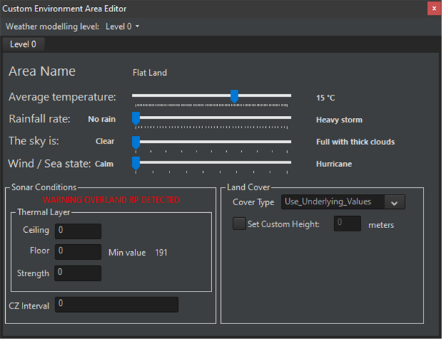

# 14.0 COMMAND Update History

## 14.1 Complete COMMAND Update History

COMMAND has changed considerably from earlier versions. Many new
features have been added, and many UI changes have been made. While much
of what applied to early release versions still applies to the latest
version, much else does not. As many returning players have left before
a specific update time, cataloging all the major changes in earlier
releases is in order.

For players whose first introduction to COMMAND is the current "Command:
Modern Operations" version, much of this will not be of any concern. But
for players who have been used to the very different mechanics of
earlier versions, reading these updates may be helpful to avoid feeling
out of place.

**Version 1.01 (October 2013)**

=======================================================

This was a "quick-fix" update of glaring issues found right after
release. Notable updates include:

A dedicated "weapons" page in the database viewer.

The ability to deselect all reference points via either a menu or by
pressing CTRL-END

-The ability to zoom to the mouse location instead of the camera center,
for the convenience of say, focusing on a contact on the far side of the
map.

-A new game option: Sonobuoy visibility. The choices are Normal
(sonobuoys are prominently displayed), Ghosted (they appear, but in a
"faded", translucent way), and Do Not Show (not visibly appearing on the
map at all)

-A new dedicated "weapon" page on the Database Viewer. The
characteristics of weapons from unguided bombs like the Mk82 to
super-smart munitions like the LRASM appear. The weapon's DB entry
includes its range, maximum speed/altitude, warhead size, signature, and
seeker type/ability.

-An "Abort Launch" button in the air ops window. When pressed, any
selected aircraft beginning the launch sequence will stop and attempt to
return to an open parking facility.

-Hold-fire can be issued to multiple selected units.

-The "Add Unit" window now remembers the filters used in the last unit
addition whenever it's reapplied. For instance, if the "Ship" type
filter is selected and the word "Iowa" is typed into the "class" text
box before the window is closed, reopening it will have a filtered list
of Iowa-class battleships in plain view.

-Major improvements in aircraft dropping ordnance without manual
control.

**Version 1.02 (December 2013)**

=======================================================

This was the first major update. Major changes included different
realism settings (see **5.4.9 Scenario Features + Settings** on page
[92](#scenario-features-settings)) and the first side proficiency
changes (see **5.4.4 Add/Edit Sides** on page [84](#addedit-sides))

-Per-waypoint speed, altitude and sensor commands. Select the waypoint
and either right click or press F2 or F9. The unit will obey the
commands when it reaches the waypoint.

-Quick Jump slots.

Quick Jumps can be used to rapidly shift back to a unit or contact. To
use quick jumps:

-Select a unit/contact and zoom the camera to the desired level.

-Press CTRL+[NUM] (the number can be 1, 2, 3, 4, etc...) and the
camera altitude and location will be saved

-To jump to that unit/location, either press the initial number or use
the "quick jump" top level menu and select from the list. The saved
numeral is to the right of the unit in the menu for easy reference.

-Note that quick jumping doesn't actually select the unit/contact,
instead it merely moves to its location.

-New game option: Reference point visibility. The options are "normal",
"small", and "do not show", the latter two serving to reduce clutter.

-The ability to set the activation time in the mission editor. This can
be vital for both hands-off normal play and for scenario creators
wishing to time missions launched by computer controlled sides.

-Side-level proficiency features, ranging from Novice to Ace. Aircraft
turn rates and weapon evasion calcs are affected by side proficiency, as
is the reaction time of all units.

-The map cursor databox (aka Black Box of Data) can be set to appear
next to the mouse cursor, at the bottom of the map, or not show at all.

-New feature: Mouse preview mode. Hovering over a contact now displays
the selection and datablock information for that unit. It's useful for
checking contacts quickly.

-Can now select new home bases for multiple-selected aircraft.

-New title screen selection: Resume from last autosave. This, true to
name, loads the last successful autosave. This makes returning to play
after an issue easier and more convenient.

-Background music is now available. While only one track is included
with the game, more can be manually added.

-New Realism Option: Unlimited Aircraft Weapons. When checked, this
allows aircraft to have unlimited amounts of any loadout available.
While this can be unrealistic (i.e. compare the shortage of air-launched
Exocets in the Falklands War to the option of having all the Etendards
launch repeated mega-salvos with this checked) and unbalancing (the
scenario may be predicated on the player having small numbers of certain
weapons at the air base), it can be useful for quick scenario editor
experiments or scenarios where neither is an issue (i.e. the available
aircraft can only carry basic unguided weapons, but they would plausibly
be present in large numbers)

-Two significant changes to "bingo" (unable to safely return to base)
fuel calculations. First is different margins. "High value" aircraft
like tankers and AEW planes will play it "safer" and automatically
return on larger amounts of fuel than "expendable" aircraft like
fighters. The second is that any aircraft with fewer than 1,500 liters
of fuel is considered "bingo" no matter how close or far from an airbase
it is.

-"Strategic" (i.e. ballistic missile) submarines now automatically move
to avoid any potential surface or sub threats in their proximity.
They're there to launch missiles, not engage in torpedo fights.

-New Doctrine Option: Use SAMs in anti-surface mode. This enables or
disables the use of naval anti-air missiles in an anti-surface mode.
There are valid conditions for using SAMs freely against surface targets
and valid conditions for saving them for aircraft.

-New Patrol Type: Sea Control Patrol. This folds ASuW [anti surface]
and ASW [anti-submarine] patrols into one. Units under a sea control
mission will engage both surface and underwater targets.

-Manual deployment of dipping sonar. Pressing shift+D with an
appropriate helicopter selected will have it hover low over the water
and deploy its dipping sonar.

-Can now edit names and delete specific aircraft directly through the
air operations window.

-Sonar and sonobuoy mechanics modifications. First, older and/or
lower-frequency sonars are affected more by reverberation in areas like
near ice packs or shallow water. Second, aircraft are now constrained by
datalink limitations when deploying sonobuoys.

-Secondary windows now remember their last positions and sizes between
sessions of running COMMAND. This helps users keep to a familiar
pattern.

-New doctrine option: Engage targets of opportunity. This means that
units will engage any contact with which they have suitable weaponry for
even if the mission tasking doesn't specifically call for it.

EXAMPLE: A carrier group, including escorts with anti-ship missiles, is
set to run a routine support mission. If "engage targets of opportunity"
is engaged, the escorts will automatically fire their ASMs at any
appropriate contact when in the proper range. If it is not engaged, they
will not unless the mission is changed or they are manually ordered to
do so.

-New event trigger: Unit Detected. The event will trigger when a unit
(filterable to varying degrees) is detected by the specified side.

-New event editor change: Event conditions. If included, the event will
only fire "IF" certain conditions, in this case, side posture, are met.
(IE, IF the "USSR" side is hostile, the NATO side will fire its nuclear
missiles at 0430.

-"Hold Position" command added to the right-click menu for mobile ground
units. This can be used to keep them in place if they've moved an
inappropriate distance.

-Database hyperlinks added for aircraft (in the "air ops" window) and
weapons (in the "unit weapons" window). Clicking them will bring up the
DB viewer with the appropriate entry.

**Version 1.03 (March 2014)**

=======================================================

This update was focused on performance, stability, and database issues.

-Aircraft loadouts now affect drag (all those bombs hung underneath that
F-105 are not going to help its agility).

-A staggered list of autosaves, where the most recent autosave is
"autoscen_20", with each autosave pushed back 20 (real world) seconds
until autoscen_100 is reached. This can help with finding issues, as an
autosave shortly *before* (instead of after) the issue can be reached.

-Patrol throttle option added. Units with no other override obey this
setting. It can be used if the goal is persistence (creep/loiter),
covering more ground (cruise) or moving very quickly for the sake of
evasiveness (full/flank).

-Aircraft with an attack profile lower than the minimum release altitude
of their carried weapons will try to fly just above the latter so that
they can reliably and precisely drop their weapons (even if it's at the
expense of being more vulnerable). Previously, they dropped at maximum
altitude, which was poor for any kind of unguided accuracy.

-Floating mines can now be detected by visual sensors (including crew
Mk1 Eyeballs) on ships and low, slow (less than 150m/450 feet and slower
than 200 knots) aircraft.

-CTRL+Left Click and Move will create a new waypoint.

-Major new game option-no pulse mode. The map and UI refresh every 0.1
seconds and the engine attempts to execute each turn as rapidly as
possible. The result is a considerably smoother, quicker-running
experience. (No-pulse is the default mode in 2.0)

-Engine throttle now affects the IR signature of an aircraft.

-Whenever an aircraft being prepared is missing primary stores (for
instance, if an airbase has one sortie's worth of bombs, they're used up
on the mission, and the survivors attempt to rearm for another
go-round), the outfitting is cancelled and the aircraft reverts to
"reserve-clean" loadout.

-Selecting a unit now highlights and "thickens" its weapon range symbols
in addition to the sensor symbols.

-Aircraft returning to base for reasons other than low fuel now return
at full rather than cruise throttle if possible to reduce the time of
vulnerability.

-Unknown contacts can now be designated as friendly with F and neutral
with N.

-Improved weather effects modelling. Progressively thicker clouds have a
progressively worse effect on EO and laser sensors (including laser
designators).

-Significant tweaks to "air boss" AI to unjam runways, maintain
formation cohesion and keep from needlessly sending aircraft back to
their hangars.

**Version 1.04 (July 2014)**

=======================================================

This update introduced a strike "auto-planner" and other improvements
such as prosecution areas for patrols (see **7.2.3 Patrol Mission** on
page [146](#patrol-mission)) and sprint-and-drift movement for warships.

-New option to turn off the BMNG layer, which returns the map to a
"retro" wireframe format.

-Added quick jump top level menu which lists all saved quick jump slots.

-Prosecution areas (additional zones that patrolling units will not
enter normally, but will pursue contacts in) added as an option to
patrol missions. Prosecution areas act as a way to restrain patrolling
units. For example, with a prosecution area, a patrolling aircraft
neither breaks away from its scheduled patrol to investigate a contact
far away from the combat area nor tries to follow retreating enemy
fighters all the way back to airfields with known SAM batteries around
them.

-Added double-click functionality.

- Plotting course (F3): double-click when placing the last waypoint
when plotting a course to exit Plot Course mode.

- Using Distance/Bearing tool (Ctrl + D): double-click to exit
Distance/Bearing tool.

-Added CTRL+click and drag functionality. By pressing the CTRL key and
clicking-dragging a waypoint or reference point that already exists, a
new one can be made.

-Most hotkeys now have a menu item. Three new menu categories added
('View', 'Contact' and 'Quick Jump')

-Added new window accessible via "Help-Hotkeys" that displays all
hotkeys.

Added new hotkeys, including:

V - Switch unit/group view, for laptops without a numeric keypad

Ctrl+V - Toggle God's Eye view

F11 - open Mission Editor

Ctrl+F11 - create new mission

Ctrl+F9 - unit/group Doctrine + EMCON

Ctrl+R - rename Reference Point (not sharing 'R' hotkey with Rename
Unit)

Ctrl+Del - delete selected ref point(s)

Ctrl+Ins - add ref point

B - return to base

Ctrl+M - clear message log

A - Toggle Hold Fire for selected units (no AI attacks)

Ctrl+A - Toggle Hold Fire for all units on current side (no AI attacks)

I - Toggle Ignore plotted path when attacking for selected unit

Ctrl + I - Toggle Ignore plotted path when attacking for all units on
current side

E - Drop Target(s)

Ctrl + E - Disengage (Drop all targets)

L - Hold Position for selected unit(s)

Ctrl + L - Hold Position for all units

Alt+S - Toggle sides (switch sides) in scenario editor

P - Drop contact(s)

-Ability to configure ghosted unit visibility for groups under "map
settings-show ghosted group members for..."

-Ability to configure plotted course visibility under "map
settings-plotted courses".

-For ease of examining the mission details, the assigned mission
description in the unit status window is now a hyperlink. Clicking it
opens the mission editor with the mission in question selected.

-Detected non-friendly unit groups (i.e. airfields, naval bases, mobile
groups) are shown as groups (one "group" icon) rather than as units
(many individual icons) when in "group view".

-There are now eleven preset cloud cover profiles, with the mouse
pointer containing more information on them:

- Thick fog 0-2k ft, solid cloud cover 7-36k ft

- Thin fog 0-2k ft, solid cloud cover 7-36k ft

- Solid middle clouds 7-16k ft, moderate high clouds 30-36k ft

- Moderate middle clouds 7-16k ft, light high clouds 27-30k ft

- Moderate high clouds 25-28k ft

- Moderate middle clouds 7-16k ft

- Moderate low clouds 2-7k ft

- Light high clouds 20-23k ft

- Light middle clouds 10-16k ft

- Light low clouds 5-7k ft

- Clear sky

-Offboard sonar sensors (towed arrays, VDS) get half the own-powerplant
noise reductions as hull sonars and a further reduction from the
existing thermal layer and deep channel modifiers-there is a reason
units that have them are considered highly capable.

-When the player attempts to load a scenario that uses a missing
database, COMMAND informs them of this and aborts the load.

-The AI can now fire heavyweight torpedoes (i.e. 650mm Soviet monsters)
at a maximum range of 8 nautical rather than the minimum of six
kilometers. Later updates would allow for more fine-tuning of torpedo
launches.

-The database "Weapon" page now features guidance details for the
currently displayed weapon, useful for, say, seeing what versions of a
missile have an IR seeker and which have an SARH seeker (the Soviets
loved making dual versions of the same airframe).

-The AI can now engage enemy SAMs in anti-surface mode if able.

-Significant improvements to intercept logic against extremely fast
targets (such as ballistic missiles and satellites). Launcher units
begin tracking at much longer distances and ensure all mandatory
datalinks can be established.

**Version 1.05 (September 2014)**

=======================================================

This update was the first to be released on Steam and introduced a huge
reform of aerial refueling operations, non-cooperative target
recognition radars, and "cranking" (slowing down in aerial combat as
much as possible to reduce the time to close the distance).

Aerial Refueling: This update introduced many changes to help aerial
refueling. The three biggest changes were:

-Crews becoming better and more context-aware about picking tankers.

-Tankers becoming better with managing their own fuel, to prevent
aircraft completely emptying them.

-Aircraft returning from missions no longer headed for tankers if not
necessary.

There were subsequent tanker improvements between this and V2.

NCTR: Certain radars have a "non-cooperative target recognition"
function. As of V2, the database entry for a unit will, on its sensors
list, contain a note if the radar has NCTR capability or not. The two
types of NCTR radars are:

JEM-Jet Engine Modulation. This requires a "look" at the blades of the
engine, and thus requires the target's front to be facing the radar
(within 15 degrees).

NBILST-Narrow Beam Interleaved Search and Track. This is more advanced
and can work from any angle.

BVR Cranking:

Starting in this update, aircraft launching BVR missiles proceeded to
"crank" after firing. Cranking means the launching aircraft will
simultaneously slow down and turn as far away as possible from the
target while still being able to guide the missile. The goal is to
preserve the range advantage as much as possible. The degree to which
aircraft can crank is now customizable in V2.

Damage Reform

-Damage rates to vehicle subsystems increased, messages updating the
player on their status appeared in the message log, and the damage
control window now color-coded subsystems in various levels of damage.
Yellow is lightly damaged, orange is moderately damaged, orange-red is
heavily damaged, and red remains the color for a system that's destroyed
outright.

**Version 1.06 (December 2014)**

=======================================================

This update introduced Lua scripting (see **5.3 Lua** on page
[78](#lua)), differing turnaround times for aircraft (see **3.3.7 Air
Operations** on page [32](#air-operations)), and unit level proficiency
settings.

-Lua: This update introduced the first Lua scripting functionality into
COMMAND. In this update, Lua was introduced as an "action" in the event
editor. Scripts included spawning units, assigning/swapping missions,
changing EMCON settings, and changing the weather.

-Surge and quick-turnaround times in air operations: Doctrine can now be
set for either "Surge" (the previous default, rapid pace like at the
start or climax of a campaign) or "sustained" (significantly slower,
"one package a day" model) mode that will affect how long it takes to
ready aircraft. Quick-turnaround has been introduced for certain
loadouts that have both simple weapons (i.e. usually unguided
bombs/rockets, nothing that requires advanced setup/programming) and an
inherently simple mission (i.e. "fly out, bomb, repeat as necessary).
However, after a certain amount of flight time, a long cooldown period
is needed.

The default quick-turnaround mode is for "fighters and ASW" aircraft,
which allows for appropriate aircraft with simple anti air/submarine
loadouts (that would realistically need to launch quickly) to deploy
rapidly without unbalancing the rest of the scenario.

-Unit level proficiency settings. While side-level proficiency settings
were added in 1.02, this enables it to be changed for specific units to
simulate differences among individual crews/formations. Whereas in past
versions of COMMAND, one would have to make two different allied sides
(IE, "Iraqi Republican Guard", "Iraqi Regular Army") to have varying
proficiency, this enables a scenario creator to have one individual side
(IE, merely "Iraq") and individual units varying from aces to novices.

-New feature: Satellite pass predictions. For all their invaluable
strengths, one large, constant weakness of satellites has been their
predictable paths. Selecting this function from the "game" menu and
clicking at any point on the map will bring up a prediction window of
how long it will take for the satellites in the scenario to reach that
point and how long they will stay in sensor coverage once there.

-Patrol/Support altitude overrides. Aircraft on patrol and support
missions can be ordered to fly at a specific altitude, either in transit
or on station.

-Radars able to detect ground targets are now limited by target speeds.
A stopped unit is harder to pick up on radar than a moving one.

-"Submarine Datum" contact: If an inbound torpedo is detected, a
circular 10nm wide submarine contact is generated under the premise that
the launching unit is close by somewhere. If a sub-launched missile is
observed leaving the water, likewise a smaller 1nm sub contact is
generated. This makes ASW more effective.

-Improved refreshing of the DB viewer window when different
units/weapons are selected, preventing the need to constantly close and
reopen it.

-Fixed a long-standing bug on the "unit enters area trigger" where the
event would fire continuously whenever the unit was in the area. Now it
fires properly when the unit "steps in".

-Special Reserved Variable For Event Engine: UnitX. This is a global
(scenario-wide) variable representing the active unit responsible for
firing any of these triggers:

-- Unit is damaged

-- Unit is destroyed

-- Unit is detected

-- Unit enters an area

-- Unit remains in area

So whichever unit causes of the above triggers to fire, it gets tagged
as "UnitX".

You can then use this special variable as a reference in any Lua-mapped
function that takes a unit's name/ObjectID as a parameter (so for
example you can dictate "whichever unit enters this area will get
assigned to this mission").

-New Message Type: Mine Contact. Like all other message types, it can be
configured to show a popup and appear on the message log. This
specifically has to deal with naval mine contacts-a warning that one
might have approached a minefield may be important.

-Altitude parameters on a loadout's mission profile are now enforced for
patrol and support missions.

-Select New Homebase now works for all unit types, not just aircraft and
groups of aircraft.

-New event trigger type: Scenario is loaded. If the current scenario
time is at or before the "start of scenario" date and time and the
scenario is loaded, the trigger is activated. This is an alternative to
the older "timed for one second after scenario start" trigger used for a
similar effect.

-Improved cloud and thermal layer indicators on throttle/altitude
window. This displays a series of indicators at various altitudes
indicated where the clouds/layers are. This helps for determining say,
the right altitude to fly a laser-guided bomb strike at, so that the
designator isn't blocked by the cloud.

-Patrol change: Minimum \# of units on station. This can be used to try
and put a certain number of units on station at any one time. When it
and the 1/3rd rule are both checked, the larger number takes precedence.

-Additional factor for naval gunnery-ship size. A large ship will be
more stable even in rough seas, while a small vessel will get tossed
around more, limiting its accuracy.

-Modified patrol behavior for aircraft. Aircraft will stop pursuing an
identified target if they do not have the means to engage it. This
solved the "Without being microed away, your MPA flies in circles above
a hostile ship until it gets shot down" issue.

-Torpedoes can be fired to max kinematic range. A new doctrine option
(configurable for units and sides) allows torpedoes to be launched at
their kinematic range. This can be set for manual shots only or AI
engagement as well.

(WARNING: NOT RECOMMENDED AGAINST ANYTHING EXCEPT A COMPLETELY UNAWARE
TARGET. DON'T SAY WE DIDN'T WARN YOU)

-New ScenEdit feature: Clone unit. Unit customizations are copied along
with the original class and name of the unit.

-Added option to identify the selected unit/contact's image as a
thumbnail on the right-side information panel.

-Aircraft on RTB orders for reasons other than fuel exhaustion now
accept course orders.

-Pressing CTRL-X now copies the lat/long coordinates in decimal form at
the current mouse cursor location to the clipboard. For example,
pressing CTRL-X while the mouse cursor is hovering over Reykjavik,
Iceland and then pasting will get the coordinates
latitude='64.1305923461914', longitude='-21.8313770294189'.

This can be very useful for say, getting the right spot for a Lua script
to spawn a unit later.

**Version 1.07 (March 2015)**

=======================================================

This update introduced...

-Weapon release authorization. Players can configure the number of
weapons launched against a specific target, the number of launchers in a
salvo, and can limit the range at which the AI will fire a weapon (i.e.
so that they don't waste weapons in a launch that will almost if not
certainly miss)

-A revamped mission editor. Compared to the pre-1.07 mission editor, the
newer one enables flight size changes, "scrub measures" (to enable
one-and-done strikes or to prevent increasingly smaller flights from
pointlessly taking off to something they can't complete), and the choice
of straight-line or angled flight paths. See
[http://www.warfaresims.com/?p=3653](http://www.warfaresims.com/?p=3653)

-"Auto-bundled" scenario attachments. See
[http://www.warfaresims.com/?p=3710](http://www.warfaresims.com/?p=3710)

-Updated UI functionality.

Updated functionality

----------------------

- Ignore plotted course when attacking: moved to doctrine

- Hold Fire turned into doctrine setting and merged with Engage Unknown
to become Weapon Control Setting (WCS)

- Added menu item to window for configuring Quick Turnaround for
airborne aircraft

- Added menu item to window for setting fuel and airborne time for
airborne aircraft

Doctrine changes

----------------------

- Doctrine tab in Doctrine window re-done

- EMCON tab in Doctrine window updated

- Added Weapon Release Authorization (WRA) tab to Doctrine window

- Ctrl + Shift + F9 opens side-wide Doctrine window

Air Ops (F6) window

----------------------

- Added 'Assign to mission' button to allow the player to assign
aircraft to missions

- Added 'Doctrine' button to update various setting for aircraft
whilst still on the ground

- Added context (right mouse-click) menu

Boat Ops (F7) window

----------------------

- Window redone, added 'Abort launch' button and synched looks and
functionality with AirOps

- Added 'Assign to mission' button to allow the player to assign
boats to missions

- Added 'Doctrine' button to update various setting for boats whilst
still in dock/davit

- Added context (right mouse-click) menu

Weapon Allocation ('Attack Target') window

----------------------------------------------

The Weapon Allocation window has been re-designed. One of the most
noticeable changes is the ability to multi-select targets and assign
salvos to all with one mouse click. This functionality uses the Weapon
Release Authorization (WRA) table to automatically create fire missions
with pre-defined weapon quantities. It should be noted that assigning
salvos this way does not take into account shooter limitations or
automatic fire range limitations. Pressing the 'Assign Salvo' button
multiple times will add additional salvo quantities of weapons.

Another significant change is that the number of weapons fired or
already impacted as part of the ongoing salvo are displayed alongside
yet-to-fire (assigned) weapons. This means the player gets a much better
overview of what targets are currently under fire and the weapons
involved.

The updated window also allows the player to add and remove shooting
units and targets. In theory, this means that the player only needs to
open the window once per scenario, and add/remove units and targets as
needed. Destroyed units and targets are automatically cleared from the
list.

Finally, the player can now resize the window, and it will also
auto-update when the player runs the simulator. The player can also
de-allocate large quantities of weapons with one mouse click.

Mission Editor

-----------------

\* The "Area Editor" component (used on mission editor etc.) has a new
button: "Highlight + center on selected". If one or more reference
points are currently selected, clicking this button highlights them and
brings the map camera to their geographic center. This is useful, for
example, for quickly seeing and moving around the reference points that
comprise a patrol area.

Contact management

---------------------

\* New UI feature: You can now filter-out a selected contact
("Filter-out" command on the contact context/right-click menu).
Filtered-out contacts are shown ghosted and no information on their
movement vector, sensor & weapon range symbols and AoU is presented on
the map. This can be useful if you have a lot of contacts of no interest
(e.g. neutrals) on the map and want to eliminate the clutter they
create. You can cancel a contact's filter-out status the same way.

You can temporarily override a contact's filtered-out status by
hovering the mouse cursor over it. This allows filtering-out multiple
contacts to reduce map clutter, and then checking them individually "at
a glance" to determine if they're worth resetting their filter-out.

-Land Range for weapons: Weapons now have separate ranges for hitting
land targets (i.e. a naval gun that's limited by its fire control
against moving sea targets but only by ballistics against stationary
land ones) and additional range rings for the land range.

-AAW engagements are now heavily dependent on the target's speed and
angle. Previously, an aircraft would get a full evasion bonus no matter
what the context. Now, a missile aimed at a slower (by fighter aircraft
standards) from the rear will have a realistically higher chance of
hitting than one aimed at the side of a rapidly moving opponent.

-AAW missiles (i.e. mostly naval SAMs) attacking large enough targets
now disable proximity fuses and rely on their (considerable) kinetic
energy to do the damage instead.

-Submarine battery recharge rate has been significantly increased, and
the recharge rate is faster the slower the submarine is moving (the
diesels can recharge the batteries and not drive the sub)

-AI Doctrine Improvements:

-Aircraft will use the tempo settings of their current bases unless
overridden by unit/mission level doctrine settings.

-New "Weapons Control Status" replaces "fire at unidentified contact"
and "hold fire". The three new settings are "Weapons Free" (fire at any
non-"friendly" contact"), "weapons tight" (fire at confirmed hostile
targets) and "weapons hold" (only fire in immediate self-defense).

-Airborne aircraft assigned via menu to existing strike missions will
have flight plans automatically generated.

**Version 1.08 (July 2015)**

=======================================================

This update focused on UI and simulation improvements.

-New Weapon Types: Anti-torpedo torpedoes and related warning systems.

-New weapon type: Enhanced fragmentation warheads, intended as a modern
alternative to cluster rounds.

-New weapon type: contact explosive (sabotage and suicide).

-New "ship" (aka "that's no island, it's an aircraft carrier") category:
Mobile Offshore Base. The hypothetical Mobile Offshore Base has been
added to the database and is designed to accommodate any aircraft type
that can fit on its runway, even one that isn't normally carrier-capable
(so a MOB can hold F-16s and A-10s, for example)

-Aircraft body IR signatures are now dependent on speed. This mainly
affects aircraft that can move very fast (and thus have a lot of heat
friction) for a sustained time.

-Bringing up the weapons window and clicking the "show arcs" checkbox
now reveals the engagement arc of a unit mount.

-The manual weapon allocation window can now optionally present "soft"
restrictions (ROE, etc..) which prevent auto-fire even if the "hard"
restrictions (ability to see/illuminate the target) are in effect.

-Targeting vectors turn yellow when the unit is physically able to
engage the target but not cleared to do so, and green when they are
cleared.

-Added "reset all side scores" on Losses/Expenditures window.

-Coastlines and borders now fade out as the player zooms in on the
terrain.

-Subs now always snorkel/recharge if at periscope depth or higher, and
now handle their speed more intelligently (via approach speed and
knowing not to chase targets they'll never catch)

-Snap up/down (how fast and far they can move vertically) limits are now
applied to AAW guided weapons.

-Side-firing (AC-130, etc....) gunships now maneuver properly to line up
their weapons.

-UNREP is now performed at a more realistic pace, and fixes have been
introduced to prevent overloading mounts on the ship being replenished.

-New side-level option: Can auto-track civilians. The selected side
automatically sees and tracks civilian/commercial units. This simulates
access to publicly available tracking sources, and can be useful for law
enforcement scenarios or to keep units from pointlessly chasing obvious
civilian contacts.

-Mechanical-scan radars can no longer conduct volume scans while guiding
a weapon, going "blind" while doing so (this is why fighters operate in
pairs!). (An advantage of phased array and ICWI radars is that they can)

Version 1.09 (October 2015)

This update accompanied the Northern Inferno DLC. New features included
campaigns (5.4.2, Campaigns), EMP blasts from nuclear detonations that
can destroy sensors, and new Lua scripts (5.3, Lua.)

-Campaigns. This allowed for the creation of campaigns like Northern
Inferno. Players can now create a set of linked scenarios with a score
threshold that must be met to progress to the next scenario *and* an
ending description.

-EMP blasts. Nuclear detonations now produce an EMP blast. The effect of
the blast does *not* depend on the yield of the nuclear warhead, but
rather on its altitude and distance to the target. The state of the
target system also matters. A turned-off system can still be affected
but is less vulnerable. Extremely important is the generation of the
system-early vacuum tube electronics are the most resistant, which each
succeeding generation becoming less and less so.

-Lua: Two Lua scripts were added:

Add Explosion. This enables a warhead to be detonated in a certain place
and altitude. This can be used to simulate everything from high-altitude
EMP-inducing nuclear blasts to conventional explosions. The ID number of
a warhead used for the detonation can be found in the "weapons" section
of the database under "warheads".

Change Unit Side. Self-explanatory, this allows a unit to switch between
sides. It can be used to simulate something like a boarding party taking
over a vessel.

New Map Features:

-Place Names. This toggleable option included countries, cities, and
major geographic features.

-Contact Emission changes. Either all emissions (so an SA-2 site would
display both the Spoon Rest search radar AND Fan Song FCR) or only
fire-control related emissions (just the Fan Song). This feature was
added to prevent clutter when viewing contact with large numbers of
sensors emitting.

**Version 1.10 (February 2016)**

=======================================================

This update included Steam Workshop support. It also included cruise
missile waypoints (so they can go around enemy SAM sites or behind
mountains to conceal themselves), improvements to the ECM model,
weight-dependent aircraft kinematics, and improved "Cooperative
engagement capacity" (where something other than the launcher can guide
weapons).

-Special Actions: These Lua script actions can be created by the
scenario editor and activated in normal play as a sort of gamble. For
instance, a player can attempt a high-risk, high-reward commando
operation or conduct a routine request for reinforcements.

-Steam Workshop: Now COMMAND scenarios can be uploaded to the Steam
Workshop. To upload, simply go to the editor menu (in the Steam version,
of course), and select "Publish Scenario To Steam Workshop."

-Waypoints for cruise missile attacks. To use them, go to 'weapons
allocated by selected attacker(s)' in the "engage targets (manual)"
window, press the 'plot course' button, and then 'draw' an appropriate
path, pressing the F3 button when a satisfactory one has been created.
The courses can be reset by clicking the 'clear course' button in the
window.

-Improved ABM modeling. This update introduced changes to anti-ballistic
engagements so that complex situations like the Patriot-vs-Scud
engagements in the Gulf War could be readily simulated.

Ordinary SAM warheads now have only a 15% chance of outright destroying
a ballistic missile target even if the endgame calc to hit it is
successful. They have a 30% chance of causing a significant (CEP
tripled) deviation of the warhead's path. Otherwise, it will only cause
a minor deviation (1.5x CEP).

Advanced SAM warheads include "Directional-frag" warheads that double
the previous values (30% destruction, 60% significant deviation), and
"hit to kill" warheads that, if they connect, will reliably destroy the
missile every time.

Trajectory deviation multipliers for ABM engagements that don't outright
destroy the missile are cumulative. This means, particularly if the
ballistic missile wasn't the most accurate to begin with, that a series
of hits that fail to completely destroy the warhead can still knock it
away from its intended target.

-Aircraft kinematics affected by weight. Aircraft now have a "weight
fraction" rating of the weapons and fuel load carried on them compared
to the nominal, best-case scenario (clean and not much much). Even
before other factors like crew skill, missile position, and altitude
come into play, an aircraft with a higher weight fraction will be less
maneuverable and thus less likely to avoid an attack.

-Cooperative Engagement Capability. What this means in short is that a
unit other than the launching one can guide a weapon provided it has a
proper datalink. To elaborate, it rapidly expands the possibilities,
turning weapons into more than the sum of their parts. An E-2D with CEC
datalinks can aid greatly in fleet defense, as it can look down and
cover a far larger area than warships blocked by the horizon, terrain,
or both.

-Improvements to electronic warfare modeling. Older-generation jammers
are less effective against modern radars and vice versa. Phased-array
radars (especially AESAs) are particularly effective at avoiding being
jammed.

**Version 1.11 (May 2016)**

=======================================================

This update introduced pier operations for long term scenarios (see
**3.3.8 Boat Operations** on page [34](#boat-operations)), more advanced
options for aerial doctrine (i.e. to enable being cautious on fuel or
"fire one salvo and run" attacks), the ability to spot enemy
aircraft/ships in their host bases, advanced submarine doctrine, and
further refining of aerial refueling doctrine.

-Expanded "Winchester" and "Shotgun" weapons states. Aircraft can do
everything from launch one long-range salvo and return to base to stay
around and fight to the last cannon round.

-Expanded "Joker" and "Chicken" fuel states that trigger fuel-based RTBs
other than the previous "Bingo" fuel state.

-Pier Operations. Ships can be rearmed and repaired at suitable bases
now, although it takes considerable amounts of time for all but the
smallest ships. Because of this, a "withdraw/redeploy" settings window
has been added to determine when they go out and when they go back
(there are more than a few historical occasions of not-fully repaired
ships being pushed back out because of time constraints).

-Hosted units (aircraft/ships) at bases can now be observed by other
sides if they're in an open facility like tarmac spaces or are spotted
taxiing to a closed hangar.

-Massive improvements to air-to-air refueling mechanics. See
<http://www.warfaresims.com/?p=4190>

-Major update to submarine mechanics. Air Independent Propulsion systems
have gotten a major rework, now being only able to keep up with battery
series at creep throttle. Many new submarine doctrine features have been
added, such as:

-Dive when threat is detected (with the intensity of the "threat")
configurable.

-Recharge battery %, transit/station-choosing the point when the
submarine snorkels to recharge its batteries.

-Recharge battery %, offensive/defensive-as above, only when the
submarine is actually engaged in combat.

-AIP usage. Allows the player to limit AIP usage, including saving it
for combat.

-Dipping sonar. Enables unassigned helicopters to dip their sonar if
they're at the right altitude. Disabling it means they'll only dip if
manually ordered or on an appropriate mission.

-Avoid contact-selectable options are "yes" and "no".

-Significant changes to replenishment rates, both UNREP and in piers.

-Aircraft may now jettison their ATG stores under attack when a doctrine
setting allows for the sake of maneuverability under fire.

-Refined pathfinding engine. There's an optional "fine-grain" navigation
configuration that's more precise but highly CPU-intensive.

-Unguided bombs and rockets dropped in salvos now use a more realistic
"stick" method of landing. In previous versions of COMMAND, a large
volley of bombs would "splatter" across a wider area, each one being
considered its own calculation. After this update (and in V2), they will
fall in a line near the area of the first impact. The dispersion of the
weapons still can vary based on factors like altitude, the proficiency
of the dropping aircraft, and the technology level of the bombsight on
the dropping aircraft.

This means that an aircraft unleashing all its unguided weapons in one
volley can only truly attack one aimpoint at a time, meaning area damage
is dependent on more bombs (there's a reason for the monster potential
bombloads on classic aircraft like the A-6) and that a stick of bombs
dropped from say, an old bomber with a rusty crew from high altitude
against an airfield can easily (and realistically) miss it altogether
and do no damage to the target.

-Changed how facility aimpoints, especially armored ones, are affected
by blast damage.

-Changed cluster bomblet effects-due to having many small explosions,
they are now much more likely to cause fires and inflict component
damage.

-Units can no longer perform component repairs if they have more than
minor flooding or fire. The crew is too concerned with trying to keep
the ship from sinking or exploding to worry about the radar dish with
disconnected wires.

-Only minor component damage can be completely fixed while a ship is
underway. More serious repairs can only be conducted in a port.

-Due to the introduction of pier operations, "Unlimited Weapons At
Airbases" realism setting is now changed to "Unlimited Base Weapons",
covering ports (i.e. reloads for missile boats) as well as air bases.

-The "Docking ops" window now has additional columns to display fuel,
damage, and weapons. It also has color-coding to determine a unit's
readiness compared to doctrine (an AI unit will only deploy if it's all
"green", but it can still be overridden manually by a human side).

-Terrain-following "above ground level" (as opposed to "above sea
level") settings are now available for aircraft under the
throttle/altitude window. This enables units with terrain following
radar capabilities (i.e. F-111s) to do their thing.

-When a mission fails to launch aircraft, a logged message explaining
why is now generated.

-New "Game Speed" options window to disable features that cause
slowdowns.

-Mine deployment depths are now displayed in the DB viewer.

-Area validation-all windows with area editors now have a "validate
area" button to see if the polygons are valid or not. All areas in a
scenario are automatically validated on load, and a warning is given if
invalid polygons have been made (this happens often with older scenarios
made in early versions of COMMAND).

**Version 1.11 SR1**

=======================================================

-Significant improvements to stick bombing mechanisms. The type of
aircraft and number of bombs now has an effect on spacing between
individual bombs.

-All weapon impacts (hits and misses) are now briefly shown on the map.

-When using the "zoom to the cursor position" option, after zooming,
the mouse cursor is re-centered at the map.

- Keyboard tweaks. Spacebar instead of F12 now pauses the game. \|
shifts to the next unit.

-COMMAND can now load and run much larger scenarios with over 10,000
active units.

-Fixed an issue where an autosave failing due to memory exhaustion
crashed COMMAND. Instead, a popup is displayed notifying the player of
the failure.

-Improved support for high-DPI desktop resolutions.

-Recording tweak: Maintain God's Eye enabled/disabled preference
between frames during playback.

-You can now enable/disable non-navigation zones and exclusion zones, in
two ways:

a\) Through the UI, as the grids on the relevant windows have an extra
"Is Active" checkbox for each zone entry.

b\) Through Lua. Usage example:

mySide = VP_GetSide({Name="US"})

myZone = mySide:getnonavzone("AAW Zone 1") [Alternative for excl.
zone: myZone = mySide:getexclusionzone("Forbidden Zone 1")]

myZone.isactive = "True"/"False"

Inactive no-navigation zones are not rendered on the map at all.
Inactive exclusion zones are rendered with a dash line (instead of
solid).

**Version 1.11 SR6**

=======================================================

-Wholly revised right column UI, intended to be compatible with as many
DPI settings as possible.

-"Damage control" button and flame damage indicator now enabled for
aircraft.

-Detected jamming emissions are now in yellow text and do not fade.

-Active sonars now have a "bottom bounce" mode.

-Mobile facility contacts now have the same expiration time (2 in-game
hours) as surface contacts.

-Ship AI tweak: Do not adjust speed for cavitation when on a simple
plotted course.

-Weapons that impact on a set of coordinates now check if a target is
actually there.

-Aircraft and aerial weapons that travel at high-supersonic/hypersonic
speeds now get a massive (if linear) boost in their IR signature.

**Version 1.11 SR7**

=======================================================

-New map/UI feature-directional unit icons. Can be selected by choosing
the "directional stylized" option under "map display".

-Revised "realism options" window. The features are now more visible and
cannot be changed in normal play.

-The unit magazines window now lists weapons by non-empty/empty first,
and then alphabetically, so that the player can quickly see what weapons
are available.

-The "New Contact" message type is supplemented by more focused types
devoted to individual types of unit (land, air, surfaced, and
submerged). This allows certain contact appearances to be more
"noticeable" in message log settings (i.e. a submarine that's the entire
point of the scenario in question can raise a clock-stopping popup when
detected, while a flurry of land contacts caused by an aerial recon run
over an enemy division doesn't overload the log)

-Ships now maneuver to unmask the preferred mount for firing (try it
with a Perry frigate with its mid-mounted gun).

-Non-aircraft units can now use escort logic (currently only for strike
missions)

-When creating an "airborne" salvo (e.g. ballistic missile firing RV),
if the target is an aimpoint, assume we're firing at an actual target
contact, and that is the one nearest to the aimpoint.

-Reimplemented incendiary weapons. The effect of an incendiary weapon
depends on both the target's size and armor levels.

-Gun rounds now lose kinetic energy the farther they travel, with
corresponding effects on their damage and penetration.

-Detection checks now take sensor min/max altitudes into effect. (Many
air-search radars have low detection altitudes, for instance).

-The localization logic previously used for ASW aircraft prosecutions is
now used for any non-aircraft unit searching for a known but imprecise
contact.

-Added loiter ability for certain tactical decoys.

-Large number of new and updated Lua methods.

-Lua commands and responses (including errors) now saved to a log file.

-Improved Lua error handling. Errors are displayed and execution stops
when running in console mode. When running from special-actions, the
function returns NIL but the script continues to run. The error is shown
in the Lua variable '\_errmsg\_' and the function in '\_errfnc\_'

**Version 1.12 (May 2017)**

=======================================================

This update accompanied the Chains of War DLC. New features include
comms disruption (see **12.6 Comms Disruption & Cyber Attacks** on page
[291](#comms-disruption-cyber-attacks)), aircraft damage (see **5.4.9
Scenario Features + Settings** on page
[92](#scenario-features-settings)), lasers, railguns, and EMPs.

-Major new feature: Comms Disruption. This enables realistic cutoffs
from the network. (awaiting new revision)

-Major new feature: Aircraft damage. Now aircraft (when the feature is
enabled) are no longer destroyed by any successful hit. Larger and/or
more heavily armored aircraft are more resistant to damage. Damaged
aircraft that return safely to base can still require long periods of
time to repair-frequently longer than the remaining time in the
scenario.

-Major new feature: Cargo. Now amphibious and air-landing operations no
longer need to be "simulated" with either teleportation events or Lua
spawns. Cargo operations can be performed manually or as part of a cargo
mission.

-New weapon types.

Lasers

Tactical EMP

Railguns/HVPs

-New 2x time acceleration setting, in case real time was too slow and 5x
was too fast.

-Improved support for 4K/UHD screens.

-"NO-CAV" is now displayed on the unit status panel for a unit
deliberately slowing down to avoid cavitation.

-Addition to passive sonar model-Sonar masking. A quieter unit can use
the noise generated by a louder one to hide. This is, unsurprisingly,
less effective against more advanced sonars.

-Lua: Fix manual/desired speed on SetUnit()

-Lua: Enhance EndScenario trigger/action

-Lua: Enhanced "Unit Detected" event trigger

**Version 1.13 (October 2017)**

=======================================================

This update added chaff dropping, changes to AAW/ABM mechanics (with
more advanced missiles being more capable and taking intercept angles
into account), and a new Lua console which serves as the base one in
VNEXT.

-New Feature: Tactical Chaff Laying. Under "attack options", a unit can
be ordered to lay down either a single bundle of chaff (single burst) or
keep going until it runs out or is ordered to stop (continuous stream).

While disruptive to radar, chaff has its limitations which led to its
relative decrease. First, aircraft must be *in* rather than simply
behind the corridor, and, when faced with 3D radars, must take care with
their altitude so that they're at the same level as the cloud.

Chaff is also most effective against older and/or lower frequency radar
sets. A modern AESA will simply ignore it completely.

-New feature accessible from the throttle/altitude window: Sprint and
drift for single units. The set speed is now the *average* speed, with
the AI speeding up and slowing down as necessary.

- Isolated-POV (on-grid status) tweak: Visual indicators (dashed
rectangle) for which of the displayed contacts are actually detected by
the selected unit.

-Changes to AAW mechanics with detailed aircraft damage. Planes with a
pressurized cabin are instantly destroyed if they have fuselage
penetration, there's a chance the flight controls will be destroyed
(dooming the aircraft) in fuselage hits, anti-missile engagements now
have reduced chances to hit in oblique/crossing engagements, and AAMs
with advanced fuses can do more than their nominal amount of damage.

-New V2 Lua console. This serves as the Lua console in COMMAND 2.0

**Version 1.14 (February 2018)**

=======================================================

This update accompanied the Silent Service DLC. It includes contact
detections on the right sidebar (so the player can see what detected a
certain contact), a "do not cavitate" option for ships or subs wanting
to stay quiet, and reattack capabilities for torpedoes and certain
missiles that initially missed.

-New UI feature: Recent contact detections. Contact recent detections,
i.e. a list of the most recent successful sensor detections on a given
contact, showing who detected it and how. Example:
[https://i.imgur.com/aEmfJnq.png](https://i.imgur.com/aEmfJnq.png)

Clicking on the sensor name brings up the DB viewer page of the carrier
platform and highlights the sensor stats. Clicking on the detector
platform name selects the platform and centers the map on it.

This can be quite useful in situations where it is not clear which of
multiple units actually detected a contact (e.g. a surface group
tracking a target) or in cases where it is desirable to understand which
of multiple different sensors can actually hold the contact (quite
common e.g. in submarine & ASW operations).

-New feature: Mark Contact Position, accessible by right clicking on the
contact and selecting "mark contact position". It's useful for
determining possible locations of uncertain contacts tracked over a long
period of time.

-New Throttle/Altitude Window feature for ships and submarines-avoid
cavitation. If enabled, the AI crew will move slowly enough to prevent
noisy cavitation. It is ignored if the ship is avoiding a weapon (after
all, it's already found and engine noise is the least of its worries)

-Users can now create circular areas of reference points in addition to
the older rectangular ones. With CTRL-right click, there is now a
"define area - circle" option in addition to the "define area -
rectangle"

-New feature: weapon re-attacks. All torpedoes with terminal guidance
and several modern ASMs have reattack capability (if they have it, it is
marked as such in their database entry). Reattacking is possible if they
are successfully jammed/decoyed just prior to impact, or if they fail
their hit-or-miss check. In the latter case, the weapon must also pass a
reliability check, with the chance of a dud being ¼ of the original PoH.

(For example, a torpedo attacks with a PoH of 80% and misses. The weapon
can re-attack, but must first pass a reliability check with a 20% chance
of failing (80% \* 0.25). If the check fails, the torpedo is a dud. If
the check succeeds, the torpedo can proceed to re-attack either the same
target or anyone else it acquires.)

If the weapon is eligible for re-attack, it passes right over/under the
target and begins a spiral search until it is able to re-acquire a
target (or runs out of fuel).

-New feature: Torpedo wire breaking. If a submarine conducts a "crash"
turn (1.25 times faster than its standard turn, used only for weapon
evasion) or is moving faster than ten knots while firing the torpedoes,
there's a chance of the guidance wires breaking and the launched
torpedoes becoming autonomous.

-New feature: Cargo pickup. Currently works only with aircraft
(helicopters and VTOLs), and is manual-ordered only (no mission-driven
behaviors as yet). To perform it, right-click on a suitable aircraft and
select "Select unit(s) for pickup". The cursor will change to a
targeting crosshair and you can select one or more target units from
which to pick up cargo-type mounts, if they have (for example, to order
a helicopter to pick troops from a mobile ground unit). Once it has
picked up cargo, the aircraft can be ordered to RTB, and upon landing it
will unload the cargo to its host unit.

-New feature: "Flaming datum". When a ship is hit by a completely
undetected torpedo, an underwater "probable sub" contact is generated at
the point of impact, giving any available ASW units a place to start
looking.

-Ferry missions can now be used for ships and submarines.

-Improvements in submarine damage model. Now only shaped-charge warheads
(on certain modern torpedoes) can penetrate underwater submarines.
Normal explosives do more realistic shock damage from detonating close
to the hull.

-New ScenEdit feature: "Chance of appearance" (Right click on unit in
ScenEdit --\> Scenario Editor --\> Chance of appearance). This allows
setting easily the chance of a unit actually showing up on the next
scenario load (at normal-play mode). Units that fail the appearance
check are discarded permanently. Applies to platforms only (not
weapons).

-When exporting facilities using .inst files, boats berthed in these
facilities are retained. This is makes it easy to preserve nominal fleet
ORBATs for specific historical periods (e.g. which ships were berthed in
Norfolk on June 15, 2006).

-Min/Max target range for ships/subs/facilities/land-units on strike
mission (e.g. "intercept and engage only targets within 200nm of your
position"), similar to the previous "tethers" used for aircraft at
their bases.

-The mission editor can now define how many aircraft in a patrol will
investigate & engage contacts, as well as wingmen behavior. This is to
prevent "contact pileups" where, for example, a single unidentified
aircraft would into the patrol/prosecution area, causing every fighter
on patrol to just drop everything and scream towards it.

-Configuration files (\*.ini) are now automatically consolidated at the
[CMANO]\\Config folder for easier management.

**Version 1.15 (March 2019)**

=======================================================

This update included tweaks to visual/IR sensors to make them more
realistically imprecise, a dynamic order of battle window, a personal
persistent map option (use at your own risk), and changes in BVR
doctrine (see **3.3.12 Unit/Group Doctrine** on page
[38](#unitgroup-doctrine))

-Personal Persistent Map Settings:

As we previously saw, the various map information and visibility
settings (which layers to display, which range rings/wedges to show,
misc. information such as targeting and illumination lines etc.) are set
individually for each side in a scenario. This makes sense from a
scenario design viewpoint, since each side may have different priorities
depending on its overall operational tasking (e.g. prefer underwater
sensor and weapon rings if conducting ASW operations). This does mean,
however, that if a player prefers to apply his own custom settings at
the start of a scenario, he has to do this at the start of each new game
session. *(Settings are automatically persisted & applied when resuming
from a save to continue an ongoing session).*

This situation has led to one of the biggest user complaints/requests,
ever since the v1.0 release of Command, to be *"I am tired of setting my
own custom map settings every time I start a scenario anew. Can we get
an option to persist my custom settings and automatically apply them
into any scenario I start playing?"*

We explained why this could be a bad idea (for example, it's an
excellent way to miss potentially important information that the
scenario author has laid out for the player's attention), but the
request remained constant. So we obliged, and it is now possible to do
precisely that.

Let us see how this works:

1.  To begin with, set up your map preferences just how you like them -
    range rings, targeting & illumination vectors, datalinks, reference
    points, sonobuoys, datablocks etc.

2.  Open the "Game Options" window, go to the "Map Display" tab.
    There, you will notice a checkbox labelled "Use personal map
    preferences" and a button labelled "Save current map profile as
    personal":

3.  Clicking on "Save current map profile as personal" will make the
    current active map profile your personal, persistent one.

4.  Checking the "Use personal map preferences" will enforce usage of
    your persistent map profile. From now on, whichever scenario you
    load and whichever side you switch to, the map profile settings in
    effect will be those of the persistent one.

To stop using the personal persistent profile, simply uncheck the "Use
personal map preferences" checkbox. The map display will immediately
revert to using the settings that the scenario author offers as default
for the scenario & side at hand.

-Dynamic Order Of Battle Window. The "List by group" page of the ORBAT
window is now dynamic, i.e. it automatically refreshes as units are
added or destroyed, take off, land, deploy or re-dock to their parent,
join or leave a group etc. This makes it possible to keep the ORBAT
window continuously open as a "running tally" (and quick-jump source)
of friendly forces during a scenario, instead of a static snapshot.

-IR and visual sensors can now only generate precise contacts at short
range, removing the old, unrealistic feature where a visual spotter
could see an aircraft and instantly know its exact position.

-Finally resolved the long-standing issue of "blind AMRAAM shots":

- Units firing AAW ARH weapons (e.g. AMRAAM) must now actively detect
the target on their own radar before being able to fire the weapon (i.e.
it's no longer enough to receive offboard contact from e.g. AWACS and
fire based purely on that). This makes it much more challenging to
employ AMRAAM-class weapons against stealthy targets or in a heavy-OECM
environment.

- After launching an AMRAAM-class weapon, the unit must still keep
detecting the contact in order to provide mid-course guidance to the
missile. If radar contact is lost for more than 5 seconds, the missile
goes into a "blind" state and flies straight ahead (similar to SARH
weapons who lose guidance). (Appropriate AI/EMCON logic has been added
to encourage this).

-Note that CEC-capable weapons such as AIM-120Ds *can* be launched
"blindly" provided there is another appropriate unit to guide them.

-BVR Engagement Logic doctrine settings.

This changes the doctrine aircraft will follow when engaging with
long-range missiles. The three choices are as follows:

-Follow missile straight-in: The aircraft will continue to follow the
missile straight towards the foe. This can be used to simulate a unit
with rigid doctrine, poor training, and/or a desire to close to visual
range quickly.

-Crank if possible (DEFAULT): The aircraft will "crank" by tilting to
the edge of its guidance radar and slowing down. This symbolizes a
desire and training to stay at long range if possible.

-Crank and drag: The aircraft will not only crank but will, once the
missile goes active and its guidance is no longer necessary, "drag" and
move away from the target. This symbolizes a greater desire to stay at
long range at any cost as well as the skill to do so.

-Updated South China Sea terrain data.

-The diesel "noise penalty" for snorkeling submarines is now gradual and
dependent on the speed of the submarine. Not surprisingly, stationary
subs are very quiet while rapidly moving subs are very loud.

Version 1.15.6

Major changes to MAD (Magnetic Anomaly Detector) sensor modelling.

-- MADs are no longer precision sensors, they have bearing ambiguity
and absolutely no range estimate (the range estimate is essentially
"anywhere from right in front of us up to max sensor range")

-- The practical MAD detection range is affected by the displacement
ratio (target displacement vs max reference figure) and under-keel depth
(shallow is worse, because of the bottom background)

-- MAD scan rates have been increased (only in DB3000 v478+). This
rewards faster sensor platforms (e.g. P-8 vs P-3 vs helicopter) as they
are able to cover more distance per given time and thus refine the
contact position through triangulation faster.

**Version 2.0**

=======================================================

COMMAND Version 2.0, or Command: Modern Operations, is the official
sequel to Command, containing a completely revamped engine.

**User Interface**

- General user interface: The entire UI has been renovated on a dark
  theme with emphasis on improved usability

<!-- -->

- New, high-resolution map layers:

  - Sentinel-2 Cloudless (2016):
    [https://s2maps.eu/](https://s2maps.eu/)

  - BMNGv2 (improved version of NASA's Blue Marble NG)

  - Relief-90: High resolution land-only overlay

  - Stamen Terrain (
    [http://maps.stamen.com/terrain](http://maps.stamen.com/terrain)
    )

  - Stamen Roads & Cities (
    [http://maps.stamen.com/terrain-lines](http://maps.stamen.com/terrain-lines)
    )

  - Terrain land-cover type (Example:
    [https://i.imgur.com/NNmb2Wx.jpg](https://i.imgur.com/NNmb2Wx.jpg)
    )

- Message Log 2.0: A radically improved message reporting system.

  - Additional unit-level message log: All messages relevant to a
    specific unit are aggregated on a window specific to this unit and
    only optionally also shown on the side-level message log. This both
    declutters the main message log and makes it much easier to quickly
    examine a unit's message history.

  - Message balloons: When an event happens on the main map, a
    "balloon" containing the message pops up for \~10 sec. This makes
    it immediately obvious where the event described is happening. The
    balloons appear at a random bearing and semi-random distance from
    the reported event, to avoid overlapping on top of each other. They
    stay visible for 5 seconds, then fade out.
    The appearance or not of the balloons is configurable per message
    type (Game Options → Message Log).

  - The side-level message log groups reported messages by type, and
    highlights the unread ones. This makes it easy to prioritize reading
    important messages (e.g. weapon engagements, battle damage etc.) and
    quickly catch up on unread traffic:
    [https://i.imgur.com/mpVkKF6.png](https://i.imgur.com/mpVkKF6.png)

  - When clicking any of the messages on the interactive message log,
    the map will auto-center on the message origin location.

  - Messages are type-color coded, both on the message log and in the
    balloons. Example:
    [https://cdn.discordapp.com/attachments/285833706273243138/451754006797352960/xFzgVmF.png](https://cdn.discordapp.com/attachments/285833706273243138/451754006797352960/xFzgVmF.png)

  - When used in detached mode, the interactive message log can also
    switch to the "classic v1" raw-text style and back again, by
    clicking on the "Switch to [other style]" button:

> [https://i.imgur.com/G2Eof7L.png](https://i.imgur.com/G2Eof7L.png)
>
> [https://i.imgur.com/H5PBcpu.png](https://i.imgur.com/H5PBcpu.png)

- Players no longer need to manually download and install the unit image
  packs; images are now automatically downloaded on-demand and displayed
  when a respective unit is selected.

- The map engine has been re-written almost from scratch, to offer a
  fast, smooth-flowing pan & zoom experience.

<!-- -->

- UI addition: A series of shortcut buttons are available under the main
  menu, to provide quick navigation to most common commands and windows.
  These can be toggled on/off by the "Show/Hide Shortcuts" button:
  [https://i.imgur.com/tT8KhD0.png](https://i.imgur.com/tT8KhD0.png)

<!-- -->

- UI addition: The "Evaluation & Scoring" window now has a "Scoring
  Graph" tab, where the player can witness the change of the side score
  over time, along with the reason for the changes. Example:
  [https://i.imgur.com/ulmYdux.png](https://i.imgur.com/ulmYdux.png)

<!-- -->

- UI addition: throttle/altitude shortcut buttons on right column:
  [https://i.imgur.com/kojiBTA.png](https://i.imgur.com/kojiBTA.png)

<!-- -->

- New UI feature: Contacts list on the ORBAT window:
  [https://i.imgur.com/iPNPEu6.png](https://i.imgur.com/iPNPEu6.png)

<!-- -->

- UI addition: "Edit hosted boats" and "Edit hosted AC" shortcut
  buttons in unit status panel. These are visible only in ScenEdit mode
  (and as applicable, e.g. a platform will no air facilities will not
  display the "Edit hosted AC" button), and allow you to directly jump
  to the relevant windows:
  [https://i.imgur.com/Jd7o1VR.png](https://i.imgur.com/Jd7o1VR.png)

<!-- -->

- UI tweak: When selecting a group member on the group-status panel (for
  a mobile group only, not land installation), instead of displaying the
  DB entry for the unit, the map now selects and centers on this unit
  and switches to unit-view if necessary. This makes it easier to
  quickly jump into a specific unit from group-view.

<!-- -->

- UI addition: Keyword search on ORBAT window. This works similarly to
  web browsers, i.e. as you type the desired keyword, entries matching
  are highlighted:
  [https://i.imgur.com/NLI3ZaW.png](https://i.imgur.com/NLI3ZaW.png)

<!-- -->

- Map/UI addition: Show list of currently selected friendly units
  grouped by class/type, similar to Homeworld. Example:
  [https://i.imgur.com/F2eJqKj.png](https://i.imgur.com/F2eJqKj.png)

<!-- -->

- UI addition: It is now possible to have multiple windows of the
  DB-viewer open concurrently

<!-- -->

- UI tweak: The throttle/altitude window (aka F2 window) more clearly
  distinguishes between having selected a waypoint of a unit's plotted
  course or the unit itself.

> Example with waypoint selected:
> [https://i.imgur.com/2Sfo3nS.png](https://i.imgur.com/2Sfo3nS.png)
>
> Example with the unit itself selected:
> [https://i.imgur.com/zNMyuBX.png](https://i.imgur.com/zNMyuBX.png)
>
> Also, by using the white "previous" and "next" arrows next to the
> unit/waypoint description, it is possible to select the previous/next
> waypoint or the unit itself without leaving this window.

- New UI feature: The right column (unit status etc.) can now slide
  in/out of the main window.

> How it works: There is now a collapse/expand button next to the right
> column:
> [https://i.imgur.com/v2rR8xj.png](https://i.imgur.com/v2rR8xj.png)
>
> Clicking the button will cause the right column to slide out of view:
> [https://i.imgur.com/z4nhUpv.png](https://i.imgur.com/z4nhUpv.png)

Clicking the button again restores the right column as normal.

> This can be useful if the left side of the main window is taken up by
> UI elements (e.g. message log & 3D-view) and this way the player can
> use more map area.

- New UI feature: Time-step buttons:
  [https://i.imgur.com/Lx7MdCQ.png](https://i.imgur.com/Lx7MdCQ.png)
  . Clicking on any of these (while paused) will advance the simulation
  time forward by 15 sec, 1 min, 5 mins or 15 mins, and then stop again.
  The key combinations Alt + 1/2/3/4 are mapped to the 15 sec, 1 min, 5
  min and 15 min timesteps respectively. This makes it possible to
  control time-flow without having the mouse cursor leave the area of
  interest.

- Map/UI tweak: When clicking on a stack of units/contacts on the map, a
  new menu pops up allowing selection of the specific desired unit.
  Example:
  [https://i.imgur.com/2ZTADQn.png](https://i.imgur.com/2ZTADQn.png)
  . This is designed to avoid the need for extreme close-up on a map
  location just to select a unit.

<!-- -->

- New UI window: Line of sight (LOS) Tool. The LOS tool offers a new
  capability for visualizing sensor LOS of a given platform or an
  arbitrary geopoint.

> To use it, select the desired platform, then on the main menu, click
> on Editor LOS Tool. The LOS-Tool window will appear, and the shaded
> area representing the platform's current LOS will be rendered on the
> map.
>
> There are various settings we can change on the tool:

- Max distance (nm): This is the maximum distance for which the LOS
  coverage will be calculated. Increasing this can have a major impact
  on map-refresh performance.

- Target Alt (m AGL): This is the assumed target altitude for which the
  LOS coverage is calculated. This can be very useful is we want to
  visualize LOS against, for example, an airborne threat at a specific
  above-ground altitude ("show radar coverage against an F-111
  terrain-following at 60m"). If the "Same as observer" checkbox is
  ticked, then the LOS calculations assume a target as the exact same
  altitude as the selected platform.

- Horizon type: This is Radar/ESM by default but may be switched to
  Visual instead. The EM horizon is somewhat longer than the strict
  visual horizon and this affects LOS coverage as well.

- Shade Color: The color of the shade coverage can be altered, to avoid
  interference with other map elements.

<!-- -->

- New map feature: If you zoom low enough to a naval vessel (ship/sub),
  you can see its proportional size at it would be really seen at that
  camera altitude. Example:
  [https://i.imgur.com/JjEmgGR.png](https://i.imgur.com/JjEmgGR.png)

- New map feature: Aircraft range rings. Like with weapons, rings that
  show the theoretical maximum range of a given aircraft can be enabled
  or disabled.

<!-- -->

- Map tweak: When displaying an area/course-based mission (on map) also
  display the mission name.

<!-- -->

- Map tweak: Long lines (e.g. intercontinental plotted courses) now
  follow the correct great-circle (i.e. curved) path.

<!-- -->

- New UI feature: Minimaps. There are 3 types: Global (entire planet),
  Scenario (fits to the scenario's units) and Camera-Following.
  Different types can be used concurrently. For example:
  [https://i.imgur.com/XrorOAJ.png](https://i.imgur.com/XrorOAJ.png)

<!-- -->

- New UI option: Full-screen view for main window (View --\>
  Full-screen view), ON by default. The shortcut key for toggling this
  is **Alt+Enter**. This setting is persisted across game sessions.

<!-- -->

- New UI feature: Hover-info box. If the user holds down the CTRL key
  while hovering the cursor over a unit, group or contact, a box pops up
  with summary information on the object of interest. Example:
  [https://i.imgur.com/qbDdlc9.png](https://i.imgur.com/qbDdlc9.png)

<!-- -->

- New UI feature: Open recent scen/save files:
  [https://i.imgur.com/IIETZiu.png](https://i.imgur.com/IIETZiu.png)

<!-- -->

- UI tweak: Steam Workshop scenarios are now accessed on a separate tab
  in the "Load Scenario" window:
  [https://i.imgur.com/0y9sonw.png](https://i.imgur.com/0y9sonw.png)

<!-- -->

- Added support for real-time visualization using Tacview (**IMPORTANT**
  **NOTE:** To use this feature, you must purchase Tacview Advanced or
  Enterprise edition) . How to use:

1)  Purchase & download Tacview (<https://www.tacview.net/> ) and
    install.

2)  The "Game Options" window a dedicated "Tacview" tab, for setting
    the path to the Tacview executable. Make sure you set the correct
    path in order to make it work. (The path is saved together with the
    other game preferences)

3)  Load up a scenario as usual, and then click on View --\> 3D View. A
    secondary window should appear, with Tacview's default top-down
    view. You can focus on any unit, either by clicking it on the
    Command map as usual, or by Ctrl+LMB on the Tacview window itself.
    The mouse scroll zooms in/out just like Command, whereas using
    mouse-grab you can rotate the camera around the focused unit.

> Tacview is fairly sparse in models and terrain out of the box, but can
> be significantly enhanced with add-ons.

- To add extra models: First, construct a suitable 3D mesh and place it
  in the proper folder (see here for instructions:
  <https://www.tacview.net/documentation/3dobjects/en/> . Afterwards,
  edit the Excel file
  [CMANO]\\Resources\\Tacview\\Associations_DB3000.xls and add a new
  row in the relevant sheet with at least the DBID and mesh file name of
  the object. Command will then read the entry and provide the filename
  to Tacview to render the object. (This currently possible only for
  DB3000 units)

- To add more detailed elevation data & textures, see instructions here:
  <https://www.tacview.net/documentation/terrain/en/>. We are currently
  putting together a global-scale SRTM3 dataset (elevations) but imagery
  layers are a tougher proposition.

> The window hosting the Tacview display has the same common properties
> as other CMANO secondary windows, so it can be moved around, resized
> etc. Two example configurations are:
>
> Single monitor:
> [https://i.imgur.com/PqnPYJm.png](https://i.imgur.com/PqnPYJm.png)
>
> Two monitors:
> [https://i.imgur.com/O7sjbS7.jpg](https://i.imgur.com/O7sjbS7.jpg)

- New UI feature: Personal persistent map profile (i.e. maintain the
  same map preferences throughout different scenarios & sides,
  effectively overriding the scenario author's default settings).

> How it works:

- Set up your map preferences just how you like them - range rings,
  targeting & illumination vectors, datalinks, reference points,
  sonobuoys, datablocks etc.

- Open the "Game Options" window, go to the "Map Display" tab. There
  you will find two new UI elements: <https://i.imgur.com/MyKYwpp.png>

- Clicking on "Save current map profile as personal" will make the
  current active map profile your personal, persistent one.

- Checking the "Use personal map preferences" will enforce usage of
  your persistent map profile. From now on, whichever scenario you load
  and whichever side you switch to, the map profile settings in effect
  will be those of the persistent one.

> To stop using the personal persistent profile, simply uncheck the
> "Use personal map preferences" checkbox. The map display will
> immediately revert to using the settings that the scenario author
> offers as default for the scenario & side at hand.

- UI tweak: The "contact status" panel now also display's the
  contact's WRA-type information:
  [https://i.imgur.com/0vPkYJh.png](https://i.imgur.com/0vPkYJh.png)

> This helps to better understand AI decisions on WRA-driven weapon
> allocations (e.g. "why are my planes shooting 8 instead of 2 Harpoons
> at this ship contact?")

- New map option: Colored datablocks. Configurable through "Game Options
  --\> Map Display". When enabled, a unit/contact's datablock will have
  the color corresponding to its posture (e.g. red if hostile).

> **General gameplay & content**

- New gameplay mode: Quick Battle Generator (aka "Command MadLibs").
  The QBG offers players a way to quickly jump into a battle without
  much preparation or wider geopolitical factors. The player selects the
  template of the quick battle he wants to create, alters the settings
  provided by the HTML page, and clicks on "START".

> Quick-battle templates are stored in subfolders inside the
> [CMANO]\\QuickBattle folder. Each template consists of a simple HTML
> page and a matching Lua file.
>
> "Behind the scenes", the values of the named HTML elements in the
> template pages are translated to matching Lua variables with the same
> name, and provided to the template's Lua script file which is then
> executed, generating the quick battle.
>
> The framework is constructed specifically so that players can make
> their own templates and share them with others, just like with regular
> scenarios.

- The features previously available only to "Chains Of War" and related
  DLCs (Comms disruption, detailed aircraft damage, cargo/ambip/airdrop
  operations and advanced weapon types) are now integrated into the base
  game and available to all players.

- New music soundtrack and sound effects.

- Brand-new scenarios by Paul Bridge (Sirius) and other community
  contributors.

- All original official v1.x scenarios have been remastered by Rory
  Noonan (Apache85) to take advantage of new v1.x and v2.0 features.

- An extensive range of tutorials (some new, some carried over from
  Command v1.x) to ease in new players into the intricacies of modern
  operations. There are now three full tutorial sets for each major
  branch of operations (air, surface, underwater), plus dedicated
  tutorials for specific aspects of the game.

- The default map icon style is now "Directional", to present new
  players with more familiar icons representing various unit types. The
  "NTDS/APP-6" and "Stylized" type options remain available.

- Includes the latest versions of the DB3000 and CWDB databases.

> **Simulation & mechanics**

- Simulation performance & scalability has been significantly enhanced.
  This is most evident in large or complex scenarios.

<!-- -->

- Major new simulation feature: Terrain types.

> The different types of terrain are now accurately represented, using
> NASA's MODIS Land-Cover 2012 dataset
>
> (More details:
> [https://lpdaac.usgs.gov/dataset_discovery/modis/modis_products_table/mcd12q](https://lpdaac.usgs.gov/dataset_discovery/modis/modis_products_table/mcd12q1))
>
> The various terrain types have different effects on the mobility of
> ground units, on weapon effects (especially blast and frag warheads)
> and spotting visibility. In summary:

- Water is impassable

- Wetlands reduce speed to 10% of original (bog!), and impair visibility
  slightly.

- Snow/Ice reduce speed to 20% of original, and impair visibility
  slightly.

- All forest types reduce speed to 30% of original, significantly hamper
  the destructive effect of blast and fragmentation detonations, and
  sharply reduce spotting ranges.

- Shrublands reduce speed to 50% of original, slightly reduce the blast
  & frag effects, and moderately reduce visibility.

- Croplands and vegetation mosaics reduce speed to 70% of original, and
  slightly reduce visibility.

- Open and wooded savannas reduce speed to 80% of original

- Barren / sparsely vegetated terrain and grasslands have no impact on
  speed, weapons or visibility.

- Urban & built-up terrain increases speed to 110% of original, but
  severely block both weapons and visibility.

> The land-type information is displayed on the map-cursor blackbox,
> next to terrain slope info.

- New optional scenario realism option: Realistic Sub Comms. When
  enabled, submarines who go below 40m depth go off the communications
  grid. The player can, at any time, send a "bell-ringer" ELF signal
  to a no-comms submarine to recall it to re-establish comms
  (right-click on sub icon, click on "Summon to re-establish comms").
  The sub will attempt to rise to shallow depth to rejoin (this may not
  be immediate, as it will try to evade nearby hostiles). Once it
  rejoins, the sub will share its contact updates with its parent side.

<!-- -->

- Land units can now resupply from appropriate units (i.e. ammo trucks)
  similar to UNREP-capable ships.

> The unit can be ordered to resupply via the "replenish/refuel if
> necessary" command on the right click window. Once the supply vehicle
> is found/directed to, it will pull up alongside it and stop, with
> weapons being gradually transferred over.

- Land units now perform pathfinding during their navigation. The
  movement cost takes into account both terrain slope (pre-existing) and
  land-cover type (new). The combination of these factors generates the
  navigation route.

> This is an example, with an M60 tank platoon at southern Attica
> ordered to move to the northeast of the peninsula:
> [https://i.imgur.com/VtqRzVZ.png](https://i.imgur.com/VtqRzVZ.png)
> . The unit selects the displayed path both to avoid the surrounding
> mountain ridges (red ellipses) and to maximize its mobility, going
> through the urban area instead of the croplands to the east.

- Significant change in unit AI logic: The "evaluate targets" and
  "evaluate threats" logics are now not performed on every pulse, but
  instead on regular intervals dictated by the OODA-Targeting (modified
  by crew proficiency) and OODA-Evasion values respectively.

> This has two effects:

1.  These two OODA values, and crew proficiency, become even more
    critical to a unit's effectiveness and survivability.

2.  Because these AI parts are called less frequently (and they are
    among the top CPU-killers), overall sim-core performance in
    large/complex scenarios is significantly improved.

- IR and visual sensors can now generate precise detections only at
  short ranges.

> Specifically:

- Visual sensors make a precise detection only at distances shorter than
  twice the max classification zoom level of the sensor (e.g. if an
  aircraft can be visually classified at 5nm by a visual sensor, all
  detections at longer than 10nm will be imprecise). The range ambiguity
  at long range is 10% of the detection range (e.g. if a detection is
  made at 20nm, the range ambiguity will be +/- 2nm)

- Non-imaging IR sensors make a precise detection only at distances
  shorter than the max classification zoom level of the sensor (e.g. if
  an aircraft can be classified at 5nm by an IRST, all detections at
  longer than 5nm will be imprecise). The range ambiguity at long range
  is 50% of the detection range (plain IRSTs are really bad at providing
  range estimates).

- Imaging IR sensors are significantly more capable than their
  non-imaging counterparts. Like visuals, they generate a precise
  detection at distances shorter than twice the max classification zoom
  level, and their range ambiguity is 20% of the detection range.

<!-- -->

- Aircraft and surface-launched missiles now use the same improved pitch
  kinematics as air-launched missiles (i.e. smoother climbs/dives).

- Lofted AAW missiles now begin their terminal dive earlier, to avoid a
  too-steep approach to the target.

- NEW: Improved, cost-based pathfinding logic. Ships now plot more
  realistic courses around islands, straits etc. and avoid "surfing"
  (coming too close to shore unnecessarily).

- Numerous tweaks to aircraft flight model, specifically for "combat"
  conditions. For example, aircraft no longer "wiggle" between
  headings as they must first roll towards the turn direction before
  committing to a turn. This in turn makes roll-rate much more critical
  to close air combat maneuvers. This is easier to observe in the
  Tacview window.

- New radar model factor: Frequency agility. Frequency-agile radars get
  two major benefits; they are more resistant to noise jamming and they
  are significantly less affected by doppler notching (see below).
  Mechanical-scan radars that are frequency agile have this flag on
  their DB values. All PESA and AESA radars are assumed to be
  frequency-agile.

- Doppler notching is now actively used as a maneuver, both for missile
  avoidance and for general radar detection avoidance. Aircraft can
  attempt to fly perpendicular to an emitter using doppler filtering in
  order to hide inside its "blind" velocity gate. The effectiveness of
  the maneuver varies with crew skill (an "ace" pilot will execute it
  far more effectively than a novice), to discourage manual
  micromanagement. Aircraft under missile attack with a doppler radar
  guiding the missile will also actively try to beam the radar instead
  of the missile (the geometry of the two axes can vary significantly).
  The maneuver is ineffective against pulse-only radars and less
  effective against frequency-agile radars.

- Air combat AI improvement: Aircraft now consider approaching
  fighters/interceptors as imminent threat, not just missiles. This
  helps AI-controlled aircraft perform more proactive evasive maneuvers
  against fighters about to perform gun attacks on them (e.g. MiG-17 vs
  F-105).

- New air combat feature: Pilot G-tolerance (a.k.a. "how to resolve the
  "fighters pulling hard turns indefinitely" realism flaw").

> When an aircraft is considered to be performing "combat maneuvers",
> an extra UI element is shown on unit status panel:
> [https://i.imgur.com/odY2E8O.png](https://i.imgur.com/odY2E8O.png)
>
> This represents the crew's tolerance to hard maneuvering. The longer
> the aircraft is continuously pulling a hard turn, the more this buffer
> fills up. (Getting out of a hard maneuver, e.g. reversing a turn,
> reduces this strain. This is one of the reasons that scissors are a
> popular practice in RL dogfights.)
>
> Once the tolerance is exhausted, the crew begin suffering G-LOC and
> have to significantly relax the turn (this is easier to notice in
> Tacview, but you should also observe a noticeably larger turn radius
> on the top-down view) while regaining their senses and control of the
> aircraft. Of course the aircraft is particularly more vulnerable
> during this recovery period.
>
> -New patrol mission option: Repeated loop. This allows units on patrol
> to take exact patterns (similar to support missions) when not engaged
> offensively.

- When a unit re-joins the comms grid, the sim now provides much more
  fine-grained feedback on what type of information was updated for a
  contact (if any), and skips mentioning contact merges that produce no
  new info.

**Scenario Editor & Scripting**

- New ScenEdit feature: Merge scenarios into a single one (Editor --\>
  Merge Scenarios). Scenario #1 is treated as the "base" for the
  merge, so behind the scenes you are essentially cherry-picking all
  transferable items from scen #2 and adding them to scen #1 (the log
  output also makes this clear). Elements that are "atomic" or
  otherwise hard to merge (date & time, weather, title & description
  etc.) will, on the output, be those of scenario #1.

**Version 2.1 (Command Modern Operations V 1.01)**

=======================================================

- A significant number of new official Tacview models included (see
  **12.8 Tacview** on page [299](#tacview-1)).

- Terrain type legend added (see **6.5 Map Settings Drop-Down Menu** on
  page [125](#map-settings-drop-down-menu))

- 15x time acceleration added (see **3.1.1 The Globe Display** on page
  [12](#the-globe-display))

- Numerous speed/performance enhancement features, as well as bug fixes.

- Tacview no longer displays all units of all sides automatically,
  adding a proper fog of war mode.

- Major ABM performance enhancements.

- Changed the shade of red displayed to stand out more easily against
  dark backgrounds.

- Mission AI tweak: For non-specific mission types, the default "start
  looking for tankers" fuel threshold has been changed from 60% to 30%.
  This helps alleviate cases where aircraft nearing their strike targets
  abruptly turn back and start looking for a suitable tanker to refuel.

- In-game sounds/music now have adjustable volume (see **6.4.4 Sounds
  and Music** on page [125](#sounds-and-music))

- Numerous database updates.

**Version 2.2 (Command Modern Operations V 1.02)**

**CMO v1.02 Release Notes**
=======================================================

\* Additional significant improvements to mine warfare:
- Map shows the connection (a line) between the mine and who is clearing
it.
- The sweep from a ship starts offset from the unit location, to
simulate the sweep hanging back from the stern. This pushes back the
mine explosions as they are caught in the sweep.
- MCM gear can have a delay factor to when it can become active.
- Improved actions for MCM-oriented torpedoes like Seafox, so they can
look for new mines if they miss the initial target mine
- Pathfinding on mine-clearing mission is improved so as to not to spend
too long finding paths. If a mine is detected in the path to the next
waypoint, the path is shortened rather than recalculated. This gives a
better flow to the mission.
- Units can be given a set of waypoints to follow, and the unit will
attempt to follow this path while diverting to clear any mines within
range.
- Mine-hunting torpedoes will be automatically fired against bottom and
rising mines (which cannot be swept). This compromise has been made
because a unit might fire the whole magazine against the first lot of
mines detected, despite being able to sweep them normally. This does not
stop the user from manually firing the torpedo using standard BOL.
- MCM gear is not immediately available when a ship turns unless the
turn angle is small; this simulates the disruption to the sweep as it
straightens out again (one cause of previous issues with sweeping was
that the sweep was always active even during sharp turns, which meant a
ship could set off multiple mines as it swing around, causing lots of
damage to itself).
- Aircraft OTOH quickly correct the sweep, but they fly an arc which can
put them out of position for the mine they are after. They will try to
self-correct and aim closer to the target mine; however this may not
happen immediately. As the sweep is active, they could sweep mines that
fall under their sweeps so the multiple attempts to line up the mine is
counter by this.
- Ships will tend to back away from any other ships performing mine
clearing operations. The sweep will be 'turned off' in these cases so
as not to set off mines in that location.

Even though the mine clearing mission has been cleaned up to help
minimize damages, this is a risky business for ships and severe damage
can still happen.

\* Improvement to 4K-Fix tool (prevents null-reference exception).
\* Added support for CWDB in the Quick-Battle Generator. You can now
specify which DB to employ in a QBG template, by using a 'hidden'-type
HTML element. Examples: \<input type="hidden" name="DB"
value="DB3000"\> or \<input type="hidden" name="DB"
value="CWDB"\> . This element must be present in the Form.html file in
the template folder. If it is not present, the QBG defaults to using the
DB3000 database.
\* Added: [Lua] VP_GetScenario method (Exposes some scenario data such
as duration, start time, complexity & difficulty, DB file used etc.)

(Command Modern Operations V 1.03)

**v1.03 - Build 1147.23 Release Notes
==================================================================**

 Major changes to sonar model, full description
here: [https://ftp.matrixgames.com/pub/Command ... HANGES.pdf
](https://ftp.matrixgames.com/pub/CommandModernOperations/CMO_v1.03_SONAR_CHANGES.pdf)Summary
of changes:
- The thermocline layer is generally weaker then before for a given
location, and completely stops being effective at 70+ degrees north or
south latitude.
- The minimum bottom depth necessary to achieve converge zone (CZ)
propagation is sharply increased per given location, and is no longer
static but dependent on latitude. CZs are now also impossible at 70+
degrees north or south latitude.
- Most under-layer sonars (SOSUS/SURTASS excluded) lose the 2x detection
range bonus afforded by the deep sound channel. This sharply reduces the
in-DSC detection ranges of VDS & towed arrays.

\* Certain IRST/FLIR systems can now produce AAW fire control-grade
data, allowing EMCON-silent engagements with AMRAAM-class weapons
(relevant
discussion: <https://www.matrixgames.com/forums/tm.asp?m=4886491> ).
Note that the fire-control data generated by advanced IRSTs can be used
not only for direct onboard shooting (e.g. F-18E uses IRST-21 to
silently shoot AMRAAMs at target) but it can also be distributed to
other platforms via CEC (e.g. F-18E silently tracks target, hands off to
CEC-equipped ship which silently shoots SM-6 at target). These are the
sensors in DB3000 v488 that have this
ability: [https://i.imgur.com/ZclxXYD.png

](https://i.imgur.com/ZclxXYD.png)\* ADDED: Visual and IR checks are now
also susceptible to look-down clutter. For example it is easier for an
IRST (or the plain Mk1 Eyeball) to pick out an aircraft over the horizon
line than against the surface background.

\* Datalink + TARH AAW missiles (e.g. AMRAAM, SM-6 etc.) can now go
active without immediately going autonomous (this allows such missiles
to be guided with greater precision & reliability against VLO targets or
in strong OECM environment). The datalink is cut instead only when the
missile acquires the target (or impacts on it, still under positive
control from the link provider).

\* TWEAK: Minelaying changes:
1. Don't drop mines until the first WP is reached rather than drop as
soon as hits area.
2. Allow a path to be set from the first WP so a pattern of mines can be
laid. No path results in the current random pathing.

\* Numerous sim-core performance tweaks.

Other changes
------------------------
\* ADDED: #14463: LOS tool with feet as an option
\* ADDED: #14495: "4 weapons" WRA option for difficult targets (see
this thread for
background: <https://www.matrixgames.com/forums/tm.asp?m=5000304>)
\* TWEAK: [Lua] "UpdateUnit" method can now handle addition/removal
of magazine components (just like comms/sensors/etc.)
\* ADDED: Setting "PauseOnDBView" (allows not pausing sim when opening
DB viewer)
\* TWEAK: [Lua] Added game mode and state to "Scenario" wrapper
\* TWEAK: Color code differences in Doctrine/ROE:
- The ROE label in RED means that the ROE differs to the next lower
level. Example: a mission ROE option has a setting, but the child group
ROE option differs.
- The ROE label in YELLOW means that the ROE differs to the next upper
level. Example: a mission ROE option has a setting, but the parent side
ROE option differs.
\* ADDED: Lua functions to return UTC time / date from epoch
\* DB-Viewer tweak: Explicitly note non-radar AAW-FC capable sensors as
such
\* FIXED: [Lua] SetMission.TankerFollowsReceivers flag not recognized
\* Performance tweak when selecting a singe unit.
\* Performance - Significant performance increase when selecting
multiple units.
\* TWEAK: Unit speed/alt window: Do not display layer information for
subs if layer strength is 0
\* ADDED: Lua missing Navigation doctrines
\* ADDED: #14341: Added UI buttons to quickly enable/disable all range
indicators
\* TWEAK: #14041: Database viewer tweak for fuel records
\* TWEAK: #8534: Cloning facility/ships now also clones their hosted A/C
and/or boats + 2 new cloning functions
\* TWEAK: Renaming is now a bit more scalable & FIXED a conflict with
renaming of RPs
\* TWEAK: Added exit Hotkeys to secondary windows
\* TWEAK: #13571: Streamlined Renaming of Units
\* TWEAK: #13802: On the "Load Scenario" window, remove ".scen" in
the name of each scenario in the selection tree (Leave .save extension
to differentiate)
\* TWEAK: The muzzle flash of a firing unit is now proportionate to
caliber & better rocket-plume detection & IR detection
\* TWEAK: The start screen is now full-screen or maximized (i.e. taskbar
visible) according to the preference of the main map window
\* TWEAK: #13181: Tweaked chaff effectiveness against early ASHMs (more
gradual)
\* TWEAK: #14241: Towed arrays cannot operate at over 15 knots
\* TWEAK: "Pure Illuminator" radars (e.g. SPG-62) now considered FCR
for emission ID purposes

\* FIXED: #14377: Ballistic missile battery fires all tubes when you
only want it to fire one
\* FIXED: #14401 SA-11 shot wrong direction
\* FIXED/ADDED: #14499 - Pathfinding issue: units would eventually get
stuck in sloppy areas. Improved how land units speed is computed given
slope, terrain type, and the unit's traction system.
\* FIXED: #14314: "Log Element Lacking Summary" for Gods Eye View
Event
\* FIXED: #14329: No-Nav zone visible from the other side of the globe
\* FIXED: #14332: AOR Target Subtype is "5025" in the Event Editor
\* FIXED: #14365: If you clone a unit hosting aircraft using Shift+c you
get reference error
\* FIXED: #4355: ScenEnded trigger never fires
\* FIXED: #14279: [Lua] Problems with the PatrolMission Table
\* FIXED: [Lua] VP_Scenario not always getting correct file name/path
\* FIXED: #13552 - Placenames layer being drawn over
\* FIXED: #14414 - BM could no longer be shot down by Lasers
\* FIXED: NoNav zone import/export issues
\* FIXED: Exclusion zone import/export issues
\* FIXED: [Lua] Null-reference exception on scenario wrapper if there
is no current side
\* FIXED: #14437 - Mobile Facility Not Stopping to Engage Aircraft
\* FIXED: "Object Reference ..." Error starting Quick Battle when
TacView open
\* FIXED: Startup crash due to missing registry values when determining
desktop DPI
\* FIXED: Wrong color on label "Auto-Evade"
\* FIXED: #14432: Lua Restoring Default Doctrine Settings.
\* FIXED: #14381 - Truncated Lon/Lat
\* FIXED: #14420 - Sprint and drift issue
\* FIXED: ABM DLZ calculations causing significant sim slowdown
\* FIXED: #13587: ship is overloading munitions
\* FIXED: #13668: UNREP message
\* FIXED: #14379: Re-naming issue
\* FIXED: #14354: Sprint & Drift doesn't work.
\* FIXED: #14345: Contact Report and Contact wrapper type description
field
\* FIXED: Low-altitude cruise missiles released from high altitude dived
too sharply in order to reach their cruise altitude
\* FIXED: #13904 - Nuke reliability issue
\* FIXED: #14407 - Main gun not reloading
\* FIXED: #14491 - Rare cases of broken saving process
\* FIXED: #14285: Lost focus on ORBAT window
\* FIXED: #14287: Ctrl+S shortcut stopped working
\* FIXED: Game Options --\> "Game Speed" tab - Checkboxes not
working
\* FIXED: #13338: "Pickup units" was no longer working
\* FIXED: #13475: Ships not pathfinding correctly when RTB
\* FIXED: #13332: FIXED group and formation editor
\* FIXED: #13322: Pause/Play shortcut not always working (bypassing
stolen focus)
\* FIXED: #14234: ARM Targeting
\* FIXED: #10643: Improved Hotkeys for windows (Bring focus / exit)
\* FIXED: #10842: Minor string modification
\* FIXED: Glitched & empty save folder showing up in scenario loading
UI
\* FIXED: #14039: Autodetected ship is listed as SKUNK when all details
are available in contact report
\* FIXED: #13652: 361-degree scale map?
\* FIXED: #14040: Ship orientation not able to be set in ScenEditor
\* FIXED: #13986: RTB issue while in Nonav / failed bounce off
\* FIXED: #14046: Aircraft are having issues when ordered to RTB
\* FIXED: #13918: Cargo Pickups can't be canceled
\* FIXED: #14167: Cargo Mission tweaks for unusual mission areas
\* FIXED: #14223: Torpedoes run out of steam too early
\* FIXED: #13328: Esc & Enter keys not working to close window
\* FIXED: Flaw in Satellite Prediction calculations
\* FIXED: #14274: ABM calculation causes the game to freeze / crash
\* FIXED: #14233: Missile engages target behind it
\* FIXED: #13765: Holding down Ctrl-key for "Hover view" doesn't work
when cursor already over unit
\* FIXED: #14251: Off-Boresight missile not working
\* FIXED: #14232: Allow to fire sequential salvo (additional) against
the same target.
\* FIXED: #13884: Reloading during engagement for AAA
\* FIXED: #13984: Infinite Acquisition/Drop loop of friendly
out-of-comms sub contacts
\* FIXED: #13985: Retained targeting of very ambiguous target for Gun,
Rocket, Iron Bomb
\* FIXED: Label too small for text on "Edit Scoring" dialog
\* FIXED: #14143: Temporary signatures and muzzle flash
\* FIXED: "Canarys cage" old scenario duplicate + Canary's cage Lua
fix
\* FIXED: #9273: Aerostats cannot dock
\* FIXED: #13182: Problem with too-perfect SSM homing
\* FIXED: #12437: Straight-running torpedoes DLZ issue
\* FIXED: #13672: Units not firing allocated weapons
\* FIXED: #10936: LCM trying to find path inland
\* FIXED: #10841: All ships can unload cargo onto shore
\* FIXED: #14209: Too much information from emissions off non
auto-detectable buildings
\* FIXED: #14024: BOL-Launch bug
\* FIXED: #13983: Engaging targets in No-Nav zones
\* FIXED: #13646: All tubes reload, but only three were fired?
\* FIXED: #14228: CVN/AOE UNREP Woes
\* FIXED: #14047: Poor map performance when group selected (and
datalinks visible)
\* FIXED: #14098: LOS tool inconsistent
\* FIXED: #13971: LOS Tool Results Still Show up After Dialog Closed
\* FIXED: #13420: Scrolling Air facilities list using mouse wheel is
slow
\* FIXED: #13321: Detection emission information shadowed by datablock
\* FIXED: "XXX" text for unknown contact speed/altitude displayed on
the same line
\* FIXED: #14217: Weird AI A/C behavior in Down Town, 1967
\* FIXED: #14135: 'Opportunity target' Doctrine ignored if
'investigate outside patrol area' setting is off
\* FIXED: #14173: A/C RTB after BVR shot without providing guidance
\* FIXED: #14177: Message log position creeps upwards on main window
\* FIXED: Adding Mount to Boat Hosted in a Facility Adds Mount to
Facility
\* FIXED: #12998: AC wont attack heavily damaged target from mission
strike list
\* FIXED: #14245: Strange missile guidance behavior
\* FIXED: #14144: Out of Comm A/C friendly contacts are continuously
dropped / Reacquired
\* FIXED: #13966: Changing Database clears scenario without warning
\* FIXED: #14475 - Mounted OECM should reference to the platform when
displaying the detecting platform
\* FIXED: #14481 Strike Missions Range Warnings when no target is
defined
\* FIXED: #14438 - Flight xyz RTBing immediately... message spam
\* FIXED: #14459 - Spawned Aircraft could have a negative AGL altitude
\* FIXED: Cargo mission not clearing Items when removing motherships
\* FIXED: #14458 - LUA issues involving posturing via LUA Code involving
Unknown Contacts
\* FIXED: #14364 - Crashing JASSM & JASSM-ER
\* FIXED: #13757 - CMO Nuclear Weapons Issues (one aimpoint mount in
target facility unaffected by blast, torpedoes not destroyed by sea
surface blast, BOL launch of ICBM targeting sea ignored weapon minimum
range)
\* FIXED: Autosave fails if the scenario is untitled
\* FIXED: #14023 Added - Autosaves no longer get chain deleted after an
exception
\* FIXED: ScenEdit_UnitY() nil on Unit Destroyed
\* FIXED: #13984 - Infinite Acquisition / drop of out of comm subs
\* FIXED: #14335 - Strafing won't work.
\* FIXED: #14319 - ESM logic compares NATO vs ITU frequency bands
causing some sensors to be blind (applies to AN/FLR-9)
\* FIXED: Ghosted group members not being rendered as semi-transparent
\* FIXED: Missing doctrine checks
\* FIXED: Weapon unneeded maneuvering trying to intercept at slow speeds
right after launch
\* FIXED: Weapon terminal point set too far for high air closure target

\* Includes support for new "Kashmir Fire" campaign.
\* Includes all updated Quick-Battle templates.
\* Includes the v488 version of the DB3000 database.

**(Command Modern Operations V 1.04)**

**CMO v1.04 - Build 1147.33 Changelog (changes from v1.03 - B1147.23)**
**==================================================================**
\* ADDED: New page on DB-viewer dedicated to sensors.

\* New map option: Automatically filter-out contacts based on
posture: <https://i.imgur.com/PFRq52e.png> . This can be very useful to
help declutter a very busy map (e.g. in Northern Inferno #1 once SOSUS
detections start happening) without manually having to filter-out each
contact. To enable the 'auto-filter', select the type of contact from
the dropdown list and left-click; a tick mark will be shown if it is
enabled. You can only select neutral biological and civilian contacts at
the moment. If the contact turns hostile or unfriendly, it will turn off
the contact's filter out flag.

\* ADDED: When a weapon record is multi-packed (e.g. 4x ESSMs on single
Mk41 cell), display this information on DB-viewer and "Weapons" window
(Example: <https://i.imgur.com/7JDIAJ2.png>)

\* ADDED: Aircraft baseline (colored green) and loadout-specific RCS
signatures shown in DB-viewer.

\* FIXED: "Red-X" problem after resuming from OS
sleep/hibernate/screen lock

\* Various SAR/CSAR improvements:
- Added CSAR role to aircraft (in addition to SAR)
- Check range to pick up
- Do pickup of cargo OR SAR-eligible unit (any unit could be so picked
up leading to lost units)
- Eligible units need to have Lua ScenEdit_SetUnit("CSAR")
- The "unit" Lua wrapper now has a WasPickedUp property to indicate if
it has been picked up

\* ADDED: #14548 Add UI option to edit ship/submarine/facility fuel
levels: [https://imgur.com/C4o9yI7
](https://imgur.com/C4o9yI7)\* ADDED: "Sub-type" filter on DB viewer
\* ADDED: #14505: Fire and Flood should be able to be edited through the
GUI
\* ADDED: #14547 - Different escort response distances for fighters and
SEAD aircraft
\* ADDED: #14564: Mission Editor option: Avoid Cavitation
\* ADDED: #14564: [Lua] Avoid Cavitation option ("AVOIDCAVITATION"
parameter on ScenEdit_SetUnit, plus "avoidCavitation" property on
"unit" wrapper object)
\* ADDED: Arc-coverage information for platform mounts & sensors on DB
viewer
\* ADDED: [Lua] Added 'unassign' keyword to SetUnit() and wrapper
(Completing un-assigns the unit as if hotkey 'u' was pressed)
\* ADDED: [Lua] Added ship ready-time, as property on unit
wrapper-object and also as parameter ("TIMETOREADY_MINUTES") on
ScenEdit_SetUnit
\* Added UI tweaks to "Set Fuel Quantity and airborne time" window.
\* Added missing chaff-rejection effectiveness values for Late-1980s &
Early-1990s sensors
\* ADDED: "Mine countermeasures" items to "Damage Control" window
\* ADDED: SBR now also records fuel levels for ships and subs
\* ADDED: [Lua] 'crew' property added to unit wrapper
\* ADDED: [Lua] 'pitch' & 'groundSpeed' properties to unit
wrapper
\* ADDED: [Lua] Added methods ResetLossExp, ResetScore
\* ADDED: [Lua] Added property contact.lastDetections
\* ADDED: [Lua] unit wrapper 'jammed'/'jammer' properties
\* ADDED: [Lua] unit.airborne_v as numeric seconds
\* ADDED: [Steam] Ability to change the visibility of workshop items

\* Tweak: #14606: [Lua] Unit wrapper damage percent reliability
\* Tweak: #14672: Show warning on the weapon form if usable only by
Command-PE
\* Tweak: #14698: Doctrine Inheritance on Patrol missions - "Ignore
Plotted Course" setting (If doctrine is inherited and already set to
'yes', don't change it. This allows users more flexibility when
controlling units under that mission)
\* Tweak: Force "DB migration" progress to use folder scenario loaded
from (This will usually be where the matching .ini file is located)
\* Tweak: Steam Workshop load of scenarios
\* Tweak: When adding a/c to facility, check base facilities for
appropriate runways
\* UI Tweak: Add scroll bars to Steam Workshop list
\* UI Tweak: If aircraft cannot launch due to no runways, log an "air
ops" message
\* UI Tweak: On "Edit hosted aircraft" window, warn about
aircraft/runway incompatibility
\* UI Tweak: Show unit being picked up
\* UI Tweak: Weapons window - show if no suitable datalink present on
platform for the selected weapon (this can be very helpful when adding
non-standard weapons on a platform in ScenEdit)

\* FIXED: #14493: Cannot manually change torpedo load
\* FIXED: #14500: ASW Patrol Missions would not drop sonobuoys in
"Repeatable Loop"
\* FIXED: #14545: Ctrl+S hotkey not working in Scenario Editor
\* FIXED: #14552: Scoring graph not working as intended
\* FIXED: #14573: [Lua] SetUnit script with Unitname and Group both
set to same (Can't change a group on a group)
\* FIXED: #14574: [Lua] SetUnit used with Group is unable to
accelerate Group past Cruise
\* FIXED: #14576: Aircraft Ignore Profile Attack Altitude
\* FIXED: #14578: Avoid cavitation option for groups
\* FIXED: #14581: Unable to unload RHIB
\* FIXED: #14587: Weird behavior with SM-3 and ABM combat
\* FIXED: #14604: Side Wrapper "unitsBy" case of exception.
\* FIXED: #14613: [Lua] Misspelling "Aircraft" when adding aircraft
locks up sim
\* FIXED: #14625: Aircraft missing #2 - clear assigned host if
destroyed
\* FIXED: #14625: Aircraft missing - confirm group delete
\* FIXED: #14630: Restarting a campaign scenario restarts as a
stand-alone scenario
\* FIXED: #14637: Can't clear Message Log in Interactive view
\* FIXED: #14649: Strike missions should allow altitude override when
ingress
\* FIXED: #14677: AutoDetect change and Platform Name
\* FIXED: #14679: Missions with activation time can't be made inactive
if there is no end time
\* FIXED: #14681: UNREP - not breaking off if unable to fit weapons in
receiver
\* FIXED: #14683: Minelaying Issues (allow group members to drop mines
and to use release height -
see: <https://www.matrixgames.com/forums/tm.asp?m=5056506> )
\* FIXED: #14684: Air-to-Ground weapons fired outside vertical-plane
boresight limit
\* FIXED: #14686: Increase the Number of Scenarios listed on Steam
Workshop Update Selection menu
\* FIXED: AC-130 gunship not maneuvering properly to fire its side guns
\* FIXED: Autosaves not saved correctly
\* FIXED: Bad loadout causes exception
\* FIXED: C-130 could pick up cargo from base while airborne
\* FIXED: Changes on "Sensors" window not updating "Damage Control"
window
\* FIXED: Correct OOB contact-BDA text
\* FIXED: Crash on NI campaign start
\* FIXED: DB viewer scrolling on filters
\* FIXED: Docking clear assigned host if destroyed
\* FIXED: Fixed inconsistent error handling in SE_AssignUnitToMission()
\* FIXED: Flight plan errors reporting unable to takeoff on airborne
flights
\* FIXED: Guided projectile was early-detonating before impacting on
surface target
\* FIXED: Inactive no-nav zone affecting target determination
\* FIXED: No datalink status when datalinks exist
\* FIXED: Out-of-memory error during ABM engagement
\* FIXED: Presence of sea-mines borks trigger weapon subtype
\* FIXED: Prevent exception if event-triggered action is removed during
the action's own execution
\* FIXED: Prevent the OS from going to sleep or turning off the monitor
(similar to media-player programs).
\* FIXED: Previous secondary windows were kept opened when loading a
scenario through "Load recent" menu
\* FIXED: Right column inherited doctrine settings not updating
correctly
\* FIXED: Severe performance hit in sat-to-sat LOS checks
\* FIXED: Show evaluation gauge even if no thresholds set
\* FIXED: Spawning weapon records in magazine
\* FIXED: [A2AR] Refueling A/C was not adjusting its throttle to his
parent's speed while attached. Creating significant fuel consumptions
discrepancies.
\* FIXED: #14496: Unloaded guns considered 'underwater'
\* FIXED: #14500: ASW Patrol Missions would not drop sonobuoys in
"Repeatable Loop"
\* FIXED: #14515: Scoring level counter Problem
\* FIXED: #14556: Can't launch mission, because I need 2147483647
aircraft
\* FIXED: #14559: Scenario won't generate a valid Delta File
\* FIXED: ASW aircraft not flying towards the AOU of their primary
target submarine.
\* FIXED: Contact filter drops 'unknown' civilian types
\* FIXED: Spawning weapon records in magazine
\* Various fixes on minimaps
\* Significant UI performance improvement in "busy" scenarios (lots of
reported messages)

\* Includes updated versions of "Kashmir Fire" scenarios #1, #3, #11
and #12.
\* Includes support for the new "Red Tide" campaign pack.

\* Includes the updated versions of the DB3000 & CWDB databases. Also
includes updated Tacview 3D-shapes and association files.

**Build 1147.44 Release Notes**
==================================================================

\* FIXED: Spiral 3 Never Hits Ship
\* TWEAK: Laser designators can now guide all SALH weapons (even if the
weapon does not have the designator listed as a compatible director)
\* TWEAK: The Tacview version checker now provides more feedback
\* FIXED: Land Cover Legend Mismatch
\* FIXED: Timing mismatch can lead to a unit's "Determine Primary
Target" method never being run (this can lead to any number of issues
related to targeting AI)
\* FIXED: #14740: Certain Side Functions nonfunctional after Side added
via LUA
\* ADDED: Ability to open online Lua Docs standalone or on specific
instruction
\* Includes updated versions of all official scenarios.

**Build 1147.42 Release Notes (changes from B1147.34)**
==================================================================

**\* NEW FEATURE:** Radar resolution cell. (See this page for
background: [https://www.radartutorial.eu/01.basics/ ...
ll.en.html](https://www.radartutorial.eu/01.basics/The%20resolution%20cell.en.html) ).
If multiple units are located within the resolution cell, the radar will
detect only one of them. This feature confers an extra advantage to
higher-frequency radar systems, as they are better able to distinguish
between closely-clustered targets.

**\* NEW FEATURE:** Radar vertical scan angle limitations. Radars can
only look up/down to a maximum of 30 degrees. This restriction severely
curtails their ability to search for targets high above or well under
them, and has indeed been used and exploited operationally
(Example: [https://theaviationgeekclub.com/the-sto ...
14-tomcats](https://theaviationgeekclub.com/the-story-of-the-giraffe-missions-and-how-iraf-mirage-f-1-fighter-bombers-were-able-to-shoot-down-four-iriaf-f-14-tomcats) ).
There is an exception, however: Phased-array radars can scan upwards
close to the vertical limit. Satellites are also exempt from this check
since they are designed for significant look-down angle.

**\* NEW FEATURE:** Phased-array radars (PESA/AESA) suffer from gain
degradation (hence effective range reduction) when attempting to detect
targets far off the antenna boresight, both on the horizontal and
vertical plane.
This schematic shows the coverage difference between a mechanical-scan
set (APG-68(V)9) and two AESA radar options for the
F-16: [https://belisarius21.files.wordpress.co ...
eba.-3.png](https://belisarius21.files.wordpress.com/2020/05/ce95ceb9ceba.-3.png) .
Note the severe drop on high off-boresight detection range on the two
AESAs because of the gain reduction.
In addition to the changes in the radar code, the difference is also
displayed on the map: <https://i.imgur.com/lB5BXn6.png> (The "flower"
coverage pattern on the ship is because of the individual SPY-1 faces,
each of which is a PESA antenna).
Aircraft with phased-array radars will now crank more conservatively
(reduced angle off-target) to compensate for this effect.

\* ADDED: [Event Editor] Checkbox to show all unit types in target
triggers
\* Tweak: Lower distance to check for localisation change
\* UI Tweak: "Speed & Altitude" window - Missing waypoint type that
might be causing exception
\* TWEAK: "Ignore plotted course" setting limited to Patrol mission
\* TWEAK: Tac-Nukes under semi-active guidance (e.g. nuclear SAMs)
detonate if they go blind after travelling half their fly distance (i.e.
armed)
\* TWEAK: #14380 - [GUI] Mission list ordered by alphabetical order
\* TWEAK: Placing mobile facility in a difficult terrain shows a
warning
\* ADDED: [Tacview] Added support for the MaxFrameRate switch (only on
Tacview 1.8.7+)
\* ADDED: Lua wrapper for Scenario object allows setting scenario Title
\* ADDED: #14339: Hotkey for "Define Area" (Ctrl + K)
\* ADDED: #13784: GUI QoL 1.1 (Add New Mission)
\* ADDED: #13787: GUI QoL 1.2 (Mission Editor)
\* ADDED: Three QoL requests from forum:
- Able to sort planes/boats in the air operations/boat operations by
ready time / loadout
- Ability to hide/show unavailable aircraft on Air-Ops window.
- Hangar/dock now show capacity occupied/total capacity (occupied
percentage)

\* Added menu button to delete waypoint and shortcut info
\* Numerous tweaks & fixes on pathfinder logics, to address reported PF
issues.
\* The practical scenario size limit (in terms of number of units) for
consistent saving has been increased.
\* The integrity check on registered DB files has been improved.
\* Placed more tactical-AI calculations to run in parallel execution.
This should result in better sim performance and higher CPU utilization
in large scenarios.
\* The DB integrity check mechanism has been improved.

\* FIXED: Changing mission creates unnecessary waypoint
\* FIXED: Delete shortcut not working --- Deleting a waypoint was
deleting units in some cases
\* FIXED: #14202: Curse you ASAT operators! DLZ issues persist
\* FIXED: #14472: Can't adjust columns in pop-up boxes
\* FIXED: Vertical boresight issue with unpowered EO-guided bombs (fixes
strike tutorial issue with KAB bombs)
\* FIXED: Contact age-time discrepancy
\* FIXED: It was possible to create multiple missions with the same
name
\* FIXED: Weapon vertical-plane boresight check was preventing pure-SALH
LGBs from dropping from high altitude
\* FIXED: #14207: Delta Files not capturing changes to non-operational
units (e.g. ships in port)
\* FIXED: Passive sonar masking checks can causes significant slowdown
in scenarios with numerous underwater targets (e.g. Nothern Inferno #1)
\* FIXED: Single aircraft not obeying the "Ignore plotted course when
attacking" setting
\* FIXED: Reset "Ignore plotted course" setting when on patrol and
contact is lost
\* [Lua]: Skip function register if function with that name is already
registered. (This prevents cases where a function is repeatedly
registered and causes a performance issue)
\* FIXED: Some of the tutorial scenarios were referencing the original
CMANO or COW-exclusive features. This has now been corrected.
\* FIXED: Torpedo "Impossible to intercept target" within kinematic
range
\* FIXED: Sub not being structurally repaired on port
\* FIXED: #10978: Ship at pier not repairing bridge and rudder
\* FIXED: Added missing ship identifiers
\* Fixed: #14602: [Lua] "SetDamage" - damage points parse to decimal
(instead of integer)
\* FIXED: #14734 - Missiles lose guidance in save file
\* FIXED: #14579 - AC change Altitude and Speed
\* FIXED: Aircraft Unload Cargo When Moving from Hangar to Flight Deck
\* FIXED: Issue w/ Weapon Release Authorization Settings
\* FIXED: #14732 - SLBM RVs circling the point where the target was
\* FIXED: #14584 - SAM Site fire doesn't account for prosecution zones
\* FIXED: Cargo mission - Won't un/load the right quantity of stuff
\* FIXED: cargo quantity to unload was reset to 0 when the "Cargo
Mission" window was reloaded
\* FIXED: Weapon that was accurate enough to direct-hit target was not
correctly air bursting on top of it
\* FIXED: #14675: Bombing in wrong place but still hitting
\* FIXED: #13811: GUI QoL 7.3 Order of Battle + Order of Battle
Contacts
\* FIXED: #13801: GUI QoL 4.2 Side Selection and Briefing window
\* FIXED: #13800: GUI QoL 4.1 Side Selection and Briefing window
\* FIXED: #13816: GUI QoL 11.4 Throttle and Altitude settings
\* FIXED: Out-Of-Comms Group vector icon
\* FIXED: ORBAT - Contact default list is collapsed, and no tab 3 in
this branch
\* FIXED: Can't kill that platoon and a lag problem
\* FIXED: [Lua] "Contact" Wrapper .fromside null-reference
exception
\* FIXED: ASBM/RV "Hyunmoo 2C" salvo causes loop "Error at 100971"
\* FIXED: Chaff ineffective?
\* FIXED: Space bar re-opening doctrine screen
\* FIXED: List of missions should be in alphabet order, for aircraft on
airfields
\* FIXED: #13784: Bug fixing for default Expand/Collapse state of ORBAT
\* FIXED: Airops form show "Label1" in the quick turnaround info when
empty
\* FIXED: QOL [Feature Request] cmanouser1's list of QOL requests
(1.4 1.5 3.1 7.2 7.5)

\* Includes all the scenarios of the Kashmir Fire campaign
\* Includes various fixed/tweaked scenarios (Operation Brass Drum,
Shifting Sands #13, The Silent Service #2, Red Tide #3 & #10)
\* Includes new Tacview 3D models by KJohnston (A-12, EA-18G, Boeing
ATS, SR-72, YF-23, S-300/400 TEL) and updated association sheets
\* Includes updated versions of available Quick-Battle templates
\* Includes the v492 releases of the DB3000 and CWDB databases

**Build 1147.48 Release Notes**
=======================================================

FIXED: Fallback CEP for SASS weapons 'SASS weapons (SAM As Surface to
Surface)
• FIXED: Aircraft don´t fit airbases in v494+ DBs
• Added support for UAS aircraft-size categories
• FIXED: F-16 #4789 appearing as biplane?
• Includes the proper & tagged version of the Showcase #1 scenario
(Showcase Queen Elizabeth.scen); the "QE2.scen" file from the previous
build should be discarded.
• Includes updated URL for remote-downloaded images
• Includes several updated/fixed/tweaked official scenarios by Kushan:
o Raid on Kismayo 2013
o C-LIVE Kuril Sunrise
o Northern Inferno #9 - Fox Two 22 Sept 1975
o Shifting Sands #13 - Seconds out Round Two!
o Strike Tutorial - 4 - Laser Dance
o Submarine Tutorial 1.1
o Submarine Tutorial 1.2
o Submarine Tutorial 1.3
o Submarine Tutorial 1.4
o Submarine Tutorial 2.1
o Submarine Tutorial 2.2
o Submarine Tutorial 2.3
o Submarine Tutorial 2.4
• Includes new installation-import files by Kushan:
o US BMEWS & ABM sites
o China - South China Sea islands & reefs (as of July 16, 2022)
• Added Tacview meshes

**Build 1147.49 Release Notes**
=======================================================

• Fixed #14827: Taiwan Blitz scenario freeze during BM attack
• Fixed: Order of Battle shows units of the last opened scenario
• Fixed: [B1268.2] Iowa Phase II Interdiction Ship aircraft error
• Fixed: Exception while reading terrain file may lead to sim freeze
• Fixed: Conformal fuel tanks should not be jettisoned

(Command Modern Operations V 1.05)

**Build 1307.1 Release Notes (changes from B1307)**
=======================================================

\* ADDED: ATO, Flight plan Editor and FlightPlan generation button into
the "Unit" Tab of Mission Editor
\* ADDED: [Lua] Added EMCON to SE_GetDoctrine
\* ADDED: Added support for area opacity; Using the area & refpoint
manager you can now define the opacity/transparency level of the
selected area/zone
\* ADDED: More informative feedback when failing to create a minefield
or when an individual mine cannot be placed

\* TWEAK: [Mission Editor] Added vertical scroll-bars, so the lower
panel can be accessed by users using lower resolution
\* TWEAK: Added ship restrictions check to landing similar to takeoff
\* TWEAK: Catapulted UAVs can be launched/landed from any open space on
ships
\* TWEAK: Modified all the instances of objective time with Time on
Target
\* TWEAK: "Intermittent emissions" now has a default value for
emission and sleep durations
\* TWEAK: Area & Ref point manager now sorts RPs by alphabetical order
\* TWEAK: [Lua] SE_AttackContact:
1. Allow course setting in mode 1
2. If no mount specified, use first one with appropriate weapon DBID.

\* FIXED: Flight plans & Flight plan Templates.
\* FIXED: Ferry missions where not using Flight plans properly. Now TOT
is now fully functional (for ferry missions) and is defined as the
landing time of the flight.
\* FIXED: Performance Issues with B1304.1
\* FIXED: Repeated Fuel State Warnings
\* FIXED: Ops planner time-based "mission satisfied" discrepancy in
elapsed time in double-flame mode
\* FIXED: Range of some unguided weapons not being shown properly
\* FIXED: Submarine not properly showing all fuel types in use
\* FIXED: Performance Drop when unit with no image selected
\* FIXED: Benign discrepancy in UI refresh when creating a new zone.
\* FIXED: Exception if player deletes last mount from landed detachment
\* FIXED/TWEAK: Shift+RMB menu now explicitly informs of no suitable
weapon available
\* FIXED: "Sinking ship" contacts were invisible
\* FIXED: Incorrect orientation on Tacview MQ-1 model

**Build 1307.2 Release Notes (changes from B1307.1)**
=======================================================

\* ADDED: DB viewer shows 'Supports Waypoints" on applicable weapons
\* ADDED: Unit WRA-type to DB Viewer
\* ADDED: "Cargo can self-deploy" option be for Cargo Delivery
missions
\* RE-ADDED: #13801: GUI QoL 4.2 Side Selection and Briefing window
\* RE-ADDED: #13800: GUI QoL 4.1 Side Selection and Briefing window
\* RE-ADDED: #13816: GUI QoL 11.4 Throttle and Altitude settings

\* FIXED: Ferry missions where not using Flight plans properly. Now TOT
is now fully functional (for ferry missions) and is defined as the
landing time of the flight.
\* FIXED: Flight plans & Flight plan Templates
\* FIXED: Empty leader flight plan when reloading flight plan editor
\* FIXED: Blank WRA reproduceable
\* FIXED: Multidomain TOT was not working properly with HGVs
\* FIXED: [B1307.1] ATO edit flight plan Lambda exception
\* FIXED: "Omniscient" Side Awareness was not working
\* FIXED: Amphibious ground unit were not deployed after being moved
from the cargo bay to the dock if they were the subject of a Cargo
Mission that was requiring them to self-transport
\* FIXED: Amphibious units were not able to RTB in docks
\* FIXED: Mission Description in ME was truncated
\* FIXED: Incorrect orientation on Tacview MQ-1 model

\* Includes the new DB-description files by CV60.
\* Includes a new series of tutorial scenarios for the multi-domain
strike planner, by Kushan.
\* Includes a corrected & updated version of Submarine Tutorial #1.3.

**Build 1307.3 Release Notes (changes from B1307.2)**
=======================================================

\* TWEAK: Ship-borne UAVs with no dedicated launcher
\* TWEAK: Resized "Scenario Briefing" window to 80% of screen
dimensions
\* FIXED: BVR missiles not lofting at short-range shots may bleed energy
excessively
\* FIXED: Error message in Strike Planner tutorial #2
\* FIXED: Very slow game speed (exception in palletized weapon logic)
\* FIXED: Multi-Axis Attack method for stand-off strike missions don't
work correctly (when using standoff A2G weapons)

**Build 1307.4 Release Notes (changes from B1307.3)**
=======================================================

\* Various tweaks & improvements on Intermittent Emissions:
- Fixed an issue preventing non-active sensor types to perform detection
and tracking
- Allowed permanent "silent" mode when setting emission value to 0
- "Wake upon detection" mode performs much better
- Fixed a display issue with negative value being shown after interval
deadline
- Toggling to intermittent now use the proper interval initial value

\* ADDED: Scenario/Save search ability in "Load Scenario"
window: [https://i.imgur.com/T73qCmC.gif
](https://i.imgur.com/T73qCmC.gif)\* Added: [Lua] Method GetKeyStore()
to dump to a table all the items stored
\* ADDED: [Mission Editor] Show show base name of targeted facility
\* ADDED: [Lua] air/dock facilities on unit wrapper

\* TWEAK: AAW missiles with turbojet propulsion are now considered
constant-powered (e.g. AAW loitering munitions, "turbo-SAMs") and thus
do not use the boost-coast model
\* TWEAK: Use proportional navigation for autonomous-guided weapon
intercepts
\* TWEAK: "Add New Satellite" menu - country list sorted
\* TWEAK: Auto-create holding area for UAV Class 1
\* TWEAK: Launch Class 1 UAVs from ground units
\* TWEAK: Allow UAV with launcher to fly from any open air facility
\* TWEAK: Allow access to DB from ORBAT (mission and type tabs)

\* POSSIBLE FIX: Significant UI slowdown when a friendly unit is
selected **\<-- NEED CONFIRMATION - UNABLE TO REPRODUCE ON TEST**
\* POSSIBLE FIX: Game stalls after loading saved scenario **\<-- NEED
CONFIRMATION - UNABLE TO REPRODUCE ON TEST**
\* FIXED: Vertical-boresight check was incorrectly calculating the
altitude difference between observer & target
\* FIXED: Operation planner would break if no side is defined.
\* FIXED: Contacts being lost due to floating point math rounding
\* FIXED: Exception thrown after setting TOT and clicking "Create
flight plans"
\* FIXED: Evaluation if the TakeOffLocation moved was never executed,
that could lead to a wrong TOT when AC depart from a ship
\* FIXED: Auto-generated flights for patrol missions do not get the
flight planned assigned.
\* FIXED: #14898: MDSP Flight plans Broken and Other Issues
\* FIXED: [Lua] GetContacts were missing base contacts in some cases.
\* FIXED: [Lua] ScenEdit_SetUnit was not registering last known
position of unit, this could cause invisible unit's icon or drawn in
invalid position until the next refresh.
\* FIXED: area & ref point manager interaction with CEZ was no longer
working as intended
\* FIXED: Error when trying to spawn in Venezuelan Satellites VRSS-1/2
\* FIXED: Interception/strike missions broken after war planner update?
\* FIXED: Helos being forced into UAV hanger when no other hangers
\* FIXED: Cross-thread issue for Cargo Editor, ORBAT, and Mission Editor
when an unit is added/removed in the scen while the windows are opened
\* FIXED: Aircrafts on a strike mission refuse to launch at anything.
They just circle the target
\* FIXED: Strike planner bug, disappearing aircraft
\* FIXED: Mouse-move order was no longer working for shift+mouse
multi-waypoint course plotting.
\* FIXED: Submarines resetting depth at each waypoint
\* FIXED: Shift+RMB was a scen edit only feature (?)
\* FIXED: Magazines disappear when exporting/importing unit
\* FIXED: Importing a unit with extra parking facilities reports
overfilled for every extra aircraft

**Build 1307.6 Release Notes (changes from B1307.5)**

**=======================================================**

\* NEW SIM FEATURE: Per-sensor mast height (optional)

Apart from the existing ability to specify an overall mast-height for a
platform/unit, it is now possibly to specify the mast-height value per
sensor. This can be useful in modeling the different height placement
(and thus horizon coverage, and the now-critical ability to clear the
local skyline, see below) for each individual sensor in a platform.

In the DB3000 v499, two ship platforms have explicit per-sensor
mast-height values:

\* #2867 - DDG 51 Arleigh Burke [Arleigh Burke Flight I] -- United
States (Navy), 2018, DMP, SM-3, AEGIS BMD

\* #122 - DDG 51 Arleigh Burke [Arleigh Burke Flight I] -- United
States (Navy), 1991

\* NEW MAJOR SIM FEATURE: Terrain type-dependent skyline / land-cover
height. The simulation now clearly distinguishes between terrain
elevation height (i.e. the actual ground) and the "skyline" height
outlined by either natural features (forest trees, plantation etc.) or
man-made structures (buildings, bridges etc.). This is critical for a
number of different sim features, from land close-combat (e.g. land
forces need to poke their sensors above local features to get sufficient
LOS) to low-level flight (some aircraft can fly between the
trees/buildings, most cannot).

Several new land-cover types have been added to the existing ones. The
overall list of land-cover types and their associated skyline-height
values is as follows:

Water =\> 0

Evergreen Needleleaf forest =\> 5

Evergreen Broadleaf forest =\> 5

Deciduous Needleleaf forest =\> 5

Deciduous_Broadleaf forest =\> 5

Mixed forest =\> 5

Closed shrublands =\> 1

Open shrublands =\> 1

Woody savannas =\> 5

Savannas =\> 1

Grasslands =\> 1

Permanent wetlands =\> 1

Croplands =\> 1

Cropland Natural Vegetation Mosaic =\> 1

Snow And Ice =\> 1

Barren Or Sparsely Vegetated =\> 1

Urban And Built Up =\> 9

Urban - Close Inner City =\> 30

Urban - Spaced High Rise =\> 45

Urban - Attached Houses =\> 6

Urban - Close Industrial =\> 9

Urban - Spaced Apartments =\> 20

Urban - Detached Houses =\> 6

Urban - Spaced Industrial =\> 9

Urban - Shanty Town =\> 4

Custom Environment Zone UI changes and new land-cover Types

The Custom Environment Zone window UI has been re-arranged, with sonar
environment overrides grouped together on one side and land-cover
overrides grouped on the other. You can now set a custom land cover
height (skyline), which will override the default land cover height for
the CEZ:

The cover type 'Use_Underlying_Values' allows you to create a CEZ that
doesn't override land cover at all (for example if you only wanted to
override weather and/or sonar conditions.) If you do select a specific
land cover type, you can then check the 'Set custom height' checkbox to
override the cover height for that CEZ. The height value is in whole
meters.

Aircraft 'Land Cover Masking' Flight Mode

'Land Cover Masking' (aka "fly between the trees/buildings") is a new
flight mode for aircraft. Only aircraft with the DB capability flag for
'land cover masking' set will be capable of this flight mode (DB v499+
required). In DB3000 v499 all rotorcraft (incl. some UAVs) have this
capability.

To set an aircraft to use this flight mode you use the Speed/Altitude
window to set an aircraft (or aircraft waypoint) to use
terrain-following mode. Once you set terrain following (and assuming the
aircraft is capable of land-cover masking), a new check box will appear
in the UI to set 'Land Cover Masking.' This can also be done via Lua
(see below.)

Aircraft flying 'land cover masking' will fly much lower than the
existing terrain following mode, as low as 10 ft AGL at loiter speed in
open terrain with good visibility.

If the scenario has the 'Terrain Effects' feature enabled, an aircraft
flying 'land cover masking' will fly just low enough to be inside the
land cover when possible. For example if land cover at the aircraft's
location is 'urban/built up' with a height of 9m then the aircraft will
fly at 8m. This allows the aircraft to receive concealment from the land
cover (see sensor changes below) while still exposing any mast-mounted
sensors it may have (a good example is OH-58D with its mast-mounted
optics).

Land Cover and Sensor Detection Ranges

The effect of land cover on the maximum sensor detection ranges for
visual, IR, and radar sensors has been changed. (NOTE: as before, land
cover only effects sensor detection range when the 'Terrain Effects'
feature is enabled in the scenario settings.)

Previously, only the land cover at the target's location influenced
sensor detection range. Now the sensor itself is checked to see if it is
'within land cover' (i.e. it clears the skyline or not) and this applies
an additional reduction in detection range if the height of the sensor
is below the local skyline. In addition, the land cover along the 'line
of sight' between the sensor and the target will also reduce sensor
detection range whenever the LOS point is below the local skyline.

These changes can result is significantly shorter detection ranges for
ground-to-ground sensor detections when there is 'high' land cover in
the area (e.g. woods and/or urban terrain.). Very low-flying aircraft
(using the 'land cover masking' mode) can also have reduced detection
ranges if they are flying below the local skyline (and dodging telephone
poles or power lines, probably).

Lua Changes

New Lua support has been added for the features above:

Land Cover Masking Flight Mode

'Land cover masking' mode can also be set via Lua using the Unit
wrapper. Set the 'unit.TF' property to 'true' to turn on terrain
following and then set the new 'unit.TFType' property to 1 (for land
cover masking) or '0' (for traditional terrain following AGL flight.)

Custom Environment Zones

Lua support for custom environment zones has been expanded.

The ScenEdit_AddZone, ScenEditRemoveZone, and ScenEdit_TransformZone
functions now support CEZs. CEZs are always added to/removed from the
'nature' side. CEZ values are set via the CEZ wrapper object (see
below.)

Lua Side wrapper has a new property and a new method:

Side.Customenvironmentzones read-only property -- returns a table of CEZ
guid/name/description. Note: only the 'Nature' side will have CEZs
normally.

Side:getcustomenvironmentzone(guid or name or description) method --
returns the CEZ as a zone wrapper object.

Lua Zone object wrapper:

Zone.landcovertype property -- get/set integer land cover type.

Zone.hascustomlandcoverheight read-only property -- returns true if CEZ
has custom land cover height set.

Zone.landcoverheight property -- get/set integer land cover height in
meters.

Zone.thermallayerceiling property -- get/set thermal layer ceiling in
meters.

Zone.thermallayerfloor property -- get/set thermal layer floor in
meters.

Zone.thermallayerstrength property -- get/set thermal layer strength as
floating-point value.

Zone.convergencezoneinterval property -- get/set convergence zone
interval as floating-point value.

Zone.weatherprofile property -- get/set weather profile as a Lua table
with 'temp', 'rainfall', 'undercloud', and 'seastate' table fields with
the same values as the weather model.

Other things

\* ADDED: Added support for "multi-staged missile" flag. Multi-staged
AAW missiles (e.g. SA-5) have a lower burnout weight in proportion to
their overall launch weight. This helps them achieve better climb
performance post-burnout, but if they loft it also means that they are
less able to use their mass to re-energize on their post-loft dive.

\* ADDED: Indication of which AC is the leader in an airgroup

\* TWEAK: Mission's WRA now supports queued dynamic units.

\* TWEAK: Battery-powered torpedoes accelerate much faster than thermal
ones

\* ADDED: Added support (incl. damage mechanics) for new "blimp"
airship type

\* FIXED: ACs with standoff weapons where flying toward the target after
the WPnLaunch

\* FIXED: Importing a unit with extra parking facilities reports
overfilled for every extra aircraft

\* FIXED: Special Message Window Sizing

\* FIXED: #14909: Add "Ground Units" to Event Triggers

\* FIXED: [Mission Editor] Deleting all missions in ME was impossible
due to retained reference to the last mission selected; this then caused
the last deleted mission to "resurrect" upon any interaction (such as
assigning a new unit)

\* FIXED: CTD when Clicking on ATO or flight plan editor button in ME
with no mission selected

\* FIXED: Exception in Balloon popup was causing a multitude of messages
to appear on screen

\* FIXED: [B1307.4] Strike Mission 'Enforced' Flight Size seems to
max out at 6

\* FIXED: Early Experience with the New Strike Planner (points 1 & 2)

\* FIXED: #14892: Imported facilities don't maintain heading

\* FIXED: Lua SetTrigger not allowing target filter of side only

\* FIXED: Lua unit course - allow any desired speed up to unit maximum

\* FIXED: #14904: Not all manually allocated missiles firing

\* Includes the new v499 release of the DB3000 and CWDB databases.

DB3000 changelog: https://drive.google.com/file/d/1XmuwnZ ...
sp=sharing

CWDB changelog: https://drive.google.com/file/d/1Y-vuNJ ... sp=sharing

\* Includes a tweaked & corrected version of the "Showcase #2: Ford
Class" DLC scenario. The issue with the squadron selection at the start
of the scenario has been fixed.

**Build 1307.7 Release Notes (changes from B1307.6)**
=======================================================

\* Performance improvements relevant to Showcase: Ford class and the new
skyline features.
\* Fixed: Export Inst Issues (Export to file missing Vehicles)

**Build 1307.8 Release Notes (changes from B1307.7)**
=======================================================

\* ADDED: Added new map layer: OpenTopoMap. This is a map layer
optimized for displaying natural topography (see
also: <https://opentopomap.org/>) . This can be useful for better
evaluating the terrain around a given unit (and thus better
understanding visibility, movement and damage effects). This layer is
externally-provided, so tile-download reliability and speed are beyond
our control.

\* More performance improvements when using the "land-cover effects"
scenario feature.

\* TWEAK: [INST]: Add speed and altitude to file
\* TWEAK: Tweaked INST to handle hosted units better
\* TWEAK: [Lua] Made errors clear for interactive use

\* FIXED: [Lua] GetMissions - allow name or guid as input
\* FIXED: [B1307.7] Error in Exception Handler pop-up
\* FIXED: New Ground-Unit Contact being classified in "New Contact"
category instead of "New Gound Contact" message window tab
\* FIXED: #14910: Units not Obeying WRA
\* FIXED: [B1315] Exception Error

**Build 1307.9 Release Notes
=======================================================\**

\* The new "Sensors blocked by skyline at sensor location and along the
LOS path to the target" feature (introduced in B1307.6) has now been
isolated into its own separate "Effects of Terrain Type - ADVANCED"
scenario realism option. This option is disabled by default, and should
NOT be used unless you know what you are doing.
This was done in order to avoid breaking most scenarios where e.g.
radars are placed in the middle of forests or urban sprawls without
blockage considerations (Recent
example: [https://www.matrixgames.com/forums/view ...
6#p5084166](https://www.matrixgames.com/forums/viewtopic.php?p=5084166#p5084166)).

\* FIXED: Severe performance issue when checking if a specific table
column exists on the database.

**Build 1307.10 Release Notes (changes from B1307.9)**
**=======================================================**

\* ADDED: [Event Editor] New trigger type: "Air/Dock Ops Status
Change". This trigger fires whenever the air/dock ops status of the
selected unit(s) changes - e.g. an aircraft takes off, a boat returns to
its host unit, an aircraft shifts from "being turned around" to
"ready and waiting" etc. The UI allows selecting which of the
available states will cause the trigger to fire. This was available
until now only through scripting but can now also be configured through
the EE.

\* FIXED: Error Exception (Command v1.05 - Build 1307.5)
\* FIXED: Destroyed leaders were not passing the group flight plan to
the next leader, causing the flight plan to be lost
\* FIXED: [FIXED] Incompatible Flight Plans and Aircraft Armaments -
Investigating a Potential Issue
\* FIXED: Exception in Formation editor
\* FIXED: Export of group members not working unless showing Unit View
\* FIXED: [B1307.9] Surface duct effect (sonar) persists at deeper
depths (Ref: [https://www.matrixgames.com/forums/view ...
0&t=393911](https://www.matrixgames.com/forums/viewtopic.php?f=10230&t=393911) ).
Tweaked this so that the benefit of surface ducting begins (very
slightly) at 50m depth and increases in percentage as the sensor and/or
the target nears the surface. The maximum benefit (1.5x of nominal
direct-path range) happens only when both the sensor and the target are
on the surface.
\* FIXED: MDSP #5 Tutorial Oddness
\* FIXED: 1307.5 Mission Editor (Activation Time) crash
\* FIXED: Pre-planned Strike Missions Broken in Build 1307.9
\* FIXED: DB viewer crash when no DB link established
\* FIXED: [Lua][B1307.8] SetTrigger ExitArea not works as expected
\* FIXED: Land Cover at sensor location was applied to IR/Radar even
without 'advanced land cover effect' option enabled
\* FIXED: Land Cover Masking checkbox shouldn't show up on waypoint in
SpeedAlt if unit isn't capable
\* FIXED: Land Cover Masking check box shouldn't appear on SpeedAlt
when unit is not capable
\* FIXED: game crash if SlugTrail_Lifetime is 0
\* FIXED: [B1307.8] Strike Planner Shows Same Target for Multiple
Flights
\* FIXED: Various (crash/behaviour) fixes and tweaks for vehicles
\* FIXED: Scripting issue in Showcase - Ford Class scenario.

**Build 1307.11 Release Notes**
=======================================================

**\* NEW MAJOR FEATURE: Targeting Priority** (part of Doctrine/ROE
settings):

A new 'Targeting Priority' tab now appears on the Doctrine/ROE window.
This tab allows the user to create a Targeting Priority List to control
how a unit prioritizes engaging known targets.
Targeting Priority is a component of a Doctrine, and thus follows all
the existing conventions for Doctrines in Command -- they can be
assigned at the unit, group, mission, or side level and will inherit
from higher-level Doctrines:

The Targeting Priority List UI will display the Targeting Priority that
applies to the Doctrine you're currently viewing. You can only edit the
Targeting Priority List if it is a part of the current Doctrine -- i.e.
not inherited from a higher-level Doctrine.

Every Targeting Priority List will contain a single 'default' priority
entry. Entries above the 'default' entry in the list will be considered
'immediate' priority targets, to be engaged before any other targets.
Entries below the default entry in the list are considered 'delayed'
priority, to be engaged only if no higher priority targets are
available. The 'default' priority entry will automatically match any
target(s) that do not match any other entry in the Targeting Priority
List, allowing the player to prioritize (or de-prioritize) individual
target types while leaving all other target types to fall into the
'default' category.

**Create:** Allows you to create a Priority Target List for the current
Doctrine. This will override any inherited Targeting Priority.

**Remove:** Removes the Targeting Priority List from the current
Doctrine. The Doctrine will automatically inherit from higher level
Targeting Priorities, if they exist.

**Move Up:** Move the selected item up one row in the list.

**Move Down:** Move the selected item down one row in the list.

**Add Item:** Add a new item above the currently selected item in the
list.

**Delete Item:** Deletes the currently selected item from the list.
NOTE: You cannot delete the default priority item.

Doctrine Targeting Priority applies as one of the final criteria when a
unit is selecting a target. Other Doctrine settings (Rules Of
Engagement, Weapon Release Authorization, etc.) and general AI targeting
considerations (side posture, mission applicability, weapon
effectiveness, etc.) are applied **before** the Doctrine Targeting
Priority is checked. So for example, if a unit does not have a weapon to
engage a given target, or that target is not considered relevant to the
unit's current mission, the target will not be considered as a potential
target regardless of Targeting Priority.
Each entry in the Targeting Priority List is evaluated in turn against a
unit's final potential targets. If an 'immediate' priority entry is
matched, the unit will engage the target(s) that match that entry,
ignoring lower priority targets. If a 'delayed' priority entry is
matched the unit will engage the target(s) that match that entry only if
there are no higher priority targets.
If there are multiple potential targets remaining after the Targeting
Priority is applied the Command AI will select one of those targets
based on its general AI and/or mission target selection behavior --
typically closest-first, while attempting to spread attackers across
multiple targets.

**NOTE:** In some cases the unit AI will evaluate a nearby hostile unit
as an immediate threat and engage it in preference to all other targets.
The Priority Targeting List is ignored in this case.
Targeting Priority Doctrine can be changed via Lua using the Doctrine
wrapper object. The Doctrine wrapper can be obtained from a unit, group,
mission, or side wrapper object via its doctrine property. See 'Lua
Changes' below for further details.

Lua additions for Targeting priority feature:

ActiveUnit wrapper: **ActiveUnit.doctrine** read-only property --
returns the Doctrine wrapper object for the unit's Doctrine.

Group wrapper: **Group.doctrine** read-only property -- returns the
Doctrine wrapper object for the group's Doctrine.

Mission wrapper: **Mission.doctrine** read-only property -- returns the
Doctrine wrapper object for the mission's Doctrine.

Doctrine object wrapper:

\* **Doctrine.TargetPriority** read-only property -- returns a Lua table
with the contents of the doctrine's priority target list, if any. Fields
for each item in the table are:
-- unit_type (integer) = ActiveUnitType
-- unit_subtype (integer) = AircraftType, ShipType, SubmarineType,
FacilityCategory, WeaponType, MobileGroundUnitCategory, depending on
unit_type.
-- Isfixedfacilitysubtype (Boolean) = For fixed facility unit_type,
'true' indicates the unit_subtype is a value from FacilityCategory,
'false' indicates the unit_subtype is from MobileGroundUnitCategory.
-- dbid (integer) = the specific DBID.
-- priority (integer) = 0 (delayed), 1 (default), 2 (immediate)
engagement priority.

\* **Doctrine:deleteTargetPriorityEntry(index)** method -- deletes the
corresponding item from the priority target list, if it exists. NOTE:
index value is 0-based. Returns the list as a Lua table.

\* **Doctrine:addTargetPriorityEntry(type, subtype,
isfixedfacilitysubtype, dbid, index)** method -- all arguments are
integers save for 'isfixedfacilitysubtype' which is a Boolean value.
'type', 'subtype', 'isfixedfacilitytype', and 'dbid' are as explained
for the TargetPriority property above. 'index' is the location in the
list where the new entry will be inserted, with the existing entry at
that location moving down. NOTE: index value is 0-based.

**Other things**

\* ADDED: [Area/Zone & Refpoint Manager] Interpolation function for
zones; Also added Shift+RMB zone interpolation options (1, 2, 3, 4, 9)
in the UI
\* ADDED: Added a new Shift+RMB interaction on zones: Highlight all RPs
of a zone exclusively
\* ADDED: Shift now allows to move multiple RPs while keeping relative
position. This makes it possible to move a selected zone in one go.
\* ADDED: Various features to easily create usable zones
-"Define area" now prompts the user to automatically create a standard
zone and requests for a name, expanding the area-centric changes.
-Added a circle shaped "define area" in addition to the rectangle
shaped one (shortcut ctrl+o)
-Reorganized the UI for reference points and areas
\* ADDED: Zone selection paradigm for all types of mission areas,
triggers, actions, nonav & exclusion zones, and flight
plans: [https://i.imgur.com/QJDYlGZ.gif
](https://i.imgur.com/QJDYlGZ.gif)\* ADDED: Special kinematic behaviour
for hovercrafts (LCAC, for instance), they no longer behave like
Martians flying saucers capable of hovering above trees.
\* ADDED: Traction system for ground units (also fixes units getting
stuck in sloppy area and adds collision bounce)
\* ADDED: Machine information in exception log and current scenario and
current database info in written exceptions
\* ADDED: Allow group formation data to persist in INST

\* TWEAK: Updated Cargo load/unload times to handle combinations of
towed / carried / personnel cargo
\* TWEAK: Improvements to "Custom Map Layer" window. You can now
re-arrange the order of the custom layers, and enable/disable them
individually: [https://i.imgur.com/8KaQZls.png
](https://i.imgur.com/8KaQZls.png)\* TWEAK: [Lua] Wrapper unit
updates:
-- Allow unit formation to jump to location
-- Added groupLead as a method

\* FIXED: #14942: Group operator not working in ScenEdit_SetUnit
Function
\* FIXED: #14919: [LUA] Waypoints Assigned to Groups Aren't Followed
\* FIXED: GMTI & SAR modifiers against mobile aimpoint facilities were
not also applied to new-annex ground vehicles
\* FIXED: Fix for aircraft not returning to EMCON properly after aerial
refueling
\* FIXED: Typo causing repeated exception trying to determine sonobuoy
icon
\* FIXED: RP Interpolation for zone was duplicating a RP

**Build 1307.12 Release Notes**
=======================================================

\* ADDED: Added ability to limit lists to existing units only when
adding Target Priority in scen edit mode
\* ADDED: New zone creation "wizard" (from highlighted RPs) in
Missions + Ref. Points menu
\* ADDED: 2 new Zone Shift+RMB interactions: RENAME and DELETE
(zone/zones+associated RPs)
\* ADDED: Various features to easily create usable zones)
\* ADDED: Cargo Delivery mission now supports vehicle self-transport
\* ADDED: "Refuel" Title in the Doctrine Form group was missing
\* TWEAK: Wholly revised calculation of drag coefficient for boost-coast
missiles, based on the equations on Eugene Fleeman's "Tactical Missile
Design" (Example: <https://imgur.com/a/ok0hRwT>)(huge props to Ian for
guiding research). For many missiles this results in greater
auto-calculated boost-burn times, which in turn results in improved
performance at lower altitudes.
\* TWEAK: Made Priority Target Entry form re-sizeable
\* TWEAK: Align ME Home base logic
\* TWEAK: [Lua] UseCustomIntermittentEmissionOnly added as a unit's
scope attribute
\* TWEAK: [Lua] ScenEdit_HostUnitToParent
\* FIXED: DB Viewer shows 'On Water' for amphibious vehicles with only
one engine alt band
\* FIXED: #14956: Crash occurring when interacting with a destroyed
event in the UI
\* FIXED: #14954: Specs fetch in benchmark
\* FIXED: Weapon expenditure count
\* FIXED: CTD when editing or creating nav or exclusion zones when no
side is defined
\* FIXED: CTD when attempting to merge units without defined side (such
as in the starting menu)
\* FIXED: CTD when selecting quick turn around without defined side
(such as in the starting menu)
\* FIXED: CTD when RTB a unit without defined side (such as in the
starting menu)
\* FIXED: CTD when opening doctrine form in starting menu
\* FIXED: SQLite exceptions causing missing units when rebuilding a
scenario and using an INI file
\* FIXED: Re: Incompatible Flight Plans and Aircraft Armaments -
Investigating a Potential Issue
\* FIXED: If a sensor tracking/illuminating a target for fire-control is
not able to re-acquire, stop tracking the target even if it is still
detecting by another non-tracking sensor
\* FIXED: #14945: Scenario "pausing" every minute
\* FIXED: #14938: Issues with manual Firing allocation of certain
weapons
\* FIXED: #14932: Not firing the rounds it should
\* FIXED: #14927: 1307.9 Order of battle Exception
\* FIXED: #14924: [1307.9] Filtering of flight plans is not working
well when flight plan is opened from mission editor
\* FIXED: "Unit Destroyed" trigger fires when unit side is changed
\* FIXED: [Lua] Issue with ScenEdit_HostUnitToParent
\* FIXED: AAW missiles with mid-course datalink guidance could be guided
even if the guidance provider was tracking the target with a
non-AAW-FC-grade sensor (e.g. Mk1 Eyeball)
\* FIXED: AAW missiles with a \<5-sec burn time (e.g. SR-AAMs) were not
accelerating fast enough in order to reach their maximum
speed-at-altitude at burnout
\* FIXED: #14963: 1307.11 Mission Editor Home base selection not showing
grouped airbases
\* FIXED: Messages with identical time stamp shown out of sequence in
message log UI

Includes fixes and tweaks on the following scenarios, by Brandon:

\* Chains Of War #1 - Blue Dawn
\* Command LIVE - Kuril Sunrise
\* Command Showcase - Queen Elizabeth
\* Choking Halifax
\* Raid On Kismayo

**Build 1307.13 Release Notes**
=======================================================

\* TWEAK: Tweaks to missile lofting logic (remove arbitrary "ceiling"
of loft arc and bias the trajectory angle upwards during boost). Related
discussion: [https://www.matrixgames.com/forums/view ... 0&t=394534
](https://www.matrixgames.com/forums/viewtopic.php?f=10230&t=394534)\*
TWEAK: [Lua] Unit set side no longer deletes and adds unit
\* TWEAK: [Lua] Unit manualAaltitude allows altitude in FT or M

\* FIXED: Cargo transfer unit wouldn't return to source when
destination was a group
\* FIXED: #14993 Too long category name in Targeting Priority WRA
\* FIXED: Hyperlink not working when unit not selected
\* FIXED: [B1307.1] Unit Panel warning message not great
\* FIXED: #14998: Game drops out of high speed to 1x repeatedly then
does not resume high speed
\* FIXED: Groups Do Not RAS to Completion Consistently
\* FIXED: TVM-guided weapons were not guiding correctly (affects
Patriot/SA-10/20/21 etc.)
\* FIXED: All radar sensors were assumed to be able to generate AAW-FC
quality data, even if they are fundamentally imprecise (e.g.
low-frequency, OTH etc.)
\* FIXED: Confusing "generation" terminology on agility-based aircraft
WRA-type
\* FIXED: Ships and Amphibs assigned to cargo mission were launching
without cargo
\* FIXED: Enabled dogleg generation when required by doctrine and if not
in BOL

\* Includes improved graphics for the depiction of mount/sensor coverage
arcs. Example: [https://imgur.com/a/M4cZsm8
](https://imgur.com/a/M4cZsm8)\* Includes updated and fixed versions of
the following scenarios, by Brandon:
- Falklands #8 - Pebble Island Raid
- Falklands Bonus #1 - The Empire Strikes Back
- Falklands Bonus #2 - Operation Mikado
- Kashmir Fire #13 - Over The Hump

**Build 1307.14 Release Notes**
=======================================================

\* ADDED: #14985: Opacity validation by "enter" key in area & ref
point manager
\* ADDED: Zone creation by polygon

\* TWEAK: Air Ops screen cleanup
\* TWEAK: Improved and standardized mission editor date parsing to fix
an issue with certain localizations
\* TWEAK: #14922: intermittent emission feedback was not hidden when no
sensor was active
\* TWEAK: Displaying a huge "Drawing Zone Polygon [ESC to cancel]"
when in polygon mode (instead of the message in status bar)
\* TWEAK: Various improvements on UI barks:
-Automatic duplication detection when queuing a message; avoiding any
duplicated bark messages in the queued message list
-Barks now follow anchored units
-Adding a new bark to a unit with already an active bark will
automatically queue a message to it instead.
-Queued messages can be customized with all bark's initial
customization options
-Fixed an issue where a message next in the sequence would not reattach
to the anchored unit

\* FIXED: #14244 - Show radar illumination arc when guiding SARH
weapons
**\* FIXED: Long-burn AAW missiles were not terminal-diving on their
target if they were still boosting at the
time** (Example: [https://www.matrixgames.com/forums/view ...
0&t=394652](https://www.matrixgames.com/forums/viewtopic.php?f=10230&t=394652) )
\* FIXED: Incorrect calculation of off-board passive sonar sensors (e.g.
towed array) detection range modifier
\* FIXED: Minimaps Crashing the Game
\* FIXED: #14972: It was impossible to group multiple aircraft with
mixed DBID
\* FIXED: Exclusion of drop target option in Shift+RMB unit interaction
, that could lead to issue when selected a contact without a selected
active unit
\* FIXED: #14929: Weapon are fired above command channel restriction
(This behavior is due to a recent change that assumes shared datalinks
across group members (e.g. a deployed SAM battery). This behavior has
been modified; it is now limited in distance and to ground units that
have settled at a given position for at least 2 minutes. So for example
once that SAM battery is again on the move it loses the shared-datalink
capability.)
\* FIXED: #14973: Lead ship not slowing down despite "group lead can
slow down" toggled
\* FIXED: #15001: Odd pathing of ground units - Given some slack
threshold to inertia computation
\* FIXED: "Edit Boats" can add the wrong type of unit when number is
'Applied'
\* FIXED: Exceptions on Docking Ops form
\* FIXED: Mission level WRA does not elaborate on "Inherited"

**v1.05.1307.18**

=======================================================

• ADDED: WRA shortcut-button in unit status panel
• ADDED: On the "Scenario Migration" window, you can now customize the
default WRA-range for AAW missiles when migrating a scenario
• TWEAK: Aligned Editor "Set Unit Property" menu items: Replaced 'Set
unit fuel & airborne time' with a new 'Set Unit Properties' which
does fuel, air/sea time and alt/depth. Replaced the 'Set time at sea'
with call to the above.
• FIXED: #15168: Bug opening formation editor
• FIXED: In some cases the units where requested to fire more weapons
then they are carrying, causing fewer weapons to be delivered
• FIXED: #15158: GUI Bug: Mission level EMCON depends on previously
selected tab
• FIXED: Do not drop the target if there is a salvo in place but you
have to fire infinite weapons
• FIXED: Kinzhal missile flies into space
• FIXED: [Mission Planner] The Mission was looking for a new target if
the previous one moved, instead of trying to reacquire it
• FIXED: Strike Plan doesn't work as expected
• FIXED: In some cases ACs where RTB before Winchester or target
destruction
• FIXED: Issue in retrieving the proper weapon based on the target type
• FIXED: #15127: [B1307.14] MDSP & WRA Issues
• FIXED: #15048 "Unit is Damaged" Trigger goes off multiple times for
the same unit
• FIXED: #15061: Ford Showcase: ScenEdit_SetEMCON doesn't toggle
sensors
• FIXED: #14918: Strike Mission WRA not discriminating between Escort
and Striker munitions
• FIXED: Un-assigning unit changes condition of a non-operating unit.
• FIXED: Un-assigning unit changes condition of a non-operating unit.
• FIXED: LuaSetTigger() not using correct area RPs for relative bearing
• FIXED: Lua ScenEdit_SetReferencePoint not changing bearing type unless
'highlighted' is present
• Includes all official scenarios rebuilt to DB v499, with their default
AAW WRA-range set to 75% of maximum range.

There are some features listed in this document that are only available
in the Public beta for the 64-bit/DX11 build. When that becomes the
final release, this manual will be updated.

**v1.05.1307.19**

=======================================================

- Added: #15173: SBR Add Support for Sensor Groups

- TWEAK: Minelaying behavior (Assume if a mine is nearby and not active,
  and the unit is a ML

- type, then it laid the mine and it can ignored for now)

- TWEAK: UAV/UCAVs of small size can be catapult-launched and retrieved
  on platforms without

- dedicated air facilities

- TWEAK: Restored TO/LA check box on Edit A/c form

- TWEAK: Aligned "Add AC" and "Add boat" window layouts

- FIXED: Submerged contacts never engaged by AI

- FIXED: [1307.18+1328.6] No fire inside no-nav zone (Added a flag to
  the NoNavZone that

- designate it as a no fire zone (default is true) so that the user can
  decide if allowing the unit to fire

- in the zone or not)

- FIXED: Docking Facilities Issue on DDG 125 (if the first dock facility
  was unable to host the boat

- the other ones were not checked)

- FIXED: Deployed mines not appearing in weapons fired export

- FIXED: Missing implementation of "Drifting Mine" behaviour

- FIXED: [1307.18+1328.3] Mission Editor Causing Reproducible Crashes

- FIXED: [Build 1307.18] "Hidden" Thermal layer/databox info broken

- FIXED: Missing illumination arcs on DB viewer

- FIXED: #15188: [B1328.5] Extreme wingman separation

- FIXED: SBR with MCM failing

- FIXED: Strike mission escort flights can not be generated

- FIXED: [1307.18] WRA Different Weapon Allocation

- FIXED: CEZ transparency was not serialized and deserialized

- FIXED: CEZ custom altitude was not able to be set to a value \< 0

- FIXED: MPAs and Helis not dropping Sonobuoys

- FIXED: #15139: Mission Level WRA GUI: Choices Revert Back to "Various
  Settings"

- FIXED: [Lua] .Phase in mission wrapper

- FIXED: PCLS broken by incorrectly applied intermittent-EMCON clause

- FIXED: ACs were RTBing without fire (specific case)

- FIXED: CEZ Transparency was not set rendered correctly. Transparency
  value was not set if

- changed via text and not via up down arrows

- FIXED: #15172: [B1307.X] SBR Generate Delta Template Errors

- FIXED: crash on scenario reload

- FIXED: Add sub unit a 0 kts (not at creep)

- FIXED: Mk1 eyeball is now operational at periscope depth if no other
  visual sensor are on

- platform and scenario is using CWDB

- FIXED: Clicking on "sensor" hyperlink in contact recent detections
  list does not bring up the DB-

- viewer as expected if the sensor is in a loadout

- FIXED: Logic flaw in Priority Target List doctrine evaluation may lead
  to infinite loop (i.e. sim

- freeze)

- FIXED: Weapon "Max Downrange" calculation returning infinity if
  MaxAltitude_AGL = 0 and

- MinAltitude_AGL = 0

**v1.05.1328.7**

=======================================================

- ADDED: [Lua] Property 'leadSlowsDown' for group wrapper object

- TWEAK: The supersonic friction increases detection range only for IR,
  not visual detections

- TWEAK: AAW weapons get expanded "outer range limit" against HGVs
  (same as with BMs/RVs

- and sats)

- TWEAK: "Game Options" window has border on right and bottom sides as
  well as left side and is

- tall enough to show all elements on the Map Display tab.

- TWEAK: Extra factor added in vs-aero DLZ checks: Target vertical
  speed. This enables SAMs to

- have expanded shot opportunities against fast-diving targets (HGVs,
  high-diver weapons like Kh-

- 22/32 etc.)

- FIXED: The "Torpedo - ASW Optimized" warhead type was properly
  evaluated for hull-

- penetration when detonating

- FIXED: Torpedo being able to engage other torpedoes even if they are
  not valid targets

- FIXED: WRA firing range settings not working after DB upgrade

- FIXED: HGV/ABM Intercept Fix

- FIXED: [Build 1307.18] "Hidden" Thermal layer/databox

- FIXED: Benchmark window shows correct amount of memory on systems with
  more than 16GB

- of RAM.

- FIXED: [1307.18][1328.6] No fire inside no-nav zone. Added a flag
  to the No-Nav Zone that

- designates it as a no-fire zone (default is true), so that the user
  can decide if allowing the unit to

- fire in the zone or not
  (<https://www.matrixgames.com/forums/viewtopic.php?f=10230&t=396732>)

- FIXED: "Unit Status" panel no longer attempts to download missing
  database unit-images

- continuously

- FIXED: Missing implementation of "Drifting Mine" behaviour

- FIXED: Docking Facilities Issue on DDG 125

- FIXED: Strike Mission Altitude Bugs

- FIXED: [1307.18 / 1328.3] Mission Editor Causing Reproducible
  Crashes

- FIXED: Scenario Grinds to a Halt

- FIXED: Missing illumination arcs on DB viewer

- FIXED: Stamen Terrain and OpenTopo layers render down to zoom level
  18.

- FIXED: HGVs with seeker activation point were diving towards the
  activation point, not the

- desired target

- FIXED: #15188: [B1328.5] Extreme wingman separation

- FIXED: Radar with no illumination properties was accepted as suitable
  director for SARH/TSARH

- weapon

- FIXED: HGV pulls up sharply if it cannot locate its assigned target

- FIXED: Null-reference exception if serializing contact whose actual
  unit has been nullified

- FIXED: Weapon crashes into ground because of erroneous AGL-altitude
  calculation

- FIXED: Land cover "skyline height" not displayed correctly when
  showing altitude in feet

- FIXED: Secondary damage of land units in CEZ

- FIXED: CEZ movement for land units was not possible if CEZ was on land
  but with bad see state

- defined

- FIXED: Secondary damage of land units in CEZ

- FIXED: CEZ movement for land units was not possible if CEZ was on land
  but with bad see state

- defined

- FIXED: [B1328.2] Flight Leader Won't Engage Hostiles and subsequent

- FIXED: SBR with MCM equipment failing

- FIXED: Ships where unable to navigate in CEZ-defined water areas

- FIXED: Aircraft could be forced in a state of "preparing to launch"
  causing it to bypass launch

- check if a condition timer was previously set

- FIXED: Aircrafts should not be allowed to take-off from a facility at
  an altitude above its max

- altitude

- FIXED: Ballistic missile would never hit the ground and glide
  indefinitely

- FIXED: Firing resolution for ballistic missile would cause a CTD

- (CheckWeaponMinMaxSpeedGate)

**v1.05.1328.8**

=======================================================

- FIXED: Loitering weapons were not considered a valid unit to issue
  orders / plot course

- FIXED: Auto-detectable units were not able to be targeted by HARMs or
  similar weapon

- because their emission age was too old

- FIXED: NGS buoy (ship), should not get Mk1 Eyeball sensor

- FIXED: Laser designators failed to illuminate for laser-guided weapon

- FIXED: #15210: [Lua] Can not set path to latitude=0 longitude=0 via
  SetUnit method

- FIXED: #15211: [Lua] Error with
  ScenEdit_GetSpecialAction(action_info)

- FIXED: #15197: All avgas tanks are empty (also for any unit without
  propulsion would have

- emptied tanks)

**v1.05.1328.9**

=======================================================

- ADDED: Ctrl+P shortcut for polygon zone creation mode

- ADDED: Ability to add fuel records to fixed facilities via scen-editor
  "Set Fuel" window

- ADDED: [Lua] Support for new cargo types in UpdateUnitCargo

- ADDED: Error window with instructions on how to provide feedback for
  effective investigation

- (example: <https://imgur.com/a/ivvMZAs>)

- ADDED: [Lua] SE_UpdateUnit to support adding new fuel source on
  fixed facilities

- TWEAK: Upon startup, the program attempts to select for use the first
  AMD or NVIDIA GPU that

- is available. This \_should\_ fix the tendency of Windows to assign
  the sub-par integrated-GPU to

- Command (because it thinks it's a low-GPU-power desktop application).

- TWEAK: Improved the way the Desktop Window Manager (DWM) uses the
  rendering pipeline.

- This \_should\_ resolve reported "tearing" effects on the map. It
  also provides a minor performance

- boost.

- TWEAK: "Stamen Roads & Cities" layer does not display level 13 tiles
  to prevent map showing

- what looks like a broken layer with missing tiles (Reason: Stamen
  server has inconsistent and

- spotty tile coverage at that level)

- TWEAK: "Stamen Roads & Cities" layer tiles render without tiles
  missing even when Placenames

- layer also enabled in View menu

- TWEAK: ROV with fuel source

- TWEAK: Placename labels render with less black fringing around them.

- TWEAK: Map does not freeze if renderer not initialized or in the midst
  of resizing at the start of a

- rendering loop.

- TWEAK: Arctic sea ice boundaries display if "borders and coasts"
  layer enabled.

- TWEAK: Map caption bar displays SOFTWARE RENDERER for GPU if "Show
  Diagnostics"

- game option is checked and DX11 initialization fails to initialize the
  primary adapter.

- FIXED: "No Preferences" Max flight size breaking strike missions

- FIXED: "Land Type Effects - Advanced" option not being saved/restore

- FIXED: Missions involving aircrafts were no longer working

- FIXED: Unable to load some cargo container contents with US units of
  measure selected

- FIXED: #15195: BMs not reaching terminal point and having broken
  trajectories when allocating

- salvo in sim resolutions higher than 1.0 (i.e. double-flame mode)

- FIXED: Crank-and-Drag not working?

- FIXED: When loading a scenario, ToT timers in could lead to crash due
  to decimal's culture

- (comma-vs-period)

- FIXED: #15202: [1307.19][1328.6] Interception Missions: Max flight
  size doesn't work in second

- interception

- FIXED: Loading scenario with taskpool was broken (caused
  stack-overflow)

- FIXED: #15196: [1307.19][1328.7] Manual Fire against units within
  No Nav zone

- FIXED: Side-level doctrine priority target list was not being applied

- FIXED: Bypass "Has Local Track On This Contact" check for
  autodetectable units

- FIXED: Protect against no sensors on sonobuoy

- FIXED: #15254: [B1328.8] Extreme wingman separation

- FIXED: Do not fix WP altitude that are already correct

- FIXED: Various weapon quantities converted to "all weapons" setting
  when firing

- FIXED: #15260: Strike Mission Flight Plans Not Loading or Not Saving
  Correctly

- FIXED: More refined check for bombing target on land when the IP is
  oversea

- FIXED: Tankers with buddy stores (e.g. MQ-25) not being refueled from

- FIXED: Mine-clearing mission failing with ROVs

- FIXED: ABM interceptor can have wrong pitch & fail intercept against
  ascending target

- FIXED: #15248 Unable to Save Game - STX (0x02) char isn't properly
  handled, causing save

- crash with some propulsion entries.

- FIXED: #15231: Some SAMs don't fire because they do not activate
  their FCRs automatically

- FIXED: #15214: BMD Interception issues (wrong intercept point
  calculated)

- FIXED: Ship pathfinder ignores sea ice

- FIXED: AC were heading north without following the FP

- FIXED: Evaluation if the Take-Off Location moved was never executed,
  that could lead to a

- wrong TOT when AC depart from a ship

- FIXED: #15244: Exception occurring on Ref point copy

- FIXED: Pallet weapons were delivering the wrong quantity of ammos when
  1 AC was firing

- against multiple targets

- FIXED: #15233: Command freezing due to concurrency issue on
  non-concurrent dictionary

- FIXED: Missing MCM sensors

- FIXED: #15222: Anti Ballistic Missiles large lateral error performing
  intercept

- FIXED: ABM intercept point may 'jump' back and forth between two
  points

- FIXED: #15161: Active GPU appears in map caption bar only if "Show
  Diagnostics" enabled.

- FIXED: #15227: Custom layers imprint black areas on the map where they
  are fully transparent

- FIXED: #15221: Anti Ballistic Missiles running in circles after failed
  interception

- FIXED: [Build 1307.19] Aircraft don't drop unguided bombs: flight
  plan issue?

- FIXED: Features + Realism "Weather Day/Night" - Not Saving

- FIXED: Lateral error in ABM intercept when future ballistic trajectory
  was not accurate

- FIXED: BMD problem: If WRA doesn't allow use of the longest ranged
  weapons of a given type

- (in this case AAW/BMD weapons) this can prevent the automatic use of
  shorter-ranged weapons

- FIXED: [Lua] Tool_Range not handling location (0,0)

- FIXED: Exception during contact processing

- FIXED: Autodetectable units cannot be fired at because "the target is
  not radiating"

- FIXED: Error displaying cargo ops form for ship group

**v1.05.1328.10**

=======================================================

- NEW FEATURE: Directional high-power microwave (HPM) projector weapons
  (aka. "EMP guns").

- General background:

- 

- [https://www.nre.navy.mil/organization/departments/aviation-force-projection-and-integrated-defense/aerospace-science-research-351/directed-energy-weapons-high-power-microwaves](https://www.nre.navy.mil/organization/departments/aviation-force-projection-)

- Two distinct subtypes of EMP projectors are currently modelled:

- Mechanical antenna emitters like AFRL's THOR/Mjolnir prototype:

- [https://www.thedrive.com/the-war-zone/thor-microwave-anti-drone-system-downs-swarms-in-test](C:\\Users\\GESERVICE\\Downloads\\•https:\\www.nre.navy.mil\\organization\\departments\\aviation-force-projection-)
  . These emit a broad "broom

- sweep" EMP beam to effect single or multiple enemy units
  concurrently, as in this example:

- [https://imgur.com/a/KZlm7gg](https://imgur.com/a/KZlm7gg%20) . This
  system is present in the DB3000 (Facility #3518)

- AESA antenna emitters like Epirus' Leonidas system (https://www.army-

- technology.com/projects/leonidas-high-power-microwave-hpm-system-usa/),
  which are able to

- form and direct multiple tight beams concurrently in order to defeat
  multiple threats. Single-

- engagement example: https://imgur.com/a/zUIk5MA . This system is
  present in the DB3000

- (Facility #3824)

- ADDED: Shift+Delete shortcut to remove everything in the scenario
  except the selection and

- actual units of selected contact

- ADDED: Enable presets on Flight plan Waypoints.

- TWEAK: Reverted to "original" tiles style for Sentinel-2 map layer
  (related discussion:

- [https://www.matrixgames.com/forums/viewtopic.php?f=10230&t=396324](https://www.matrixgames.com/forums/viewtopic.php?f=10230&t=396324))

- TWEAK: Improve the error feedback if, on startup, there is an error
  during the setup of the initial

- (blank) scenario

- TWEAK: All recoverable aircraft hve their nominal acceleration values
  halved compared to the

- hitherto calculation. This is an interim step towards establishing
  more faithful values for per-

- aircraft acceleration. The immediate effect of this is that
  high-performance aircraft are less able

- (reduced time window) to outrun/drag-out incoming AAW shots when they
  detect them.

- TWEAK: The main map window and all secondary windows now use "dark"
  header bars.

- Tweak: Remove color from sensor in weapon/loadout window

- TWEAK: Cater for loadout weapon records not being present (pod-mounted
  sensors are collected

- even if the pod is no longer present)

- TWEAK: Changed column names on Priority Target List form for
  consistency with other UI

- TWEAK: Lua editor (operation planner loop) now supports resizing and
  fullscreen mode

- TWEAK: Operation Planner UI now supports resizing and fullscreen mode

- TWEAK: Map rendering pipeline logs issues to exception log if 'Log
  debug information to file' is

- checked in game options.

- TWEAK: EMP wave/pulse does not affect visual sensors that are not
  electronic in nature (e.g.

- Mk1 Eyeball, binoculars, analog periscopes etc.)

- TWEAK: EMP pulse/wave now also affects engines on aerospace units
  (e.g. aircraft)

- TWEAK: The "strength" of an EMP pulse/wave dissipates by the square
  of the distance (not

- linearly)

- TWEAK: Add build number to the startup line in Exception Log file

- TWEAK: Numerous simulation performance improvements

- TWEAK: Aircraft ignoring EMCOM if semi-active guidance weapon is in
  the air

- TWEAK: The Stamen map layers are no longer available on the map
  options (Stamen are

- switching to a paywalled access
  system[https://maps.stamen.com/stadia-partnership/](https://maps.stamen.com/stadia-partnership/)

- TWEAK: User feedback when flight plan waypoints are automatically
  adjusted during validation

- TWEAK: Against aerodynamic threats, start targeting and
  shot-evaluating at an outer-limit value

- that depends on the target's current Mach (provides earlier reaction
  against hypersonic weapons,

- if they are detected in time)

- TWEAK: Provide a visual hint to the user on where to find the (very
  risky) option to let long flights

- take off with no tankers in place

- TWEAK: Pitch rate on aerodynamic-control weapons reduces with altitude

- TWEAK: [Lua] Additional options for minelaying missions:

- -

- MinesLaidInSet: Determines how many mines will be laid in a set

- -

- MinesLaidInterval: Determines the spacing interval between mines being
  laid

- -

- MinesLaidMethod: Determines the method used for minelaying (0 = line,
  1 = random)

- FIXED: Picking area in area editor would not clear the previous zone

- FIXED: Groups are now taken into account into conditional unit
  selection

- FIXED: #15330: Group leader having default '0' speed override

- FIXED: #15293: Torpedo with "Datalink Plus Active" guidance (e.g.
  Mk48 Mod 7) would be stuck

- into "snake" search pattern

- FIXED: Miscellaneous fixes for pallet weapon logics

- FIXED: Zones cannot be converted to CEZ

- FIXED: Impact logic for AAW missile with proximity fuze (e.g.
  Stinger-PROX) was not handled correctly

- FIXED: AC slack was too much and it was causing the flights to be on
  the target too early

- FIXED: #15317: [1328.9] ACs don't take off in Land Strike mission

- FIXED: Typo fix in Game Options window ("Groun[d] Unit Zoom")

- FIXED: #15301: [1328.9] Strike Mission: Max number of flights
  overwrites Flight Size

- FIXED: #15292: [1328.9] User can't override throttle speed in
  generated flight plan

- FIXED: Can't remove sensors in loadout

- FIXED: #15312: Desired Speed override conflicting with "Group Lead
  Allowed To Slow Down"

- logics

- FIXED: #15296: [1328.9] WRA Gun Allocation not working

- FIXED: Unit with priority target doctrine fires at lower priority
  targets that come into range

- FIXED: #15305: Radars cannot classify (not identify) aerial targets
  via NCTR

- FIXED: Custom icon position and centering

- FIXED: Ground unit icon for infantry not being shown

- FIXED: Error in rendering zone with empty description

- FIXED: Icon replacement being drawn off-center during custom icon
  scaling

- FIXED: [Reference point manager] desktop color was applied to some
  buttons

- FIXED: [Lua] Standard Zone missing from Lua SE_RemoveZone()

- FIXED: Group leader designation (based on flight plan) should consider
  flight plan with at least 1

- waypoint in it only

- FIXED: Erratic navigation of aircraft on patrol

- FIXED: Strike Mission GUI Bug (Confounded Buttons on Target Page)

- FIXED: RTB (Mission Over) Bingo/Winchester (Missions that generated a
  flight plan as result of a

- trigger were not adding the target to mission-specific targets)

- FIXED: Some ACs where unable to understand that they have reached a WP
  because they were

- flying in circle with a radius too big

- FIXED: Unit with a comm link with zero max channels available (e.g.
  Link16 in v501 DBs) could

- not establish a comm link

- FIXED: #15131 : Barks were no longer working in most cases

- FIXED: #15335: Pallet weapons not working --- Extended pitch rate
  calculation to take air density

- into account in "MaxAltitude = 0" cases

- FIXED: Incorrect logic checking for daisy-chain comms could prevent
  CEC connection

- FIXED: Guided projectile rounds were skipping the "PH reduction at
  mid/long range because of

- energy reduction" when engaging aerospace targets

- FIXED: Prevented crash for warhead circular references (e.g. Scud C
  with submunition warhead)

- and added silent "DB exception" when this error is spotted

- FIXED: Weapons pallet needs to be able to parachute-loiter even when
  at full stop

- FIXED: ACs were RTBing just after launch

- FIXED: Speed & Altitude setting disappearing when editing flight plan
  waypoint

- FIXED: #15300: Another case where parent specific weapon data link
  needed to be checked

- FIXED: "Manual local control" modifier accidentally also applied to
  A2A gunnery (leads to

- unrealistically low PH)

- FIXED: #15327 - [B1328.9] Time stuck

- FIXED: Lofting AAMs/SAMs lose too much energy during terminal dive
  because they fly straight to

- the target

Includes updated versions of all official scenarios:

- All scenarios updated to DBv501.

- Changed WRA-range for AAW weapons to 50%.

- Update for the "Basic Air Ops" tutorials to take into account all
of the recent mechanic and

GUI changes.

- Fixes for "Raid on Kismayo", "Stand Up", and "Surface Tutorial
1.3".

- Added support for Command Showcase - Operation Desert Falcon

Includes the new v502 DB3000 and CWDB databases:

DB3000 v502 changelog:

<https://drive.google.com/file/d/19VlGrRxC453noab_vDnSZggdef-5p9NF/view?usp=sharing>

CWDB v502 changelog[:
[https://drive.google.com/file/d/19VBm2pSFZhLkjZBtFGKkjiQXLFZ8z3G7/view?usp=sharing](https://drive.google.com/file/d/19VBm2pSFZhLkjZBtFGKkjiQXLFZ8z3G7/view?usp=sharing)

**v1.05.1328.11**

=======================================================

- NEW FEATURE: Counter-RAM mechanics (currently only for unguided
  rockets). General

- background:
  <https://en.wikipedia.org/wiki/Counter_rocket,_artillery,_and_mortar>

- o

- Unguided rockets are now no longer auto-detectable, instead they need
  to be explicitly

- detected by sensors. Rockets above 100mm in caliber can be detected by
  general air-

- search sensors if the physics are right; smaller-caliber rockets can
  be detected only by

- CRAM-specialized sensors such as counter-battery radars (e.g.
  TPQ-36/37, Zoopark-1/2,

- ARTHUR, COBRA etc.). They can also be engaged by weapons possessing a
  CRAM

- capability, such as the Centurion CIWS or Iron Dome.

- o

- If a counter-battery optimized sensor detects one or more rockets, it
  is able to backtrack

- their trajectory and generate a rough-location contact for the unit
  that fired them. This

- allows modelling real-life counter-battery hunting tactics.

- ADDED: [Lua] Added actual roll and pitch to unit wrapper

- ADDED: [Lua] Add the name of the causing event/trigger/etc. to
  generated Lua-error messages

- Numerous performance tweaks on map/UI and simulation engine

- TWEAK: Restored the "Placenames" map layer, using a subset of the
  Stamen Labels layer

- (cached on MG servers, not Stamen's).

- TWEAK: Ballistic missile and RV contacts are marked as "FIREBALL"
  (instead of MISSILE)

- TWEAK: [Lua] Enhanced CallAdvancedDialog to handle HTML as input and
  return Lua table of

- values

- TWEAK: Tweak on aircraft acceleration physics: The accel rate drops
  due to exponentially-rising

- drag as approaching the maximum speed for given alt & throttle
  (practical effect: planes

- accelerate really fast from an initial low speed, but take forever to
  reach the maximum speed).

- TWEAK: In ABM DLZ checks, consider the interceptor's ceiling when
  attempting to calculate the

- seeker-activation point

- FIXED: #15079: [B1307.2] ToT not working for single unit firing on
  multiple targets

- FIXED: #15372: TALDs not being rendered on map

- FIXED: #15334: [B1328.10] Weapon allocations by default?

- Fixed: Torpedo contact impact crashing for undefined primary target

- Fixed: Crash when fetching time of day

- FIXED: #15359: Issue with text measurement on info bar

- FIXED: WPN MAX quantity onboard was miscalculated in some occasion +
  in some cases the

- unit was focused on fire against a low priority target

- FIXED: AAW range-ring flickering

- FIXED: ACs not dropping their bombs on the first pass

- FIXED: ACs not dropping their bombs due to altitude

- FIXED: AEGIS ships not auto-firing SAMs

- FIXED: #15365: [B1328.11] SA-21 blocking issue

- Fixed: Wrong behaviour of ground unit slider and Icon zoom not being
  saved and shown in

- interface

- FIXED: Climb Time was not calculated correctly for HoldStart and
  HoldEnd WP 1/X

- Fixed: DLZ failure for ABM intercept

- FIXED: #15314: [1328.9] Intercept Mission

- FIXED: #15338: [CPE 2.2.5] [1328.10] Duplicate row when selecting
  "preset" in WRA Range

- FIXED: #15355: [1328.10] Copy&Paste a decoy unit add DECOY word
  every time.

- Fixed: #15357: S-400 Peters out vs. target at medium range

- FIXED: (1328.10a) Naval unit not auto engaging ground mobile

- FIXED: #15361: [1328.10] Priority in land ship weapons

- FIXED: MDSP issues regarding TOTs and Wpn Altitude

- FIXED: Cargo Package not in Pool

- FIXED: [1328.10a] Repeatable Exception Error During Bomb Impacts

- FIXED: [1328.10a] Very Straightforward Strike Mission Errors and not
  meeting TOT

- FIXED: #15353: [1328.10] AA-12 Tailchase

- FIXED: Allow Ferry missions to use flight plan only in "One Way"
  Setting

- FIXED: Aircraft Not Following Flight Plan

- FIXED: No MDSP message if the correction if the altitude function is
  not called from the UI

- FIXED: Logic flaw in determining units stacked under the map-click
  point

- FIXED: When firing to an incoming weapon if the weapon is within the
  min range (plus some

- slack) drop it + Message feedback for unit not firing

- FIXED: Low-DP but nevertheless "valid" (in terms of armor
  penetration) hits were not destroying

- ground-vehicle units (this can happen frequently with e.g. cluster
  munitions).

- FIXED: the Turning point Ingress just before weapon release has to
  follow a different default

- altitude, the "strike" one and not the "cruise" one

- FIXED: Taking into account mission template when generating or fixing
  flight plan altitude

**v1.05.1328.12**

=======================================================

- ADDED: New map display option (Game Options window): Draw black
  outlines on icons & text to

- make them easier to stand out against background map (ON by default;
  disable if it is slowing

- down rendering)

- ADDED: [Lua] Added target property to unit wrapper

- TWEAK: Map appears at slightly higher resolution on average by loading
  higher zoom levels at

- higher altitudes.

- TWEAK: Updated built-in callsigns list

- FIXED: Crash issue on startup

- FIXED: #15340: [Lua] Sensor mounts were not being attached to parent
  platforms when added by

- Lua - SE_UpdateUnit; this led to incorrect illumination-arc
  calculation

- FIXED: #15335: [B1328.10] Palletized munitions with Nan altitude and
  other issues

- FIXED: [B1238.11] Rapid Dragon weapons pallets transcending
  altitude, accelerating infinitely,

- and migrating to North Pole

- FIXED: [Lua] Exception error in weapon wrapper

- FIXED: [B1328.11] Strikers and Escorts Not Working Together

- FIXED: Lofted ASW weapon (SS-N-15) was considering the target altitude
  (underwater) instead of

- the desired impact altitude (water surface) for the lofted trajectory
  calculation

- FIXED: [B1328.11] Aircraft egressing off flight plan to the east and
  west for some distance

- FIXED: #15386: [B1328.11] Aircraft selected not transfer to Target
  list on air strike mission

- FIXED: Missiles where not splashing on water

- PARTIALLY FIXED: #15375: [B1328.11] DF-26 No altitude and weird
  behavior

- FIXED: #15304: [1328.9] Air Intercept, low altitude in transit

- FIXED: Escorts flying in circle ignoring the escorted unit

- FIXED: Setting sub/ship throttle causes sonar signature to increase
  even if vessel doesn't move

- FIXED: #15377: Speed override causes Sub to keep moving after course
  is cleared

- Numerous general fixes

- Numerous sim-performance tweaks

Includes the new v503 release of the DB3000 and CWDB databases.

o DB3000 v503 additions:

<https://drive.google.com/file/d/1CfqVLnl4pR1oSHbD4hUOYPzPLzgyx7Ou/view>

o CWDB v503 additions:

<https://drive.google.com/file/d/1CgAWCjDxyugeB609KRSldtq9scUnTFkA/view>

**v1.05.1328.13**

=======================================================

- NEW FEATURE: Water-surface facilities (supported only on v504+ DBs).
  Such facilities are

- placed on the water surface (not on the sea bottom) and can be
  attacked with both land-attack

- and anti-ship weapons. Examples of such facilities include bridges
  (both single-unit and multi-

- segment), offshore platforms, piers etc.

- ADDED: Unit Status panel (right column) shows primary target name for
  selected unit

- ADDED: Display a red X-crosshairs symbol and ETA on the calculated
  interception point when a

- weapon is selected

- ADDED: Added 'Unpack all containers at destination' option for Cargo
  Transfer Mission

- ADDED: Added aircraft emergency diversion to new host base when fuel
  is too low

- ADDED: [Lua] Contact wrapper - markedAsDecoy property

- ADDED: [Lua] Add time on target and takeoff time to mission wrapper

- TWEAK: Significant performance improvement on game startup and
  scenario loading time

- TWEAK: Fixes & enhancements on mine-laying mission

- TWEAK: Losses & expenditures: Don't attempt to show stores with an
  empty name

- TWEAK: Map appears at slightly higher resolution at lower altitude,
  reducing OpenTopoMap

- pixelation

- TWEAK: OpenTopoMap layer does not stop rendering tiles at very low
  altitude. Virtual Earth layer

- renders tiles at higher resolution at very low altitude.

- TWEAK: When bubbling up message-box messages from sim-core to UI,
  check if the originator

- side is the current side on the UI; if not then don't show them

- TWEAK: Nuclear detonations begin appearing immediately upon detonation
  instead of after a

- slight delay and their circles expand with internal fill that fades
  out over time.

- TWEAK: Event balloons render properly again with outlines and
  elliptical background fill around

- them.

- TWEAK: Various refinements on the "throttle down to avoid weird
  things" logics active during

- double-flame time accel

- TWEAK: List Packages in order by name

- FIXED: #15458: Various aircrafts don't have a correct WRA
  Classification

- FIXED: #15447 : Ballistic missiles erratic trajectories

- FIXED: Comms-jammer was jamming low-frequency radar

- FIXED: Bark for "weapon hold" status and "switching to opportunity
  targets" were visible even if

- the unit was not from the player side

- FIXED: Cached datatables access issue causing DB-Viewer and "Add
  Unit" dialog to not behave

- correctly

- FIXED: Decoy icon not being shown for decoy UAVs

- FIXED: [1328.12] OECM jamming other bands

- FIXED: #15468: No Navigation Zones Prevent Flights from Launching

- FIXED: Missiles were handled as air contacts and so they where not
  always targeted + there was

- an hardcoded limitation of 10NM when identifying an incoming weapon as
  a threat.

- FIXED: #15469: [1328.12] BM detonating into the ground

- FIXED: #15250: Port/dock 'blue area' (pier lane) not working
  properly

- FIXED: Keep plotted path on map when WP selected

- FIXED: [DX11 renderer] Pier-lanes not being rendered

- FIXED: #15462: [1328.13] Units on inactive missions don't perform
  manual attack

- FIXED: #15407: [1328.12] SAMs not working against Guided Weapons and
  BM

- FIXED: #15466: [1328.12] HAAWC from Osprey not seen

- FIXED: Non-Functional Air-to-Air Missiles in Helicopters, CMO v1.06
  Build 1328.12

- FIXED: Suicide craft not auto-attacking water-surface facilities, also
  manual suicide attacks do not

- generate damage

- FIXED: Various fixes on submarine damage from shaped-charge torpedoes:

- The secondary-explosion damage of such torpedoes was not affecting the
  target sub

- The explosion standoff was too small for all types of ASW torpedo
  impacts (generated too

- high shock factor)

- Fire/flood effects are now cumulative (e.g. major + major --\> step
  up to "severe")

- FIXED: "ASW optimized" warheads not producing secondary blast effect

- FIXED: ASW-optimized torpedo warheads were not getting their designed
  penetration & flooding

- bonus

- FIXED: Unit assigned to cargo mission waits for pending cargo when it
  won't be able to load it

- FIXED: #15396: (1328.11) Illumination and targeting vectors not
  appearing properly

- FIXED: Weapon losses not recorded

- FIXED: Unit icons "parallaxing" against map layer at extremely close
  zoom

- FIXED: QuickSink-fused weapon was impacting non-ship target and the
  impact logics had not

- accounted for this case (fallback to normal impact)

- FIXED: Weapon ETA calculator did not consider carried-dispenser
  weapons (JP233, MW-1 etc.)

- FIXED: in some cases Aircrafts where circling around WP 6

- FIXED: #15310: CEZ Terrain Pathfinding Bug?

- FIXED: Explosion crater only damaging the first hit unit

- FIXED: #15253: [B1328.8] 64-bit slowdown when launching mass amount
  of bombs

- FIXED: Calculation of ABM intercept point did not take into account
  max weapon altitude

- FIXED: Tanker-to-tanker aerial refueling issue

- FIXED: #15440: Diesel/electric submarine extremely loud if electric
  engine is destroyed

- FIXED: #15414: [B1328.12] Aircraft not following flight plan speed

- FIXED: #15077: The DISPLAY of Flight Plan Paths seems off

- FIXED: #15402: [1328.11] Prosecution Area not working

- FIXED: (Double-flame mode rudder behaviour) Wobbling ships, boats and
  submarines

- FIXED: Broken ESM for negative altitude

- FIXED: (Double flame mode) Some weapons type overshooting targets

- FIXED: #15415: [B1328.12] Aircraft not firing all their standoff
  weapons

- FIXED: #15127: [B1307.14] MDSP & WRA Issues

- FIXED: Some ACs where not RTB

- FIXED: #14926: [1307.9] ATO does not show all packages under a task
  pool when the pool is

- selected

- FIXED: Units with a phased-array radar boresighted well away from the
  unit's heading (e.g.

- SLAR) incorrectly suffered the "phased array degradation due to
  off-boresight angle"

- Fixed/Tweaked: Effectively decayed satellite (moving along a decayed
  orbit) will destroy it

- FIXED: #15431: AOU miscalculates for very high altitudes and sensor
  range (e.g. GEO SIGINT

- satellites)

- FIXED: #14925: [1307.9] Sorting ATO by mission/package greys out all
  buttons except "Create

- flight"

- FIXED: #15374: [1328.11] Can't assign a ship from a group to a
  Strike mission

- FIXED: Group leash transparency

- FIXED: 0014882: [B1303] Extreme wingman separation

- FIXED: Leftover UI-only code (from the pre-CMO days) stating that HGVs
  & D-EMP weapons

- could only be used in CPE

- FIXED: ABM interceptor activation point too low vs. ascending target

- FIXED: #15430: [1328.12] Command Blocked with Error

- FIXED: UAVs visual/icon classification fix

- FIXED: #15418: [1328.12] DB viewer exception Log

- FIXED: #15413: [B1328.12] Aircraft taking off to0 soon

- FIXED: Issue with the new HPM weapon type that doesn't let you attack
  an UAV if it's a weapon

- (i.e. loitering munition) but if it's an aircraft you can attack it

- FIXED: #15410: [B1328.12] Aircraft flying off into space (point 1)

- FIXED: #14923: [1307.9] Cloning missions with generated flight plans
  messes up some references

- in ATO

- FIXED: #15406: Parabolic trajectory on guided projectiles wasn't
  taking into account altitude delta

- FIXED: [Operation Planner] UI is more responsive for H and L initial
  mission dropdown when

- adding a mission concurrently

- Numerous general fixes

- Numerous sim-performance tweaks

Includes the new v504 release of the DB3000 and CWDB databases.

o DB3000 v504 additions:

<https://drive.google.com/file/d/1InvoyJJJnRGfCpDJgU9cNOAxMNCCw1P9/view?usp=sharing>

o CWDB v504 additions:

<https://drive.google.com/file/d/1Ip8AM2y1EZbQgQusUC6BFPzlKwxU6Cgt/view?usp=sharing>

**v1.05.1328.14**

=======================================================

- New weapon type: Laser dazzlers.
  (Background[https://en.wikipedia.org/wiki/Dazzler\_(weapon)](https://en.wikipedia.org/wiki/Dazzler\_(weapon)))

- Dazzlers differ from high-energy lasers as they have a deliberately
  wider, more dispersed (and

- less powerful) beam pattern. This reduces the destructive effect but
  makes it easier to hit their

- intended target. They are used primarily to damage/destroy
  visual/EO/IR sensors, on manned as

- well as unmanned platforms and weapons. When used against manned
  aircraft, they can cause

- temporary blindness and even lead to the aircraft crashing if at low
  altitude.

- ADDED: #15453: Add ability to place reference points relative to any
  unit or any reference point

- ADDED: [Lua] Show if comms being jammed on unit.components wrapper

- TWEAK: #15475: [B1328.13] Weapons in final phase always redirected
  to target

- TWEAK: Rudder turn speed and overswing prevention logic

- TWEAK: Show if comms jammed on Comms window

- TWEAK: Setting "WCS free" now explicitly informs that neutral
  targets are excluded from

- engagements

- FIXED: [B1328.13] Patrol & prosecution zone issues

- FIXED: ACs where blocked in refuel loop

- FIXED: #15485: [Lua] TimeToReady inside event not working

- FIXED: Do not perform expensive "Terrain type effects - Advanced"
  checks for satellites

- FIXED: #15502: [B1328.13] Aircrafts RTB if WP 2 it's close to WP #8

- FIXED: Weapon ETA cache was cleaned every second + Weapon ETA recalc
  logic

- FIXED: SM-6 Blk IB (fired against ground target) petered out way short
  of max range

- FIXED: Cater for BOL-attack when checking for water-surface targets

- FIXED: [Lua] Restore visibility to :methods (fixes several reported
  issues in B1328.13)

- FIXED: #15488: [B1328.13] RPs relative to a unit not being saved

- FIXED: #15486: [B1328.13] Dipping sonar not detected by subs

- FIXED: #15445: [B1328.13] Wrong position of contacts in scenario

- FIXED: RPs relative to units where not working correctly

- Added support for the "Showcase #4 - Icebreakers" scenario.

Includes updated versions of all official scenarios. All scenarios were
updated to the v504 DBs, in

addition there have been fixes & tweaks to the following scenarios:

o Falklands - Cry Havoc Bluff Cove: Added Saint Julian Air Base

o Live - No BREXIT, no Problem!: Fixed USS Missouri Doctrine, should no
longer RTB at

scenario start

o Live - You Brexit - You Fix It!: Fixed USS Missouri Doctrine, should
no longer RTB at

scenario start. Updated Russian AAW loadouts and Swapped German NH90
DBIDs

o Live - Pole Positions: Fixed US submarines not being assigned to
missions when playing

as Russia

o Standalone - South China Sea Clash: Swapped USA LCS DBIDs, CCG WHEC
DBID, and

Updated UnitDestroyed events

**v1.06.XXXX**

**v1.06 1328.18**

=======================================================

SIGNIFICANT MODEL TWEAK: Velocity filters for air & space-search radars.

o Until now, radars with an air-search capability and those with
space-search (ie. ASAT &

ABM) capability were separated in their target detection capacity by
altitude and target

type; ie. air-search radars could detect aerodynamic targets within the
atmosphere,

whereas space-search radars could detect BMs and RVs outside the
atmosphere. While

broadly accurate, this abstraction left a lot of unrealistic cases: For
example a fighter

radar could detect an RV in its terminal phase, or endoatmospheric
guided weapons

such as hypersonic missiles where not detected by BMD radars.

o IRL, radars use velocity filters (in addition to altitude ceilings) to
specialize in their search

task and minimize false contacts etc. Command now correctly replicates
this behavior,

with some assumptions for the minimum and maximum velocity values:

- Air-only search radars may detect any target from 0 knots (hover) up
to Mach 5

- Space-only search radars (ie. BMD/ASAT) can detect any target from
Mach 2 up

to "unlimited" velocity

- Combined air & space-search capable radars use the full velocity
spectrum

o This addition allows more realistic representation of the capabilities
and limitations of

each type of radar, against the full gamut of endo- and exo-atmospheric
targets.

• ADDED: Feedback for "Unit Add" when an airbase cannot host a unit

• ADDED: Autodetectable feedbacks: Added a warning when adding an
autodetectable target to

Mission target list and added a specific bark message when an engagement
is failing because the

target is autodetectable but is not emitting (e.g. SEAD strike on fixed
but silent radar)

• ADDED: [Lua] New method for creating a new blank scenario:
Tool_BuildBlankScenario()

• Includes revised tutorial scenarios by Brandon Johnson.

• TWEAK: ABM-optimized radars can scan all the way up to vertical zenith
(instead of 80 degrees)

• TWEAK: Numerous tweaks, fixes & improvements on BMD engagement logics.
Not covering all

known issues but should resolve most egregious cases (famous last
words).

• TWEAK: Error message for unhostable unit behind a check for "Side is
Human controlled"

• TWEAK: Using a modified random-number-generator (RNG) to ward off edge
cases like

constantly returning 0 if hammered from multiple threads

• Tweak: DB-viewer: if re-using window, act on highlighted item if
passed

• Tweak: DB-viewer: Re-enable "scroll to" for sidebar links

• TWEAK: [QOL] If you open the side- or mission-level WRA with a
contact selected, the contact's

relevant WRA category is highlighted (yellow)

• TWEAK: Platforms with a sonar (if selected) will now always render the
direct-path range, even if

CZs are not possible in their location

• TWEAK: When a contact that is a potential SEAD target (e.g. an enemy
radar facility) is detected

radiating, its WRA target-type is presented as "[Normal WRA type, e.g.
building or mobile vehicle]

\+ Radar". This indicates to the user this contact's "dual" WRA
nature. When auto-firing on this

target with a SEAD-oriented weapon, the "Radar" WRA-target-type logics
(salvo size, firing

range, number of shooters etc.) may take precedence over the contact's
normal WRA-type

logics. When auto-firing a weapon without dedicated "Radar" WRA-type
on this contact, the

contact's "normal" WRA-type takes precedence instead.

• TWEAK: Proportional navigation for missile terminal guidance has been
temporarily disabled

(replaced by intercept-calc guidance), as it contains a critical logic
flaw. This will be revisited later.

• FIXED: The "if the weapon doesn't have any functioning seekers,
it's going to miss" clause was

overlooking cases where a weapon is entirely remote-controlled with no
onboard guidance (e.g.

TVM-guided weapons like Patriot)

• FIXED: #15563: [1328.14] Patriot guidance issues

• FIXED: #15506: [UI] Scen Editor Chapter and Hotkey Window with
unnecessary scrollbar

• FIXED: #15561: [1328.14] Refueling with flight plans

• FIXED: Units will not drop munitions on (mobile) ground targets

• FIXED: "Destroyed" event not registering weapon destroyed by another
weapon correctly

• FIXED: Edit Cargo form didn't size-check when color coding cargo
items in DB view

• FIXED: #15533 : Rate of Fire was no longer working

• FIXED: #15538: [1328.14] Unit engage offensive with no weapons to
attack

• FIXED: ABM off course due to terminal point mis-calculation

• FIXED: Selecting a ballistic unit/contact would force an altitude
sanity check bringing its altitude

to 0 --- this silently broke any selected unit and also broke released
weapon (RV) which were

released at 0m alt

• FIXED: Intermittent emcon could sometimes initialise with "Wake when
detecting threat" on when

loading a scenario

• FIXED: #15520: Broken interception of HGV --- Command would freeze

• FIXED: #15535: [1328.14] UI maintains weapon target on side panel

• FIXED: #15530: WRA Broken

• FIXED: #15529: Mission Editor Exceptions

• FIXED: #15526: Aircraft divert to base with no reason

• FIXED: #15519: [1328.13] Active Sonar detect sub, but passive sonar
from sub unable to hear

Active Sonar

• FIXED: Cargo Package Inside and Outside Task Pool Simultaneously

• FIXED: [1328.12] Can't arm second Caiman

• FIXED: #15367: (1328.10a) Aircraft not being reported ready in message
log

• FIXED: #14923: [1307.9] Cloning missions with generated flight plans
messes up some

references in ATO

• FIXED: #15518 Cargo UI Window Wrong Label Anchor

• FIXED: AC leader can get blocked in circle flight

• FIXED: #15444: [B1328.13] Empty Slots create fake planes

• FIXED: #15541: [1328.14] Command guided missiles overflow target

• FIXED: #15579: [1328.14] WRA Self Defense doesn't inherit from
superior echelon

• FIXED: #15574: [1328.14] Max number of flights disregarded

• FIXED: [1328.14] Game Slow-Down due to Missiles (caused by setting
missile WRA-range to

"NEZ")

• FIXED: #15563: TVM-guided weapons with no active sensor would never
impact

• FIXED: Repeated exception checking if mount is busy when it has never
fired

• FIXED: Very slow DLZ calculation if weapon WRA-range set to "NEZ"

• FIXED: #15592: [B1328.13] Escorts circle if strike aircraft
destroyed

• FIXED: #15537: [1328.14] Support Mission Refuel issue

• FIXED: Command-guided missile not maneuvering correctly to intercept
point

• FIXED: Unit was not determining correctly that it had a local track on
a given contact. This led to

the "Firing unit must obtain (from itself or another CEC-enabled
platform) a high-quality track on

the target before firing" block-reason being given in circumstances
where it should not.

• FIXED: #15576: [1328.14] RTB and Refueling Status

• FIXED: #15541: [B1328.14] Command guided missiles overflow target

• FIXED: #15661: F1 auto-attack not working properly

• FIXED: #15665: NEZ DLZ Cache generation was broken

• FIXED: Notification_Barks is now flushed when releasing references

• FIXED: #15660: THAAD not engaging targets --- Issue when targeting
HGVs

• FIXED: #15520: Broken interception of HGV --- Command would freeze

• FIXED: Unhandled UI exception when StandardFormations.txt can't be
opened

• FIXED: When logging exceptions, custom exception data were not written
out

• FIXED: Dark Blue text on Dark Grey background on DB-viewer (difficult
to read)

• FIXED: EMCON not being properly shown on interface and set to units

• FIXED: AIM-9X-Blk2 was lofting at unreasonably high trajectory at a
high-altitude shot

• FIXED: #15593: [B1328.13/CPE 2.3.1] Phantom flights error

• FIXED: EMCON not being applied properly to UUVs, ROVs and all MCM
platforms

• FIXED: #15578: [1328.14] Flight plans not seen

• FIXED: Non-aggregate exceptions were not logged correctly

• FIXED: #15659 & #15538: Units were dropping from engaged offensive as
soon as they were out

of current weapon range (or avoided engaging at all)

• FIXED: #15668: Aircraft ignoring hold waypoint times during MDSP
strike missions

• FIXED: uncaught exception when deleting a unit in scen edit mode

• FIXED: #15675: BOL order not working

• FIXED: #15669: Add more precision to fuel consumption

• FIXED: Crash when adding selected targets to just created mission if
no other missions were

present in the treeview

• FIXED: #15594: [B1328.13/CPE 2.3.1] Standoff munitions not arriving
at ToT

• FIXED: In some cases Plotted Course where not cleared from the AC
during flight plan generation

• FIXED: #15680: Exception-Fuse Error

• FIXED: Sim freeze on weapon DLZ calculation

• FIXED: ACs were cycling if the target of a strike FP was destroyed

• Fixed: #15362: [1328.10a] No impact resolution for inertial weapons
at flame speed

• FIXED: #15402: [1328.11] Prosecution Area not working

• FIXED: Ships were moving to a standoff range for the longest weapon
without considering

Doctrine limitations

• Fixed: Datalinked weapons not receiving midcourse guidance updates

• ADDED: Unit (temporarily) disobeys EMCON to properly guide datalinked
or semiactive weapons

in the air

• FIXED: #15690: [2.3.1] PrSM with 500lb WH dispensing submunitions
(cluster detonation over

water was actually happening underwater)

• TWEAK: Air-search radars can also detect hovering air targets

• RE-FIXED: #15519: [1328.13] Active Sonar detect sub, but passive
sonar from sub unable to

hear Active Sonar

• FIXED: CAP was engaging outside patrol area

• FIXED: [1328.17] Air Intercept Mission - Interceptors Stuck on
Loiter

• FIXED: Plotted course is ignored if the AC is RTB in Winchester state

• RE-FIXED: #15406: (1328.12) Unguided unitary rockets disappearing
before reaching target

• FIXED: Pop-up message - "hold" popup messages were not following
"Behaviour Bark" options

like other barks

• FIXED: "Investigates unknown contacts" flags were used against
targets with different stance

• FIXED: Units were ignoring contacts outside patrol area even when
instructed to investigate

• FIXED: Plotted course continuously regenerated in CAP missions

• FIXED: #15734: (1328.18) Aircraft on CAP investigate hostile contacts
outside prosecution area

and do not engage

• FIXED: #15732: (1328.18) Unit and mission waypoints getting deleted
before unit reaches them

• FIXED: ACs went back at FP instead of landing

• FIXED: In some cases MDSP Errors were not initialized before being
accessed

• FIXED: Sensors that are kept active to aid in datalinked weapon
guidance are limited to the ones

that can provide an AAW-FC-grade track

• FIXED: #15715: [1328.17] Waypoints skipped when running the sim
below flame speed

Includes the new v505 release of the DB3000 and CWDB databases.

o DB3000 v505 additions:
<https://warfaresims.slitherine.com/DB3K_505_Changelog.txt>

o CWDB v505 additions:
<https://warfaresims.slitherine.com/CWDB_505_Changelog.txt>

**Beta build 1405 CIV (Steam only)**

=======================================================

We have just put out a Public Open Beta on Steam. Head into the
properties section and opt into the beta branch, it will become
available to download.

This update is the culmination of a months-long endeavour to consolidate
our development branches on a stable, solid release and address the
various significant issues reported earlier this year on the B1328.xx
series. We have received very positive feedback on the result during
internal testing, and we hope this also applies to our wider public
userbase.

Because this is a release focused on quality improvement and issue
fixes, there are only a few new additions. The most significant are:

\* A revised HTML-rendering backend, using Microsoft's new WebView2
rendering engine. You should notice improved HTML rendering on the
DB-viewer and other UI elements that use HTML sources. This also aloows
richer custom UI elements at the beginning of a scenario (e.g. to define
custom options for the scenario, difficulty settings etc.)

\* Indicators for aircraft contrails and ship/submarine wakes can be
displayed on the map, under a unit's datablock. This makes it easier
for the player to be more aware that his units may be visually detected
at significantly longer ranges because of these factors. These
indicators can be disabled on the "Game Options" window (similar to
noise & cavitation indicators) if they clutter the map unacceptably.

\* The new update also includes the long-awaited new releases of the
DB3000 & Cold-War DB databases (yes, the AIM-174B is included in v507).

DB3000 v506 changelog: https://drive.google.com/file/d/1n0UWMU ...
sp=sharing

CWDB v506 changelog: https://drive.google.com/file/d/1n8oSgf ...
sp=sharing

DB3000 v507 changelog: https://drive.google.com/file/d/1myeLWr ...
sp=sharing

CWDB v507 changelog: https://drive.google.com/file/d/1nBHZT2 ...
sp=sharing

**v1.07.XXXX**

**Command v1.07 (Build 1487) Release Notes (changes from v1.06 - Build
1328.xx)**

=======================================================

NEW FEATURE: Show aerospace units in their true altitude (a.k.a.
"pin-cushion view"). Disabled by default (for now), it can be enabled
in "Game Options --\> Map Display --\> Draw units at true altitude".
When enabled, air & space units are shown in their true altitudes rather
than as "ground-tracks" on the planet surface. To help visualize their
vertical placement, a gray vertical pole is drawn from the unit to the
surface (similar to Tacview's "Display Object Height" setting). If a
unit is out of the visible viewpoint but its ground-track is still
visible, the unit's icon is ghost-drawn at the ground-track position,
to indicate the unit's horizontal location.

ADDED: Revised HTML-rendering backend, using Microsoft's new WebView2
rendering engine. You should notice improved HTML rendering on the
DB-viewer and other UI elements that use HTML sources. This also allows
richer custom UI elements at the beginning of a scenario (e.g. to define
custom options for the scenario, difficulty settings etc.)

ADDED: Aircraft fuel on-load rate restriction (requires v508+ DBs). When
activated, the bottleneck on A2A fuel transfer is not just the offload
capacity of the tanker, but also the onload capacity of the aircraft.
Also the calculation for transfer rate is now the same for CMO & CPE.

ADDED: Indicators for aircraft contrails and ship/submarine wakes can be
displayed on the map, under a unit's datablock. This makes it easier
for the player to be more aware that his units may be visually detected
at significantly longer ranges because of these factors. These
indicators can be disabled on the "Map Settings" menu if they clutter
the map unacceptably.

(Clarification: Contrails and wakes have been part of the simulation
engine since CMANO's original 2013 release. This change adds visual
indicators for them)

ADDED: [Lua] New method "ScenEdit_WeaponAllocation" to show weapon
allocation from attacker to target. Syntax:
ScenEdit_WeaponAllocation(attackerGUID, contactGUID, attackingSideGUID)

supply attacker and contact GUIDs to see salvos generated between the 2

supply attacker GUID and empty contact to see salvos from the attacker
to anyone

supply contact GUID and empty attacker to see salvos against contact.
Note in this case, you MUST supply the side from which attacks are
coming from.

ADDED: [QOL] Possibility to copy and paste zones through the zone
context menu (Shift+RMB)

ADDED: Notification bark to let the player know if the AC reached the
weapon release point too early (explanation for the occasional "hover
on waypoint" behavior)

ADDED: [Lua] Added TimeZulu to the flight plan WP wrapper

ADDED: Formation Editor accessible in unit mode when group member is
selected

ADDED: [Lua] Function for resetting the message log:
Tool_ResetMessageLog([Optional: Print First]). If the optional "print
first" value is set to True, the message log will first be written out
to \\Logs\\AALog.txt before being purged.

Includes updates & fixes to these official scenarios:

Standalone - Chasing Aphrodite, 2019

Standalone - Iron Hand, 2014

Standalone - Maria and Victoria

Kashmir Fire - 2. Retaliation

Kashmir Fire - 4. Doomsday Clock

Kashmir Fire - 8. Flaming Dragon

Kashmir Fire - 12. Thunder From The Sea

Showcase Ford Class

The Silent Service - 2. Ground Pounder

The Silent Service - 3. Chicken Kiev

Includes the v506, v507 and v508 releases of the DB3000 & Cold-War DB
databases. This concludes the months-long China national overhaul, one
of the most ambitious projects undertaken by the DB team (details:
https://github.com/PygmalionOfCyprus/cmo-db-requests/issues/4131). The
Command database is now arguably one of the most comprehensive
open-source compilations of information on modern Chinese military
equipment (excl. small arms).

DB3000 v506 additions:
<https://drive.google.com/file/d/1n0UWMUiqniOgaqt7NrbvaRvBPjg4b82P/view>

CWDB v506 additions:
<https://drive.google.com/file/d/1n8oSgftzyF3Jw9lUxuyMCh-c_wBnICH2/view>

DB3000 v507 additions:
<https://drive.google.com/file/d/1myeLWrzWbGBE5Ddwhrz7uX4yIPn5j78c/view>

CWDB v507 additions:
<https://drive.google.com/file/d/1nBHZT2mQiUg74AvyZPXiPTbFnro5SKfr/view>

DB3000 v508 additions:
<https://drive.google.com/file/d/1wD5-lO4K_jUS4yuQ6BLpQqd_vRcV6490/view>

CWDB v508 additions:
[https://drive.google.com/file/d/1w4IIuX_glHk9SGpnPT6jW7JR47SybvOp/view](https://drive.google.com/file/d/1w4IIuX_glHk9SGpnPT6jW7JR47SybvOp/view%20)

TWEAK: The Sentinel-2 map layer is now disabled by default

TWEAK: Better formatting for camera altitude text

TWEAK: Speed boost in DLZ calcs if the target is higher than the
weapon's ceiling

TWEAK: Weapon Endgame reports with more specific wording

TWEAK on lofted AAW weapon trajectory: If climbing post-burnout and
getting close to stalling, begin terminal dive towards the target

TWEAK: Improvement on secondary targets management for bombing + WRA
check

TWEAK: On "Head To First Waypoint", start the climb/dive to the next
waypoint's desired altitude only when we are within the horizontal
distance needed for the climb/dive (this prevents aircraft from starting
their climb/dive too early)

TWEAK: The flight planner will now always set the weapon release
altitude according to the mission profile's "attack altitude ingress"
value - allowing for minimum safe height

TWEAK: Force sim to pause on File-\> StartMenu

TWEAK: Removed the obsolete "Test Scripts" top-level menu

TWEAK: scenario duration color on Begin Scenario Button set to white

TWEAK: Spread the OpenTopoMap tile calls to the three different known
servers, to increase download throughput (and bypass throttling blocks)

TWEAK: The slug-trails are now rendered as an actual fading trail
instead of unselected ref-points

TWEAK: Rotated icons and vectors at the edge of the globe will no longer
show heading as if they were looked at directly from the top, but will
instead be rendered as pointing to the heading they are actually moving
towards

TWEAK: On Docking Ops window, list the hosted units of each platform in
natural-sort order

TWEAK: Do not draw the mouse cursor databox if the mouse cursor is
pointing outside the planet

Numerous significant sim-speed improvements.

A large number of miscellaneous issue from B1328.xx have been resolved.

FIXED: Outline not being rendered and overlapping text for caption bar

FIXED: Contact vertical speed was not recomputed each pulse

FIXED: Exception when Primary Target isn't a unit (aimpoint, etc.)

FIXED: #16156 Cold War DB possible matches for emission detection
incorrect (if previously played a DB3000 scenario)

FIXED: [Build 1405 CIV] Nooo! Manually plotted courses disappear when
units fire

FIXED: Name of selected GPU not displayed on caption bar

FIXED: ACs flying north and not RTB due to trying to maintain standoff
while following a FP

FIXED: Scenario "Canary's Cage" forcibly deleted on startup

FIXED: Severe slowdown in salvo creation with AAW missiles when the
WRA-range setting is "No Escape Zone"

FIXED: In some cases a weapon would resolve its impact twice, before and
after the target's point-defence resolution, thus ignoring the point
defence's outcome

FIXED: Aircraft climbs to maximum altitude (when at weapon release
point) instead of FP or weapon release altitude

FIXED: #16174: Rapid Dragon strike behavior: Ordering the target in
descending distance order ensures that the Wpn launching point is valid
for all the targets. Also fixed an issue that was preventing the
generation of a FP with multiple targets if the targets were too spread
out.

FIXED: Crash when trying to import units due to missing "folder
exists?" check

FIXED: [B1405] Aircraft armed with AIM-174B descend to surface level

FIXED: [MDSP] AC stuck looping in place

FIXED: Formation type list not being cleared properly when reloaded.

FIXED: #16118: The formation type index 0 is being ignored as a
formation type

FIXED: #16093: Manually allocate MALD, clears unit plotted course

FIXED: ACs in a patrol mission persists to the FP instead of engaging

FIXED: The message window was not correctly parsing LOADDOC directives
if they were preceded by any other text & tags (e.g. \<BODY\>)

FIXED: Harpoon not being fire due to altitude

FIXED: #16197: Weapons with HE blast-frag warheads would have an
excessive effective frag radius, thus easily wiping out multi-aimpoint
facilities (e.g. TLAM vs SA-10 battery)

FIXED: ASuW bomb not engaging due to altitude issue

FIXED: #15838: SS-N-27 variants do not deploy supersonic final stage

FIXED: Concurrency-caused DB freak exception

FIXED: TerrainFollowingFlag not set

FIXED: Satellite names not listed correctly on Losses & Expenditures

FIXED: Special messages with external HTML content not displayed on the
message log

FIXED: Aircraft with flight plan fly away without guiding weapons onto
target

FIXED: Helicopters following flight plan may hover forever after
take-off

FIXED: ACs were not respecting the Zulu time of the mid-flight WPs

FIXED: Sometimes the wrong weapon was retrieved for FP weapon engagement
check

FIXED: Winchester ACs were not RTB if there were some leftover targets

FIXED: Filter-by-keyword causing crash to desktop (unable to add
weapon/sensor)

FIXED: Unit cloning not working for anything having a coverage arc
definition (weapons, sensors)

FIXED: ToT was calculating Weapon range as part of the flight leg for
ACs

FIXED: Aircraft on flight plan miss window to create salvos on
double-flame speed

FIXED: #16154 Air-Intercept aircraft fly off in random directions

FIXED: Individual aircraft ignoring flight plan when engaged offensive

FIXED: Crew quantity not retrieved correctly when instantiating
facilities. (This led to the Mk1 Eyeball sensor not being present on
manned facilities)

FIXED: #16212: [B1434] UE migration scenario

FIXED: AC using the next waypoint altitude instead of the current one

FIXED: Navigation issues (added a little slack to WP reach threshold +
missing PC length check)

FIXED: #16216: Doctrine mission reset when units assigned on air

FIXED: ACs in separate targets were hovering at waypoints

FIXED: Keyword-search method when adding a sensor was case-sensitive

FIXED: #16220: JDAMs, aircraft getting stuck in mid-air and circling
target/waypoint

FIXED: Support missions not generating TOT for all flights

FIXED: Aircraft circle at waypoints indefinitely with unreachable
altitudes

FIXED: WRA Winchester issue (erroneous "Follow Plotted Course" for
winchester ACs ignoring leader)

FIXED: #16237: DLZ check causing soft-lock and exception fuse

FIXED: #16215: Wrong WRA Allocation

FIXED: #16239: SAMs engaging targets below their engagement floor

FIXED: #16241: Ordering manual refuel clears the selected tanker's
plotted course

FIXED: Multiple improvements on Flight plans altitude management

FIXED: "Horizontal distance needed to climb/dive to desired altitude"
was sometimes returning a negative value

FIXED: Issue when closing window with hotkey (Escape And/or dedicated)

FIXED: ACs reverting back to "Altitude Before Engaged Offensive" even
if they had a flight-path to follow (and thus should ignore this value)

FIXED: #16230: Boats cannot dock at a port that is part of a group

FIXED: Mission Profile values are always used for determine weapon
release altitude - UNLESS AC loadout is null (in such case Upper Release
Altitude Limit (ASL) - 100 is used)

FIXED: Aircraft Minimum Safe Height value is used instead of Profile
Altitude value if the latter is lower than the former (this protects
aircraft from getting self-blasted/fragged on low-level delivery)

FIXED: Adding minimum weapon altitude and land altitude taken into
consideration (with 0 as min value)

FIXED: Aircraft must finish firing weapon salvos before continuing
flight plan

FIXED: WebView2 cache/user folder now uses Command's WritableRoot
folder (fixing I/O issues on some computers)

FIXED: Weapon endgame being reported as a miss if intended target was a
miss even if another unit was hit

FIXED: ACs were heading to the target ignoring the fact that they had
not reached weapon-release WP + ACs were circling weapon release target
after weapon launch

FIXED: #16247: ABM missiles flying inefficient/impossible paths, fail to
intercept BMs

FIXED: Game-Mode not being preserved during scenario migration to
different DB

FIXED: #16268: Aerial Refueling taking priority over RTB even if
aircraft are in range of airbase (units RTB not in bingo toward the base
ignore bingo doctrine and do not refuel)

FIXED: [Lua] Fixed case of empty list when trying to find units

FIXED: The MDSP had issues plotting flight paths around no-nav zones.

FIXED: #16181 Rapid Dragon pallet was being destroyed before it could
fire

FIXED: Constant exception thrown when landing aircraft was on a strike
mission

FIXED: #16234: Different airbase composition (single-unit vs complex)
causing issues

FIXED: #16224: Wrong Bingo fuel calcs depending on base type

FIXED: #16280: BOL-Launched torpedoes disappear immediately upon being
launched

FIXED: Saved window size of multi-unit sensors form may cut off controls

FIXED: #16284: Flight plan WPs don't update position of moving base
(e.g. carrier) causing aircraft to fly to wrong position while RTB and
crash

FIXED: [1436 CIV] Unimplemented method involving WRA

FIXED: #16286: Group members do not follow group leads speed while lead
is engaged offensive during patrol mission

FIXED: Fixed case of SBR Platform List being written under app directory
(not logs path)

FIXED: Reference points adapting to the zone visibility settings once
they have been added to the no navigation or exclusion zones

FIXED: Aircraft emergency diversion logic only after tanker checks
failed

FIXED: Tacview not updated when Contact ID status changes

FIXED: Cropped text in Area Editor

FIXED: NoNavZones and ExclusionZones Window Layout

FIXED: #16289: Reference points visibility state not saved properly

FIXED: #16297: Aircraft (no FP) not adjusting pitch to meet boresight
limit on target

FIXED: #16303: Weapons disappearing if firing unit is Out-Of-Comms

FIXED: Gameplay Freezes, possibly due to Strike Missions

FIXED: External (LOADDOC-provided) side-briefing and
scenario-description texts broken after saving campaign scenario to
somewhere other than its original campaign folder

FIXED: Stationary ship group never changes throttle when given an new
plotted course

FIXED: #16305: Ships in formation do not change speeds properly to
return to formation

FIXED: Added weapon min-range check to avoid creating salvos that cannot
be fired

FIXED: The UI was changing the status of the AC when drawing the
targeting Vector

FIXED: Resolve unguided weapon defensive shot (CIWS) before target
weapon impact

FIXED: #16009: Escorts engage targets at altitude/speed of aircraft they
are escorting

FIXED: #16287: Aircraft circle weapon launch after firing during strike
mission if target list contains unengaged target

FIXED: #16291: CAP mission FPs not generated because "currently
generated flight profile requires too much fuel"

FIXED: #15705: Mission Deactivation checkboxes are non-functional

FIXED: [MDSP] Wrong leg time estimation when climb time is present

FIXED: Engagement was wrongfully dropped if one of the weapon was
incapable of fire

FIXED: Hellfire Won't Shoot - Not Authorized to use SAMs Against
Surface Targets

FIXED: Target detected due to omniscience not correctly inheriting its
unit-side posture

FIXED: Some UI element anchoring issues on Docking-Ops window

FIXED: Various issues related to area-effect explosions and
aimpoint-facilities

FIXED: Exception in Numeric Up-Down control when opening "Satellite
Pass Prediction" window

FIXED: Inconsistent application of "Use SAMs on ASuW" doctrine when
selecting weapons

FIXED: ACs following a non-FP course were not changing the altitude
according to the WP request

FIXED: #15156: Fixed dual-mode ARM not seeing the target as radiating

FIXED: #16173: Some elements of UI menu are greyed out

FIXED: #16277: Upgrading a scenario scrubs side-is-human missions

FIXED: #16293: Special Message window "previous" & "next" buttons
not working

FIXED: #15906: SBIRS don't detect LRBM

FIXED: Ship not always engaging incoming missile with CIWS

FIXED: Fixed case where closure speed was not calculated in AAW weapon
lofted flight trajectory

FIXED: Movement vector issue for ground units right before or after
being stationary

FIXED: Movement vector issues related to "old altitude" not being
updated for contacts in certain cases

FIXED: #16348: Aircraft evade missiles even when they should intuit they
are out of threat range

FIXED: #16337: Aircraft immediately losing control when spawned in
airborne through editor

FIXED: #16322: ScenEdit_AddExplosion not working

FIXED: #16342: Scenario rebuild error, all aircraft airborne

FIXED: [Lua] Groups not properly exposing GroupLead's
CurrentSpeed_Vertical

apps-fileview.texmex_20241017.01_p4

**Command Public Beta Build 1493 Release Notes (changes from Build
1487)**

=======================================================

TWEAK: Button padding in mission editor so text is not cut off

Various sim-speed tweaks

FIXED: Typo in "Northern Inferno" campaign file causes error when
advancing from first to second scenario in campaign mode

FIXED: Repeated while path-finding across International Date Line

FIXED: "Edit" buttons in Docking Ops window were too small

FIXED: Added Message Error box when Scenario-Load fails in "Campaign
Continue"

FIXED: At-altitude slug-trails artifacts

FIXED: Pre-unit slug-trails causing save corruption in certain cases

FIXED: Precise WP estimation for flight with no time constraints

FIXED: Precise flight plan ETA calculation for patrol missions

FIXED: #16105: Weapons DLZ issues

FIXED: #16370: Error Fuse when an aircraft is evaluating threats

FIXED: Exception when checking for distance from launch-point for
torpedo self-destruction

**Command v1.07 Build 1527 release notes (changes from Build 1487)**

**====================================================================**

ADDED: Option for Repeatable-loop movement style for mining mission

ADDED: [Lua] Added waypoint wrapper to unit.course

ADDED: Added "Max Range" option to WRA firing-range selections. This
allows differentiating between the weapon's explicit max range and the
system default (which might be e.g. 50% of max).

Includes the v509 release of the DB3000 and CWDB databases.

DB3000 v509 additions: https://drive.google.com/file/d/1-SDvh6 ...
sp=sharing

CWDB v509 additions: https://drive.google.com/file/d/1-hKp9p ...
sp=sharing

TWEAK: Various tweaks for contrails:

- Contrails cannot be formed outside the atmosphere

- The temperature-at-altitude is now calculated dynamically from the
sea-level temperature, using the US standard atmosphere model, so the
altitude threshold for contrails forming now varies with the time-of-day
and local surface temperature. (The temperature can vary widely with
altitude: https://apollo.nvu.vsc.edu/classes/met1 ... t_temp.gif )

- Airships and other craft using non-combustion propulsion (e.g.
pure-coasting or nuclear) do not generate contrails

- Weapons using boost-coast propulsion generate contrails only during
their boost duration. Weapons using "cruise" propulsion (e.g. turbojet
or piston/turboprop) can generate contrails throughout their flight

- There is a "transition" layer between -40C and -50C temperature at
which contrails can be formed but are weaker than at lower temperatures;
this is reflected by lowering the visual size of the generated contrail
by one magnitude (e.g. medium to small).

TWEAK: [Lua] Tweaks to AdvancedDialog

TWEAK: "Load [scenario] From File" now displays an error in case it
fails to load. Extra checks applied.

TWEAK: Modified the styling on the EMCON / WRA / Sensors buttons on the
right column, to align them more with pre-existing format

TWEAK: [Lua] Adjusted Add/Set reference methods to be relative to RP
and contacts too

TWEAK: Changed style of WPF buttons ("EMCON WINDOW (Ctrl + F9)", "WRA
Window", "Sensors Window (F9)", "Doctrine Window (Ctrl + F9)")

TWEAK: Altitude poles are rendered as dashed lines for easier
differentiation from other UI elements

TWEAK: Various tweaks on the display of navigation points in pin-cushion
view. Also the selected weapon's (estimated) intercept point is
displayed in its true altitude.

TWEAK: Speed improvement on showing the Doctrine-ROE window

TWEAK: Numerous sim-engine and map/UI performance tweaks

TWEAK: Button padding in mission editor so text is not cut off

TWEAK: Raised the minimum camera altitude to 500m (instead of 10m)

TWEAK: [Lua] Push firing unit to unguided weapon wrapper

TWEAK: [Lua] Add data binding to SpecialMessage

TWEAK: [Lua] Render HTML messages without adjusting if a DOCTYPE

TWEAK: Enforce a hold and hold end WP/time for missions that DON'T have
a TOT.

TWEAK: Area Clipper tweaked for more reliable shape intersections

TWEAK: Various tweaks to missile loft autopilot logics

TWEAK: Tweaks to post-loft terminal dive behavior, to maximize duration
at higher altitude (shed as little speed as possible)

TWEAK: The Defining of RP areas will result into an error if there is
not Side created to avoid crashes.

TWEAK: Drawing a Polygon RP will allow you to not create a zone.

TWEAK: Replaced infinite random selection to cumulative-weight random
selection for component damages

TWEAK: Removed altitude blending (i.e. fade-out on zoom-in) for borders
and coastlines layer.

TWEAK: [Lua] Added package list to Lua mission wrapper

Various sim-speed and map-rendering speed tweaks

FIXED: Typo in "Northern Inferno" campaign file causes error when
advancing from first to second scenario in campaign mode

FIXED: Repeated while path-finding across International Date Line

FIXED: "Edit" buttons in Docking Ops window were too small

FIXED: Added Message Error box when Scenario-Load fails in "Campaign
Continue"

FIXED: At-altitude slug-trails artifacts

FIXED: Pre-unit slug-trails causing save corruption in certain cases

FIXED: Precise WP estimation for flight with no time constraints

FIXED: Precise flight plan ETA calculation for patrol missions

FIXED: #16105: Weapons DLZ issues

FIXED: #16370: Error Fuse when an aircraft is evaluating threats

FIXED: Exception when checking for distance from launch-point for
torpedo self-destruction

FIXED: arrow keys not working for moving maps

FIXED: WRA issues

FIXED: #16292: Duplicated Mk1 eyeball when saving + loading

FIXED: #16378: Aircraft not firing mobile decoys at strike mission
targets

FIXED: Weapon turns toward (0,0) when intercept becomes impossible

FIXED: Cluster weapon reporting miss when weapon's explosion radius \<
dispersion radius of the unit

FIXED: #16381: Aircraft not firing (engaged defensive while on flight
plan)

FIXED: #16353: Applied an .ini during a scenario deep rebuild crashed

FIXED: #16396: Aircraft increase altitude when defending against
higher-altitude missiles instead of decreasing

FIXED: #16305: Ships in formation do not change speeds properly to
return to formation

FIXED: #16372 Units assigned to a plotted course enter defensive status

FIXED: Aircraft go defensive vs. distant missile clearly not engaging
them

FIXED: Target Speed Modifier (in weapon endgame messages) is being
Repeated in Message Window

FIXED: Label about PTL not anchored correctly

FIXED: Custom station/transit alt in mission causes min-alt WPs in FP

FIXED: Patrol aircraft on FP return to FP after engaging one target

FIXED: Patrol mission area rendered as a solid box (instead of path
across waypoints) when movement style is "Repeatable Loop"

FIXED: [Lua] Possible exception in GetContact()

FIXED: #15796: [Lua] Active Units from scenario still show killed
ships

FIXED: #15863: [Lua] Unlock reference point not working

FIXED: Sporadic exception when opening mission editor

FIXED: #16373: Show unit behavior bark setting not working.

FIXED: Prosecution area of patrol mission not rendered

FIXED: Really low-to-the-ground trails not being rendered

FIXED: [Mission Editor] mining mission not showing correct UOM

FIXED: Weapon Launch point was showing latitude and longitude in text

FIXED: Plotted course preview not visible when extending an existing
plotted course

FIXED: Generate Flight Plan button must never be disabled for Strikes
even if they have no TOT or TOS

FIXED: DLZ checks & burn calcs always use standard weather conditions

FIXED: Boost-coast missiles shouldn't increase loft after burnout

FIXED: ActualTempAtAltitude_CurrentScenarioTime() needs to return
degrees C

FIXED: Multiple issues in FP generation + ACs reverting to "follow
plotted course" before having shot all the necessary missiles

FIXED: Various tweaks & fixes to the way drag is calculated during DLZ
checks

FIXED: Various tweaks to "loft autopilot" logics for lofting AAW
missiles. This should prevent them from using too-low a trajectory
(energy-wasteful, fair chance of premature petering-out) on
middle-of-range and short-range shots.

FIXED: "Group of groups" behaviors not working

FIXED: Borders & coastlines layer rendered inconsistently / "spotty"

FIXED: Mining mission properly uses the defined mining parameters

FIXED: RP not being marked relative if didn't have a bearing/distance

FIXED: [Lua] SetMission not correctly handling some presets on
altitude/depth

FIXED: Non-side firing range wra linking max range option to system
default, which isn't always true as system default can be different
from max

FIXED: WRA default firing range not showing actual system default value

FIXED: [Lua] Null-reference exception in ScenEdit_SetUnit

FIXED: Manual Weapon Alloc window broken (was not providing
human-readable feedback)

FIXED: #16441: Aircraft ignoring tankers and AAR

**Command v1.07 Build 1544 release notes (changes from Build 1487)**

**====================================================================**

**\* MAJOR NEW FEATURE: Side Enablers.** See here for
details: [https://command.matrixgames.com/?p=5825

](https://command.matrixgames.com/?p=5825)**\* MAJOR NEW FEATURE: GNSS
disruption.** See here for
details: [https://command.matrixgames.com/?p=5825

](https://command.matrixgames.com/?p=5825)**\* NEW MAP FEATURE: 3D
Terrain and vertical scaling** (Game Options --\> Map Display --\>
Draw Units at altitude --\> 3D Terrain rendering). This enables a more
realistic "stereoscopic" rendering of the map terrain, similar to
Google Earth. As in GE, the "vertical exaggeration" slider can be used
to make the elevation peaks and depths stand out more
prominently. *NOTE: This setting also affects the vertical placement of
aerospace units. So for example, a vertical exaggeration setting of
"2" will make aircraft, satellites etc. appear at double their actual
altitude.*

\* Includes updated versions of all official scenarios.

\* Includes the new v510 release of the DB3000 database (no CWDB release
in this cycle).
DB3000 v510 additions: [https://drive.google.com/file/d/1-H-fAi ...
sp=sharing

](https://drive.google.com/file/d/1-H-fAiHSZFNFllqa4pSNLiaBRhqJppRI/view?usp=sharing)\*
ADDED: [Lua] UI_OpenNewDatabaseWindow(SelectedObjectType [String],
selectedObjectID [Int32])
\* Added: Possibility to create/edit (Zone Context menu) zones to be
unbound to reference points and entirely not interactable by players
\* ADDED: [Lua] TimelineID property of Scenario wrapper
\* ADDED: [Lua] Added parse for handling ISO date
\* Added: [Lua] Support for RBG and ARGB for area color modifications
through Lua
\* ADDED: [Lua] Added ability to update air/dock facilities on units:
- add_dock_facility,remove_dock_facility [use dockfacid to reference
specific GUID to remove, or removes first one found]
- add_air_facility, remove_air_facility [use airfacid to reference
specific GUID to remove, or removes first one found]]
Examples:
local u = ScenEdit_UpdateUnit({
guid='CY41MA-0HN9IIDE9MCFT',mode='add_dock_facility',dbid=19})
local u = ScenEdit_UpdateUnit({
guid='CY41MA-0HN9IIDE9MCFT',mode='remove_dock_facility',dbid=19,dockfacid='CY41MA-0HN9IIDE9MDV6'})
print(u.components)

\* TWEAK: Bark display conditions and fixed non-anchored bark not being
displayed due to configuration
\* TWEAK: When a unit is engaged offensive but maneuvering to standoff,
indicate this on the "Status" label in the unit-status panel
\* TWEAK: Completely reworked the general autopilot logic for lofting
AAW weapons, based on new information from this
thesis: <https://apps.dtic.mil/sti/tr/pdf/ADA289267.pdf> . Also numerous
other improvements related to lofting mechanics and drag calculation.
\* TWEAK: Completely revised the estimation of missile burnout weight
when this is not explicitly declared in the DB. Source: "Modelling
Missile Flight Characteristics by Estimating Mass and Ballistic
Parameters": [https://aimt.cz/index.php/aimt/article/view/1247
](https://aimt.cz/index.php/aimt/article/view/1247)\* TWEAK: Use
diameter, not wingspan, to calculate weapon cargo area and size
requirement (this results in most weapons being more compact for cargo &
transport purposes)
\* TWEAK: Mouse hover rectangle (dashed one) now properly sizes to the
unit's icon, just like selection rectangle
\* TWEAK: A unit icon's datablock position is now relative to the icon
size (so if the icon is enlarged the datablock adjusts its position)
\* TWEAK: Multiple "pin-cushion view" tweaks and improvements
\* TWEAK: [Mission Editor] Mission Settings custom input now retains
the previous set altitude on change
\* TWEAK: [Mission Editor] Loadout altitude mission setting now
displays the altitude
\* TWEAK: Speed tweak on scenarios with lots of satellites
\* TWEAK: Tweaked explosion endgame message for better clarity
\* TWEAK: Weapon endgame report rework (message log only)
\* TWEAK: [Lua] Allow existing RPs to be used in Add Zone()
\* TWEAK: Improvements on ship/submarine maneuvering defense against
torpedoes
\* TWEAK: Old detection records that refer to out of comms units are now
shown in the UI
\* TWEAK: Ships more consistently evade (turn to unmask against) missile
threats
\* TWEAK: Moved the "Load" and "Load Recent" menu items under
"Save" and "Save As"
\* TWEAK: Various sim speed tweaks, particularly for cases where the
"Terrain type effects - ADVANCED" realism feature is active

\* FIXED: Undefined group type (such as empty group) was causing an
unhandled exception
\* FIXED: GLSDB booster not releasing its SDB payload as expected
\* FIXED: [Lua] Unassign use on wrapper and SetUnit() follow normal
behavior of dropping any targets
\* FIXED: Command crashes if user enters invalid trigger date or time
format
\* FIXED: Massive slowdown in strike missions with a gazillion targets
(e.g. "Aegean In Flames" scenario)
\* FIXED: UUVs spotted via Visual/IR sensors while at -20m depth
\* FIXED: #16459: [Lua] Missing Lua properties for mission
\* FIXED: Crash if you clear the ScenEdit 'edit unit properties'
altitude text box
\* FIXED: Weapon with no fuel record throws exception at DLZ
calculation
\* FIXED: When generating a passive detection AOU, SOSUS and SURTASS
sonars were capping themselves using the max direct-path limit as the
max-range value (This cap is valid only for other sonar types; SOSUS and
SURTASS are not actually limited by the direct-path limit, as they use
the deep-sound channel)
\* FIXED: #16160: Aircraft not investigating contacts, moving
erratically during sea control patrol
\* FIXED: #16407: Sprint and drift order not working consistently in
groups, ships are "drifting" at formation speed for hundreds of miles
\* FIXED: Manual sonobuoy drops were ignoring the datalink channel
check
\* FIXED: ASW Aircraft not engaging surfaced submarines
\* FIXED: #16489: Helicopter can't land in its base ship
\* FIXED: Submarine plotted course being rendered as if touching seabed
\* FIXED: Boost-coast missiles running out of energy vs. loitering
target
\* FIXED: "Rocket - Boost-Coast" propulsion type used wrong min
average speed modifier
\* FIXED: #16235: Unit in Mission: manual course deleted
\* FIXED: #16450: Packages have no Deactivation Time Features in ME
\* FIXED: #16052: Helicopter in dipping-sonar status does not descend to
correct altitude for deploying sonar (and thus stuck in dip cycle)
\* FIXED: #16496: WRA not being followed
\* FIXED: #16477: Units assigned to inactive mission acquire targets
from the mission *(\<\< Strictly speaking they can still target them,
and thus shoot at them if in range and allowed to, but they no longer
consider them as primary target and thus maneuver against them)*
\* FIXED: #16502: ASW Interception starts with RTB Mission Over status
\* FIXED: Units on patrol clearing their course and flickering between
"following plotted course" and "Engaged offensive" status in some
edge cases
\* FIXED: More precise search among flight targets to spot the ones that
have their WRA covered so that the flight can concentrate on the other
flights
\* FIXED: #16447: Contacts handle by out of comms units

**Command v1.07 - Build 1567.6 Release Notes**

**========================================================================**

Fixed and updated versions of the following official scenarios:

\* Fail Safe - 1. Down Bird: Replaced Norwegian F-105s with F-104s. Also
changed loadout on 2x Scimitars as Tankers and amended briefing to point
that out so they can refuel the F-104s.

\* Fail Safe - 2. Knock Knock: Removed the Nike sites in Northern Norway

\* Kashmir Fire - 6. Shoreline : Further reduced the available SAMs on
the Indian carrier group.

\* Northern Inferno - 9. Fox Two 22 Sept 1975 : Turned Soviet NFZ back
on, pre-generated Soviet strike flight plans.

\* Red Tide - 2. Kobayashi Maru : Fixed Italian submarine not being
assigned to a mission.

\* Red Tide - 9. Deja Vu : Added the correct AIM-9 variant for the F-4s
to the USS Midway magazine.

\* Standalone Scenarios - Operation Lightning Strike, 2014 : Fixed
Pakistani IADS units not being set to out of comms when the associated
HQ is destroyed.

\* Includes the v511 release of the DB3000 database. DB3000 v511
additions: [https://drive.google.com/file/d/1dPLTsb ...
sp=sharing](https://drive.google.com/file/d/1dPLTsbUD4GnBl0KgLiC1OOsBe4hhQyku/view?usp=sharing)

\* Tweak: Slugtrails for units that are out-of-comms are now only shown
up to the last position update received for the unit

\* TWEAK: Tooltip: Mission settings tooltips for "Investigate outside
patrol area" and "investigate within weapon range" checkmarks.

\* TWEAK: Facility patrol missions check within weapon range now
evaluates the targets outside area + best-weapon range

\* TWEAK: Submarine patrol missions check within weapon range now
evaluates the targets outside area + best-weapon range

\* TWEAK: Surface patrol missions check within weapon range now
evaluates the targets outside area + best-weapon range

\* TWEAK: No trails are created for Groups to avoid artifacts

\* TWEAK: Relaxed the 0.4nm drop range restriction for ASW torps to 1nm
(gives more time to the shooter to engage)

\* TWEAK: Removed "WRA cannot be fulfilled" messages since it might be
causing confusion

\* FIXED: #16548: Clicking on "Plotted Course Info" causes unit
duplication

\* FIXED: Out-of-comms Units Still showing current position and heading

\* FIXED: #16553: SAM shouldn't use direct flight vs distant, low
altitude target

\* FIXED: Endgame report exception, report not shown in log

\* FIXED: Aircraft not switching primary target to aid fired guided
weapon and not cranking

\* FIXED: Unit leaving "Engaged Offensive" status while in a patrol
mission and guiding a weapon towards a mission-relevant contact

\* FIXED: Escort aircraft not following weapon state RTB doctrine during
strike

\* FIXED: #16557: AI missions do not generate flight plans to strike
pre-planned (autodetected) targets

\* FIXED: Typo and wrong kind of message-box used when warning user that
flight plan could not be generated with direct-path due to no nav zones

\* FIXED: #16560: Manual attack order against submarine with air
launched torpedo displays "code error" in manual attack window

\* FIXED: #16310: [B1468] Aircraft in ferry missions can't refuel due
to aircraft switching status

\* FIXED: TOT is broken in case where AC start firing while in the
marshalling phase (and thus do not wait until they reach the Weapon-Fire
Waypoint)

\* FIXED: ASuW missiles running in circles when the target is destroyed

\* FIXED: Number of flights for "investigate unknown contacts" and
"engage contacts" in Mission Settings for Patrol

\* FIXED: #16569 ASW helis not engaging subs with torpedoes on ASW
strike

**Command v1.08 Build 1674 Release Notes (changes from v1.07)**

**====================================================================**

\* MAJOR NEW FEATURE: Drone Autonomy Levels. For details see here:
[https://command.matrixgames.com/?p=5886](https://steamcommunity.com/linkfilter/?u=https%3A%2F%2Fcommand.matrixgames.com%2F%3Fp%3D5886)

\* NEW FEATURE: Communications jamming (previously only in CPE,
excluding scripting) is now also available in CMO. (See original article
on comms disruption & effects:
[https://command.matrixgames.com/?p=4454)](https://steamcommunity.com/linkfilter/?u=https%3A%2F%2Fcommand.matrixgames.com%2F%3Fp%3D4454))

\* NEW OPTIONAL SCENARIO REALISM FEATURE: ASCM terrain-following
restrictions. When this (off by default) feature is active, early ASCMs
who lack TF capability cannot overfly land with elevation higher than
their cruise altitude (unit is actively blocked from firing, both in
auto-fire and also through the manual weapon allocation window). If the
weapon is fired nevertheless (e.g. BOL shot) and encounters terrain
higher than its cruise altitude, it smashes into it. ( \< This means
that is possible, but risky, to fire such missiles over very
low-elevation land terrain such as atolls etc.)

Non-TF ASCMs with waypoint capability (e.g. Harpoon Block 1C) can be
fired with a plotted course around landmasses, to avoid the "land
between shooter and target" restriction when this feature is active. On
the manual weapon allocation window, if the selected salvo has a
suitable complex course that avoids landmass, non-TF ASCMs show up as
"green" (can fire).

\* NEW SIM FEATURE: "Depressed trajectory" capability for certain
ballistic missiles (Requires v512+ DBs). Missiles who have this
capability will use the "low" trajectory option in any
less-than-maximum range shot (the default behavior for most BMs is to
use the "high" trajectory leg).

(Currently only the Russian Iskander-M/E and its North Korean analog
KN-23 are flagged as such in the database. If you have sources for other
systems having the same capability, feel free to share them on the DB
tracker:
[https://github.com/PygmalionOfCyprus/cmo-db-requests/)](https://steamcommunity.com/linkfilter/?u=https%3A%2F%2Fgithub.com%2FPygmalionOfCyprus%2Fcmo-db-requests%2F))

\* MAJOR REVISION: Revised user interface and new capabilities for
Doctrine/ROE window.

- Instead of concentrating doctrine options on a single crammed window,
they are now separated into per-category tabs. This makes it both faster
to find a specific option and also affords more space for adding more
options in the future:
[https://imgur.com/a/VKM1F8s](https://steamcommunity.com/linkfilter/?u=https%3A%2F%2Fimgur.com%2Fa%2FVKM1F8s)

- Doctrine settings may be automatically filtered/excluded if they are
not applicable to the selected unit(s). In this example, a single ship
is selected, and only the doctrine settings that are relevant to surface
ships are displayed:
[https://imgur.com/a/lCv9k9j](https://steamcommunity.com/linkfilter/?u=https%3A%2F%2Fimgur.com%2Fa%2FlCv9k9j)

- The "mini display" of doctrine options in the right UI column has
been removed, and replaced by a semi-automatic system of "doctrine
deconfliction". The game attempts to detect common doctrine & mission
conflicts (e.g. having WCS "hold" on a weapon while being a patrol
with that weapon) and suggest to the player fixes for them; the player
can then approve the fix change or ignore the suggestion. Example:
[https://imgur.com/a/c7DTRAB](https://steamcommunity.com/linkfilter/?u=https%3A%2F%2Fimgur.com%2Fa%2Fc7DTRAB)

- Improved simulation stability & performance on doctrine-related paths

- More responsive doctrine UI sections

Includes the new v512 databases.

- DB3000 v512 additions:
[https://drive.google.com/file/d/1PvOV1NivFzh_vrXKW-i_LIW0dlMIcQDC/view?usp=sharing](https://steamcommunity.com/linkfilter/?u=https%3A%2F%2Fdrive.google.com%2Ffile%2Fd%2F1PvOV1NivFzh_vrXKW-i_LIW0dlMIcQDC%2Fview%3Fusp%3Dsharing)

- CWDB v512 additions:
[https://drive.google.com/file/d/1mB2Ko3DnI4Lfql-PZGdEFqjd105NAmaW/view?usp=sharing](https://steamcommunity.com/linkfilter/?u=https%3A%2F%2Fdrive.google.com%2Ffile%2Fd%2F1mB2Ko3DnI4Lfql-PZGdEFqjd105NAmaW%2Fview%3Fusp%3Dsharing)

\* Includes the thoroughly reworked & revised edition of "The Silent
Service" DLC. All known scenario issues have been fixed, and a host of
various tweaks and improvements made on each scenario.

\* Includes updated versions of Fail-Safe #1, #2 and #5.

\* Includes updated DB description files by Steve Lohr and KGambit

\* ADDED: Chainsaw/Grinder Movement Style for Patrol Missions (see:
[https://x.com/RSE_VB/status/1897710024937365913)](https://steamcommunity.com/linkfilter/?u=https%3A%2F%2Fx.com%2FRSE_VB%2Fstatus%2F1897710024937365913))

\* ADDED: Ability to select what datablock information is shown for
units & contacts (just track number & name, or also kinematics, or
everything)

\* Added: UI elements that give information on time passed and
identifying unit for last reported position of out of comms units

\* ADDED: Banner with information about CPE shown at startup (can be
disabled by checking the checkbox "Do not show on startup")

\* ADDED: New message type: Comms-related message. This handlesd all
messages related to comms (suffering comms jamming or other disruption,
re-jioning the comms grid etc.). Messages about events happening while
the unit is off-grid (sensor detections etc.) are still covered by the
"Comms Isolated Message" type.

\* ADDED: Added support for additional windows to Tool_UIWindow() Lua
function: 'airops', 'boatops', 'readyarm', 'mounts',
'sensors', 'emcon', and 'magazines'

\* ADDED: [Lua] New unit wrapper property to show aircraft flight
range: :flightRange(throttle, speed, altitude). Setting parameters to
nil implies using the current values.

Example:

local u = ScenEdit_GetUnit({name='Looking #1',
guid='207d76e0-e5be-4012-bbc8-93a142bb5b7b'})

print(u:flightRange(nil,nil,nil))

Result = { endurance = 21863, range = 1214.61108398438 }

\* ADDED: [Lua] "tracknumber" read-only property on contact
wrapper-object

\* ADDED: [Lua] Added ability to migrate scenarios:

- Example for single use:
print(Tool_Scen_Migration({scenario='D:/CMO/Scenarios/mine lua
test.scen', config='D:/CMO/Scenarios/mine lua
test.ini',dbfile='DB3K_510.db3'}))

- Example for batch file:
print(Tool_Scen_Migration({scenario='D:/CMO/Scenarios/batchfile.xml',
config='batch',dbfile='DB3K_510.db3'}))

\* ADDED: [Lua] Add loadout enums to Lua table

\* ADDED: [Lua] New property .ToString for "Event" wrapper object
(shows basic event info in a print statement)

\* TWEAK: The Sentinel-2 map layer now uses per-zoom-Level tile packing,
which allows increased performance and also faster download and
installation

\* TWEAK: The unit-status thumbnail and the DB-viewer now use webp
(instead of jpg) as the image format. (You may temporarily have a
shortage of shown images as these are repopulated from the server
on-demand)

\* TWEAK: Re-enabled sluggish rudders

\* TWEAK: Various sim-speed tweaks

\* TWEAK: Various speed tweaks on map tile rendering

\* Tweak: no trails are created for ActiveUnits that are not operating

\* TWEAK: Removed "WRA cannot be fulfilled" messages since it might be
causing confusion

\* Tweak: no trails are created for Groups to avoid artifacts

\* Tweak: [Lua] ScenEdit_RunScript returns True if execution is
succesful, False if execution fails, nil if execution does not even
start or an exception is encountered

\* Tweak: Unit that goes out-of-comms now self reports an identified
contact for itself, aiding other allied units in tracking its position

\* TWEAK: Tweaks on the Lua Console for better visibility of methods
selection

\* TWEAK: Various tweaks & improvements on barks mechanism

\* Tweak: Passing through a support mission RP while refueling counts as
having passed through

\* TWEAK: On contact datablocks, show the track number distinctly from
the rest of the contact name

\* TWEAK: "Show Diagnostics" is now "True" by default

\* TWEAK: Faster and more efficient sorting of messages on message log
window

\* TWEAK: Tweaked datablock rendering of contact track number according
to NATO APP-6D symbology ("TN:XXX")

\* TWEAK: Significant threading & performance improvement on simulation
engine

\* TWEAK: [Lua] VP_GetContact now also supports track-number as the
search key

\* TWEAK: [Lua] ScenEdit_GetContact can now also use a contact's
track number as the search key

\* TWEAK: [Lua] The summary list provided by ScenEdit_GetContacts
now also includes each contact's track-number

\* TWEAK: No-comm drones shouldn't engage targets when "drone autonomy
levels" scen feature is not active

\* TWEAK: Enforced a more rigid waypoint altitude check in MDSP

\* TWEAK: #16623: Reduced the sidebar scrollbar size

\* TWEAK: #16636: Strike mission now defaults to focusing on target
instead of engaging opportunity targets

\* TWEAK: When running in interactive-GUI mode, the simulation thread
gets set to "Lowest" priority (This reduces raw sim-engine
performance, but has two UX benefits: (a) It reduces the impact of sim
execution on UI responsiveness (map zoom/pan lag, general UI lag etc.)
(b) It reduces the impact of sim execution on the overall OS
responsiveness)

\* TWEAK: Force the application at startup to run as DPI-unaware, and
log this on the exception log as part of the startup info. (This is
independent of the DPI setting stored on the registry, so if this works
reliably players should no longer need to manually use the 4KFIx tool)

\* TWEAK: Air intercept missions have "Engage Opportunity Targets" ON
and "Focus Entirely On Strike Targets" OFF by default

\* TWEAK: Updated collapse section code in DB viewer

\* TWEAK: Map refresh is now both smoother and more performant (higher
FPS)

\* TWEAK: Reduced the impact of large message log refresh on the UI

\* TWEAK: Revised how '\<weapon\> targeted \<contact\>' messages are
added to the log

\* TWEAK: Increased accuracy on weapon time calculation in Mission
Planner

\* TWEAK: [Mission Editor] Changed patrol mission 'none' altitude
to 'unspecified' for UI consistency

\* TWEAK: "Filter by Keyword" check boxes eliminated on
Add[component] type panels

\* TWEAK: Improved framerate / UI response for large scenarios

\* TWEAK: QoL addition for showing next waypoint in "Unit Status" when
on plotted course

\* TWEAK: Flights with a mission profile that requires too much fuel are
generated and a visual warning allows the user to tweak the flight plan
(no changes when the side is not human controlled)

\* TWEAK: Cruise missiles have no boresight launch limits

\* TWEAK: Various sim-speed tweaks

\* MAJOR FIX: "Message Log" window still showing log items that are no
longer in the simulation's in-memory log ( \<\< This solves cases of
past problem reports like "UI & sim getting incrementally more sluggish
as number of log messages increases")

\* FIXED: Deserialization of last reported information for out-of-comms
units

\* FIXED: #16469: (1567.5) Flight lead doesn't RTB when hitting bingo
fuel while following plotted course, wingman does

\* FIXED: Number of flights for "investigate unknown contacts" and
"engage contacts" in Mission Settings for Patrol.

\* FIXED: End of turn turn overswing for fast rudders

\* FIXED: #16550 Flight plan editor window is empty, shows no wps

\* FIXED: Fixes to rendering issues on "Day/Night Shading" layer and
Z-fighting between foreground layers

\* FIXED: DB viewer error when showing a submarine entry

\* FIXED: handling of unguided weapons in endgame report

\* FIXED: Issue with Lua doctrine

\* FIXED: [Lua] ScenEdit_RunScript always returning "" even in
case of error

\* FIXED: Contact creation spam when tracking friendly out-of-comms
units

\* FIXED: Doctrine parent link was showing up despite being topmost
doctrine

\* FIXED: #16586: ASW aircraft on ASW patrol fly straight when target is
uncertain

\* FIXED: #16510: Detection AoU was not properly computed when an ESM
sensor's resolution was \>180deg

\* FIXED: #16027: [B1467] AAR refueling inside Flight Plans are not
working

\* FIXED: Aircraft always attempt refuel from same tanker, causing an
RTB order or the aircraft to crash

\* FIXED: [Lua] Explosions not catering for Lua generated ones via
AddExplosion

\* FIXED: #16595: Command Freezes as weapons detect targets

\* FIXED: Aircraft still heading to refuel point after tanker
destruction

\* FIXED: #16418: [B1515] Different issues on Air to Air Refueling
point 3

\* FIXED: #16387: [B1493] Aircrafts ignoring refuel WPs in strike
plan

\* FIXED: Out-of-comms unit not receiving position updates when detected
by allied units

\* FIXED: Contact being dropped when still needed to track an
out-of-comms unit

\* FIXED: #16576: AC group widely separated while performing standoff
attack

\* FIXED: Erratic wingman movements when heading to refuel point state,
making aircraft to burn all their fuel before being able to reach tanker

\* FIXED: #16484: [B1527] Cannot set manual speed while refueling

\* FIXED: #16660: Ships out of formation in a patrol mission

\* FIXED: Lead and wingmen may split up during group stand-off attack

\* FIXED: #16663: Ships weaving back and forth in formation

\* FIXED: Strike flight plan AC never go engaged offensive and fire few
weapons

\* FIXED: Aircrafts failing to connect to Tankers

\* FIXED: #16655 AIM-120D fired at wrong direction + DL issue (Also
optimized the way to check if a contact was auto-detected or not)

\* FIXED: Group members do not keep formation

\* FIXED: Ship group lead not being able to delete reached waypoint from
plotted course

\* FIXED: Aircraft after completing a manual course, RTBs, the status
doesn't say anything until the AC is on the final approach

\* FIXED: #16649: DF-4 Missile TELs do not fire (For focused strike
mission, when unit is not an aircraft on a flight plan, we no longer
drop valid opportunity targets or player's manually assigned targets)

\* FIXED: Exception fuse after aircraft drop many unguided bombs

\* FIXED: Aircraft checking wrong doctrine for group member RTB decision

\* FIXED: Strike aircraft on flight plan fly to target after expending
all weapons

\* FIXED: Message log may be spammed with 'failed to set home base

\* FIXED: #16620: Aircraft switching constantly from RTB to On Patrol

\* FIXED: #16447: Incorrect waypoint desired altitude clamping to weapon
release window (Clamped weapon altitude for waypoint, when a desired
altitude was specified by user, was not being clamped when above max and
was always forced to max when in the correct range)

\* FIXED: #16670: Unit in Patrol with a Flight Plan ignores Weapon State
RTB

\* FIXED: Aircraft on strike flight plan ingress may go RTB after
disconnecting from tanker

\* FIXED: Aircraft on strike mission flight plan egress may RTB instead
of refueling

\* FIXED: Air group disconnects from tanker before stragglers can refuel

\* FIXED: #16661 :All weapons WRA doesn't work correctly - Extended
group aware shooter count to other unit class

\* FIXED: #16361 - SEAL using a ContactBomb also kill SEAL units

\* FIXED: #14342 - Fixed contact exiting exclusion zone doesn't return
to default stance

\* FIXED: Flickering "Heading To Refuel Point" status not allowing
wingman to catch up with a slightly ahead leader that was already
refuelling

\* FIXED: #16613 - Wingman don't follow flightplan

\* FIXED: Message spam for synchronizing of hosted-unit recon updates

\* FIXED: Patrol missions never launch more aircraft after first
fight(s) land

\* FIXED: #14688 - Underground Explosion Shockwave Damage to Surface
Targets

\* FIXED: #16611 - AAW missiles loft unnecessarily at very close range

\* FIXED: [Lua] QueryBaseUnit not working if providing base name
instead of GUID

\* FIXED: WRA not being followed

\* FIXED: #16612: Patrol w/loadout attack altitude keeps ac at max
altitude

\* FIXED: AAW missile on datalink doesn't activate sensor when in range
of target

\* FIXED: Asynchronous image & map-tile calls were causing
soft-deadlocks & slow replies

\* FIXED: Exception changing emission interval after opening Doctrine
via 'EMCON' button

\* FIXED: #16591: High autonomy drones don't engage targets if no-comm

\* FIXED: #16591: Patrol no-comms unit always switches to closest
possible target

\* FIXED: Retroactive fix for Weapon launch WP min altitude error

\* FIXED: "RTB - Mission Over" status was interfering with the plotted
course

\* FIXED: Wingman not following leader's altitude in case of patrols
missions with plotted course

\* FIXED: Cargo weapons stacking calculation incorrect when container is
empty

\* FIXED: [MDSP] In some case waypoint altitude was set to minimum

\* FIXED: [MDSP] Wingmen separation & rejoining issues

\* Fixed/Improved: The "unit considers itself to be under attack?"
check has been refactored and improved

\* FIXED: #16641: Tanker AAR settings empty

\* FIXED: DLZ computation could crash

\* FIXED: Missing waypoint selection for FP using initial point

\* FIXED: If the leader has reached weapon release point and you are
within the prescribed separation you are good to fire

\* FIXED: edge case exception related to AAR preventing AC destruction

\* FIXED: #16622 - Issues in reaching fast and maneuverable tankers

\* FIXED: Wingmen using navigation turns when forming up causes weaving
(Also tweaked speed decision to avoid overshoot of formation station)

\* FIXED: Exception fuse when aircraft is on non-strike mission

\* FIXED: Aircraft may stop engaging target when strike mission specific
target is active unit (Needed to evaluate against existing contact for
the strike target AU (if there is one))

\* FIXED: Strike flight plan waypoint with bad data was setting desired
alt to AGL alt (Caused AC to be too low (AGL) to release weapons)

\* FIXED: Lua INST export not setting the type of DB used

\* FIXED: Strikes that start with no targets get deactivated (the
targets are not yet added to the target list but the mission is not
deactivated)

\* FIXED: Units not engaging ANY targets if they were not in their
strike specific targets and "Engage Opportunity Targets" was set to
false

\* FIXED: Aircraft status goes back and forth between refueling and RTB

\* FIXED: #16677: Ships on ASW patrol attacking land targets

\* FIXED: #16675: Support missions not launching flights to maintain
coverage even if current flights in the air are RTBing

\* FIXED: Blast misses some facility aimpoint mounts that should be hit

\* FIXED: No message or indicator shown for EMP attack on aimpoint
facility unit

\* FIXED: Flickering between "Heading To Refuel Point" and
"Refueling" status at start of refuel while on support missions

\* FIXED: Recovery from "dirty" state in which tanker thinks it's
still connected but client thinks it's not

\* FIXED: [Doctrine UI re-write): Navigation method for subs, surface
and land units had incorrect selection options

\* FIXED: #16682: Autosave no longer works

\* FIXED: Navigator's "Get Nearest Accessible Spot" logic not
checking for ice-pack (this could make a unit in the ice-pack head
straight for the North Pole, e.g. in "Pole Positions" scenario)

\* FIXED: 16674: Aircraft failing to refuel a tanker as the tanker
thinks he is still connected to a unit which is RTB

\* FIXED: Issues in Lat-Lon gridlines render when "Day/Night" layer is
disabled and 3D terrain view is enabled

\* FIXED: Unecessary message box when flight-list count is 1

\* FIXED: Autosaves not being generated at correct interval

\* FIXED: \\[MDSP] Secondary targets further then weapon max range \*
0.9 are not automatically added to the strike

\* FIXED: Wingmen on strike flight plan go to wrong waypoint if engaged
offensive before weapon release point (Wingmen continue following lead
in this case)

\* FIXED: Aircraft failing to use laser designator during group standoff
attack

\* FIXED: Group icon not rendered at correct altitude when pin-cushion
view is enabled

\* FIXED: Updated signature of the beta Tacview executables not
recognized correctly

\* FIXED: #16705: Consistent "object reference not set to an instance
of an object" error when attempting to play quick battle scenarios

\* FIXED: WRA shows 'not implemented' for land structure soft bunker
and underground

\* FIXED: Doctrine UI shows "-2" for self defense range for some
weapons

\* FIXED: #16701: Flight plan not being generated when there is a No-Nav
Zone present

\* FIXED: Pathfinder request never runs for flight plan generation

\* FIXED: #16703: 1/3rd Rule not followed by CAP missions when using
flight plans with Time-on-Station value

\* FIXED: #16689: Aircraft on patrol flight plan with very low waypoint
altitudes unable to adapt altitude

\* FIXED: #16706: Ships switch back and forth from patrol to offensive

\* FIXED: #16351: ASW Mortar can't fire

\* FIXED: Mortar rounds follow the same trajectory as gun rounds

\* FIXED: #16697: Chainsaw CAP flights fly north instead of flying to
CAP patrol area

\* FIXED: #16707: Docked boats are able to launch aircraft

\* FIXED: #16689: Yet another case of aircraft on CAP with flight plan
unable to adapt altitude

\* FIXED: #16542: SEAD patrol aircraft won't target radar without
precise emission ID

\* FIXED: #16710: Aircraft enters RTB after take-off

\* FIXED: Sim thread may deadlock if Lua console script causes an error

\* FIXED: Weapons were not fired against by units in strike missions
with TOT

\* FIXED: Non-AC unit assigned to strike mission drops incoming hostile
aircraft & missile contacts

\* FIXED: #16715: Command hard-crashes when clicking mission hyperlink
in "unit status" panel when unit is not selected

\* FIXED: #16709: Manual flight-plan generation with NFZ incorrect

\* FIXED: In some cases units were firing at the target immediately

\* FIXED: #16725: [1645] ASCM Crashes into sea

\* FIXED: #16728: Mission clone not working

\* FIXED: Exception when opening any submarine entry on DB viewer

\* FIXED: Logic flaw in calculating the cruise altitude of non-TF ASCMs

\* FIXED: Mission editor inconsistent strike min/max response radius
placement

\* FIXED: #16714: Suicide-USVs not engaging targets when assigned to
mission

\* FIXED: Various WRA-related issues

\* FIXED: Various aircraft RTB-related issues

\* FIXED: Setting aircraft patrol attack/transit/station altitude to
'none' showed wrong UI

\* FIXED: #16712: Wrong attack altitude setting for patrol missions

\* FIXED: #16730: Naval units on patrol unable to plot route through
Bosporus strait

\* FIXED: In some cases aircraft do not follow egress path for flight
plan

\* FIXED: #16729: Submarine guiding torpedo while under attack
constantly switches between engaged offensive and defensive

\* FIXED: #16712: Aircraft A2A attack altitude issues

\* FIXED: Null-exception fuse in bistatic radar pipeline when jammers
are present

\* FIXED: #16721: Escort aircraft engage until they run out of fuel and
crash

\* FIXED: #16761: Aircraft running out of fuel and crashing on strike
mission

\* FIXED: #16474: Ships not firing within self-defense range

\* FIXED: #16755: Spacebar/Run button doesn't work when using the
"Advance X time" buttons

\* FIXED: #16669: Custom Environment Zone not parsing strength and
intervals with decimals --- Fixed CTD when using comma as separator in
CEZ UI

\* FIXED: #16759: Intermittent Emcon UI not saving values when
immediately closing the Doctrine window

\* FIXED: Helicopters With No Mission RTB After Take Off

\* FIXED: #16535: [B1550] Unable to use Time-on-Station modifier
with support missions

\* FIXED: #16751: IR Seeker lost track

\* FIXED: Manually unassigned aircraft not maneuvering towards station

\* FIXED: #16713: In case mission-Profile of loadout is empty, return
MaxAltitude for Loadout Altitude Settings

\* FIXED: #16676: Warheads occasionally do too much damage

\* FIXED: Datablocks Setting "Show Everything" not working

\* FIXED: Datalinked weapon not currently on datalink may skip overshoot
check

\* FIXED: #16494: Loitering munitions get stuck, fly erratically until
out of fuel

\* FIXED: Aircraft on Ferry Mission Attempt to RTB if there is no
plotted course and the host has no actual destination

\* FIXED: Bridges (water structures in general) could not be targeted by
cruise missiles

\* FIXED: Aircraft could crash (running out of fuel) in patrol mission
(When member of aircraft group (wingman) landed, the new leader was
resuming route to the last patrol waypoint, disregarding its fuel state
or the current RTB. At best, it was leading the aircraft to do an
unwanted back and forth to the patrol area while RTBing. At worst, this
behavior led to a crash if fuel reserve was insufficient to cover for
this behavior)

\* FIXED: Mission was automatically deleted for task pool after first
RTB (This "auto-purge" behavior [unassigning units and deleting
missions] is now conditioned to the usage of a flight plan)

\* FIXED: #16723: ASUW Weapons turning extremely off-boresight to attack

\* FIXED: Unit icon flickering due to asymmetrical side postures
