# 3.0 User Interface

??? info "FAQ: How can I make Command run faster?"
    Go to **Game > Game Options** and turn off the following:

    - **High-fidelity mode**
    - **No-pulse time mode**

    This makes the game run at 1 second resolution rather than 1/10 second resolution. Also, turn off as many range rings as you can, or set them to "Selected Unit Only." [Process Lasso](https://bitsum.com/processlasso/) has been noted by many users to provide a substantial speed improvement.

??? info "FAQ: How can I change altitude from metric to imperial?"
    Go to **Game > Game Options** and check **'Show Altitude in Feet'** to view altitude and depth in feet rather than meters.

??? info "FAQ: What kind of maps does Command use?"
    Command uses two types of map data:

    - **Digital Elevation Model (DEM):** A modified version of the SRTM30PLUS dataset with 30 arc-second resolution (~900m/cell). The Professional Edition offers 3 arc-second resolution (90m/cell).

    - **Raster overlays:** Multiple layers optimized for different use cases, including Sentinel-2 satellite imagery and OpenTopoMap topographic data.

??? info "FAQ: How do I edit a plotted course?"
    - **Create new course:** Press F3 and click on the map to place waypoints. Press Esc or F3 when done, or double-click on the last waypoint.
    - **Move a waypoint:** Click and drag the waypoint.
    - **Create new waypoint:** Hold Ctrl, click and drag an existing waypoint (must move at least 4 pixels).
    - **Delete a waypoint:** Click on it and press Delete.
    - **Delete whole course:** Select the unit and press F3 twice.
    - **Re-plot from mid-course:** Select a waypoint and press F3 to delete all waypoints beyond it.

??? info "FAQ: How do I set throttle and altitude for individual waypoints?"
    Select the waypoint and press F2. Alternatively, right-click on the waypoint and select **Throttle - Altitude/Depth**.

??? info "FAQ: How do I set EMCON for individual waypoints?"
    Select the waypoint and press F9. Alternatively, right-click on the waypoint and select **Sensors**.

??? info "FAQ: The message log window is gone. How do I get it back?"
    If the message log was in a separate window and moved off-screen, go to **Game > Game Options > Reset position of secondary windows**.

??? info "FAQ: How do I make the map track a selected unit?"
    Select the unit and press T. Alternatively, go to **Map Settings > Track Selected Unit**. Press T again to stop tracking.

??? info "FAQ: How do I make mouse scroll zoom at the cursor location?"
    Go to **Game > Game Options > General** and select **'Map zooms on mouse cursor'**.

??? info "FAQ: How do I configure which messages appear?"
    Go to **Game > Game Options > Messages** to configure which message types appear and which cause a pop-up that freezes the clock. Very useful for new weapon contacts.

??? info "FAQ: Is there a ruler and compass tool?"
    Yes. Press **Ctrl+D** or go to **View > Range/Bearing Tool** to activate it. Draw a temporary line between two points to display distance and bearing. Double-click on the map or press Ctrl+D again to deactivate.

??? info "FAQ: Why is the Radar Illuminator text in red?"
    Radar Illuminators are dangerous radars used with Semi-Active Radar Homing (SARH) missiles. Once an illuminator goes active, there is most likely a missile in the air heading for the illuminated target.

??? info "FAQ: Can I manually designate contacts as Hostile/Neutral/Friendly?"
    Yes. Select the contact(s) and press:

    - **H** - Mark as Hostile
    - **N** - Mark as Neutral
    - **F** - Mark as Friendly

??? info "FAQ: What does 'Reload Priority' do in the Weapons window?"
    Reload priority instructs your crew to prioritize loading a specific weapon on a mount. Useful for multi-weapon launchers where you want specific weapons always ready (e.g., keeping Mk48 torpedoes on two torpedo tubes and Harpoons on the other two).

Command's user interface (UI), in simplest terms, is a zoomable globe
bordered by a menu, game controls and informational displays. The globe
allows for action on a truly worldwide scale. Units can move from one
hemisphere to another (think intercontinental missile launches or B-2
raids from Whiteman AFB in the central United States to Serbia or Iraq
and back), following a proper curved path as they do so. Actions such as
REFORGER convoys or the reinforcement of East Asian bases can be
realistically simulated in this large-scope system.

## 3.1 Simulation Area

### 3.1.1 The Globe Display


Viewing and manipulating the scenario map is simple. Using a mouse, you
can point and right-click to rotate and use the mouse wheel to zoom in
and out. You can use the "View" menu item at the top of the application
to change the information displayed on the globe, including turning on
and off the various range rings and enabling/disabling the many layers
included with the game, making the map anything from the default
ultra-detailed Sentinel-2 satellite imagery to a blank wireframe. You
can also add your own imagery as an overlay by using a third-party
program to grab the imagery and pressing the custom overlay button to
display it. Personal view preferences can be saved in the Game Options
menu. The globe is rendered using DirectX 11 for performance purposes.


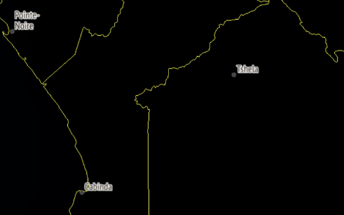

*The diversity of map options in COMMAND is shown in these two snapshots
of the Congolese/Cabindan coast. The top screenshot has the Sentinel-2
layer enabled, while the lower one has the BMNG Layer disabled
entirely.*

As in the real world, COMMAND's environment is affected by the terrain
and weather and has a profound effect on your sensors, weapons, and
tactics. It thus pays a lot to be aware of your natural surroundings. To
get a better understanding of the world in your operations theater, feel
free to mouse over the globe and notice the cursor data block's display
of land elevations and terrain types while over land and bathymetric
data (including convergence zone [CZ] information) while over water.

This is important because terrain affects operations greatly.
Underwater, the data block displays the depth of the water and other
features vital for submarine warfare. One is the depth and strength of
the thermal layer, a feature that serves as a natural barrier to sound
transmission. Another is the distance of convergence zones, which allow
vessels with long-range passive sonar to pick up contacts well beyond
the short range of direct paths.

Over land, the slope and type of land determines how fast land units can
move, what exact paths they take (units will steer around mountains
rather than trying to climb them), how visible they are, and how
shielded they are from explosive attacks against them. Greater slope,
even without any terrain effects, makes land units slower. Water terrain
features (lakes) are totally impassable by land units.

Wetlands and snow both slow down land units considerably (the former to
a greater extent) and make them less visible. Forests, and to a lesser
extent shrublands, both significantly slow down and shield the land
units from eyes and bombs alike. Croplands and vegetation mosaics have a
small visibility and speed reduction, while savannas have a minor speed
reduction. Barren and grassland terrain acts as a "base case" with no
modifiers, while urban terrain offers the greatest shielding and,
contrary to the others, makes land units slightly *faster* due to the
availability of paved roads. Several terrain types are also highly
disruptive to radar detection. These types are forests (all sub-types),
croplands and urban. Obtaining a radar detection in these areas is
significantly more difficult.

Moving the cursor around the theater can be very important. The presence
or absence of convergence zones is a game changer in anti-submarine
warfare. As sloping and terrain significantly determine the pathing of
land units (and the presence of islands and shores the pathing of naval
ones), seeing what's where is important in knowing where to send one's
bomber aircraft to hit those land units.

### 3.1.2 Terrain and Land Cover

COMMAND simulates many different effects of terrain ranging from unit
detectability to the effects of munitions on in dense and barren areas.
In addition to the type of terrain, terrain has three height values:


Elevation refers to the ground level of the terrain with no objects
present such as trees or buildings. The height refers to the average
height of objects on that terrain, such as trees or buildings, and the
skyline is the average height of the objects plus the base level of the
terrain underneath it. These values are useful to a planner because they
give you the ability to plan terrain masking attacks, and some types of
units such as AH-64E Apache Guardian helicopter can 'rest' behind the
skyline of the terrain and stick various sensors outside of the terrain
making it possible to detect units without being easily engaged.

The slope of terrain as well as the type of terrain has an impact on the
performance of ground units. Some units such as hovercraft can easily
move between different types of terrain, but struggle with slope and
certain terrain densities. When planning ground combat, it is important
to consider this along with visibility in order to best deploy your
units.

### 3.1.3 Unit, Group, and Weapon Symbols

Units can be utilized in the game as individual units or groups. Groups
are useful to create as you can give many units common orders, and you
can organize ships into formations for a better common defense.

To group units simply drag-select the units you would like to group
together and press the G key. You will now notice they have merged into
one group symbol, which you can rename to whatever you would like.

If you'd like to remove members or dissolve the group:

- In game mode, you can detach individuals by select then in unit view
  (see below) and pressing the d key. Once you get down to one unit the
  group will dissolve.

- In editor mode you can select the group and press the delete key once
  which will dissolve the group.

Units and Groups are displayed on the game map as color-coded symbols.
The colors note postures (player side, friendly, unfriendly and hostile)
and the symbols themselves let you know what kind of units they are:


\* Allied sides are marked with an "A" under them; one-way friendly
sides (e.g. you are friendly towards them, but they are neutral towards
you) are marked with an "F" under them.


Unit Aimpoint Counts: The small white numbers next to units are a mount
and sensor aimpoints within the unit. This allows players to know how
many components (ex. Each tank of a 4-point tank platoon) are within a
unit so they can allocate the correct number of weapons).

Reference Points: Reference points are markings that can be used as area
boundaries, waypoints or simple markers. There are several types with
different properties:

- Unselected/Unlocked Reference

- Selected Reference Point

- Locked Reference Point

### 3.1.4 Group versus Unit View Mode

You can toggle between unit view and group view by pressing the 9 key on
the keypad of your keyboard. To check which mode you are in please check
the value on the bottom left-hand side of your display.

Group view is default and displays the group symbol and group data block
for units that have been grouped together. You can see individual units
in a group when it is selected but cannot select and give individual
orders to ships.

Unit view displays every unit and data block of every unit on the map.
You can select and give individual units orders in this window.

### 3.1.5 Upper Game Bar


Two layers of game controls are located below the menu items on the map.
The upper bar currently includes the following:

- The **Time Compression drop-down menu** lets you set the speed at
  which the simulation moves forward. The options are 1x (real time), 2x
  time acceleration (twice as fast), 5x, 15x, and the flame/turbo
  option, which moves as fast as your PC can handle the scenario. There
  is one option beyond flame called double flame or coarse fidelity.
  When this is selected, the scenario will change the time-step to only
  make calculations when required and thereby move at a much quicker
  rate. This feature will automatically disengage when high accuracy is
  required such as during weapons engagements. The actual speed of
  turbo/flame is defined by the size/complexity of the scenario and the
  configuration of your PC. The same scenario can run faster or slower
  on different computers, and the same PC can run different scenarios at
  different speeds. (Add example?)

<!-- -->

- The **Start/Stop button** pauses or resumes the simulation.

- The **Record** button activates Commands internal recording ability.
  You can use this to view or play files later. Once pressed it becomes
  the stop recording button. The files this generates are only capable
  of being viewed in Command and can be quite large.

- The **Custom Overlay** button lets you add imagery from 3rd party
  sources to the display. See **11.2 Custom Overlays 101** on page
  [276](#custom-overlays-101) of this manual for specific instructions
  on how to do this.

- The **Show/Hide Shortcuts** button toggles the lower shortcut bar on
  and off.

- The **Special Actions** button brings up, if any, the available
  special actions for the current side.

- The **Options** button brings up the game options menu (see **6.4 Game
  Options Window** on page [123](#game-options-window))

You will notice game information displayed at the top border of the
globe display. This information includes game time in GMT, local time,
remaining time in scenario, the camera zoom altitude in meters, AU count
(unit count) and a pulse time (game speed indicator).

Note that the "AU count" and "Pulse Time" numbers are diagnostic
settings that are not turned on by default. You can turn them on in game
options by checking the Game Diagnostics Check box. Pulse time can be
effectively used for bug reports or seeing if one action slows the game
down more than another. AU count is useful to determine just how big the
scenario can be.

### 3.1.6 Lower Game Bar

The lower bar currently contains shortcuts for the following actions.
Attempting to engage them while having selected an incompatible unit (a
unit not under your control in a general sense, or the "Aircraft
Operations" button for a unit that holds no aircraft) will simply result
in nothing happening. Hovering the mouse over any location on the
shortcut bar will display a hotkey that can be used for the same
function. These actions are the most critical in COMMAND and are covered
in detail in the "Buttons and Windows" and "Mission Editor" sections.


- Engage Targets (Auto): See **3.3.1 Engage Target(s) - Auto** on page
  [24](#engage-targets---auto)

- Engage Targets (Manual): See **3.3.2 Engage Target(s) -- Manual** on
  page [24](#engage-targets-manual)

- Plot Course: See **3.3.3 Plot Course** on page [26](#plot-course)

- Throttle/Altitude: See **3.3.4 Throttle and Altitude** on page
  [27](#throttle-and-altitude)

- Formation Editor: See **3.3.5 Formation Editor** on page
  [29](#formation-editor)

- Magazines: See **3.3.6 Magazines** on page [30](#magazines)

- Aircraft Operations: See **3.3.7 Air Operations** on page
  [32](#air-operations)

- Boat Operations: See **3.3.8 Boat Operations** on page
  [34](#boat-operations)

- Mounts and Weapons: See **3.3.9 Mounts and Weapons** on page
  [36](#mounts-and-weapons)

- Sensors: See **3.3.10 Sensors** on page [37](#sensors)

- Systems and Damage: See **3.3.11 Systems and Damage** on page
  [37](#systems-and-damage)

- Unit/Group Doctrine: See **3.3.12 Unit/Group Doctrine** on page
  [38](#unitgroup-doctrine)

- Mission Editor: See **7.1 Mission Editor** on page
  [135](#mission-editor)

*Note: Despite an attempt to fit the variety of computers running
COMMAND, windows may appear distorted or cut short due to DPI issues. If
that appears, close the program and run the 4KFix tool located in the
Command folder. This may no longer be required as of CMO V1.08.*

### 3.1.7 Message Log


The message log is in the lower left-hand corner of the screen. It is
divided into several subsections containing different types of messages
that can be minimized or emphasized. This is so that a player wanting to
see, for example, when their aircraft are taking off or landing, is not
overwhelmed by one endgame calculation from a lengthy naval bombardment
after another.

Moving the mouse over a message highlights the subject of that message
on the map by creating a balloon near it with the message in question.
This can be helpful for say, pinpointing the location of a new contact.

Clicking on the plus sign to the left of a message elaborates details on
that message. For example, "Bogey #20 now type-classified: UCAV" turns
into "Contact: BOGEY #20 has been type-classified as: UCAV
(Classification by: Fishbed #1 [Sensor: Mk1 Eyeball] at 3.6 nm)"

The message log can be placed in a separate window by pressing
CTRL-SHIFT-M or via a menu (see **6.2 View** on page [113](#view), and
**6.4 Game Options Window** on page [123](#game-options-window)). In a
separate window the message log can be toggled between the "interactive"
view (which has the different message categories and hover-balloons) and
the "raw text" view found in previous versions of COMMAND (which simply
has a list of detailed text messages arranged in chronological order).

### 3.1.8 Time Step Buttons

The time step buttons are below the message log and serve as a way of
precisely fast-forwarding COMMAND in intervals that range from 15
in-game seconds to 15 minutes. **When the simulation is running,
pressing them does nothing**. When the simulation is paused, pressing
one of them runs the simulation at the current level of time
acceleration for the marked duration and then pauses it again. To move
quickly, setting time acceleration to "Turbo/max speed" (the flame icon
on the time acceleration menu) before pressing a time step button is
recommended.

## 3.2 Mouse

### 3.2.1 Mouse Functions

The mouse has several further functions in the UI.

First you will notice the cursor has a data block next to it which
displays information on the environment of the current area it is
pointed at. Depending on whether it is over land or sea this information
includes position in latitude and longitude; elevation and depth in
meters; convergence zone (CZ) layer information (sonar model), terrain
slope and type, local time and weather.

If the CTRL key is held down when hovering the cursor over a unit or
contact, an additional box appears with more information about the
subject in question.


*The Fletcher-class destroyer USS Morgan has full fuel, 112 depth
charges, 3425 rounds of gun ammunition, and 5 torpedoes in it, and has
its radar turned on.*

Selecting several units will cause a list, with the units sorted by
class and type, to appear in the upper left portion of the map.

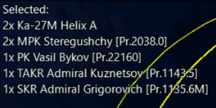

*In this example, a Russian carrier group has been selected. Two
airborne Ka-27 helicopters appear on top, followed by two Steregushchy
frigates and one each of the other three units, including the carrier
itself.*

When clicking on a unit in close proximity to others, a menu of all the
units in the area appears, enabling the player to select any one in
particular without needing to zoom in to a large degree.

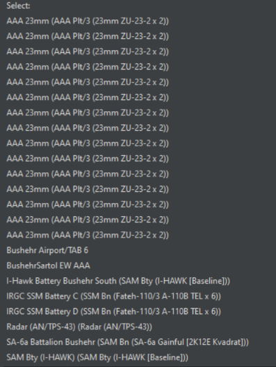

*An extreme example of bunching. With two clicks, the player can select
the airbase at Bushehr, a search radar by the airbase, one of the four
ballistic missile batteries, one of the two SAM units, or one of the
many AAA facilities there.*

## 3.3 Buttons and Windows

The functions accessible on the top "shortcut bar" contain most of what
one needs to run COMMAND.


### 3.3.1 Engage Target(s) - Auto

This function will order the selected unit or group to attack a
designated target or group of targets. After selecting this function,
designate a target by clicking on a target or drag selecting one or
more. The mouse cursor will turn into a crosshair to symbolize that the
"engage targets" mode has been engaged. The firing unit or group will
then move to get within the firing parameters of the weapon to be used.
If there is more than one weapon the unit will work from its longest
ranged weapons to its shortest (i.e. a warship will fire its missiles at
the target and then, if it survives, close to gun range). You can also
call on this function using the F1 hotkey or from the right click/unit
orders menu. Note that when multiple attackers are given the task of
attacking multiple units, their attacks are queued in parallel, that is
nits now perform the salvo evaluations in their own individual threads
and submit "firing proposals" to their side. The parent side groups
firing proposals per target and selects the most promising one, based on
criteria that depend on the nature of the target (e.g. for aerospace
targets an important factor is time-to-impact).

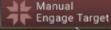

### 3.3.2 Engage Target(s) -- Manual

This function calls on the weapons allocation dialog, which allows
players to manually allocate weapons to selected targets. This is a
great function to use in conjunction with plotted courses to allow for
off-axis attacks or more fine-grained strike planning; however, you must
manually put your units in the correct firing parameters for weapons to
fire.

To use, select the function (the cursor will turn into a crosshairs) and
then click or drag select one or more targets. The weapons allocation
dialog will then launch allowing you to allocation weapons to targets.
This function can also be called using the Shift+F1 key combo or from
the right click/unit orders menu.


The dialog is organized by having attackers, their weapons and
allocations listed at the top and the selected target list and
allocations to them listed below.

To allocate a weapon to a target:

1.  First select one target from the target list below by clicking on it
    so it is highlighted.

2.  Select an attacker from the list above. If they have a legal weapon
    to fire on the target it will appear in the suitable weapons list
    group by weapon type. If the weapon is legal but outside on or more
    firing parameters, the reason will be written in red text (see
    complete list of reasons and solutions below). If the weapon is
    within firing parameters, you will see green text saying "OK - Can
    fire."

3.  You then allocate the number of weapons to the target by populating
    the allocated field below the suitable weapons list and clicking the
    allocated button or you can double click any weapons line in the
    suitable weapons list. If you are not sure how many weapons to
    allocate, please review both weapons and targets in damage values as
    well as the defender in the platform display. Once allocated, the
    weapons will appear in both the **Weapons Allocated by Selected
    Attacker(s)** list at the top and the Weapons Allocated to Selected
    Target at the bottom. Some weapons are "palletized", and can thus be
    assigned either individually (i.e. missiles at different targets
    from the same pallet) or all at once (every missile on the pallet is
    destined for the same target). When launching palletized weapons, it
    is important to launch every from the pallet in order to achieve
    maximum effect.

4.  Certain missiles can make off-axis attacks. Go to '**weapons
    allocated by selected attacker(s)**', press the **'plot course'**
    button, and then **'draw'** an appropriate path. This is highly
    useful to avoid giving away one's position and taking advantage of
    terrain. The courses can be reset by clicking the **'clear course'**
    button.

5.  If you'd like to de-allocate weapons you can do so by
    double-clicking the individual weapon's lines in the **Weapon's
    Allocated by Selected Attacker(s**) list.

6.  When are satisfied, you can complete the process by clicking on the
    red "x". You would then have to ensure the firing platforms remain
    in firing parameters by manually plotting, adjusting speeds and
    assigning them to missions.

> Note: If you are told under the weapon in the weapon list that you
> aren't allowed to use that weapon, see **9.3.8 My @#%\^@#% weapon
> won't fire!!!** on page [210](#my-weapon-wont-fire) for guidance on
> how to figure out weapon firing parameters.


###  3.3.3 Plot Course

A unit's course is a single waypoint at the destination or a series of
waypoints to a destination. The unit's current course is displayed on
the map as line segments with waypoints designated by small boxes at the
nodes.

- **Set Course**: Select a unit or group and either press "F3" or select
  Plot Course on the Unit Orders drop down menu. Click on the map at the
  desired waypoint location. Continue to add waypoints as desired until
  the final waypoint has been plotted, then click "F3" or Plot Course to
  finish.

- **Edit Course**: To edit or change a course or move a waypoint, "Left
  Click" on a waypoint and drag it to the desired location which will
  create a new waypoint.

- **Adding Additional Waypoints**: Select a unit or group. Does not work
  with multiple units/groups selected. Left click on the last waypoint
  or any waypoint and press F3. Left click on the map to place
  additional waypoints. Press "Esc" after the last waypoint is placed.

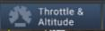

### 3.3.4 Throttle and Altitude

**Throttle/Altitude**: Select a unit(s), group, or previously plotted
waypoint and either press "F2" or select Throttle / Altitude on the Unit
Orders drop down menu. The speed and altitude/depth menu opens. Maximum
and Minimum values of speed or altitude/depth are set by the unit's
capabilities and terrain.

. **Unit/Waypoint Settings:** On top of the throttle/altitude window is
an arrow set that enables scrolling between unit and waypoint settings.
When different settings are applied to the unit, it will change
speed/altitude immediately. When applied to a waypoint, it will only do
so once the unit reaches the waypoint in question.

· **Speed**: Either select one of the preset throttle settings or use
the slider to select the desired speed. The unit(s) will respond to the
command immediately. Select one of the presets or use the slider to set
the desired altitude/depth. If the unit's altitude/depth is set by an
assigned mission it may be overridden by checking the Manual override
checkbox.

· **Altitude/Depth**: Either select one of the presets or use the slider
to set the desired altitude/depth. If the unit's speed is set by an
assigned mission, it may be overridden by checking the Manual override
checkbox. The height of clouds will appear on the slider. Checking
"Terrain Following" means that the (air) unit will fly at the specified
height above *ground* level rather than above *sea* level (which can be
crucial if the scenario is in a mountainous area and is needed for units
with terrain-following capability like the F-111 to use their full
potential). Checking "Land Cover Masking" will make the unit attempt to
remain at minimum altitude and use the terrain to cover their movement.
Think of terms of flying between buildings, under power lines and
between trees. Not every flying unit is capable of doing this at such a
low level, and its effectiveness will be dependent on the type of unit.

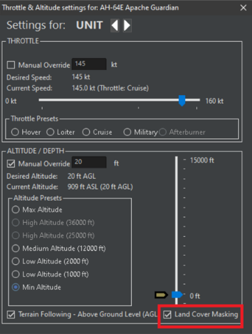

Note: Being as high as possible for aircraft, deep as possible for subs,
and fast as possible for ships is not necessarily the best way to handle
units. Pay attention to mission, sensors, and threats before setting
throttle and altitude/depth.

**Special Case for Submarines**: Submarines have special depth options
for flexibility in being stealthy vs aggressive:

- **Just above the Layer**: The submarine will operate just above the
  Thermal Layer (See **9.3.3 Submarine Combat** on page
  [204](#submarine-combat). This is optimal for use of towed array
  sonar.

- **Just Below the Layer**: The submarine will operate just below the
  Thermal Layer.

- **As deep as possible**: The submarine will operate at its test depth.
  If the sea floor is above test depth, the submarine will operate in a
  terrain hugging mode just above the bottom.


### 3.3.5 Formation Editor

This opens the formation editor to change the placement of units inside
the group. You can also select this function by pressing the F4 hotkey.
This opens the formation editor, allowing elements of a group to change
position.

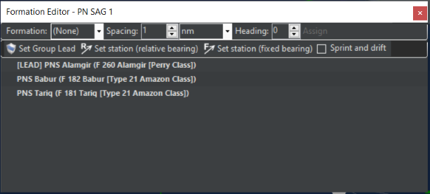

**Formation:** This sets the literal formation the units will form. It
can be a line, column, wedge, or anything else on the menu. This menu
allows you to select a custom preset formation. Formation presets are
defined in the Resources/Formation folder in the main CMO directory.

**Spacing:** This sets the distance between units.

**Heading:** This sets the default heading between units.

**Assign:** This assigns the units to a formation, executing the
changes.

**Place:** In the scenario editor, you can immediately order all units
into a specific formation by pressing this button.

**Group Lead**: The lead platform is the center of the formation,
usually a HVU (high value unit). When forming groups, the game will try
and pick the best possible candidate, but players can change if they
desire to do so. The Group Lead is shown in the editor window with
"[LEAD]" in front of its listing.

**Setting Group Lead**: Select the desired unit from the platform
display drop down list and click the Set Group Lead button.

**Setting Patrol Stations**: Players can set patrol stations of units
within the formation. To do so just select the unit from the formation
editor listing so it is highlighted, click the set new station button
(relative or fixed bearing) and then click a point on the map where you
would like that position to be. You will know its created when you see a
diamond marking the position with the word station next to it on the
display. The unit will then move towards it when the clock begins.

**Set new Station (relative bearing**): The assigned unit will always
maintain its position relative to a group's course. This formation
setting is most useful for ASW units, mine sweepers etc. as it clears a
path for the HVU.

**Set new Station (fixed bearing**): The assigned unit will maintain its
position relative to the lead regardless of course. This setting is most
useful to put units between the HVU and a known threat.

**Sprint and Drift:** This allows units in the formation to, instead of
traveling at a steady pace, achieve the same overall time by speeding up
(sprinting) and slowing down (drifting). It is typically used by ASW
units to get a better sonar picture by quieting their engines.

Note: Pay close attention to cavitation settings for ships using sprint
and drift in a formation. Not being considerate of noise levels can give
away your position without you even realizing it.

Note 2: A very powerful feature is the ability to manipulate formations
through Lua. This gives the ability to change formations based on
location, threat axis, losses, etc. Below is a quick rundown on this
capability.

**Example of getting:**
```lua
local f = ScenEdit_GetUnit({name='Group 14', guid='GNRIJH-0HM7B6IC7IPUR'})
print(f.formation)
```

**Example of setting:**

```lua
local f = ScenEdit_GetUnit({name='Group 14', guid='GNRIJH-0HM7B6IC7IPUR'})
f.formation = {name='wedge', transpose=true}
```

**For setting the formation preset, the following options are available:**

- **name**: Name of the preset as stored in StandFormations.txt
- **transpose** (optional): If True, the members are insta-teleported to assigned positions. If False (also default), the members are assigned their positions and will try to reach them as possible.
- **spacing** (optional): Override the preset's default spacing value
- **spacing_unit** (optional): Override the preset's default unit of spacing (0 for nautical miles, 1 for meters)
- **bearing** (optional): Override the group lead's desired heading

**Refer to the Lua documentation for more details.**

### 3.3.6 Magazines


Pressing the magazine button launches the magazine dialog which displays
individual magazines, weapons records and number of weapons carried.

In edit mode, you can add new weapons records to magazines, and you can
edit ammunition amounts in the weapons records. This allows you to
supply mounts and hosted aircraft with the weapons and ammunition needed
to any you have added to the host unit.


### 3.3.7 Air Operations


Clicking the button launches the Air Ops dialog which is used to manage
hosted aircraft for the base in question.

The air ops dialog has two tabs: Aircraft Status and Air Facilities.


#### 3.3.7.1 Aircraft Status Dialog

The aircraft status dialog groups aircraft by type with individual units
shown in drop-down lists. You can expand and retract the lists by
clicking the + and - button next to each unit type.,

The columns display current information on the hosted unit.

**Aircraft**: At the group level displays the unit count and type name.
At the unit level displays the unit's given callsign.

- **Status**: Shows the current status of the aircraft. These include:

  - Ready: A/C is available for use.

  - Readying: A/C is in the process of reloading and refueling.

  - Taking off: A/C is in the takeoff process

- **Mission**: Shows the name of the mission the aircraft is assigned
  to. The field will be blank if unassigned.

- **Loadout**: Shows the current Loadout of the aircraft or the loadout
  being fitted if the aircraft is being readied.

- **Time to Ready**: Shows the time remaining until the aircraft is
  available. 0s is shown when the aircraft is ready. When an order is
  given for an aircraft to launch the launch time is then displayed. If
  quick turnaround is enabled, it will show the remaining quick-turn
  sorties.

- **Launch Individual button**: Pressing this button after selecting one
  or more aircraft will order them to launch and as individuals.

- **Launch as Group(s):** Pressing this button after selecting numerous
  aircraft will launch them as a group. If the selected aircraft are of
  different types and loadouts they will be launched as separate groups
  or individuals by type and loadout.

- **Ready/Arm**: Launches the Ready Aircraft Dialog which allows you to
  change the loadout of your aircraft with available munitions.

- **Enable Quick Turnaround:** In the editor, this enables or disables
  quick turnaround for the selected aircraft.

- **Expand Aircraft List:** This expands every available aircraft type
  to its full length.

- **Show/Hide Unavailable:** This either shows or hides aircraft that
  are currently unavailable for use.

The ready aircraft dialog displays a list of available loadouts and the
ready time and attack altitude the primary munitions are deployed by the
AI at. If you click on each row, the stores fields at the bottom will
display the individual components (munitions, pods, tanks, sonobuoys)
for each loadout and the number available in the parent units' aircraft
magazine.

To choose one in the editor simply select the weapon row you like and
press the OK-ready button or Ready Immediately (ScenEdit) button.

If the parent unit does not have the unit, you can add it by clicking
the check base magazine button at the top which allows you to view the
magazine dialog and edit munitions.

**Set time to Ready**: You can set a value for when you'd like an
aircraft to become available using this dialog. Just fill in the days,
hours and minutes filed to complete. This is helpful for the start of
scenarios.


#### 3.3.7.2 Air Facilities Tab

This dialog displays hosted aircraft grouped by the units and component
facilities (hangars, open parking spots, revetments, elevators etc.).
You can follow the progression of aircraft from hangar to
elevator/taxiway to pad/runway. A launch time is also provided.

Facilities can be added or removed via the buttons at the bottom left.
However, be aware that the unit must be flagged as "aviation capable" to
be able to use fixed-wing aircraft.

### 3.3.8 Boat Operations


This function launches the Docking Ops dialog which allows players to
manage embarked boats. This function can also be called with the F7
hotkey or clicking the boats button on the right-hand information
display.


The **Boat Status tab** displays docked boats grouped by type. The name
at the group level gives a unit count and type name and at the unit
level gives the individual unit's name, status (locked, launching),
assigned mission and time to ready or launch.

The launch individually button allows you to select one or more row and
launch them as individuals. The launch as group allows you to select one
or more rows and launch them as a group by type.

At piers, ships may be repaired and rearmed, although the process is
extremely slow for all but the smallest ships. Watercraft may be
returned to service with less than perfect health or ammunition from a
pier. They can be deployed manually or automatically with the right
doctrine (see **6.3.8 Side Doctrine/ROE/WRA/EMCON** on page
[119](#side-doctrineroewraemcon)).

Piers allow for more rapid and effective repairs than the jury-rigged
ones capable at sea, and they can also load weapons more effectively
than an UNREP.

However, piers are best suited for very long duration scenarios, not
short ones where long-term damage management is not an issue. Thus,
advanced port operations are not suited for a one- or two-day slugfest,
but they are suitable for a long blockade or conflict lasting a week or
more.

When placing piers or single-unit ports in the scenario editor, a blue
area appears. Ships can move freely in this area even if it's otherwise
overland. This is to let them reach the pier placed at a suitable
location, and represents canals or channels made to allow entry to the
port. Rotating the pier also changes the location of the blue area.

Multi-unit ports require ammunition storage facilities and piers like
multi-unit airbases. Single-unit ports encompass all of these in one
unit, also like their airbase counterparts.


The **Docking Facilities** tab shows the available facilities to hold
smaller watercraft, similar to its counterparts at air bases.

###  3.3.9 Mounts and Weapons


This function launches the Weapons Dialog which displays information on
all weapon mounts on a platform. You can also launch it by pressing F8
on your keyboard or pressing the weapons button on the right-side
information display.

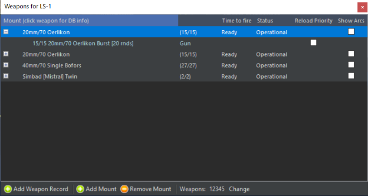

The weapons dialog displays a list of all weapons grouped by mount. The
black root level text describes the mount, its capacity and status. The
subset blue weapons record text describes the individual weapons in the
mount, the time to fire and a checkbox that allows players to mark
certain weapons as the reload priority in the case of a mount that
shoots different weapons and ammunition. The gray subset text notes the
capacity to carry the weapon but the lack of any.

- **Add Weapons Record button**: Allows players to add a weapons record
  to any mount by selecting the mount and pressing this button.

- **Remove Weapon Record(s) button**: Allows players to remove weapons
  records by selecting the record(s) and pressing this button.

- **Add Mount button**: Press this button to add a new mount.

- **Remove Mount button**: Select the mount(s) and press this button to
  remove them.

- **Edit Weapons**: To change the number of weapons in a record select
  the record, click the change button, enter a numeric value in the
  weapons field and then click set.

### 3.3.10 Sensors


This function launches the sensor dialog that displays a list of all
sensors on a unit. This includes the sensor type, status and a check box
showing whether the sensor is active or not. This function can also be
activated by hitting the F9 key or pressing the sensors button on the
display.

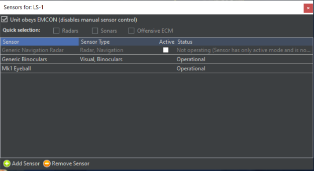

To make any changes you will need to uncheck the "**Unit obeys EMCON**"
check box as EMCON settings are inherited from unit/mission or side
settings. You can then activate or deactivate each sensor by either
checking off the active check box in the list or activating them in
groups by using the Quick selection check boxes. Keep in mind that
passive sensors are always on and cannot be turned off.

- The **Add Sensor** button launches the **Add Sensor Dialog** which
  allows you to add a sensor to a platform.

- The **Remove Sensor** button works by selecting a sensor and then
  pressing this button.

- **Damage Control**: This function opens the Damage Status dialog (F10
  hotkey) and "Damage Cntrl" button in the Right-Side Information Panel
  as well. This displays the damage conditions of the unit and its
  sensors, mounts and magazines.

In **Editor mode**, you can change the values of these to add damage to
ships and units in constructed scenarios.

### 3.3.11 Systems and Damage


Opens the Damage Status window. This displays the damage conditions of
the unit and its sensors, mounts and magazines.


In Editor mode, you can change the values of these to add damage to
ships and units in constructed scenarios. You can also light the unit on
fire.

### 3.3.12 Unit/Group Doctrine


This allows the doctrine, EMCON (Emissions Control, aka whether the
active sensors will be on or off), and Weapon Release Authority of the
selected unit to be changed. It can be changed side-wide under the
"**Game Menu**", the "**Edit Sides**" function in ScenEdit, or by
pressing CTRL+Shift+F9.

The doctrine window has four tabs: General, EMCON Settings, Weapon
Release Authorization (WRA), and Withdraw & Redeploy.

Note: With General Doctrine, EMCOM, Weapons Release Authorization (WRA),
and Withdrawal & Redeploy settings, you are given an immense amount of
control over how your units, groups, and missions behave without the
player having to intervene. Mastering these settings is key to mastering
Command.

**General Info on The Doctrine windows**

Doctrine and RoE options under the General tab include the following:

All doctrine options have the "inherited" setting. This means the unit
automatically follows the doctrine of the side (if unassigned to a
mission) or a mission (if assigned, and the mission's ROE/Doctrine
contradicts the side). The buttons at the bottom of the "doctrine
window" can be used to reset doctrine to the default inherited settings
of the side if need be.

In the scenario editor, all doctrine settings can be set to
play-editable through a checkbox to the right of the individual
doctrines. For example, a scenario editor can let a player change the
refueling threshold of force the player to use a general threshold of
30%.

At the bottom right corner of the General Doctrine page are the options
to save and load all the WRA and doctrine information as a file that can
be easily loaded at a later date.


STRATEGIC:

**Use Nuclear Weapons**: Determines if the platform is authorized to
employ nuclear weapons. If enabled, it will fire them. If disabled, it
will not.

**RULES OF ENGAGEMENT:**

**Weapons Control Status:** Determines rules of engagement for either
air, surface, subsurface, or land targets. Weapons TIGHT means the
unit(s) will fire at confirmed hostile targets only. Weapons FREE means
it will fire at anything that isn't confirmed friendly (possibly
dangerous to neutrals or allies). Weapons HOLD means it will not fire on
its own at all and will launch only if manually ordered.

**Ignore Plotted Course:** If enabled, the unit will abandon its
previously (manually) plotted course while attacking a target. If
disabled, it will not.

**Engage Ambiguous**: Sets the AI behavior when considering using a
weapon. Each weapon has certain tolerances calculated on-the-fly for
down/cross-range; most direct-guidance systems want a precise target,
most LOAL weapons have relatively strict cross-range tolerance (equal to
the sensor swath) but relaxed downrange tolerance because of their BOL
ability, area-effect weapons can tolerate up to their kill zone etc. If
the target's ambiguity figures are greater than the weapon tolerances,
this is explained in the manual weapon allocation window and the weapon
will not be fired. This dialog has three options besides "inherited".

An ambiguous contact is any contact with an uncertainty area. When set
to "ignore ambiguity", the AI will ignore the ambiguity when determining
whether or not to launch a weapon. Select this at one's risk, for the
chance of hitting a phantom or moved contact is incredibly high. When
set to "Optimistic", the target uncertainty area must be smaller than 3x
the weapon tolerance for the AI to launch the weapon. When set to
"Pessimistic", the target location uncertainty must be less than the
weapon tolerance for the AI to launch the weapon.

**Engage Opportunity:** If enabled, the unit will engage targets not
directly related to the mission at hand. If disabled, it will not.
Enable at one's own risk, for this can lead to dangerous behavior.

**Emission Control (EMCON)**

**Ignore EMCON when under attack:** If enabled, the unit will turn on
its emitting sensors when it's actively engaged defensively (the theory
being that since it's already been found, there's no use hiding and
weakening its defenses anymore). If disabled, it will continue with its
previous EMCON state even if attacked.

**MISC:**

**Kinematic Range:** If enabled, the unit will fire torpedoes to its
kinematic (maximum physical) range. The much shorter "practical range"
is there to ensure that the target cannot avoid the torpedo simply by
running at flank speed in the opposite direction. Kinematic range can be
set for always practical, always kinematic, or kinematic for manual
shots. The kinematic for manual setting means a submarine set on a
patrol mission running into warships will engage at a practical range,
but if the player sees a slow merchant ship with no sonar, they can
engage it from a distance with a manual allocation.

**Automatic Evasion**: The game has several pre-programmed evasions
routines that the AI will undertake if it detects it is under attack.
This RoE gives you the ability to turn this behavior of and off. In some
cases, turning it to NO is useful if having aircraft pressing their
attacks is desired.

**Refuel:**

**Refuel/UNREP:** This changes whether or not aircraft will refuel, and
ships will resupply each other. It can be turned on, turned off, or
(default) turned on but not have tankers attempt to refuel each other.

**Refuel/UNREP Selection:** This allows tankers to be chosen, be they
simply the nearest ones, tankers closer to the objective, or an even
greater priority to closer-target tankers.

**Refuel/UNREP Allied Units:** This allows supply units to refuel ones
from sides other than the player. Available choices are allowing it,
allowing either onloading or offloading only, or forbidding it
altogether.

**Refuel to Tanker Threshold:** Sets the threshold for when an aircraft
will seek out a tanker if set to refuel.

**Air Operations:**

**Air Operations Tempo**: This changes the overall tempo of the side's
air operations. A "**surge**" tempo generates sorties at a far quicker
rate than a "**sustained**" tempo. Historically, "**surge**" tempos
cannot be maintained for very long. Sustained is thus recommended for a
scenario set in the middle of a long air campaign, at the end of a long
logistical chain, or both. (There were two "Surge" periods in the Gulf
War air campaign, at the beginning and during the ground war.)

Note that tempo is different from the ready times included in the
aircraft loadouts.

**Quick Turnaround**: This enables quick turnaround for suitable
aircraft and loadouts.

Quick turnaround is used to model frenzied air activity such as the
Israeli strikes at the beginning of the Six Day War. It enables aircraft
to repeatedly fly brief missions with a short ready time before the
inevitable cooldown.

- YES-all possible quick turn platforms are enabled.

- FIGHTERS AND ASW-This enables non air-to-ground loadouts for quick
  turnaround. Air to ground ones are disabled and ready at the same
  overall tempo.

- NO-No quick turnaround allowed. Loadouts ready at the default
  operational tempo.

**Fuel State/Pre-Planned**: This changes the time when an aircraft
automatically considers itself having insufficient fuel and returns to
base. The default is "Bingo" (just enough to make it back), but can be
changed to various "Joker" states to provide an additional barrier
against running out of fuel.

**Fuel State/RTB**: This changes when the individual aircraft in a
flight return to base. It can be set to individual units leaving, when
the first aircraft reaches bingo/joker (encouraged), when the last
aircraft does so (EXTREMELY risky), or not RTBing at all at the fuel
state (Even riskier yet, only done in the event of some assured
micromanagement).

NOTE: The default fuel RTB settings are there for a reason. Change at
your own risk and be aware that losing the aircraft to a lack of fuel is
possible, even likely.

**Weapons State/Pre-Planned**: This changes the time when an aircraft
automatically considers itself "Winchester" (out of suitable weapons)
and returns to base. The aircraft can be used for anything from one BVR
launch and run engagements to fighting to the last shell, depending on
the situation. Fuel retreat can also be modified.

- **Use Loadout Setting**: The default, this goes with the inherent
  loadout.

For others, an example is in order: An F-14 Tomcat with a mixed arsenal
of AIM-54s, AIM-7s, AIM-9 Sidewinders, and its gun takes off for a
patrol mission.

- **Winchester:** This disengages weapons concerned with that mission.
  In the event of an air-to-air mission, it means everything that can
  fire at aircraft. In the event of opportunity fire being set, it will
  engage with air-to-air guns. In this situation, the Tomcat will fight
  until it runs out of ammunition (or gets low on fuel). If it's serving
  as a screen for ground units against enemy attackers or bodyguard for
  a high-value unit, this setting is effective.

- **Shotgun**: Less than the maximum number of weapons will be fired
  before the unit RTB

- **All BVR or Standoff** means that the hypothetical Tomcat will fire
  both its AIM-54s AND AIM-7s before returning to base, useful if
  engaging say, a bomber formation.

- **One Engagement with BVR or Stand-off** is useful if it's facing a
  superior opponent. It will engage once with (presumably AIM-54s) BVR
  missiles, and then RTB. That way it can take advantage of range in a
  hit-and-run engagement.

- **One Engagement with "WVR or Strike**" is useful if it's a ground
  attack aircraft you don't want to hang around in the face of AA
  weapons. It's also useful for a similar swoop-and-run attack done with
  an aircraft that only has WVR weapons.

Make sure to turn targets of opportunity off if you don't want strange
actions like an MPA or bomber flying over to engage a comparable enemy
plane with its tail guns. *(British Nimrods were armed with AIM-9s in
the Falklands so this sometimes happens!)*

**Weapons State/RTB**: Like with the fuel state, this changes when the
individual aircraft in a flight return to base. The "last aircraft
reaches \_\_\_\_\_ state" options are considerably less risky than with
fuel.

**A/G Strafing (Gun):** This enables or disables strafing gun runs on
air-to-ground missions. Whether it is to be enabled or disabled depends
highly on the circumstances-a "fight to the death for the sake of ground
support" situation with an inherently expendable airplane that has only
a small number of bombs would support it being enabled, while an
advanced aircraft operating against a target with a high level of AAA
would support it being disabled.

**Jettison Ordnance:** This enables or disables an aircraft jettisoning
its A2G ordnance when under attack. An aircraft with no ordnance will be
more maneuverable thanks to being lighter, but it also obviously cannot
perform its ground attack mission. This was the real goal for North
Vietnamese interceptors-shooting down American aircraft was just a bonus
luxury.

**BVR Engagement Logic:** This changes the doctrine aircraft will follow
when engaging with long-range missiles.

- **Follow Missile Straight-in**: The aircraft will continue to follow
  the missile straight towards the foe. This can be used to simulate a
  unit with rigid doctrine, poor training, or a desire to close to
  visual range quickly.

- **Crank if Possible** (DEFAULT): The aircraft will "crank" by tilting
  to the edge of its guidance radar and slowing down. This symbolizes a
  desire and training to stay at long range if possible.

- **Crank and Drag**: The aircraft will not only crank but will, once
  the missile goes active and its guidance is no longer necessary,
  "drag" and move away from the target. This symbolizes a greater desire
  and skill to stay at long range at any cost.

**Anti-Surface Warfare:**

**Use SAMs in ASuW Mode:** If enabled, ships with SAMs that can fire
them in anti-surface mode (which most radar-guided SAMs can achieve)
will fire them at appropriate surface targets.

**Maintain Standoff:** If enabled, units will attempt to stay inside the
range of their own weapons but outside that of their known opponents. If
disabled, they will charge the target and attempt to engage with every
available weapon (which can range from a destroyer firing its missiles
and closing to gun range knowing the danger, or it can be a missile boat
with only a machine gun on deck trying to engage with that).

**Navigation:** Select the appropriate method to navigate between
waypoints.

**Use missile waypoints:** When set to Yes, ASuW missile shooters will
use the missile's waypoint/dogleg capability (if present and if the
range allows it). If set to No, ASuW missile shots will always go
"straight in".

**Submarine & ASW Warfare:**

**Avoid Contact:** If enabled, the submarine will attempt to avoid
contact with any known threat. "Yes-Always" makes it non-negotiable,
while "Yes-Self Defence" means it will at least fire back to defend
itself.

**Dive When Threat is Detected:** If enabled, the submarine will
automatically dive deeper when it detects a threat within the exact
parameters of the setting. This can be a matter of radar detection, ESM
detection, or simple proximity.

**Recharge Battery %, Transit/Station:** This determines the threshold
when a submarine will rise to recharge its battery and is not in an
urgent engagement.

**Recharge Battery %, Offensive/Defensive:** This determines the
threshold when a submarine will rise to recharge its battery and is in
an urgent engagement.

**Air-Independent Propulsion:** This determines whether or not a
submarine with air-independent propulsion capability will use it.
Options are "always", "never", and "when engaged offensive or defensive"
(aka, in urgent battles).

**Dipping Sonar:** If enabled, helicopters will automatically deploy
dipping sonar when hovering at a low enough altitude over water. If
disabled, they will only do so if on a mission or manually ordered.

**Land Warfare:**

**Navigation:** This determines the type of pathfinding a land unit
takes. If set to "shortest route" (the previous default) the unit will
attempt to steer on the easiest path. If set to "direct route", it will
simply move in a straight line towards its destination without any
consideration for the terrain types.

(WARNING: This may result in the unit getting "caught" on difficult
terrain such as mountains. Use at your own risk)

**EMCON Tab**

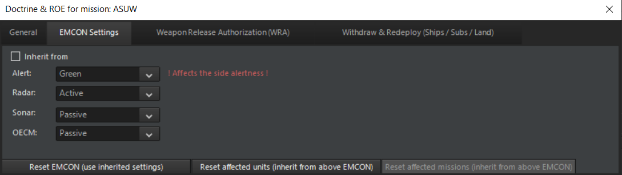

EMCON is the Emissions Condition of the platform/side/mission. It allows
radar, active jammers, and active sonars to emit by default or not.

This sets the ordered status of all emitters regarding Radar, Active
Sonar, and OECM (Offensive Radar Jamming). Each emitter category has its
own setting and has two states:

- **PASSIVE**: Radars, Active Sonar, and OECM off.

- **ACTIVE**: Radars, Active Sonar, and OECM on. Be aware that active
  sensors can be detected at greater distances than their sight range
  (think the equivalent of seeing a flashlight beam) and should thus be
  turned on only when necessary.

**Setting EMCON**: There are several ways of setting EMCON for a unit or
group of units. At the beginning of the game, the EMCON settings have
been set by the scenario designer. If the player does nothing, all
Platforms will inherit the initial EMCON settings. The player can
manually set EMCON settings in a variety of ways.

**EMCON Default Value**: The default value for EMCON is "Inherited",
where the platform inherits its EMCON condition from its parent platform
and/or as set for that side by the scenario designer.

**Inherited EMCON**: EMCON can be inherited from the scenario designer
settings, Mission EMCON settings, Group EMCON settings, or Parent Unit
EMCON settings. Platforms assigned to a mission will inherit the
mission's EMCON settings and any embarked or assigned platforms will
also inherit them. Aircraft automatically inherit their EMCON settings
from either their parent platform or their mission is assigned to one.

**Manual EMCON**: setting the EMCON settings of a platform or a group.
Click on the unit or group and select the "SENSORS" button on the unit
information window. Set the desired EMCON settings. You may get a
message to confirm the manual override of the EMCON settings.

**Intermittent EMCON:** Different "alert" levels can be set with sensors
turning on and off at either random or set intervals, or in response to
threats being detected. This can be useful for allowing active sensors
to be used while not constantly blaring them, or for adjusting them
based on context.

ALERT LEVEL (side): The Alert allows a player to see and modify the
side-wide alert level. Alert levels are Green, Blue, Orange, Yellow, and
Red. The color designation has no meaning in reference to other colors.
It only has meaning for how you configure the EMCON for individual
groups and units on that side. The five colors allow the player to
configure five alert levels for a side. The alert level can be changed
manually by the player or changed based on events and Lua code.


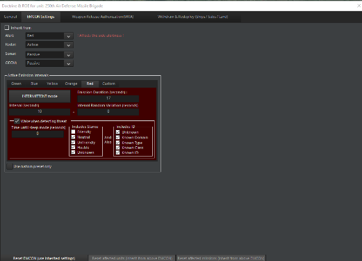


**ALERT LEVEL (unit or group):** The picture above is of the EMCOM
display for a unit or group that can be accessed through the menu, right
clicking, or the buttons along the top of the map. While the sensors can
be controlled basically the same as the Side EMCOM described above, it
also includes an Active Emissions Intervals box. This is where
Intermittent Emissions are configured.

Different "alert" levels can be set with sensors turning on and off at
either random or set intervals (Intermittent Emissions), or in response
to threats being detected. Intermittent Emissions can be useful for
allowing active sensors to be used while not constantly blaring them, or
for adjusting them based on context. The Active Emissions Intervals box
is where the emissions setting are input for each alert level plus a
custom setting. The custom setting allows the player to have more
granular control of intermittent emissions that aren't tied to the alert
level. Keep in mind that for intermittent emissions to work, the sensor
must be set to active, not passive.

Active Emissions Interval box label definitions:

Green/Blue/Yellow/Orange/Red/Custom tabs -- Separate intermittent
emissions configuration screens for each alert level plus a custom
level.
Intermittent/Continuous Mode -- Switches between the Active Emissions
Interval box and the alert level controlling emissions and
passive/active drop-down boxes controlling emissions. If it says
Intermittent mode, it is in intermittent mode. And the same for
Continuous mode.

**Emission Duration** -- How long, in seconds, the emissions will be
turned on.

**Interval** -- How long the emissions will be off, in seconds, before
they cycle back on.

**Interval Random Variation** -- A random variation added to the
interval off cycle. Will be no longer than amount entered in seconds.

**Wake when detecting threat** -- Will force the sensor to power on if a
new unit is detected. If the player leaves Intermittent mode on, the
sensor will stay on until the enemy unit disappears, and the sleep mode
expires

**Time until sleep mode** -- How many seconds will have to count off
after a detected unit disappears for the sensor to go back into its
intermittent cycle.

**Includes Stance and Includes ID** - As you can see, the wake mode can
be configured to activate with filters from detected unit posture and
detection level.

Warning: The Alert level setting is for the entire side. If you change
the alert level in a unit's EMCON screen, it changes the entire sides
alert level. If you want intermittent emissions for units and groups to
not be impacted by alert level, use the custom tab in the Active
Emissions Interval box and make sure the Use Custom Preset Only box is
checked.

**WRA Tab**


**Weapon Release Authorization** allows players to tailor different
weapons for different targets. Unknown/unspecified is for targets not
yet positively classified. Thus, an aircraft can be set to fire two
AMRAAMs at a time at a fighter target and one at a time against a
wallowing support aircraft.

WRA refers to the target's "Missile Defense Value". This is included in
the target's database viewer and is a guide to ideally how well they can
defend themselves against a basic Harpoon-style ASM. A small missile
boat or unarmed civilian ship has a missile defense value of 2
Harpoon-equivalents, while a high-end version of the Ticonderoga or
Kirov cruisers has a whopping 96. Note that missile defense value only
applies to positively identified targets.

For warships, WRA is extremely useful to ensure that heavy missiles are
not squandered on overkill targets (i.e. don't launch monstrous
carrier-busting missiles against small sailboats).

WRA also allows for maximum firing range to be changed to a distance
less than the on-paper maximum. This is especially useful for scenario
designers to ensure a higher probability of kill for their AI side, as
the missile will have plenty of energy. It is also helpful to score
kills against alerted enemy aircraft without wasting the missiles, as
they will dive to avoid attacks, dropping below the horizon and causing
direct-line-of-sight guided missiles to lose their lock.

Another function of WRA is giving the unit "personality". On one
extreme, a jumpy, ill-trained crew can be portrayed by setting the WRA
to engage at the farthest range possible and fire the most weapons
possible, regardless of the target. On the other, an overly cautious
crew can be set to only engage at very short ranges and only launch one
weapon at a time. A balanced unit will be in the middle.

WRA can be combined with other doctrine and scenario measures to further
flesh out the unit personality. These include side proficiency and
engaging non-hostile targets (the jumpy unit should engage them the
moment they appear; the cautious one will wait until they are 100% sure
it's hostile.)

The WRA can be set to a no-escape zone launch that causes a weapon
system to only engage when the current target cannot 'escape' the weapon
using a course reversal maneuver. If the target contact is unknown, the
weapon will be launched at it using this option based on the unknown
target's current speed. If the target type is known, the weapon will
launch based on the target's *maximum speed.* This can result in shots
waiting for a last possible moment in the instance of a very high-speed
target.

A final instance of unit personality is in emissions control. Many
otherwise-skilled units have proven sloppy or clumsy with emissions
secrecy in wars throughout history, and this can be simulated by having
radars set to "ON" by default even when it is not opportune.

Here are some typical examples of "personality" for aircraft are, using
the same fourth-gen fighter with radar-guided missiles as a base:

- **Default**. RTB weapons state depends on loadout, WRA is two radar
  guided missiles (AMRAAM, etc.) at a time against a known fourth- or
  fifth-generation fighter and one against anything else. This is a
  sensible choice for most circumstances.

- **Hit-and-run**. RTB weapons state is Shotgun, one engagement with
  BVR, WRA dumps all the BVR missiles at the target, with WVR ones
  possibly disabled altogether or at least toned down. *(This can be a
  maddening adversary if he out-ranges and outruns you)*

- **Fight to the death**. RTB weapons state is Winchester, all mission
  specific weapons expended, allow targets of opportunity with guns. WRA
  close to default. This can be taken to extremes by simply selecting
  the "No, aircraft do not RTB when weapon state is reached" button.

Sometimes, different missions call for different personality sets. An
interceptor operating in an environment of enemy air superiority would
be suited for a hit-and-run attack, like North Vietnamese MiG-21s which
near-invariably fired their AA-2s and then ran for home. An escort
fighter would be more willing to fight to the end to make sure the enemy
goes for them and not their charges. A nervous or inexperienced pilot
will fire all their missiles at near-max range, while a veteran will
wait until they can engage in optimal conditions.

(Those optimal conditions vary by weapons and target and should be found
by scenario editor experimentation.)

EMCON is up to the player to interpret-it's possible to have a
pilot/crew who cluelessly exposes the radar, or a timid one that never
turns it on even when it would be justified. Both show inexperience and
a lack of potential in their own ways.

And of course, mission setups, especially for AI players, illustrate the
overall personality of the *side*. A timid aircraft may launch and run,
but a timid *air force* will simply stay on the ground.

**Withdraw/Redeploy Tab**

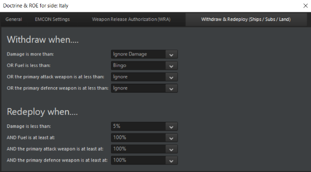

This sets the doctrine for ships assigned to a port unit (see above,
Docking Operations).

Ships can be configured to automatically withdraw from the engagement
and return to the nearest port if they are either damaged beyond a
certain degree or low on fuel or ammunition. This is necessary for
'intelligent' AI missions and can be useful for a human player as well.

The default is set to "ignore", meaning that ships will stay on their
mission no matter what.

The redeployment settings control when a ship is to re-emerge from port.
The defaults have them only setting sail again at full fuel and
ammunition loads less than 5% damage. The changes can simulate an
emergency redeployment, or one where a full load merely isn't necessary.

**Targeting Priority**

The fourth tab on the Doctrine & ROE menu is the targeting priority
page. This allows you to customize what the priority targets are for a
given side, mission, or unit. To create a new set of priorities, select
the create button in the bottom left corner and then click on Add Item
to create a new priority for the unit.

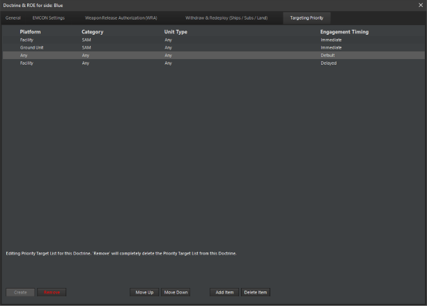

Automatic and manual attacks will ignore the priorities set here, so
this tool is be used for units assigned to pre-planned missions and
units that engage targets of opportunity. After pressing Add Item, a new
dialog will appear:

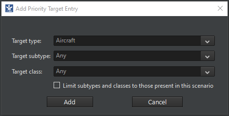

This menu has several options to customize your priority.

- **Target Type:** This picks the family or unit type of targets. It can
  be left broad or clarified with the other options.

- **Targeting Subtype:** This is the specific subtype within a type of
  targets that is focused upon with this prioritization. For example, if
  you used Aircraft as your Type, the subtype could be bombers.

- **Target class:** This lets you pick the exact unit you wish to engage
  with this priority. If the previous subtype was bomber, this would
  allow you select the exact DBID bomber you wish to engage.

- **Limit subtypes and classes:** This checkbox allows you to only see
  units in the scenario as options to select.

After creating several different prioritizations, you can now order them
in the main menu by pressing the Move Up and Move Down options. The
target prioritization is affected by the WRA, so keep in mind that you
may create a situation where multiple units must have enough 'weapons on
the way' to a specific priority target before engaging down the list of
targets.

**MISSION EDITOR**


The mission editor is the backbone of COMMAND, and in addition to the
shortcut bar, can be accessed by either pressing F11 or using the
"Missions + Ref Points" drop down menu. The complexity of the mission
editor is such that it deserves its own section. See **7.2 Mission
Definitions and Details** on page number
[144](#mission-definitions-and-details), for in-depth information on the
types of missions.


